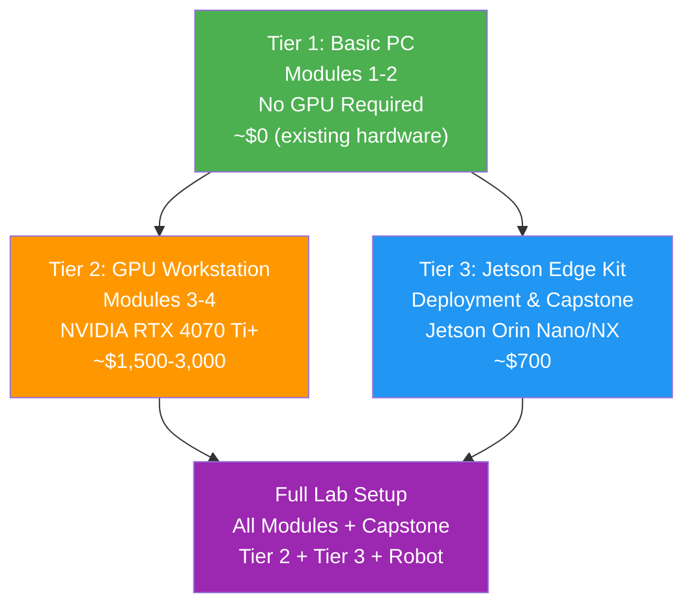

# Appendix A: Hardware Setup Guide

## Overview

This appendix walks you through the hardware you need to follow along with every module in this textbook. Not everyone needs the same equipment -- the course is designed with **three hardware tiers** so you can participate whether you have a basic laptop or a fully equipped robotics lab.

**Who needs this:** Every reader should review this appendix before starting Chapter 1 to understand which hardware tier applies to them.

**Estimated time:** 30 minutes to review; hardware procurement time varies.

## Prerequisites

- A budget estimate for your setup (see tier table below)
- Basic familiarity with computer specifications (CPU, GPU, RAM)
- Internet access for purchasing and downloading

## A.1 Hardware Tier Overview

The course is structured so that early modules (Modules 1--2) require only a standard computer, while later modules (Modules 3--4) benefit significantly from NVIDIA GPU hardware. The following diagram illustrates the three tiers.



### Tier Summary Table

| Tier | Covers | GPU Required | Estimated Cost | Who It's For |
|------|--------|-------------|----------------|--------------|
| **Tier 1: Basic PC** | Modules 1--2 (ROS 2, Gazebo basics) | No | $0 (existing hardware) | Beginners, software-only learners |
| **Tier 2: GPU Workstation** | Modules 3--4 (Isaac Sim, VLA) | Yes (NVIDIA RTX) | $1,500--$3,000 | Students running Isaac Sim locally |
| **Tier 3: Jetson Edge Kit** | Deployment, Capstone | Jetson Orin built-in | ~$700 | Edge AI deployment practice |

## A.2 Tier 1: Basic PC (Modules 1--2)

For the first two modules, you will work with ROS 2 and basic Gazebo simulation. These do not require a GPU.

### Minimum Requirements

| Component | Minimum Spec | Recommended |
|-----------|-------------|-------------|
| **CPU** | Intel Core i5 (8th Gen+) or AMD Ryzen 5 | Intel Core i7 (12th Gen+) or AMD Ryzen 7 |
| **RAM** | 8 GB | 16 GB |
| **Storage** | 50 GB free (SSD preferred) | 100 GB free SSD |
| **OS** | Ubuntu 22.04 LTS | Ubuntu 22.04 LTS |
| **Network** | Broadband internet | Wired Ethernet preferred |

:::tip Windows and macOS Users
If you are on Windows 10/11, you can use **WSL2** (Windows Subsystem for Linux) to run Ubuntu 22.04 without dual-booting. See [Appendix B: Software Installation Guide](./a2-software-installation.md) for WSL2 setup instructions. macOS users can use Docker-based ROS 2 setups, but native Ubuntu is strongly recommended.
:::

### Verifying Your Hardware on Ubuntu

Open a terminal and run the following commands to check your system.

```bash
# Check CPU info
lscpu | grep "Model name"
```

Expected output:
```
Model name:   Intel(R) Core(TM) i7-12700H
```

```bash
# Check available RAM
free -h | grep Mem
```

Expected output:
```
Mem:            15Gi       4.2Gi       8.1Gi       0.3Gi       3.4Gi      10.7Gi
```

```bash
# Check available disk space
df -h / | tail -1
```

Expected output:
```
/dev/sda1       234G   45G  177G  21% /
```

## A.3 Tier 2: GPU Workstation (Modules 3--4)

NVIDIA Isaac Sim is an Omniverse application that requires **RTX ray-tracing** capabilities. Standard integrated graphics or non-NVIDIA GPUs will not work.

### Recommended Specifications

| Component | Minimum Spec | Ideal Spec |
|-----------|-------------|------------|
| **GPU** | NVIDIA RTX 4070 Ti (12 GB VRAM) | NVIDIA RTX 3090 / 4090 (24 GB VRAM) |
| **CPU** | Intel Core i7 (13th Gen+) or AMD Ryzen 9 | Intel Core i9 or AMD Ryzen 9 7950X |
| **RAM** | 32 GB DDR5 | 64 GB DDR5 |
| **Storage** | 256 GB SSD free | 512 GB NVMe SSD free |
| **OS** | Ubuntu 22.04 LTS | Ubuntu 22.04 LTS |
| **Display** | 1920x1080 | Dual monitor recommended |

:::caution Why 64 GB RAM Is Recommended
Isaac Sim loads complex USD (Universal Scene Description) assets into memory alongside physics simulation and AI inference. With 32 GB, you may experience crashes during complex humanoid scenes. If budget is tight, start with 32 GB and add more later.
:::

### Verifying Your NVIDIA GPU

```bash
# Check if NVIDIA driver is installed and GPU is detected
nvidia-smi
```

Expected output (example with RTX 4070 Ti):
```
+-----------------------------------------------------------------------------+
| NVIDIA-SMI 535.183.01   Driver Version: 535.183.01   CUDA Version: 12.2     |
|-------------------------------+----------------------+----------------------+
| GPU  Name        Persistence-M| Bus-Id        Disp.A | Volatile Uncorr. ECC |
| Fan  Temp  Perf  Pwr:Usage/Cap|         Memory-Usage | GPU-Util  Compute M. |
|===============================+======================+======================|
|   0  NVIDIA GeForce ...  Off  | 00000000:01:00.0  On |                  N/A |
|  0%   38C    P8    12W / 285W |    512MiB / 12288MiB |      2%      Default |
+-------------------------------+----------------------+----------------------+
```

If `nvidia-smi` returns an error, you need to install NVIDIA drivers. See [Appendix B](./a2-software-installation.md) for driver installation.

```bash
# Check VRAM amount
nvidia-smi --query-gpu=memory.total --format=csv,noheader
```

Expected output:
```
12288 MiB
```

You need at least 12 GB (12288 MiB) of VRAM for Isaac Sim.

## A.4 Tier 3: NVIDIA Jetson Edge Kit

The Jetson Orin is the industry-standard edge AI platform for robotics deployment. You will use it in the Capstone and for sim-to-real transfer exercises.

### The Economy Student Kit (~$700)

| Component | Model | Approx. Price | Purpose |
|-----------|-------|---------------|---------|
| **Brain** | NVIDIA Jetson Orin Nano Super Dev Kit (8 GB) | $249 | 40 TOPS AI inference, runs ROS 2 |
| **Eyes** | Intel RealSense D435i | $349 | RGB + Depth camera with built-in IMU |
| **Ears** | ReSpeaker USB Mic Array v2.0 | $69 | Far-field microphone for voice commands |
| **Storage** | 128 GB High-Endurance microSD | $30 | OS and application storage |
| **Total** | | **~$700** | |

:::tip Buy the D435i, Not the D435
The "i" suffix on the Intel RealSense D435**i** means it includes an Inertial Measurement Unit (IMU). The IMU is essential for Visual SLAM exercises in Module 3. The non-i version lacks this sensor.
:::

### Optional: Jetson Orin NX Upgrade

If your budget allows, the **Jetson Orin NX (16 GB)** provides more VRAM and compute (100 TOPS vs 40 TOPS), enabling you to run larger perception models on-device.

## A.5 Optional Robot Hardware

Physical robots are optional for this course -- all exercises can be completed in simulation. However, if you want hands-on experience with real hardware, here are the recommended options.

### Option A: Mobile Robot (Budget-Friendly)

- **TurtleBot3 Burger** (~$550): A small differential-drive robot with excellent ROS 2 support. Ideal for navigation exercises (Nav2). Includes a 360-degree LiDAR and an OpenCR controller board.
- **TurtleBot3 Waffle Pi** (~$1,800): Adds an Intel RealSense camera for depth perception.

### Option B: Robotic Arm

- **Universal Robots UR5e** (industrial, ~$35,000): Industry-standard 6-DOF arm with a MoveIt 2 driver. Available in many university labs.
- **MyCobot 280** (~$600): A budget 6-DOF desktop arm with ROS 2 support. Suitable for manipulation exercises.

### Option C: Humanoid Robot

- **Unitree G1** (~$16,000): One of the most accessible full humanoid robots with ROS 2 SDK support.
- **Hiwonder TonyPi Pro** (~$600): A miniature humanoid for kinematics experiments. Note that it runs on Raspberry Pi and cannot run Isaac ROS -- use it only for walking kinematics.

### Peripheral Requirements for VLA (Module 4)

For the Vision-Language-Action module, you will need:

| Peripheral | Purpose | Minimum Spec |
|-----------|---------|-------------|
| **Webcam** | Visual input for VLA models | 720p USB webcam (Logitech C270 or similar) |
| **Microphone** | Voice commands via Whisper | Any USB microphone; ReSpeaker for far-field |
| **Speaker** | Audio output for conversational robotics | Any 3.5mm or USB speaker |

## Verification

Run the following checklist to confirm your hardware is ready.

```bash
# 1. Check OS version (should be Ubuntu 22.04)
lsb_release -a 2>/dev/null | grep Description
```

Expected output:
```
Description:    Ubuntu 22.04.4 LTS
```

```bash
# 2. Check CPU meets minimum (4+ cores)
nproc
```

Expected output (should be 4 or higher):
```
8
```

```bash
# 3. Check RAM (should be 8 GB minimum)
free -h | awk '/Mem:/{print $2}'
```

Expected output:
```
15Gi
```

```bash
# 4. Check GPU (Tier 2 only)
nvidia-smi --query-gpu=name,memory.total --format=csv,noheader 2>/dev/null || echo "No NVIDIA GPU detected (OK for Tier 1)"
```

Expected output (Tier 2):
```
NVIDIA GeForce RTX 4070 Ti, 12288 MiB
```

Expected output (Tier 1):
```
No NVIDIA GPU detected (OK for Tier 1)
```

## Troubleshooting

### Problem 1: `nvidia-smi` command not found

**Cause:** NVIDIA drivers are not installed.

**Fix:**
```bash
sudo apt update
sudo apt install -y nvidia-driver-535
sudo reboot
```

After reboot, run `nvidia-smi` again. If it still fails, check that your GPU is physically seated correctly and that Secure Boot is disabled in BIOS.

### Problem 2: Insufficient disk space for Isaac Sim

**Cause:** Isaac Sim requires approximately 30 GB of disk space for installation, plus additional space for USD assets.

**Fix:**
```bash
# Check disk usage and identify large files
du -sh /home/$USER/* | sort -rh | head -10
```

Free up space or add an external SSD. Isaac Sim can be installed to an external drive by specifying a custom installation path.

### Problem 3: Intel RealSense camera not detected on Jetson

**Cause:** The `librealsense2` library may not be installed, or the USB port may not provide sufficient power.

**Fix:**
```bash
# Install librealsense on Jetson
sudo apt-key adv --keyserver keyserver.ubuntu.com --recv-key F6E65AC044F831AC80A06380C8B3A55A6F3EFCDE
sudo add-apt-repository "deb https://librealsense.intel.com/Debian/apt-repo $(lsb_release -cs) main"
sudo apt update
sudo apt install -y librealsense2-utils
# Test the camera
realsense-viewer
```

If the camera disconnects intermittently, use a **powered USB hub** -- the Jetson's USB ports may not supply enough current for the D435i.

### Problem 4: System freezes during Gazebo simulation

**Cause:** Insufficient RAM. Gazebo with complex worlds can consume 4--8 GB of RAM.

**Fix:** Close other applications before launching Gazebo. If you have only 8 GB of RAM, add swap space:

```bash
sudo fallocate -l 4G /swapfile
sudo chmod 600 /swapfile
sudo mkswap /swapfile
sudo swapon /swapfile
# Make it persistent
echo '/swapfile none swap sw 0 0' | sudo tee -a /etc/fstab
```

## Next Steps

Once you have confirmed your hardware is ready, proceed to [Appendix B: Software Installation Guide](./a2-software-installation.md) to install Ubuntu 22.04, ROS 2 Humble, and the required development tools.
