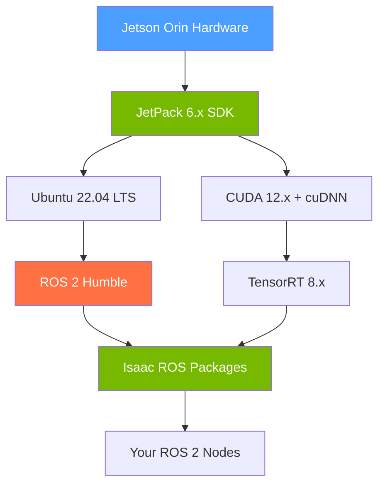

# Appendix D: Jetson Deployment Guide

## Overview

This appendix guides you through deploying a complete ROS 2 + AI robotics stack on the **NVIDIA Jetson Orin** family of edge AI modules (Nano 8GB, NX 16GB, AGX Orin 32GB/64GB). Jetson Orin combines an ARM64 CPU with an NVIDIA Ampere GPU and dedicated deep learning accelerators (DLAs), making it the standard edge hardware platform for Physical AI.

**Estimated time**: 60–90 minutes (plus 20–30 minutes for downloads)

**When to use this appendix**:
- Deploying the Chapter 10 ONNX policy to physical hardware
- Setting up a physical humanoid or mobile robot
- Running Isaac ROS perception pipelines on-device



---

## Prerequisites

Before starting, you need:

- **Jetson Orin module** (Nano, NX, or AGX) with carrier board
- **Host PC** running Ubuntu 22.04 (for SDK Manager flashing)
- **USB-C cable** or Micro-USB cable for flashing
- **MicroSD card** (64GB+ for Jetson Orin Nano) or NVMe SSD (for AGX/NX)
- **Internet connection** on the Jetson (Ethernet preferred during setup)
- Minimum 20GB free disk space on the Jetson after flashing

---

## Flashing JetPack 6

JetPack is NVIDIA's complete SDK for Jetson — it bundles the Linux kernel, CUDA, cuDNN, TensorRT, and hardware drivers into a single flashed image.

### Option A: SDK Manager (Recommended for AGX Orin)

On your **host PC** (not the Jetson):

```bash
# 1. Download SDK Manager from NVIDIA Developer website
# https://developer.nvidia.com/sdk-manager
# Install the .deb package:
sudo apt install ./sdkmanager_2.x.x-xxxxx_amd64.deb

# 2. Put Jetson into recovery mode:
#    - Hold RECOVERY button
#    - Press and release RESET button
#    - Release RECOVERY after 2 seconds

# 3. Verify Jetson is in recovery mode:
lsusb | grep NVIDIA
# Expected: Bus 00x Device 00x: ID 0955:7323 NVIDIA Corp. APX

# 4. Launch SDK Manager and follow the GUI:
sdkmanager
```

Select:
- **Target Hardware**: Jetson AGX Orin (or your module)
- **JetPack Version**: 6.x (latest)
- **Components**: ✓ Jetson OS, ✓ Jetson SDK Components (CUDA, cuDNN, TensorRT)

### Option B: Pre-built SD Card Image (Jetson Orin Nano Only)

For Jetson Orin Nano 8GB, NVIDIA provides a pre-built SD card image:

```bash
# On host PC: download and flash to SD card
# Download from: https://developer.nvidia.com/embedded/learn/get-started-jetson-orin-nano-devkit

# Flash with Balena Etcher or dd:
sudo dd if=jetson-orin-nano-jp6-r36.x.x.img of=/dev/sdX bs=4M status=progress
sync
```

---

## Verifying JetPack Installation

After first boot, verify the JetPack version and CUDA availability on the Jetson:

```bash
# Verify JetPack version
cat /etc/nv_tegra_release
# Expected output:
# R36 (release), REVISION: 4.0, GCID: 37698959, BOARD: t234ref,
# EABI: aarch64, DATE: Fri Oct 18 02:32:45 UTC 2024

# Check CUDA version
nvcc --version
# Expected:
# nvcc: NVIDIA (R) Cuda compiler driver
# Cuda compilation tools, release 12.6, V12.6.68

# Verify GPU is accessible
python3 -c "import torch; print(torch.cuda.is_available()); print(torch.cuda.get_device_name(0))"
# Expected: True  /  Orin (nvgpu)

# Check available GPU memory (in MB)
tegrastats | head -1
# Shows: RAM 2048/7772MB  SWAP 0/3886MB  CPU [12%@729,...] GPU [45%@624MHz]
```

---

## Installing ROS 2 Humble on Jetson (ARM64)

ROS 2 Humble supports ARM64 natively through the same apt repository as x86. The installation process is identical to Ubuntu 22.04 x86 — JetPack 6 ships with Ubuntu 22.04.

```bash
# 1. Set locale
sudo locale-gen en_US en_US.UTF-8
sudo update-locale LC_ALL=en_US.UTF-8 LANG=en_US.UTF-8
export LANG=en_US.UTF-8

# 2. Enable the Universe repository
sudo apt install software-properties-common
sudo add-apt-repository universe

# 3. Add the ROS 2 apt repository GPG key
sudo apt update && sudo apt install curl -y
sudo curl -sSL https://raw.githubusercontent.com/ros/rosdistro/master/ros.key \
    -o /usr/share/keyrings/ros-archive-keyring.gpg

# 4. Add the ROS 2 repository source
echo "deb [arch=$(dpkg --print-architecture) signed-by=/usr/share/keyrings/ros-archive-keyring.gpg] \
    https://packages.ros.org/ros2/ubuntu $(. /etc/os-release && echo $UBUNTU_CODENAME) main" | \
    sudo tee /etc/apt/sources.list.d/ros2.list > /dev/null

# 5. Install ROS 2 Humble (desktop install includes rviz2 — use base for headless)
sudo apt update
sudo apt install ros-humble-ros-base python3-argcomplete -y
# Note: Use ros-humble-desktop if you have a display connected

# 6. Install development tools
sudo apt install python3-colcon-common-extensions python3-rosdep -y

# 7. Initialize rosdep
sudo rosdep init
rosdep update

# 8. Source ROS 2 automatically in every new terminal
echo "source /opt/ros/humble/setup.bash" >> ~/.bashrc
source ~/.bashrc

# 9. Verify installation
ros2 run demo_nodes_py talker
# Expected: [INFO] [talker]: Publishing: 'Hello World: 0'
```

---

## Installing Isaac ROS on Jetson

Isaac ROS is NVIDIA's collection of GPU-accelerated ROS 2 packages for perception, manipulation, and navigation. The recommended installation method is via **Docker**, which bundles all NVIDIA dependencies.

### Docker-Based Install (Recommended)

```bash
# 1. Install Docker if not present
sudo apt install docker.io -y
sudo usermod -aG docker $USER
newgrp docker

# 2. Install NVIDIA Container Toolkit (enables GPU in Docker)
sudo apt install nvidia-container-toolkit -y
sudo systemctl restart docker

# 3. Verify GPU access in Docker
docker run --rm --gpus all ubuntu:22.04 nvidia-smi
# Expected: shows GPU info for Jetson integrated GPU

# 4. Pull the Isaac ROS base container (JetPack 6 compatible)
docker pull nvcr.io/nvidia/isaac/ros:aarch64-ros2_humble_jp6.0

# 5. Clone Isaac ROS workspace
mkdir -p ~/workspaces/isaac_ros_dev/src
cd ~/workspaces/isaac_ros_dev
git clone https://github.com/NVIDIA-ISAAC-ROS/isaac_ros_common.git src/isaac_ros_common

# 6. Launch the Isaac ROS development container
cd ~/workspaces/isaac_ros_dev/src/isaac_ros_common
./scripts/run_dev.sh ~/workspaces/isaac_ros_dev

# Inside the container, build Isaac ROS packages:
cd /workspaces/isaac_ros_dev
colcon build --symlink-install
source install/setup.bash
```

### Verifying Isaac ROS

```bash
# Inside the Isaac ROS container:
# Verify Isaac ROS AprilTag detection (no camera needed)
ros2 launch isaac_ros_apriltag isaac_ros_apriltag.launch.py
# Expected: node launches without errors

# Check container is running with GPU access
docker ps | grep isaac
# Should show the running isaac ros container
```

---

## Running Your ROS 2 Nodes on Jetson

Copy your workspace from your development machine to Jetson and build it:

```bash
# On your development machine:
rsync -avz ~/ros2_ws/src/ jetson@<jetson-ip>:~/ros2_ws/src/

# On Jetson:
cd ~/ros2_ws
rosdep install --from-paths src --ignore-src -y  # Install any missing deps
colcon build --symlink-install
source install/setup.bash

# Run your Chapter 10 ONNX policy node:
pip3 install onnxruntime-gpu  # GPU-accelerated inference on Jetson
ros2 run sim_to_real policy_node \
    --ros-args -p model_path:=/home/jetson/models/walking_policy.onnx
```

### Performance Tip: Use GPU for onnxruntime

On Jetson, switching from CPU to GPU inference can reduce policy latency from ~20ms to ~3ms:

```python
# In policy_node.py — change the provider:
self.session = ort.InferenceSession(
    model_path,
    providers=['CUDAExecutionProvider', 'CPUExecutionProvider']  # Try GPU first
)
```

---

## Verification Checklist

Run these commands to verify a healthy Jetson deployment:

```bash
# 1. JetPack version
cat /etc/nv_tegra_release | head -1
# Expected: R36 (release), REVISION: 4.x

# 2. CUDA compiler
nvcc --version | grep release
# Expected: release 12.x

# 3. ROS 2 working
ros2 run demo_nodes_py talker &
ros2 topic echo /chatter --once
# Expected: data: 'Hello World: N'

# 4. GPU accessible in Python
python3 -c "import torch; assert torch.cuda.is_available(), 'No GPU!'; print('GPU OK')"

# 5. Isaac ROS container available
docker images | grep isaac
# Expected: nvcr.io/nvidia/isaac/ros  aarch64-ros2_humble_jp6.0  ...

# 6. onnxruntime with GPU
python3 -c "
import onnxruntime as ort
providers = ort.get_available_providers()
print('Available providers:', providers)
assert 'CUDAExecutionProvider' in providers, 'No CUDA provider!'
print('ONNX GPU inference OK')
"
```

---

## Troubleshooting

### Error: `nvcc: command not found`

CUDA is installed but not on the PATH. Add it:
```bash
echo 'export PATH=/usr/local/cuda/bin:$PATH' >> ~/.bashrc
echo 'export LD_LIBRARY_PATH=/usr/local/cuda/lib64:$LD_LIBRARY_PATH' >> ~/.bashrc
source ~/.bashrc
```

### Error: `torch.cuda.is_available()` returns `False`

The PyTorch version installed via pip may not have Jetson GPU support. Use the NVIDIA-provided PyTorch wheel:
```bash
# Find the correct wheel for your JetPack version:
# https://forums.developer.nvidia.com/t/pytorch-for-jetson/72048
pip3 install torch-2.x.x+nv24.x-cp310-cp310-linux_aarch64.whl
```

### Error: Docker cannot access GPU

```bash
# Check nvidia-container-runtime is configured:
sudo nvidia-ctk runtime configure --runtime=docker
sudo systemctl restart docker
# Then retry: docker run --rm --gpus all ubuntu:22.04 nvidia-smi
```

### Error: ROS 2 nodes on Jetson cannot communicate with laptop

They are on different `ROS_DOMAIN_ID` values. Synchronize them:
```bash
# On both machines, use the same domain ID:
export ROS_DOMAIN_ID=42
# Add to ~/.bashrc on both machines for persistence
```

---

## Further Reading

- **Related chapters**: [Chapter 10: Sim-to-Real Transfer](../module-3/ch10-sim-to-real.md) — ONNX policy deployment
- **Related appendix**: [Appendix A2: Software Installation](a2-software-installation.md) — development machine setup

**Official documentation**:
- [NVIDIA Jetson Orin Getting Started](https://developer.nvidia.com/embedded/learn/get-started-jetson-orin-nano-devkit)
- [JetPack SDK documentation](https://developer.nvidia.com/embedded/jetpack)
- [Isaac ROS GitHub](https://github.com/NVIDIA-ISAAC-ROS)
- [PyTorch for Jetson](https://forums.developer.nvidia.com/t/pytorch-for-jetson/72048)
