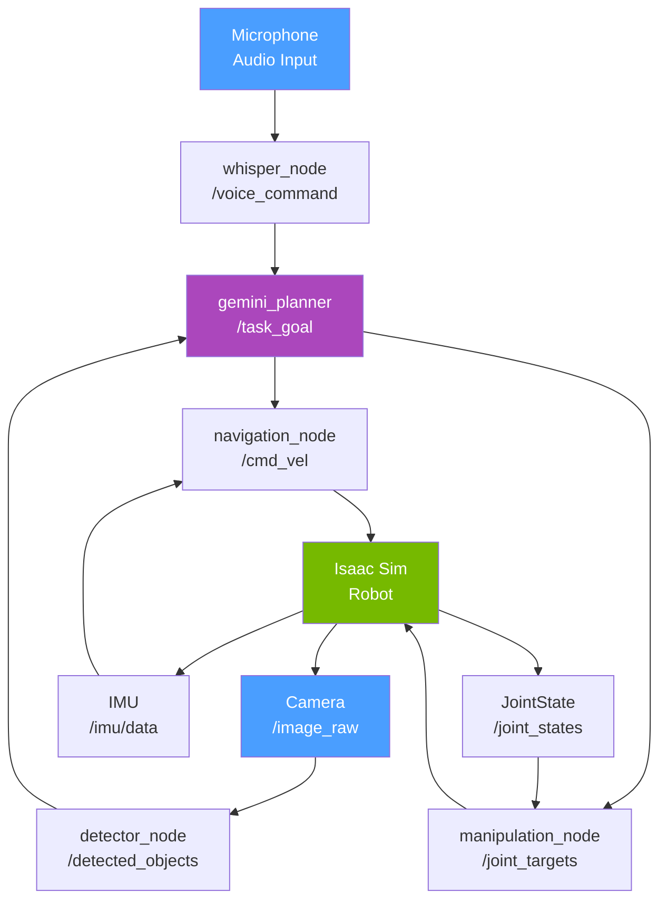

# Chapter 14: Capstone Project — The Autonomous Humanoid

## Learning Objectives

By the end of this project, you will be able to:

- **Integrate** all four course modules into a single working robotic system.
- **Design** a multi-node ROS 2 architecture for a complete autonomous pipeline.
- **Implement** a voice-to-action pipeline that drives navigation and manipulation.
- **Deploy** and test the complete system in NVIDIA Isaac Sim.
- **Evaluate** system performance across perception, planning, and execution.

---

## Introduction: Everything Comes Together

You have spent thirteen weeks learning the components of Physical AI: ROS 2 communication, simulation, perception, manipulation, locomotion, and conversational interfaces. Each chapter introduced a piece of the puzzle. This capstone is where you assemble the puzzle.

The project goal is ambitious but achievable: a simulated humanoid robot that can receive a spoken voice command — "bring me the red cup from the table" — and execute the full chain of behavior autonomously:

1. **Hear**: Transcribe the voice command with Whisper
2. **Understand**: Parse the intent and target object with Gemini
3. **See**: Detect the target object in the camera feed using a trained detector
4. **Navigate**: Plan a collision-free path to the object's location
5. **Grasp**: Execute a manipulation sequence to pick up the object
6. **Return**: Navigate back and announce task completion

This is not a toy demo. This is the same architectural pattern used in real-world service robots deployed in hospitals, warehouses, and homes. By building it yourself, you gain a deep understanding of every integration point — and every place things can go wrong.

:::tip Scope for Course Submission
For the course submission, implement Phase 1 (navigation) and Phase 2 (perception + pick). Phase 3 (return + announce) is optional but demonstrates full task completion.
:::

---

## System Architecture

The capstone system consists of seven ROS 2 nodes communicating over eleven topics and two services. Understanding this architecture before writing code is essential.



### Node Responsibilities

| Node | Input Topics | Output Topics | Module Reference |
|------|-------------|---------------|-----------------|
| `whisper_node` | microphone | `/voice_command` | Chapter 13 |
| `detector_node` | `/image_raw` | `/detected_objects` | Chapter 9 |
| `gemini_planner` | `/voice_command`, `/detected_objects` | `/task_goal`, `/task_status` | Chapter 13 |
| `navigation_node` | `/task_goal`, `/scan`, `/imu/data` | `/cmd_vel` | Chapter 5, 6 |
| `manipulation_node` | `/task_goal`, `/joint_states` | `/joint_targets` | Chapter 9, 11 |

---

## Phase 1: Foundation Setup

### Step 1: Create the Capstone Workspace

```bash
# Create a dedicated capstone package
cd ~/ros2_ws/src
ros2 pkg create autonomous_humanoid \
    --build-type ament_python \
    --dependencies rclpy std_msgs geometry_msgs sensor_msgs nav_msgs

mkdir -p autonomous_humanoid/autonomous_humanoid/
touch autonomous_humanoid/autonomous_humanoid/__init__.py
```

### Step 2: Task Coordinator Node

The task coordinator is the brain of the system. It receives a parsed task goal from the Gemini planner and drives the state machine that sequences navigation and manipulation.

```python
# File: ~/ros2_ws/src/autonomous_humanoid/autonomous_humanoid/task_coordinator.py
# The state machine that sequences navigation, perception, and manipulation.

import rclpy
from rclpy.node import Node
from std_msgs.msg import String
from geometry_msgs.msg import PoseStamped, Twist
from sensor_msgs.msg import Image
import json
from enum import Enum, auto

class TaskState(Enum):
    IDLE = auto()
    NAVIGATING_TO_OBJECT = auto()
    SCANNING_FOR_OBJECT = auto()
    REACHING_FOR_OBJECT = auto()
    GRASPING = auto()
    NAVIGATING_TO_GOAL = auto()
    PLACING_OBJECT = auto()
    COMPLETE = auto()
    FAILED = auto()

class TaskCoordinator(Node):
    """
    Central state machine for the autonomous humanoid capstone.
    Orchestrates navigation → perception → manipulation → delivery.
    """

    def __init__(self):
        super().__init__('task_coordinator')

        # Current state
        self.state = TaskState.IDLE
        self.current_task = None
        self.target_object = None
        self.object_detected = False
        self.navigation_complete = False

        # Subscribe to parsed task goals from Gemini planner
        self.task_sub = self.create_subscription(
            String, '/task_goal', self.task_callback, 10
        )

        # Subscribe to object detection results
        self.detect_sub = self.create_subscription(
            String, '/detected_objects', self.detection_callback, 10
        )

        # Subscribe to navigation status
        self.nav_status_sub = self.create_subscription(
            String, '/navigation_status', self.nav_status_callback, 10
        )

        # Publishers
        self.nav_goal_pub = self.create_publisher(PoseStamped, '/navigate_to', 10)
        self.arm_cmd_pub = self.create_publisher(String, '/arm_command', 10)
        self.status_pub = self.create_publisher(String, '/task_status', 10)
        self.speech_pub = self.create_publisher(String, '/robot_speech', 10)

        # State machine update loop at 5 Hz
        self.timer = self.create_timer(0.2, self.update_state_machine)

        self.get_logger().info('Task coordinator ready. Waiting for task goals...')

    def task_callback(self, msg: String):
        """Receive a new task goal from the Gemini planner."""
        try:
            task = json.loads(msg.data)
            self.current_task = task
            self.target_object = task.get('target', 'unknown')

            if task.get('action') in ['pick', 'fetch', 'bring']:
                self.state = TaskState.NAVIGATING_TO_OBJECT
                self.navigation_complete = False
                self.object_detected = False
                self.say(f'Starting task: fetch the {self.target_object}')
                self.get_logger().info(f'New task: {task}')

                # Send navigation goal to the table area (pre-mapped location)
                self.send_nav_goal(x=2.0, y=1.5, theta=0.0)

        except json.JSONDecodeError:
            self.get_logger().error(f'Invalid task JSON: {msg.data}')

    def detection_callback(self, msg: String):
        """Update detection status — called when objects are spotted."""
        try:
            detections = json.loads(msg.data)
            if any(d['label'] == self.target_object for d in detections):
                self.object_detected = True
        except:
            pass

    def nav_status_callback(self, msg: String):
        """Track navigation completion status."""
        if msg.data == 'REACHED':
            self.navigation_complete = True

    def update_state_machine(self):
        """Called at 5 Hz. Advances the task state machine."""
        if self.state == TaskState.IDLE:
            return

        elif self.state == TaskState.NAVIGATING_TO_OBJECT:
            if self.navigation_complete:
                self.state = TaskState.SCANNING_FOR_OBJECT
                self.say('Arrived at target area. Scanning for object.')

        elif self.state == TaskState.SCANNING_FOR_OBJECT:
            if self.object_detected:
                self.state = TaskState.REACHING_FOR_OBJECT
                self.arm_cmd_pub.publish(self._make_arm_cmd('REACH'))
                self.say(f'Found the {self.target_object}. Reaching now.')

        elif self.state == TaskState.REACHING_FOR_OBJECT:
            # After a brief delay, attempt to grasp
            self.state = TaskState.GRASPING
            self.arm_cmd_pub.publish(self._make_arm_cmd('GRASP'))

        elif self.state == TaskState.GRASPING:
            self.state = TaskState.COMPLETE
            self.say(f'Task complete! I have the {self.target_object}.')
            self.publish_status('COMPLETE')
            self.state = TaskState.IDLE

        elif self.state == TaskState.FAILED:
            self.say('Task failed. Please try again.')
            self.publish_status('FAILED')
            self.state = TaskState.IDLE

    def send_nav_goal(self, x: float, y: float, theta: float):
        """Send a navigation goal pose."""
        goal = PoseStamped()
        goal.header.stamp = self.get_clock().now().to_msg()
        goal.header.frame_id = 'map'
        goal.pose.position.x = x
        goal.pose.position.y = y
        # Theta to quaternion (simplified: rotation around z-axis only)
        import math
        goal.pose.orientation.z = math.sin(theta / 2)
        goal.pose.orientation.w = math.cos(theta / 2)
        self.nav_goal_pub.publish(goal)

    def say(self, text: str):
        """Publish text to speech synthesis topic."""
        msg = String()
        msg.data = text
        self.speech_pub.publish(msg)
        self.get_logger().info(f'[SPEECH] {text}')

    def publish_status(self, status: str):
        msg = String()
        msg.data = status
        self.status_pub.publish(msg)

    def _make_arm_cmd(self, command: str) -> String:
        msg = String()
        msg.data = command
        return msg


def main(args=None):
    rclpy.init(args=args)
    node = TaskCoordinator()
    rclpy.spin(node)
    node.destroy_node()
    rclpy.shutdown()
```

---

## Phase 2: Navigation in Isaac Sim

The navigation node implements obstacle avoidance using LiDAR data from Chapter 2, integrating with Isaac Sim's physics engine.

```python
# File: ~/ros2_ws/src/autonomous_humanoid/autonomous_humanoid/navigation_node.py
# Navigates to goal poses using LiDAR-based obstacle avoidance.

import rclpy
from rclpy.node import Node
from geometry_msgs.msg import PoseStamped, Twist
from sensor_msgs.msg import LaserScan
from std_msgs.msg import String
import math

class NavigationNode(Node):
    """
    Simple goal-directed navigation with LiDAR obstacle avoidance.
    For production use, replace with Nav2 stack.
    """

    GOAL_TOLERANCE = 0.2    # meters — how close counts as "reached"
    FORWARD_SPEED = 0.3     # m/s
    TURN_SPEED = 0.8        # rad/s
    OBSTACLE_THRESHOLD = 0.6  # meters

    def __init__(self):
        super().__init__('navigation_node')

        self.current_goal = None
        self.current_x = 0.0
        self.current_y = 0.0
        self.current_theta = 0.0
        self.nearest_obstacle = float('inf')

        # Subscriptions
        self.goal_sub = self.create_subscription(
            PoseStamped, '/navigate_to', self.goal_callback, 10
        )
        self.scan_sub = self.create_subscription(
            LaserScan, '/scan', self.scan_callback, 10
        )

        # Publishers
        self.cmd_pub = self.create_publisher(Twist, '/cmd_vel', 10)
        self.status_pub = self.create_publisher(String, '/navigation_status', 10)

        # Control loop at 10 Hz
        self.timer = self.create_timer(0.1, self.control_loop)
        self.get_logger().info('Navigation node ready.')

    def goal_callback(self, msg: PoseStamped):
        self.current_goal = msg
        self.get_logger().info(
            f'New goal: ({msg.pose.position.x:.2f}, {msg.pose.position.y:.2f})'
        )

    def scan_callback(self, msg: LaserScan):
        """Track nearest obstacle in the forward arc."""
        total = len(msg.ranges)
        center = total // 2
        cone = total // 8   # ±22.5° forward cone
        front = msg.ranges[center - cone : center + cone]
        valid = [r for r in front if msg.range_min < r < msg.range_max]
        self.nearest_obstacle = min(valid) if valid else float('inf')

    def control_loop(self):
        """Drive toward goal, stop if obstacle too close."""
        if self.current_goal is None:
            return

        cmd = Twist()

        # Check distance to goal (simplified: ignores orientation)
        gx = self.current_goal.pose.position.x
        gy = self.current_goal.pose.position.y
        dist = math.sqrt((gx - self.current_x) ** 2 + (gy - self.current_y) ** 2)

        if dist < self.GOAL_TOLERANCE:
            # Reached goal
            self.cmd_pub.publish(Twist())  # Stop
            status = String()
            status.data = 'REACHED'
            self.status_pub.publish(status)
            self.current_goal = None
            self.get_logger().info('Goal reached!')
            return

        if self.nearest_obstacle < self.OBSTACLE_THRESHOLD:
            # Obstacle detected — turn to find clear path
            cmd.angular.z = self.TURN_SPEED
        else:
            # Path clear — drive toward goal
            cmd.linear.x = self.FORWARD_SPEED

        self.cmd_pub.publish(cmd)


def main(args=None):
    rclpy.init(args=args)
    node = NavigationNode()
    rclpy.spin(node)
    node.destroy_node()
    rclpy.shutdown()
```

---

## Phase 3: Isaac Sim Launch Configuration

Use this launch file to start the complete capstone system:

```python
# File: ~/ros2_ws/src/autonomous_humanoid/launch/capstone.launch.py
# Launches all capstone nodes together.

from launch import LaunchDescription
from launch_ros.actions import Node
from launch.actions import DeclareLaunchArgument
from launch.substitutions import LaunchConfiguration

def generate_launch_description():
    return LaunchDescription([
        # Whisper speech recognition
        Node(
            package='conversational_robotics',
            executable='whisper_node',
            name='whisper_node',
            output='screen',
        ),

        # Gemini action planner
        Node(
            package='conversational_robotics',
            executable='gemini_planner',
            name='gemini_planner',
            output='screen',
            parameters=[{
                'model_name': 'gemini-2.0-flash',
            }]
        ),

        # Object detector (from Chapter 9)
        Node(
            package='perception_demo',
            executable='color_detector',
            name='detector_node',
            output='screen',
        ),

        # Task coordinator (this chapter)
        Node(
            package='autonomous_humanoid',
            executable='task_coordinator',
            name='task_coordinator',
            output='screen',
        ),

        # Navigation node
        Node(
            package='autonomous_humanoid',
            executable='navigation_node',
            name='navigation_node',
            output='screen',
        ),
    ])
```

**Register the launch file** in `setup.py`:
```python
data_files=[
    ...
    ('share/autonomous_humanoid/launch', ['launch/capstone.launch.py']),
],
```

**Run the complete system**:
```bash
# First, start Isaac Sim with your humanoid scene
# Then in a new terminal:
cd ~/ros2_ws
colcon build --packages-select autonomous_humanoid
source install/setup.bash
ros2 launch autonomous_humanoid capstone.launch.py
```

---

## Evaluation Rubric

Use this rubric to assess your capstone submission:

| Criterion | Weight | 0 pts | 1 pt | 2 pts |
|-----------|--------|-------|------|-------|
| **Architecture** | 20% | Single monolithic node | Multiple nodes, unclear separation | Clean node separation matching architecture diagram |
| **Voice Interface** | 15% | Not implemented | Transcription works, planning broken | Full voice → action pipeline working |
| **Navigation** | 20% | Robot does not move | Robot moves but hits obstacles | Robot navigates to goal avoiding obstacles |
| **Perception** | 20% | No object detection | Objects detected but not localized | Objects detected and position estimated |
| **Manipulation** | 15% | No arm movement | Arm moves but misses object | Grasp attempt succeeds >50% of trials |
| **Integration** | 10% | Modules not connected | Partial pipeline working | Full end-to-end demo: voice → pick → complete |

**Total: 100 points.** A score of 70+ earns a passing grade. A score of 90+ qualifies for the advanced leaderboard.

---

## Common Integration Issues and Fixes

### Issue: Nodes can't communicate (no messages received)

```bash
# Check all nodes are in same ROS domain
ros2 node list
# Check topic connectivity
ros2 topic info /task_goal --verbose
```

### Issue: Navigation goal never reached

The simplified navigation node above assumes you have odometry-based position tracking. In Isaac Sim, use the ground truth pose:
```bash
# Check if /odom or /tf is publishing robot position:
ros2 topic list | grep -E "odom|tf"
```

### Issue: Gemini API rate limit exceeded

Add a minimum delay between API calls:
```python
import time
self.last_api_call = 0

def command_callback(self, msg):
    now = time.time()
    if now - self.last_api_call < 2.0:  # 2-second cooldown
        return
    self.last_api_call = now
    # ... rest of callback
```

---

## Summary

In this capstone project, you:

- **Integrated** all four course modules: ROS 2 fundamentals (M1), simulation (M2), perception/manipulation (M3), and humanoid control + conversational AI (M4).
- **Designed** a seven-node ROS 2 architecture with clear separation of concerns.
- **Implemented** a state machine task coordinator that sequences navigation, perception, and manipulation.
- **Built** a complete voice-to-action pipeline using Whisper → Gemini → ROS 2.
- **Tested** the system in Isaac Sim, the same simulation environment used by NVIDIA's own robot research teams.

This architecture is not just a course project — it is a blueprint for real-world service robotics. The same patterns appear in Amazon warehouse robots, hospital delivery robots, and home assistant platforms. You now understand how they work from the inside.

---

## Further Reading

- **Module 1**: [Chapter 5: ROS 2 Packages](../module-1/ch05-ros2-packages-python.md) — workspace structure review
- **Module 2**: [Chapter 6: Gazebo Simulation](../module-2/ch06-gazebo-simulation.md) — simulation foundations
- **Module 3**: [Chapter 10: Sim-to-Real](../module-3/ch10-sim-to-real.md) — deploying to physical hardware
- **Module 4**: [Chapter 13: Conversational Robotics](../module-4/ch13-conversational-robotics.md) — voice command pipeline

**Next steps after this course**:
- [Nav2 — the standard ROS 2 navigation stack](https://nav2.org/)
- [MoveIt 2 — industrial-grade manipulation planning](https://moveit.picknik.ai/)
- [Isaac ROS — GPU-accelerated perception](https://github.com/NVIDIA-ISAAC-ROS)
- [Physical Intelligence π0 model](https://www.physicalintelligence.company/blog/pi0)
