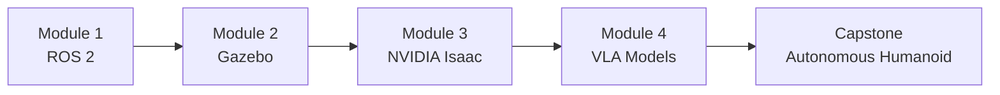

# Preface & Course Overview

> Content coming soon. This chapter will introduce the book, its goals, the course structure, and how to use this textbook effectively.

**Topics covered in this chapter:**
- What is Physical AI and why it matters
- Course overview: 4 modules, 13 weeks
- How to use this textbook
- Prerequisites and learning path
- Hardware and software requirements

## Course Structure



## Code Example

```python
# ROS 2 Publisher Node (Preview)
import rclpy
from rclpy.node import Node
from std_msgs.msg import String

class PhysicalAIPublisher(Node):
    def __init__(self):
        super().__init__('physical_ai_publisher')
        self.publisher_ = self.create_publisher(String, 'robot_command', 10)
        self.timer = self.create_timer(1.0, self.publish_command)

    def publish_command(self):
        msg = String()
        msg.data = 'Navigate to target'
        self.publisher_.publish(msg)
        self.get_logger().info(f'Published: {msg.data}')
```
