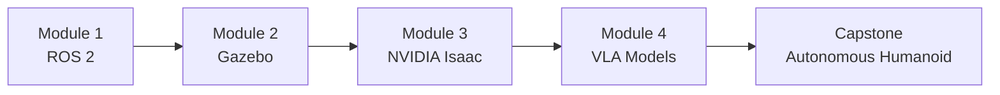

# Preface & Course Overview

## Learning Objectives

By the end of this chapter, you will be able to:

- **Define** Physical AI and distinguish it from traditional software-only artificial intelligence.
- **Identify** the four modules of this course and explain how they build upon one another.
- **Configure** a development environment suitable for ROS 2 and robot simulation.
- **Run** a minimal ROS 2 publisher node in Python and interpret its output.
- **Navigate** this textbook effectively using the recommended reading path and cross-references.

---

## Introduction

Imagine walking into a busy hospital at 3 a.m. The hallways are quiet except for a soft whirring sound. A humanoid robot rolls up to the nursing station carrying a tray of medications, each sorted by patient room number. It pauses at a doorway, scans the room with depth cameras, identifies the patient's wristband, and gently places the correct medication on the bedside table. No human nurse had to leave the station. No medication error occurred.

This is not science fiction. Companies like **Boston Dynamics**, **Tesla**, **Figure AI**, and **Agility Robotics** are actively building machines that operate in spaces designed for humans. Warehouses, hospitals, homes, and construction sites are all becoming proving grounds for robots that can see, walk, grasp, and respond to spoken language.

The convergence is happening now because three technologies matured at the same time. **Large Language Models** gave machines the ability to understand natural language instructions. **GPU-accelerated simulation** made it possible to train robot behaviors in virtual worlds millions of times faster than in the real world. And **edge AI hardware** like NVIDIA Jetson became powerful enough to run those trained models on a robot's body in real time.

This textbook exists to teach you how all of these pieces fit together. You do not need prior robotics experience. You do need curiosity, basic Python skills, and the willingness to work through hands-on exercises that connect theory to practice.

---

## What is Physical AI?

**Physical AI** refers to artificial intelligence systems that perceive, reason about, and act within the physical world. Unlike a chatbot that processes text or an image classifier that labels photos, a Physical AI system must contend with gravity, friction, obstacles, and the unpredictable nature of real environments.

Think of it this way: a traditional AI model lives inside a server rack. It receives data, computes an answer, and sends it back. A Physical AI system lives inside a body. It must sense the world through cameras and LiDAR, decide what to do, and then move motors, joints, and actuators to carry out that decision. If the decision is wrong, the robot falls over. The stakes are literally physical.

### Real-World Examples

The field is advancing rapidly. Here are three landmark systems that define the current state of Physical AI:

- **Boston Dynamics Atlas**: Originally a hydraulic research platform, Atlas demonstrated backflips, parkour, and dynamic obstacle traversal. The newer electric Atlas focuses on warehouse logistics. It represents the pinnacle of dynamic bipedal locomotion.

- **Tesla Optimus (Gen 2)**: Tesla's humanoid robot is designed for repetitive factory tasks. It uses the same vision-based neural networks that power Tesla's self-driving cars, repurposed for a bipedal body. Optimus demonstrates how automotive AI pipelines can transfer to humanoid robotics.

- **Figure 01/02**: Figure AI's humanoid integrates OpenAI's language models to understand spoken commands. In a widely shared demo, Figure 01 was asked "Can you give me something to eat?" and correctly identified, picked up, and handed over an apple. This showed the power of combining Vision-Language-Action (VLA) models with a physical robot body.

What these systems share is a common software architecture: a perception layer (cameras, sensors), a reasoning layer (AI models), and an actuation layer (motors, joints). This textbook teaches you how to build all three layers using open-source tools.

:::note
You will not build a physical humanoid robot in this course. Instead, you will build the complete software stack and test it in high-fidelity simulation. The software you write is the same software that runs on real robots. Simulation is not a shortcut; it is how the industry works.
:::

---

## Course Structure

This course is organized into four modules, each building on the previous one, culminating in a capstone project where you bring everything together.



### Module 1: The Robotic Nervous System (ROS 2)

**Chapters 1--5** introduce the Robot Operating System 2, the middleware that nearly every modern robot uses. You will learn how ROS 2 organizes software into **nodes** that communicate over **topics**, **services**, and **actions**. By the end of this module, you will be writing Python programs that send commands to simulated robot joints and receive sensor data in return. You will also learn **URDF** (Unified Robot Description Format), the XML-based language used to describe a robot's body.

### Module 2: The Digital Twin (Gazebo)

**Chapters 6--7** move your ROS 2 programs into a 3D physics simulator called **Gazebo**. You will build virtual worlds with gravity, friction, and collisions. You will attach simulated sensors --- LiDAR, depth cameras, IMUs --- to a virtual robot and watch your ROS 2 nodes process that sensor data in real time. This is where your code starts controlling a body, even if that body is made of pixels.

### Module 3: The AI-Robot Brain (NVIDIA Isaac)

**Chapters 8--10** introduce **NVIDIA Isaac**, a platform for building AI-powered robots. Isaac Sim provides photorealistic simulation and synthetic data generation. Isaac ROS provides hardware-accelerated perception pipelines including Visual SLAM (simultaneous localization and mapping) and autonomous navigation via **Nav2**. You will also learn **sim-to-real transfer**, the technique of training a robot in simulation and deploying the learned behaviors to physical hardware.

### Module 4: Vision-Language-Action Models

**Chapters 11--13** tackle the cutting edge: humanoid kinematics, bipedal locomotion, and conversational robotics. You will integrate speech recognition (Whisper) to accept voice commands, use large language models to translate natural language into robot action plans, and combine vision and language into a unified control pipeline.

### Capstone: The Autonomous Humanoid

**Chapter 14** is where it all comes together. Your final project is a simulated humanoid robot that receives a voice command, plans a path through an environment with obstacles, navigates to a target object, identifies it using computer vision, and manipulates it. Every module feeds into this capstone.

---

## How to Use This Textbook

### Reading Path

This textbook is designed to be read linearly from Chapter 1 through Chapter 14. Each chapter assumes knowledge from the chapters before it. If you are already familiar with ROS 2, you can skim Chapters 3--5, but make sure you are comfortable with the code patterns used there before moving to Module 2.

### Prerequisites

You need the following before starting Chapter 1:

- **Python 3.10+**: You should be comfortable writing Python functions, classes, and using pip to install packages. You do not need to be an expert.
- **Linux basics**: You should know how to open a terminal, navigate directories with `cd` and `ls`, and edit files. Ubuntu 22.04 is the recommended operating system.
- **No prior robotics experience**: This textbook starts from zero. We explain every robotics concept before using it.

### Hardware Options

This course is computationally demanding. You have two paths:

| Path | What You Need | Best For |
|------|--------------|----------|
| **Local Workstation** | Ubuntu 22.04, NVIDIA RTX 4070 Ti or higher, 64 GB RAM | Full experience including Isaac Sim |
| **Cloud Lab** | Any laptop + AWS g5.2xlarge instance (~$1.50/hr) | Students without RTX GPUs |

For detailed hardware specifications and the Economy Jetson Student Kit ($700), see [Appendix A1: Hardware Setup](../appendices/a1-hardware-setup.md). For step-by-step software installation, see [Appendix A2: Software Installation](../appendices/a2-software-installation.md).

:::tip
If you do not have an NVIDIA GPU, do not let that stop you. Chapters 1--5 (the entire ROS 2 module) run on any modern computer. You only need GPU hardware starting in Module 2, and even then, cloud options are available. Start learning now and sort out hardware later.
:::

### Conventions Used in This Book

Throughout this textbook, you will encounter the following patterns:

- **Code blocks** contain working, copy-paste-ready examples. Every code block specifies the filename in a header comment.
- **Mermaid diagrams** illustrate architecture, data flow, and state machines. They render automatically in the web version of this book.
- **Admonition boxes** (like the tip above) highlight important notes, warnings, and best practices.
- **Exercises** at the end of each chapter range from conceptual questions to full coding challenges.

---

## Your First Taste of ROS 2

Before diving into theory, let us look at a complete ROS 2 program. Do not worry if you do not understand every line yet. The goal is to see the shape of a ROS 2 application and build excitement for what is coming in Module 1.

The following program creates a **publisher node** --- a small program that sends messages on a named channel called a **topic**. In robotics, this pattern is used everywhere: a camera node publishes images, a motor controller subscribes to velocity commands, and a planner publishes navigation waypoints.

```python
# filename: physical_ai_publisher.py
# A minimal ROS 2 publisher node that sends robot commands once per second.

import rclpy                          # ROS 2 Python client library
from rclpy.node import Node           # Base class for all ROS 2 nodes
from std_msgs.msg import String       # A simple message type containing one string field

class PhysicalAIPublisher(Node):
    """A ROS 2 node that publishes command strings to a topic."""

    def __init__(self):
        # Initialize the node with the name 'physical_ai_publisher'.
        # This name appears in tools like `ros2 node list`.
        super().__init__('physical_ai_publisher')

        # Create a publisher that sends String messages on the 'robot_command' topic.
        # The '10' is the queue size: how many unsent messages to buffer.
        self.publisher_ = self.create_publisher(String, 'robot_command', 10)

        # Create a timer that fires every 1.0 second.
        # Each tick calls self.publish_command.
        self.timer = self.create_timer(1.0, self.publish_command)

        # A counter so we can see each message is unique.
        self.count = 0

    def publish_command(self):
        """Called once per second by the timer. Builds and publishes a message."""
        msg = String()                                  # Create an empty String message
        msg.data = f'Navigate to target #{self.count}'  # Fill in the data field
        self.publisher_.publish(msg)                    # Send it onto the topic
        self.get_logger().info(f'Published: "{msg.data}"')  # Log to the terminal
        self.count += 1


def main(args=None):
    rclpy.init(args=args)                     # Initialize the ROS 2 runtime
    node = PhysicalAIPublisher()              # Create an instance of our node
    rclpy.spin(node)                          # Keep the node running until Ctrl+C
    node.destroy_node()                       # Clean up the node
    rclpy.shutdown()                          # Shut down the ROS 2 runtime


if __name__ == '__main__':
    main()
```

When you run this program (after installing ROS 2, which we cover in Chapter 3), you will see output like this:

```
[INFO] [1717012345.678] [physical_ai_publisher]: Published: "Navigate to target #0"
[INFO] [1717012346.678] [physical_ai_publisher]: Published: "Navigate to target #1"
[INFO] [1717012347.678] [physical_ai_publisher]: Published: "Navigate to target #2"
[INFO] [1717012348.678] [physical_ai_publisher]: Published: "Navigate to target #3"
```

Let us break down what is happening:

1. **`rclpy.init()`** starts the ROS 2 communication layer. Without this call, no messages can be sent or received.
2. **`Node.__init__('physical_ai_publisher')`** registers this program as a named participant in the ROS 2 network. Other nodes can discover it by name.
3. **`create_publisher(String, 'robot_command', 10)`** declares that this node will send `String` messages on the topic `robot_command`. Any other node that subscribes to that topic will receive every message.
4. **`create_timer(1.0, self.publish_command)`** sets up a callback that fires every second. Timers are how ROS 2 nodes perform periodic work without blocking.
5. **`rclpy.spin(node)`** enters an event loop. The node stays alive, processing timer callbacks and incoming messages, until you press Ctrl+C.

This is the fundamental pattern of all ROS 2 programming. In Chapter 4, you will build both publishers and subscribers, connect them, and watch data flow between nodes. In later modules, the `String` message will be replaced with sensor data, velocity commands, and navigation goals.

---

## Summary

This chapter introduced the key ideas you will explore throughout the rest of this textbook:

- **Physical AI** is AI that operates in the real world through a physical body, contending with gravity, friction, and unpredictable environments.
- The course is structured into **four progressive modules**: ROS 2 fundamentals, Gazebo simulation, NVIDIA Isaac perception and navigation, and Vision-Language-Action models.
- You need **basic Python and Linux skills** to get started. No prior robotics experience is required.
- The textbook supports both **local workstation** and **cloud-based** development paths.
- A **ROS 2 publisher node** is the fundamental building block of robot software. It sends messages on a named topic that other nodes can subscribe to.

Every concept introduced here will be expanded, practiced, and applied in the chapters ahead. By the end of this course, you will have built a complete autonomous humanoid robot system in simulation.

---

## Hands-On Exercise: Explore a Robot Demo

This exercise verifies that your development environment is ready and gives you a taste of what is coming.

### Part 1: Environment Check

Run the following commands in your terminal and confirm each one succeeds. If any command fails, consult [Appendix A2: Software Installation](../appendices/a2-software-installation.md) for troubleshooting.

```bash
# Check that Python 3.10+ is installed
python3 --version

# Check that pip is available
pip3 --version

# If you have already installed ROS 2, verify it
ros2 --help
```

### Part 2: Watch a ROS 2 Demo (No Installation Required)

If you have not yet installed ROS 2, complete this alternative exercise:

1. Visit the official ROS 2 documentation at [https://docs.ros.org/en/humble/](https://docs.ros.org/en/humble/).
2. Read the "What is ROS 2?" overview page.
3. Watch the Turtlesim demo video linked from the tutorials section. Turtlesim is a simple 2D simulator where a virtual turtle responds to ROS 2 commands.
4. Write down three questions you have about how ROS 2 works. Bring these questions to Chapter 3, where we answer them systematically.

### Part 3: Run the Publisher (If ROS 2 Is Installed)

If you have ROS 2 Humble or Iron installed:

1. Save the publisher code from the "Your First Taste of ROS 2" section above into a file called `physical_ai_publisher.py`.
2. Open a terminal, source your ROS 2 setup file (`source /opt/ros/humble/setup.bash`), and run:

```bash
python3 physical_ai_publisher.py
```

3. Open a second terminal, source ROS 2 again, and listen on the topic:

```bash
ros2 topic echo /robot_command
```

4. You should see the messages appearing in the second terminal. Congratulations --- you have just witnessed inter-process communication via ROS 2 topics.

---

## Further Reading

- **Next chapter**: [Chapter 1: Introduction to Physical AI](../module-1/ch01-intro-physical-ai.md) --- a deep dive into the principles, history, and landscape of Physical AI.
- **Software setup**: [Appendix A2: Software Installation](../appendices/a2-software-installation.md) --- step-by-step guide for installing ROS 2, Gazebo, and NVIDIA Isaac on Ubuntu 22.04.
- **Hardware guide**: [Appendix A1: Hardware Setup](../appendices/a1-hardware-setup.md) --- workstation specifications, Jetson kits, and cloud alternatives.
- **Cloud lab**: [Appendix A3: Cloud Lab Setup](../appendices/a3-cloud-lab-setup.md) --- how to run GPU-intensive simulations on AWS.
- **ROS 2 official documentation**: [https://docs.ros.org/en/humble/](https://docs.ros.org/en/humble/)
- **NVIDIA Isaac documentation**: [https://developer.nvidia.com/isaac](https://developer.nvidia.com/isaac)
- **Gazebo documentation**: [https://gazebosim.org/docs](https://gazebosim.org/docs)
