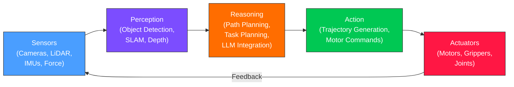

# Chapter 1: Introduction to Physical AI

## Learning Objectives

By the end of this chapter, you will be able to:

- **Define** Physical AI and explain how it differs from traditional software-only AI.
- **Describe** the Physical AI stack (Sensors, Perception, Reasoning, Action, Actuators) and the role of each layer.
- **Identify** at least three real-world humanoid robot platforms and their distinguishing capabilities.
- **Explain** why ROS 2 serves as the backbone for modern Physical AI systems.
- **Run** a simple Python sensor simulation loop and interpret its output.

---

## Introduction

Picture a warehouse at midnight. Rows of shelves stretch into the distance, stacked with thousands of packages. A humanoid robot walks down an aisle, reads a barcode with its chest-mounted camera, picks up a 10-kilogram box with two hands, and places it on a conveyor belt. It does this eight hours straight without a break, without a complaint, and without dropping a single package.

This scenario is not a projection for 2040. Companies are deploying robots like this today. But here is the question that matters for you as a learner: **how does the robot know what to do?**

The answer is Physical AI --- artificial intelligence that lives inside a body and operates in the real, messy, unpredictable physical world. Unlike a chatbot that processes text on a server, a Physical AI system must see obstacles, plan movements, and command motors in real time. If its software makes a bad decision, the robot does not just return an error message. It falls over.

This chapter introduces the foundational ideas behind Physical AI. You will learn the layered architecture that every physical AI system shares, meet the robots that define the state of the art, and understand why a middleware framework called ROS 2 ties everything together. By the end, you will have run your first simulated sensor loop in Python, taking the first step toward building robot software.

---

## 1.1 What Is Physical AI?

### The Core Idea

**Physical AI** refers to AI systems that perceive, reason about, and act within the physical world. The key word is *act*. A language model can generate a plan for cleaning a room, but it cannot pick up a sock. A Physical AI system can.

Think of AI as existing on a spectrum:

| Type | Input | Output | Example |
|------|-------|--------|---------|
| **Digital AI** | Text, images, data | Text, images, predictions | ChatGPT, DALL-E |
| **Cyber-Physical AI** | Sensor streams | Control signals | Self-driving cars |
| **Physical AI** | Sensor streams from a body | Motor commands to that body | Humanoid robots |

Physical AI sits at the far end of this spectrum. It requires a body --- cameras for eyes, motors for muscles, and a computer for a brain. The software must run in real time because the physical world does not pause while the robot thinks.

### Why Now?

Three breakthroughs converged to make Physical AI practical:

1. **Large-scale simulation**: Platforms like NVIDIA Isaac Sim can simulate millions of robot interactions in photorealistic virtual worlds. Robots learn in simulation, then transfer those skills to real hardware.
2. **Foundation models**: Vision-Language-Action (VLA) models allow robots to understand spoken commands like "pick up the red cup" and translate them into motor actions.
3. **Edge AI hardware**: Chips like the NVIDIA Jetson Orin can run neural networks directly on the robot, eliminating the latency of cloud-based inference.

These three pillars --- simulation, foundation models, and edge compute --- form the technological foundation that this entire textbook builds upon.

---

## 1.2 The Physical AI Stack

Every Physical AI system, from a warehouse arm to a humanoid robot, follows the same layered architecture. Understanding this stack is the single most important concept in this chapter.



Let us walk through each layer.

### Sensors (Input Layer)

Sensors are the robot's senses. They convert physical phenomena into digital data:

- **Cameras** (RGB and depth) provide visual information. A depth camera like the Intel RealSense D435i produces both a color image and a distance measurement for every pixel.
- **LiDAR** (Light Detection and Ranging) emits laser pulses and measures how long they take to bounce back, creating a precise 3D map of the surroundings.
- **IMUs** (Inertial Measurement Units) measure acceleration and angular velocity --- think of them as the robot's inner ear, providing balance information.
- **Force/Torque sensors** measure how hard the robot is gripping or pushing, enabling delicate manipulation.

### Perception (Understanding Layer)

Raw sensor data is useless until it is interpreted. The perception layer converts camera pixels into identified objects, LiDAR point clouds into navigable maps, and IMU readings into orientation estimates. Key algorithms include:

- **Object detection**: "There is a cup 1.2 meters ahead."
- **SLAM** (Simultaneous Localization and Mapping): "I am at position (3.5, 2.1) in a room shaped like this."
- **Depth estimation**: "The table surface is 0.75 meters below my gripper."

### Reasoning (Decision Layer)

The reasoning layer decides what to do. Given the perception layer's understanding of the world, it plans actions:

- **Task planning**: "To clean the table, first pick up the plate, then wipe the surface, then place the plate back."
- **Path planning**: "To reach the kitchen, go forward 3 meters, turn left, go 5 meters."
- **LLM integration**: "The user said 'bring me a drink.' That means: locate a cup, pick it up, navigate to the user, hand it over."

### Action (Execution Layer)

The action layer converts high-level plans into specific motor commands. A path plan saying "move forward 3 meters" becomes a sequence of joint angles, velocities, and torques for each leg and each motor.

### Actuators (Output Layer)

Actuators are the robot's muscles. Electric motors rotate joints, linear actuators extend limbs, and grippers open and close. The feedback arrow in the diagram is critical: after every action, the sensors measure the result, and the cycle repeats.

### The Stack in This Course

Each module of this textbook maps directly to layers of the Physical AI stack:

| Module | Stack Layers Covered |
|--------|---------------------|
| Module 1 (ROS 2) | Communication between all layers |
| Module 2 (Gazebo) | Simulated sensors and actuators |
| Module 3 (Isaac) | Perception and navigation |
| Module 4 (VLA) | Reasoning and action |

---

## 1.3 Real Robots Shaping the Field

Understanding Physical AI in the abstract is useful, but seeing real systems grounds the theory. Here are three platforms that define the current state of the art.

### Boston Dynamics Spot and Atlas

Boston Dynamics has been building dynamic robots for over three decades. **Spot**, their quadruped (four-legged) robot, is commercially deployed in power plants, construction sites, and mines for autonomous inspection. Spot uses LiDAR, stereo cameras, and a sophisticated locomotion controller to walk over rough terrain.

**Atlas**, their humanoid, is perhaps the most recognizable robot in the world. The electric version of Atlas (introduced in 2024) focuses on warehouse logistics --- picking up heavy bins, navigating tight spaces, and operating in environments designed for humans. Atlas demonstrates that bipedal robots can perform dynamic, whole-body manipulation.

### Tesla Optimus

Tesla's **Optimus** (also called Tesla Bot) represents a different philosophy: build a general-purpose humanoid at automotive manufacturing scale. Optimus uses the same vision neural networks developed for Tesla's self-driving cars, repurposed for a walking body. Tesla has demonstrated Optimus sorting objects, folding clothes, and walking across uneven ground. The key insight from Tesla's approach is that autonomous driving and humanoid robotics share the same fundamental problem: perceive the world with cameras and act on it in real time.

### Figure 02

**Figure AI** builds humanoids specifically designed for commercial work. Their Figure 02 robot integrates large language models for understanding spoken instructions. In a landmark demonstration, Figure 01 was asked "Can you give me something to eat?" and it correctly identified an apple on a table, picked it up, and handed it to the person. This showed the practical power of combining Vision-Language-Action models with a physical robot body. Figure 02 advances this further with improved manipulation and faster inference.

### The Common Thread

Despite their differences, all three platforms share the same Physical AI stack described in Section 1.2, and all three use ROS 2 (or architectures heavily inspired by it) for communication between software modules.

---

## 1.4 Why ROS 2 Is the Backbone

You might wonder: why do we need a special framework for robot software? Why not just write Python scripts that read sensors and command motors?

The answer is complexity. A real robot runs dozens of software processes simultaneously: one for each camera, one for SLAM, one for path planning, one for motor control, one for safety monitoring. These processes must communicate reliably, in real time, and across different computers. A camera node on the robot's head sends images to a perception node on the robot's main computer, which sends detected objects to a planning node, which sends motor commands to controllers in the robot's legs.

**ROS 2** (Robot Operating System 2) provides the communication infrastructure that makes this possible. It is not an operating system in the traditional sense (like Linux or Windows). It is a **middleware framework** --- a set of libraries and tools that handle message passing, node discovery, and lifecycle management.

Key reasons ROS 2 is the industry standard:

- **Publisher-subscriber messaging**: Nodes communicate by publishing messages to named topics. Any node can subscribe to any topic. This decouples software components, making systems modular and testable.
- **DDS middleware**: ROS 2 uses the Data Distribution Service (DDS), an industrial-grade protocol for real-time data exchange. DDS handles discovery (nodes find each other automatically) and quality-of-service (you can configure reliability, latency, and priority).
- **Language support**: ROS 2 has first-class support for Python and C++. You will use Python throughout this textbook.
- **Ecosystem**: Thousands of packages exist for navigation, manipulation, perception, and simulation. You do not have to build everything from scratch.
- **Simulation integration**: ROS 2 integrates seamlessly with Gazebo and NVIDIA Isaac Sim, the two simulation platforms covered in this course.

You will install and start using ROS 2 in Chapter 3. For now, understand that ROS 2 is the glue that connects every layer of the Physical AI stack.

---

## 1.5 Your First Sensor Simulation

Let us write code. Even before installing ROS 2, you can simulate the fundamental pattern of Physical AI: a sensor reading loop. In robotics, sensors produce data continuously, and software must process each reading as it arrives.

The following Python script simulates a robot with three sensors: a temperature sensor, a distance sensor (like LiDAR), and a battery level monitor. It reads values in a loop, just like a real robot would.

```python
# filename: sensor_simulation.py
# A simple simulation of robot sensor readings.
# No ROS 2 required — pure Python to illustrate the sensor loop concept.

import random
import time

def read_temperature():
    """Simulate a temperature sensor (Celsius). Normal range: 20-30."""
    return round(20.0 + random.uniform(0, 10), 1)

def read_distance():
    """Simulate a LiDAR distance reading (meters). Range: 0.1 to 5.0."""
    return round(random.uniform(0.1, 5.0), 2)

def read_battery():
    """Simulate battery level (percent). Slowly drains over time."""
    # We use a global counter to simulate drain
    read_battery.level = getattr(read_battery, 'level', 100.0)
    read_battery.level -= random.uniform(0.1, 0.5)
    return round(max(read_battery.level, 0.0), 1)

def main():
    print("=== Robot Sensor Simulation ===")
    print(f"{'Time':>6}  {'Temp (C)':>9}  {'Distance (m)':>13}  {'Battery (%)':>12}")
    print("-" * 48)

    for tick in range(10):
        temp = read_temperature()
        dist = read_distance()
        batt = read_battery()

        # Flag warnings — this is what a reasoning layer would do
        warning = ""
        if temp > 28.0:
            warning += " [WARN: HIGH TEMP]"
        if dist < 0.5:
            warning += " [WARN: OBSTACLE CLOSE]"
        if batt < 20.0:
            warning += " [WARN: LOW BATTERY]"

        print(f"{tick:>6}  {temp:>9}  {dist:>13}  {batt:>12}{warning}")
        time.sleep(0.5)  # Simulate 2 Hz sensor rate

    print("\nSimulation complete.")

if __name__ == "__main__":
    main()
```

**Expected output** (values will vary due to randomness):

```
=== Robot Sensor Simulation ===
  Time   Temp (C)  Distance (m)  Battery (%)
------------------------------------------------
     0       23.4           3.21         99.7
     1       27.1           0.43         99.3 [WARN: OBSTACLE CLOSE]
     2       29.5           2.87         98.9 [WARN: HIGH TEMP]
     3       21.8           4.12         98.5
     4       25.6           1.05         98.1
     5       28.3           0.22         97.8 [WARN: HIGH TEMP] [WARN: OBSTACLE CLOSE]
     6       24.9           3.56         97.4
     7       22.1           2.33         97.0
     8       26.7           1.78         96.5
     9       20.3           4.89         96.1
```

### What This Code Teaches

This simple script demonstrates four core Physical AI concepts:

1. **Sensor polling loop**: Real robots read sensors at a fixed rate (here, 2 Hz). In ROS 2, this pattern becomes a timer callback inside a node.
2. **Multiple sensor streams**: A robot processes many data streams simultaneously. Each `read_*` function represents a different sensor.
3. **Threshold-based reasoning**: The warning logic is a primitive version of what a reasoning layer does --- interpret sensor data and flag important conditions.
4. **Time-series data**: Sensor values change over time. The battery drains. Distance fluctuates. A robot must handle this continuous flow.

In Chapter 3, you will replace this raw Python loop with a proper ROS 2 node that publishes sensor data on topics, allowing other nodes to subscribe and react.

---

## 1.6 From Simulation to Reality

A question you might have: "If we are working in simulation, does it matter?" The answer is a resounding yes. Here is why.

Modern robot development follows a **sim-to-real pipeline**:

1. **Build the software stack** using ROS 2 nodes (Modules 1 and 2).
2. **Train behaviors** in simulation using millions of trials (Module 3).
3. **Validate in simulation** with randomized environments and sensor noise.
4. **Deploy to real hardware** with minimal code changes.

The key insight is that the ROS 2 code you write in simulation is the same code that runs on a real robot. The only thing that changes is the data source: instead of a simulated camera, you connect a real camera. The publisher-subscriber architecture of ROS 2 makes this swap seamless.

This is why NVIDIA, Boston Dynamics, and Tesla all invest heavily in simulation. It is not a shortcut --- it is the standard development workflow for Physical AI.

```python
# filename: sim_vs_real.py
# Demonstrates how the same processing logic works with different data sources.
# In a real system, you would swap SimulatedSensor for a hardware driver.

class SimulatedSensor:
    """Produces fake distance readings for testing."""
    def __init__(self):
        import random
        self._random = random

    def read(self):
        return round(self._random.uniform(0.5, 4.0), 2)

class RealSensor:
    """Placeholder for a real hardware sensor driver."""
    def read(self):
        # In production, this would read from USB, I2C, or a ROS 2 topic.
        raise NotImplementedError("Connect real hardware to use this.")

def process_reading(distance):
    """Same logic regardless of data source."""
    if distance < 1.0:
        return "STOP — obstacle too close"
    elif distance < 2.0:
        return "SLOW — approaching obstacle"
    else:
        return "CLEAR — full speed ahead"

# --- Usage ---
sensor = SimulatedSensor()  # Swap to RealSensor() on hardware
for i in range(5):
    d = sensor.read()
    action = process_reading(d)
    print(f"Reading {i}: {d:.2f}m -> {action}")
```

**Expected output** (values will vary):

```
Reading 0: 2.45m -> CLEAR — full speed ahead
Reading 1: 0.87m -> STOP — obstacle too close
Reading 2: 1.53m -> SLOW — approaching obstacle
Reading 3: 3.21m -> CLEAR — full speed ahead
Reading 4: 1.02m -> SLOW — approaching obstacle
```

The `process_reading` function does not care whether the distance came from a simulated sensor or a real LiDAR. This separation of concerns is fundamental to how professional robot software is designed.

---

## Summary

This chapter introduced the foundational concepts that underpin the entire textbook:

- **Physical AI** is artificial intelligence that perceives, reasons about, and acts within the physical world through a body with sensors and actuators.
- The **Physical AI stack** (Sensors, Perception, Reasoning, Action, Actuators) is a universal architecture shared by every robot, from warehouse arms to humanoids.
- Real robots like **Boston Dynamics Atlas**, **Tesla Optimus**, and **Figure 02** demonstrate that Physical AI is already commercially viable, not a distant research goal.
- **ROS 2** is the middleware framework that connects all layers of the stack, providing publisher-subscriber messaging, real-time communication, and integration with simulation tools.
- The **sim-to-real pipeline** means the code you write in simulation is the same code that runs on real hardware.
- A **sensor loop** is the fundamental pattern of Physical AI: read sensors, process data, decide actions, repeat.

---

## Hands-On Exercise

### Goal

Verify that your development environment is ready for this course by checking Python and (optionally) ROS 2 installations, then extend the sensor simulation.

### Prerequisites

- A computer running Ubuntu 22.04 (recommended) or any OS with Python 3.10+
- A terminal / command line

### Steps

1. **Check your Python version**:

   ```bash
   python3 --version
   ```

   You should see `Python 3.10.x` or higher.

2. **Run the sensor simulation**:

   Save the `sensor_simulation.py` code from Section 1.5 to a file and run it:

   ```bash
   python3 sensor_simulation.py
   ```

   Verify that you see 10 lines of sensor readings with occasional warnings.

3. **Extend the simulation**: Add a fourth sensor function called `read_orientation()` that returns a random angle between 0 and 360 degrees (simulating a compass heading). Add it to the output table and add a warning if the heading changes by more than 45 degrees between consecutive readings.

4. **(Optional) Verify ROS 2**: If you have already installed ROS 2 Humble, run:

   ```bash
   source /opt/ros/humble/setup.bash
   ros2 --version
   ```

   You should see output like `ros2 0.9.x` (the exact number depends on your patch level). If you have not installed ROS 2 yet, no worries --- we will guide you through installation in Chapter 3.

### Expected Result

After completing step 3, your extended simulation should produce output similar to:

```
  Time   Temp (C)  Distance (m)  Battery (%)  Heading (deg)
---------------------------------------------------------------
     0       23.4           3.21         99.7          182.3
     1       27.1           0.43         99.3           47.5 [WARN: HEADING JUMP]
     ...
```

### Verification

You have successfully completed this exercise if:
- Python 3.10+ is confirmed installed.
- The sensor simulation runs without errors and produces 10 rows of output.
- Your extended simulation includes the heading column and heading-jump warnings.

---

## Further Reading

- **Previous**: [Preface & Course Overview](../intro/index.md) --- textbook introduction and course structure.
- **Next**: [Chapter 2: Embodied Intelligence](ch02-embodied-intelligence.md) --- why bodies matter for intelligence and the sensorimotor loop.
- **ROS 2 official documentation**: [https://docs.ros.org/en/humble/](https://docs.ros.org/en/humble/)
- **Boston Dynamics Atlas**: [https://bostondynamics.com/atlas/](https://bostondynamics.com/atlas/)
- **Tesla Optimus**: [https://www.tesla.com/optimus](https://www.tesla.com/optimus)
- **Figure AI**: [https://figure.ai/](https://figure.ai/)
- **NVIDIA Isaac**: [https://developer.nvidia.com/isaac](https://developer.nvidia.com/isaac)
