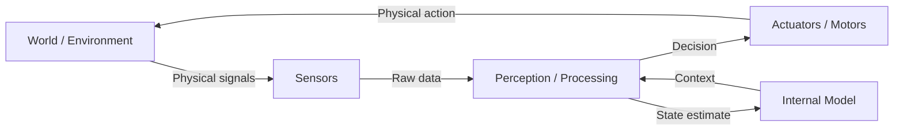

# Chapter 2: Embodied Intelligence & Sensors

## Learning Objectives

By the end of this chapter, you will be able to:

- **Explain** the concept of embodied intelligence and how physical embodiment changes the nature of AI.
- **Identify** the key sensor types used in humanoid robots (cameras, LiDAR, IMU, force/torque sensors).
- **Describe** why sensor fusion is necessary and how multiple sensors complement each other.
- **Write** a ROS 2 subscriber node that reads from a LiDAR topic and identifies obstacles.
- **Implement** a basic reactive controller that uses sensor data to avoid collisions.

---

## Introduction

In 1990, roboticist Rodney Brooks published a paper that challenged the prevailing view of AI. The conventional wisdom was that intelligence was purely computational — a powerful enough computer running the right algorithm would eventually produce intelligent behavior. Brooks argued the opposite: intelligence is not something that happens inside a computer. It emerges from the interaction between a body and its environment.

He called this **embodied intelligence** — the idea that having a physical body, with sensors that feel the world and actuators that change it, is not just useful for a robot but *constitutive* of real intelligence. A disembodied chess program, no matter how sophisticated, cannot learn that fire is dangerous or that ice is slippery. Only a body that has experienced these things can truly know them.

This chapter explores what it means for a robot to perceive the world. You will learn about the sensors that give robots their "senses," how those sensors produce data that ROS 2 can process, and how to write code that reacts to sensor input. This is the foundation upon which everything in this course builds — because before a robot can reason or act, it must first be able to *feel*.

---

## What is Embodied Intelligence?

**Embodied intelligence** refers to the principle that intelligent behavior arises from the continuous interaction between an agent's body, its sensors, and the physical environment. It stands in contrast to the classical "brain in a vat" model of AI, where intelligence is purely symbolic computation disconnected from the physical world.

Consider how a child learns about gravity. They do not learn it from a textbook first. They learn it by dropping objects, falling off things, and feeling weight in their hands. The body is not just a vehicle for the mind — it is part of the cognitive system.

For robots, this translates into a key design principle: **a robot without sensors is blind, and a blind robot cannot be intelligent**. Every decision a robot makes must ultimately be grounded in data from the physical world. The richer and more reliable that data, the more capable the robot becomes.

### The Sensorimotor Loop

All physically-embodied AI systems operate on what is called the **sensorimotor loop** — a continuous cycle of sensing, processing, and acting:



This loop runs continuously, typically at rates of 10–1000 Hz depending on the task. A robot navigating a cluttered hallway might update its obstacle map at 10 Hz using LiDAR while simultaneously updating its balance controller at 500 Hz using IMU data. The ability to close this loop reliably — in real time, despite sensor noise and actuator imprecision — is the core engineering challenge of Physical AI.

---

## Sensor Systems for Humanoid Robots

A humanoid robot typically carries a suite of sensors, each providing a different kind of information about the world. Understanding what each sensor does, and what it cannot do, is essential for designing robust robotic systems.

### RGB Cameras

**What they sense**: Color images, 2D pixel arrays at 30–60 fps.

RGB cameras are the most information-dense sensor on most robots. A single camera frame contains hundreds of thousands of pixels, each encoding color and brightness. Deep learning models trained on image data can extract objects, faces, text, and scene layouts from this stream.

**Limitations**: Cameras provide no direct depth information. Two objects at very different distances can appear the same size. Lighting changes — shadows, glare, low light — can break vision algorithms that work perfectly in lab conditions.

### Depth Cameras (RGB-D)

**What they sense**: Color images + per-pixel distance estimates (point clouds).

Depth cameras like the Intel RealSense D435 and ZED 2 combine an RGB camera with an infrared depth sensor. Each pixel in the output has both a color value and a distance measurement. This produces a **point cloud** — a 3D map of visible surfaces, typically at 30–90 fps.

ROS 2 message type: `sensor_msgs/PointCloud2`

**Limitations**: Depth cameras typically have a range of 0.3–10 meters. They struggle with transparent surfaces (glass, water) and shiny reflective materials. Outdoor sunlight can overwhelm the infrared sensor.

### LiDAR

**What they sense**: 360° distance measurements using laser pulses.

LiDAR (Light Detection and Ranging) spins a laser beam around 360° and measures how long each pulse takes to return. The result is a `LaserScan` message in ROS 2 — an array of distance values, one per angular step (typically 0.1°–0.5°).

ROS 2 message type: `sensor_msgs/LaserScan`

**Key fields**:
- `ranges[]` — array of distance values in meters
- `angle_min`, `angle_max` — scan angle range (usually -π to π)
- `angle_increment` — angular resolution between beams
- `range_min`, `range_max` — valid distance range

**Limitations**: LiDAR produces 2D or 3D point data but no color information. Small obstacles at ankle height can be missed by a horizontally-mounted LiDAR.

### IMU (Inertial Measurement Unit)

**What they sense**: Acceleration and rotation rate (linear + angular motion).

An IMU contains a **3-axis accelerometer** (measures linear acceleration, including gravity) and a **3-axis gyroscope** (measures rotation rate). Together, they allow a robot to estimate its orientation and motion at very high rates (500–2000 Hz).

ROS 2 message type: `sensor_msgs/Imu`

For a bipedal robot, the IMU is critical: it tells the balance controller which way is "down" and how fast the body is rotating. Without a functioning IMU, a walking robot cannot maintain balance.

### Force/Torque Sensors

**What they sense**: Contact forces and moments at robot joints or end-effectors.

Force/torque (F/T) sensors measure how hard a robot is pressing or being pressed. Placed in a robot's wrist, they let a manipulation system detect when a gripper has grasped an object, and how firmly. Placed in a robot's ankle, they help a walking controller detect ground contact.

### Sensor Comparison

| Sensor | Data Type | Update Rate | Range | Key Weakness |
|--------|-----------|-------------|-------|--------------|
| RGB Camera | 2D image | 30–60 Hz | Line-of-sight | No depth, lighting-sensitive |
| RGB-D Camera | 3D point cloud | 30–90 Hz | 0.3–10 m | Fails on glass/reflective |
| LiDAR | 2D/3D distances | 10–40 Hz | 0.1–100 m | No color, misses small objects |
| IMU | Acceleration/rotation | 500–2000 Hz | N/A | Drift over time |
| Force/Torque | Force/moment | 500–1000 Hz | N/A | Only at contact point |

---

## Why Sensor Fusion Matters

No single sensor provides a complete picture of the world. Each has blind spots, limited range, or vulnerability to specific conditions. **Sensor fusion** is the practice of combining multiple sensor streams to produce a more accurate, complete, and robust state estimate than any single sensor could provide alone.

A classic example: LiDAR is highly accurate for distance but cannot identify what an object is. A camera can classify objects but cannot reliably measure their distance. By fusing LiDAR distance measurements with camera object detections, a robot can both know *where* an obstacle is and *what* it is.

In ROS 2, sensor fusion is typically handled by dedicated packages:
- **`robot_localization`** — fuses IMU and odometry to estimate robot pose
- **`rtabmap_ros`** — fuses RGB-D + LiDAR for 3D mapping and localization
- **`depth_image_proc`** — converts depth images to point clouds

---

## Code Example: LiDAR Subscriber Node

The following ROS 2 node subscribes to a LaserScan topic and reports the distance to the nearest obstacle. This is the simplest form of obstacle awareness.

```python
# File: ~/ros2_ws/src/sensor_demo/sensor_demo/lidar_reader.py
# Subscribes to /scan (LiDAR data) and prints nearest obstacle distance.

import rclpy
from rclpy.node import Node
from sensor_msgs.msg import LaserScan  # LiDAR message type

class LidarReader(Node):
    """A ROS 2 node that reads LaserScan data and finds the nearest obstacle."""

    def __init__(self):
        super().__init__('lidar_reader')

        # Subscribe to the /scan topic. Queue size 10 means we buffer up to
        # 10 messages before dropping old ones if we fall behind.
        self.subscription = self.create_subscription(
            LaserScan,
            '/scan',
            self.scan_callback,
            10
        )
        self.get_logger().info('LiDAR reader started. Waiting for /scan messages...')

    def scan_callback(self, msg: LaserScan):
        """Called every time a new LaserScan message arrives."""
        # msg.ranges is a list of float distances in meters.
        # Values of 'inf' mean no obstacle was detected at that angle.
        # We filter those out before finding the minimum.
        valid_ranges = [r for r in msg.ranges if r > msg.range_min and r < msg.range_max]

        if not valid_ranges:
            self.get_logger().warn('No valid range readings in scan!')
            return

        # Find the nearest obstacle distance
        min_distance = min(valid_ranges)
        min_index = msg.ranges.index(min(msg.ranges))

        # Convert index to angle in degrees for human-readable output
        angle_rad = msg.angle_min + min_index * msg.angle_increment
        angle_deg = angle_rad * 180.0 / 3.14159

        self.get_logger().info(
            f'Nearest obstacle: {min_distance:.2f} m at {angle_deg:.1f}°'
        )


def main(args=None):
    rclpy.init(args=args)
    node = LidarReader()
    rclpy.spin(node)           # Keep node alive until Ctrl+C
    node.destroy_node()
    rclpy.shutdown()


if __name__ == '__main__':
    main()
```

**Expected output** (when a simulated robot is near a wall):
```
[INFO] [lidar_reader]: LiDAR reader started. Waiting for /scan messages...
[INFO] [lidar_reader]: Nearest obstacle: 0.82 m at -12.5°
[INFO] [lidar_reader]: Nearest obstacle: 0.80 m at -12.5°
[INFO] [lidar_reader]: Nearest obstacle: 0.79 m at -11.8°
```

### Obstacle Avoidance Controller

Now let us extend this into a simple reactive controller that steers away from obstacles:

```python
# File: ~/ros2_ws/src/sensor_demo/sensor_demo/obstacle_avoider.py
# A proportional controller that steers away from obstacles using LiDAR.

import rclpy
from rclpy.node import Node
from sensor_msgs.msg import LaserScan
from geometry_msgs.msg import Twist  # Velocity command message

class ObstacleAvoider(Node):
    """Steers a robot away from obstacles detected by LiDAR."""

    SAFE_DISTANCE = 0.8   # Meters — stop/turn if obstacle closer than this
    FORWARD_SPEED = 0.2   # m/s — default forward speed
    TURN_SPEED = 0.5      # rad/s — turning speed when obstacle detected

    def __init__(self):
        super().__init__('obstacle_avoider')

        # Subscribe to LiDAR data
        self.scan_sub = self.create_subscription(
            LaserScan, '/scan', self.scan_callback, 10
        )

        # Publish velocity commands to move the robot
        self.cmd_pub = self.create_publisher(Twist, '/cmd_vel', 10)

        self.get_logger().info('Obstacle avoider running.')

    def scan_callback(self, msg: LaserScan):
        """Decide how to move based on the closest obstacle."""
        cmd = Twist()  # All fields default to 0.0 (stopped)

        # Look only at the forward 60° cone (30° left and right of center)
        total_readings = len(msg.ranges)
        center = total_readings // 2
        cone_half = total_readings // 12  # ~30° on each side

        front_ranges = msg.ranges[center - cone_half : center + cone_half]
        valid_front = [r for r in front_ranges if 0.1 < r < 10.0]

        if not valid_front:
            # No valid readings in front — stop and wait
            self.cmd_pub.publish(cmd)
            return

        min_front = min(valid_front)

        if min_front > self.SAFE_DISTANCE:
            # Path is clear — drive forward
            cmd.linear.x = self.FORWARD_SPEED
        else:
            # Obstacle too close — turn in place (left by default)
            cmd.angular.z = self.TURN_SPEED
            self.get_logger().info(f'Obstacle at {min_front:.2f} m — turning!')

        self.cmd_pub.publish(cmd)


def main(args=None):
    rclpy.init(args=args)
    node = ObstacleAvoider()
    rclpy.spin(node)
    node.destroy_node()
    rclpy.shutdown()
```

**How the controller works**: When the LiDAR reports a clear path ahead (all distances > 0.8 m), the robot drives forward at 0.2 m/s. When anything enters the 60° forward cone within 0.8 m, the robot stops and rotates left. This is called a **reactive controller** — it responds directly to sensor input without building an explicit map.

---

## Summary

In this chapter, you learned:

- **Embodied intelligence** emerges from the continuous loop between a physical body, its sensors, and the environment — not from isolated computation.
- Robots use a **sensorimotor loop**: sense → process → act → repeat, running at 10–2000 Hz depending on the task.
- The key sensor types are RGB cameras, depth cameras (RGB-D), LiDAR, IMU, and force/torque sensors — each with distinct capabilities and limitations.
- **Sensor fusion** combines multiple sensor streams to produce more accurate and robust perception than any single sensor.
- In ROS 2, you access sensor data by **subscribing** to topics and processing messages in callbacks. LiDAR data arrives as `sensor_msgs/LaserScan`; velocity commands are sent as `geometry_msgs/Twist`.

---

## Hands-On Exercise: LiDAR Obstacle Detection

**Time estimate**: 30–45 minutes

**Prerequisites**:
- ROS 2 Humble installed ([Appendix A2](../appendices/a2-software-installation.md))
- Chapter 1 completed
- Basic Python familiarity

### Steps

1. **Create a new ROS 2 package**:
   ```bash
   cd ~/ros2_ws/src
   ros2 pkg create sensor_demo --build-type ament_python --dependencies rclpy sensor_msgs geometry_msgs
   ```

2. **Create the LiDAR reader node**:
   Save the `lidar_reader.py` code above to `~/ros2_ws/src/sensor_demo/sensor_demo/lidar_reader.py`.

3. **Register the node as an entry point** — edit `~/ros2_ws/src/sensor_demo/setup.py`:
   ```python
   entry_points={
       'console_scripts': [
           'lidar_reader = sensor_demo.lidar_reader:main',
           'obstacle_avoider = sensor_demo.obstacle_avoider:main',
       ],
   },
   ```

4. **Build the package**:
   ```bash
   cd ~/ros2_ws
   colcon build --packages-select sensor_demo
   source install/setup.bash
   ```
   Expected output: `Summary: 1 package finished`

5. **Launch a simulated robot** (requires Gazebo from Chapter 6):
   ```bash
   # In terminal 1: launch Turtlebot3 in Gazebo
   ros2 launch turtlebot3_gazebo turtlebot3_world.launch.py
   ```

6. **Run the LiDAR reader**:
   ```bash
   # In terminal 2:
   ros2 run sensor_demo lidar_reader
   ```

7. **Verify**: You should see distance readings printed every second. Place a virtual obstacle near the robot in Gazebo and watch the distance decrease.

### Verification

```bash
# Confirm the /scan topic is publishing:
ros2 topic hz /scan
```
You should see: `average rate: 10.000`

---

## Further Reading

- **Previous**: [Preface & Course Overview](../intro/index.md) — why Physical AI matters
- **Next**: [Chapter 3: ROS 2 Architecture](ch03-ros2-architecture.md) — the computation graph, DDS, and the full ROS 2 ecosystem
- **Related**: [Appendix A1: Hardware Setup](../appendices/a1-hardware-setup.md) — physical sensor hardware specifications

**Official documentation**:
- [ROS 2 sensor_msgs package](https://docs.ros.org/en/humble/p/sensor_msgs/)
- [Intel RealSense ROS 2 package](https://github.com/IntelRealSense/realsense-ros)
- [Rodney Brooks — Intelligence Without Representation (1991)](https://people.csail.mit.edu/brooks/papers/representation.pdf)
