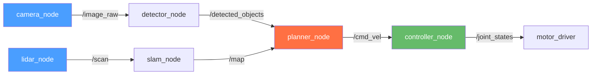
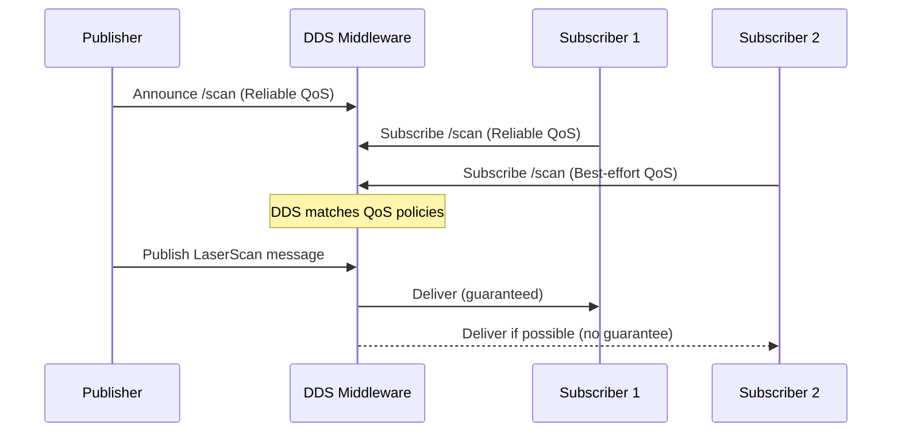

# Chapter 3: ROS 2 Architecture

## Learning Objectives

By the end of this chapter, you will be able to:

- **Explain** why ROS 2 was created as a replacement for ROS 1, and what problems DDS solves.
- **Describe** the ROS 2 computation graph: nodes, topics, services, actions, and parameters.
- **Use** the `ros2` CLI to inspect a live system: list nodes, echo topics, call services.
- **Implement** a ROS 2 service server and client in Python.
- **Configure** Quality of Service (QoS) profiles for reliable vs. best-effort communication.

---

## Introduction

By 2012, ROS 1 was running on thousands of robots worldwide. Research labs, startups, and universities had built an ecosystem of hundreds of packages. But as robotics moved from research labs into industry, serious problems emerged.

ROS 1 was designed for a single robot on a reliable local network. It relied on a central master process — `roscore` — that every node had to connect to. If `roscore` crashed, the entire system went down. There was no built-in support for real-time control, no encryption for multi-robot communication, and no way to run on embedded systems without a full Linux desktop.

**ROS 2** was designed from scratch to fix these problems. It uses an industry-standard middleware called **DDS** (Data Distribution Service) that provides peer-to-peer communication, no single point of failure, encryption, and configurable quality-of-service guarantees. The result is a framework that works on everything from a Raspberry Pi to a data center, and is safe to deploy in production robots working alongside people.

In this chapter, you will learn how ROS 2 organizes robot software into a distributed computation graph and how to use the command-line tools to understand and debug any ROS 2 system.

---

## The Computation Graph

In ROS 2, every running program is a **node**. Nodes are the fundamental unit of computation. A robot system typically consists of dozens of nodes, each responsible for one specific task:

- A `camera_node` reads from camera hardware and publishes images
- A `detector_node` subscribes to images and publishes detected objects
- A `planner_node` subscribes to detected objects and publishes navigation goals
- A `controller_node` subscribes to navigation goals and controls the motors

This network of nodes communicating with each other is called the **computation graph**.



### Communication Primitives

ROS 2 provides four ways for nodes to communicate:

| Primitive | Pattern | Use Case |
|-----------|---------|----------|
| **Topics** | Publish/Subscribe (async) | Continuous data streams: sensor data, velocity commands |
| **Services** | Request/Response (sync) | One-time requests: "is the arm ready?", "reset odometry" |
| **Actions** | Long-running goal + feedback | Tasks taking seconds: "navigate to room 3", "pick up object" |
| **Parameters** | Key-value configuration | Node settings: speed limits, topic names, thresholds |

**Topics** are the most common. A publisher sends messages without knowing who receives them. Any number of subscribers can listen to the same topic. This decoupling is what makes ROS 2 systems modular and composable.

**Services** are synchronous: the client sends a request and blocks until the server responds. Use services for infrequent, discrete operations — not for continuous data.

**Actions** are like services but designed for long-running tasks. The client sends a goal, the server sends periodic feedback while working, and finally sends a result. This is how the navigation stack works: you send a goal pose, and navigation streams feedback (current position, estimated time) until it either succeeds or fails.

---

## DDS: The Middleware That Powers ROS 2

**DDS (Data Distribution Service)** is an OMG standard for real-time, distributed, publish-subscribe messaging. It was originally developed for military and aerospace systems where reliability matters absolutely.

DDS operates on a **data-centric** model: instead of thinking about connections between nodes, you think about the data itself. Any DDS participant that publishes data with a specific topic name can be discovered by any subscriber interested in that name — automatically, without any central coordinator.

Key DDS concepts in ROS 2:

- **Discovery**: Nodes find each other automatically using multicast. No `roscore` needed.
- **Quality of Service (QoS)**: Each publisher and subscriber declares how reliable it needs communication to be.
- **Domain IDs**: Run multiple independent ROS 2 systems on the same network with different domain IDs (`ROS_DOMAIN_ID` environment variable).



### Quality of Service Profiles

QoS lets you trade reliability for performance:

| Profile | Reliability | Durability | Use Case |
|---------|-------------|------------|----------|
| `SENSOR_DATA` | Best-effort | Volatile | Camera frames, LiDAR scans |
| `SERVICES_DEFAULT` | Reliable | Volatile | Service calls |
| `SYSTEM_DEFAULT` | Reliable | Volatile | Most general topics |

**Best-effort** means: send once, don't retry if lost. This is fine for sensor data where fresh data is better than stale retransmitted data. **Reliable** means: guarantee delivery, retransmit if needed. Use this for critical commands.

---

## Code Example: Service Server and Client

Services are how nodes ask each other questions. Here is a complete service example that demonstrates the request/response pattern using the built-in `AddTwoInts` service type.

### Service Server

```python
# File: ~/ros2_ws/src/ros2_demo/ros2_demo/add_two_ints_server.py
# A ROS 2 service server that adds two integers.

import rclpy
from rclpy.node import Node
from example_interfaces.srv import AddTwoInts  # Service type: {int64 a, int64 b} -> {int64 sum}

class AddTwoIntsServer(Node):

    def __init__(self):
        super().__init__('add_two_ints_server')

        # Create a service named 'add_two_ints'.
        # The callback 'handle_request' is invoked for every incoming request.
        self.srv = self.create_service(
            AddTwoInts,
            'add_two_ints',
            self.handle_request
        )
        self.get_logger().info('AddTwoInts service ready.')

    def handle_request(self, request, response):
        """Called each time a client sends a request."""
        # request.a and request.b come from the client
        response.sum = request.a + request.b
        self.get_logger().info(
            f'Incoming: {request.a} + {request.b} = {response.sum}'
        )
        return response  # Return value becomes the service response


def main(args=None):
    rclpy.init(args=args)
    node = AddTwoIntsServer()
    rclpy.spin(node)
    node.destroy_node()
    rclpy.shutdown()
```

### Service Client

```python
# File: ~/ros2_ws/src/ros2_demo/ros2_demo/add_two_ints_client.py
# A ROS 2 service client that calls the addition service.

import sys
import rclpy
from rclpy.node import Node
from example_interfaces.srv import AddTwoInts

class AddTwoIntsClient(Node):

    def __init__(self):
        super().__init__('add_two_ints_client')
        # Create a client for the 'add_two_ints' service
        self.client = self.create_client(AddTwoInts, 'add_two_ints')

        # Wait until the server is available (poll every 1 second)
        while not self.client.wait_for_service(timeout_sec=1.0):
            self.get_logger().info('Waiting for service...')

    def send_request(self, a: int, b: int):
        request = AddTwoInts.Request()
        request.a = a
        request.b = b

        # call_async() is non-blocking; spin_until_future_complete() waits for it
        future = self.client.call_async(request)
        rclpy.spin_until_future_complete(self, future)
        return future.result()


def main(args=None):
    rclpy.init(args=args)
    client = AddTwoIntsClient()
    a = int(sys.argv[1]) if len(sys.argv) > 1 else 3
    b = int(sys.argv[2]) if len(sys.argv) > 2 else 5
    result = client.send_request(a, b)
    client.get_logger().info(f'Result: {a} + {b} = {result.sum}')
    client.destroy_node()
    rclpy.shutdown()
```

**Expected output** — Terminal 1 (server):
```
[INFO] [add_two_ints_server]: AddTwoInts service ready.
[INFO] [add_two_ints_server]: Incoming: 3 + 5 = 8
```

Terminal 2 (client):
```
[INFO] [add_two_ints_client]: Result: 3 + 5 = 8
```

---

## The ros2 CLI: Introspecting Your System

The `ros2` command-line tool is your window into any running ROS 2 system. You can inspect which nodes are running, what data is flowing, and call services without writing code.

```bash
# List all running nodes
ros2 node list

# Show detailed info about a node (publishers, subscribers, services)
ros2 node info /camera_node

# List all active topics
ros2 topic list

# Show message type and pub/sub count for a topic
ros2 topic info /scan

# Print every message on a topic (Ctrl+C to stop)
ros2 topic echo /scan

# Measure message rate in Hz
ros2 topic hz /scan

# Call a service from the command line (no code required)
ros2 service call /add_two_ints example_interfaces/srv/AddTwoInts "{a: 10, b: 7}"

# List and get parameters
ros2 param list
ros2 param get /my_node some_param
```

These commands work on any ROS 2 system — whether running locally or on a physical robot connected over WiFi.

---

## Summary

In this chapter, you learned:

- **ROS 2** was created to fix ROS 1's limitations: no central point of failure, real-time support, security, and cross-platform compatibility.
- **DDS** is the peer-to-peer middleware underneath ROS 2. It handles node discovery and message delivery without a central master process.
- The **computation graph** consists of nodes connected by topics (pub/sub), services (req/res), actions (goal/feedback/result), and parameters (configuration).
- **QoS profiles** let you choose between reliable delivery (guaranteed) and best-effort (lower latency) depending on your use case.
- The **ros2 CLI** lets you inspect any live ROS 2 system — listing nodes, echoing topics, calling services — all without writing code.

---

## Hands-On Exercise: Explore a Live ROS 2 System

**Time estimate**: 20–30 minutes

**Prerequisites**:
- ROS 2 Humble installed ([Appendix A2](../appendices/a2-software-installation.md))
- `demo_nodes_py` package (included with `ros-humble-desktop`)

### Steps

1. **Launch the talker demo** (Terminal 1):
   ```bash
   source /opt/ros/humble/setup.bash
   ros2 run demo_nodes_py talker
   ```
   Expected output: `Publishing: 'Hello World: 0'` (incrementing every second)

2. **Launch the listener** (Terminal 2):
   ```bash
   source /opt/ros/humble/setup.bash
   ros2 run demo_nodes_py listener
   ```
   Expected output: `I heard: Hello World: 0`

3. **Inspect the system** (Terminal 3):
   ```bash
   source /opt/ros/humble/setup.bash
   ros2 node list      # Should show: /talker  /listener
   ros2 topic list     # Should show: /chatter  /rosout  /parameter_events
   ros2 topic info /chatter
   ros2 topic echo /chatter
   ros2 topic hz /chatter   # Expected: average rate: 1.000
   ```

4. **Build and run the service example**:
   ```bash
   cd ~/ros2_ws
   colcon build --packages-select ros2_demo
   source install/setup.bash
   ros2 run ros2_demo add_two_ints_server &
   ros2 run ros2_demo add_two_ints_client 42 58
   ```

### Verification

```bash
ros2 node list | grep -E "talker|listener"
```
You should see both `/talker` and `/listener` in the output.

---

## Further Reading

- **Previous**: [Chapter 2: Embodied Intelligence & Sensors](ch02-embodied-intelligence.md) — sensor systems and the sensorimotor loop
- **Next**: [Chapter 4: ROS 2 Nodes and Topics](ch04-ros2-nodes-topics.md) — building publishers and subscribers from scratch
- **Related**: [Appendix A2: Software Installation](../appendices/a2-software-installation.md) — ROS 2 Humble install guide

**Official documentation**:
- [ROS 2 Humble Concepts](https://docs.ros.org/en/humble/Concepts.html)
- [Understanding DDS in ROS 2](https://docs.ros.org/en/humble/Concepts/About-Different-Middleware-Vendors.html)
- [ros2 CLI Tutorials](https://docs.ros.org/en/humble/Tutorials/Beginner-CLI-Tools.html)
