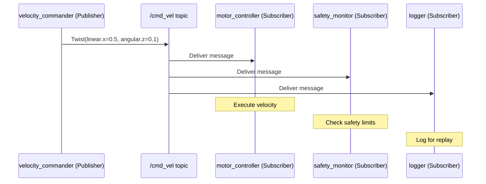

# Chapter 4: ROS 2 Nodes and Topics

## Learning Objectives

By the end of this chapter, you will be able to:

- **Explain** the publish/subscribe pattern and why it enables modular robot software.
- **Build** a ROS 2 publisher node that sends `geometry_msgs/Twist` velocity commands at a fixed rate.
- **Build** a ROS 2 subscriber node that receives and processes those velocity commands.
- **Debug** topic communication using `ros2 topic echo`, `ros2 topic hz`, and `ros2 topic bw`.
- **Implement** a simple motion pattern by modifying publisher output values.

---

## Introduction

Imagine a restaurant kitchen. The chef who decides what to cook does not need to know which waiters will carry the food. The waiters do not need to know which chef prepared it. They communicate through a shared order system — dishes placed on a pickup counter, waiters collecting them when ready. Neither side needs to know about the other directly.

This is exactly how ROS 2 topics work. A **publisher** places messages on a named topic — a kind of shared channel. Any number of **subscribers** can read from that topic without the publisher knowing or caring. This decoupling is what makes ROS 2 systems scalable: you can add new nodes that consume sensor data without modifying the sensors, or add new sensors without modifying the navigation stack.

In the previous chapter, you learned what topics are conceptually and how to inspect them with the CLI. In this chapter, you will build them from scratch. By the end, you will have a working publisher/subscriber pair exchanging robot velocity commands — the same message type used by every differential-drive robot in ROS 2.

---

## The Publish/Subscribe Pattern

The pub/sub pattern has three key properties:

1. **Asynchronous**: The publisher does not wait for subscribers. It sends and forgets.
2. **Decoupled**: Publishers and subscribers do not know about each other. They only agree on a topic name and message type.
3. **Many-to-many**: Multiple publishers can publish to the same topic; multiple subscribers can subscribe to the same topic simultaneously.



A key insight: the safety monitor and logger were added without modifying the original publisher or motor controller. This is the power of pub/sub.

### ROS 2 Message Types

Messages are typed data structures defined in `.msg` files. ROS 2 provides standard message packages:

| Package | Common Types | Use Case |
|---------|-------------|----------|
| `std_msgs` | `String`, `Float64`, `Bool`, `Int32` | Simple values |
| `geometry_msgs` | `Twist`, `Pose`, `Vector3`, `Point` | Positions, velocities |
| `sensor_msgs` | `LaserScan`, `Image`, `Imu`, `PointCloud2` | Sensor data |
| `nav_msgs` | `Odometry`, `Path`, `OccupancyGrid` | Navigation |

The `geometry_msgs/Twist` message is the standard velocity command in ROS 2:

```
# geometry_msgs/Twist structure:
Vector3 linear     # linear.x = forward speed (m/s)
                   # linear.y = lateral speed (m/s, usually 0 for ground robots)
                   # linear.z = vertical speed (m/s, used for drones)
Vector3 angular    # angular.z = rotation rate (rad/s, positive = counter-clockwise)
```

For a ground robot, you typically only use `linear.x` (forward/backward) and `angular.z` (turning left/right).

---

## Building a Publisher Node

A publisher node runs on a timer and sends messages at a fixed rate. The pattern is always the same: create a publisher, create a timer, send a message in the timer callback.

```python
# File: ~/ros2_ws/src/motion_demo/motion_demo/velocity_commander.py
# Publishes Twist velocity commands at 10 Hz (10 messages per second).

import rclpy
from rclpy.node import Node
from geometry_msgs.msg import Twist  # Standard velocity command message
import math

class VelocityCommander(Node):
    """Publishes a circular motion pattern: forward + rotate."""

    def __init__(self):
        super().__init__('velocity_commander')

        # Create a publisher on /cmd_vel.
        # Queue size 10: buffer up to 10 unsent messages before dropping old ones.
        self.publisher = self.create_publisher(Twist, '/cmd_vel', 10)

        # Timer fires every 0.1 seconds = 10 Hz.
        # High-frequency control is smoother than 1 Hz.
        self.timer = self.create_timer(0.1, self.publish_velocity)

        self.count = 0  # Track how many messages we've sent
        self.get_logger().info('Velocity commander started at 10 Hz.')

    def publish_velocity(self):
        """Called 10 times per second. Builds and publishes a velocity command."""
        msg = Twist()

        # Drive in a circle: constant forward speed + constant rotation
        msg.linear.x = 0.3   # 0.3 m/s forward
        msg.angular.z = 0.5  # 0.5 rad/s counter-clockwise (~28.6 degrees/sec)

        self.publisher.publish(msg)
        self.count += 1

        # Log every 10 messages (every second) to avoid console spam
        if self.count % 10 == 0:
            self.get_logger().info(
                f'Published #{self.count}: linear.x={msg.linear.x}, angular.z={msg.angular.z}'
            )


def main(args=None):
    rclpy.init(args=args)
    node = VelocityCommander()
    rclpy.spin(node)           # Run until Ctrl+C
    node.destroy_node()
    rclpy.shutdown()


if __name__ == '__main__':
    main()
```

**Expected output** (every second):
```
[INFO] [velocity_commander]: Velocity commander started at 10 Hz.
[INFO] [velocity_commander]: Published #10: linear.x=0.3, angular.z=0.5
[INFO] [velocity_commander]: Published #20: linear.x=0.3, angular.z=0.5
[INFO] [velocity_commander]: Published #30: linear.x=0.3, angular.z=0.5
```

---

## Building a Subscriber Node

A subscriber node registers a callback function that is invoked automatically each time a new message arrives on the topic.

```python
# File: ~/ros2_ws/src/motion_demo/motion_demo/velocity_monitor.py
# Subscribes to /cmd_vel and monitors incoming velocity commands.

import rclpy
from rclpy.node import Node
from geometry_msgs.msg import Twist
import math

class VelocityMonitor(Node):
    """Subscribes to /cmd_vel and prints speed information."""

    # Safety threshold: warn if commanded speed exceeds this
    MAX_SAFE_LINEAR = 1.0   # m/s
    MAX_SAFE_ANGULAR = 2.0  # rad/s

    def __init__(self):
        super().__init__('velocity_monitor')

        # Subscribe to /cmd_vel. The callback runs every time a message arrives.
        self.subscription = self.create_subscription(
            Twist,
            '/cmd_vel',
            self.velocity_callback,
            10
        )
        self.message_count = 0
        self.get_logger().info('Velocity monitor listening on /cmd_vel.')

    def velocity_callback(self, msg: Twist):
        """Called automatically when a Twist message arrives."""
        self.message_count += 1

        linear_speed = msg.linear.x
        angular_speed = msg.angular.z

        # Calculate the equivalent circular radius if both are non-zero
        if abs(angular_speed) > 0.001:
            turn_radius = linear_speed / angular_speed
            radius_str = f'radius={turn_radius:.2f} m'
        else:
            radius_str = 'straight line'

        self.get_logger().info(
            f'[#{self.message_count}] linear.x={linear_speed:.2f} m/s, '
            f'angular.z={angular_speed:.2f} rad/s ({radius_str})'
        )

        # Safety check
        if abs(linear_speed) > self.MAX_SAFE_LINEAR:
            self.get_logger().warn(f'SAFETY: Linear speed {linear_speed:.2f} exceeds limit!')
        if abs(angular_speed) > self.MAX_SAFE_ANGULAR:
            self.get_logger().warn(f'SAFETY: Angular speed {angular_speed:.2f} exceeds limit!')


def main(args=None):
    rclpy.init(args=args)
    node = VelocityMonitor()
    rclpy.spin(node)
    node.destroy_node()
    rclpy.shutdown()
```

**Expected output** (when commander is running):
```
[INFO] [velocity_monitor]: Velocity monitor listening on /cmd_vel.
[INFO] [velocity_monitor]: [#1] linear.x=0.30 m/s, angular.z=0.50 rad/s (radius=0.60 m)
[INFO] [velocity_monitor]: [#2] linear.x=0.30 m/s, angular.z=0.50 rad/s (radius=0.60 m)
```

The radius calculation shows that at `linear.x=0.3` and `angular.z=0.5`, the robot would trace a circle with 0.6 m radius — about the size of a hula hoop.

---

## Topic Namespacing and Remapping

In a multi-robot system, you need to avoid topic name collisions. If two robots both publish to `/cmd_vel`, messages get mixed up. ROS 2 solves this with **namespacing** and **remapping**.

**Namespacing**: Prefix a node with a namespace so all its topics use that prefix:
```bash
ros2 run motion_demo velocity_commander --ros-args -r __ns:=/robot1
# Creates topic: /robot1/cmd_vel
```

**Remapping**: Change any topic or node name at launch time without editing code:
```bash
ros2 run motion_demo velocity_commander --ros-args -r /cmd_vel:=/robot1/cmd_vel
```

This is one of ROS 2's most powerful features: the same code can be deployed for multiple robots by simply changing the launch configuration.

---

## Debugging Topic Communication

When something is not working, these CLI commands help diagnose the problem:

```bash
# Is the topic being published at all?
ros2 topic hz /cmd_vel
# Expected for our demo: average rate: 10.000

# How much data is being sent?
ros2 topic bw /cmd_vel
# Shows bytes/second throughput

# Who is publishing and subscribing?
ros2 topic info /cmd_vel --verbose
# Lists publisher and subscriber node names + QoS profiles

# Are QoS profiles compatible? (Mismatch causes silent failure)
ros2 topic info /cmd_vel --verbose | grep -A3 "QoS"
```

**The silent failure trap**: If a publisher uses `BEST_EFFORT` QoS but a subscriber requests `RELIABLE`, messages will not be delivered and no error is shown. Always check QoS compatibility when a subscriber receives nothing despite a publisher running.

---

## Summary

In this chapter, you learned:

- The **publish/subscribe pattern** is asynchronous and decoupled: publishers do not know about subscribers, and vice versa. This enables modular, composable robot software.
- `geometry_msgs/Twist` is the standard ROS 2 velocity command: `linear.x` for forward speed, `angular.z` for rotation rate.
- A **publisher** uses `create_publisher()` and a timer callback to send messages at a fixed rate.
- A **subscriber** uses `create_subscription()` and a message callback that fires automatically on each incoming message.
- **Topic namespacing** and **remapping** allow the same node code to run in multi-robot deployments.
- **QoS mismatches** silently prevent message delivery — always verify with `ros2 topic info --verbose`.

---

## Hands-On Exercise: Build a Circular Motion Controller

**Time estimate**: 30–45 minutes

**Prerequisites**:
- ROS 2 Humble installed ([Appendix A2](../appendices/a2-software-installation.md))
- Chapter 3 exercise completed

### Steps

1. **Create the package**:
   ```bash
   cd ~/ros2_ws/src
   ros2 pkg create motion_demo --build-type ament_python \
       --dependencies rclpy geometry_msgs
   ```

2. **Create both nodes**:
   Save `velocity_commander.py` and `velocity_monitor.py` from this chapter to `~/ros2_ws/src/motion_demo/motion_demo/`.

3. **Register entry points** in `~/ros2_ws/src/motion_demo/setup.py`:
   ```python
   entry_points={
       'console_scripts': [
           'velocity_commander = motion_demo.velocity_commander:main',
           'velocity_monitor = motion_demo.velocity_monitor:main',
       ],
   },
   ```

4. **Build**:
   ```bash
   cd ~/ros2_ws
   colcon build --packages-select motion_demo
   source install/setup.bash
   ```
   Expected: `Summary: 1 package finished`

5. **Run the commander** (Terminal 1):
   ```bash
   ros2 run motion_demo velocity_commander
   ```

6. **Run the monitor** (Terminal 2):
   ```bash
   source ~/ros2_ws/install/setup.bash
   ros2 run motion_demo velocity_monitor
   ```

7. **Challenge**: Modify `velocity_commander.py` so the robot alternates between driving forward (5 seconds) and rotating in place (3 seconds). Hint: use `self.count` and time thresholds.

### Verification

```bash
ros2 topic hz /cmd_vel
```
You should see: `average rate: 10.000`

---

## Further Reading

- **Previous**: [Chapter 3: ROS 2 Architecture](ch03-ros2-architecture.md) — DDS, computation graph, QoS
- **Next**: [Chapter 5: ROS 2 Packages with Python](ch05-ros2-packages-python.md) — organizing code into proper packages
- **Related**: [Chapter 6: Gazebo Simulation](../module-2/ch06-gazebo-simulation.md) — running `/cmd_vel` commands on a simulated robot

**Official documentation**:
- [Writing a publisher/subscriber (Python)](https://docs.ros.org/en/humble/Tutorials/Beginner-Client-Libraries/Writing-A-Simple-Py-Publisher-And-Subscriber.html)
- [geometry_msgs/Twist](https://docs.ros.org/en/humble/p/geometry_msgs/)
