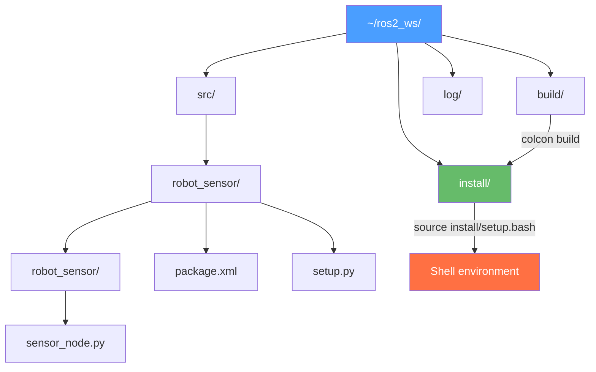

# Chapter 5: Building ROS 2 Packages with Python

## Learning Objectives

By the end of this chapter, you will be able to:

- **Explain** the structure of a ROS 2 Python package and what each file does.
- **Create** a new Python package using `ros2 pkg create` with correct dependencies.
- **Configure** `setup.py` entry points to register executable nodes.
- **Build** a workspace with `colcon build` and source the install space.
- **Declare and read** runtime parameters in a ROS 2 node using `declare_parameter` and `get_parameter`.

---

## Introduction

So far you have written individual nodes and run them with `ros2 run`. But where do those files live? How does ROS 2 know which Python file to run when you type `ros2 run motion_demo velocity_commander`? How can you share your robot code with a colleague so they can build it on their own machine?

The answer is the **ROS 2 package** — the fundamental unit of robot software organization. A package bundles together all the Python source files, configuration files, launch files, and dependency declarations needed for a particular piece of robot functionality. The `colcon` build system reads these packages, installs them into a workspace, and makes them discoverable by `ros2 run` and `ros2 launch`.

In this chapter, you will learn how packages work from the inside out. You will create a complete package called `robot_sensor`, write a node that uses the ROS 2 parameter server for runtime configuration, and master the colcon build workflow. These skills are the foundation you will use in every subsequent chapter.

---

## Anatomy of a ROS 2 Python Package

When you create a ROS 2 Python package, it has a specific directory structure:

```
robot_sensor/                  ← Package root (same name as package)
├── robot_sensor/              ← Python module (same name as package)
│   ├── __init__.py            ← Makes this a Python module
│   └── sensor_node.py         ← Your node source code
├── resource/
│   └── robot_sensor           ← Ament index resource marker (empty file)
├── test/
│   ├── test_copyright.py      ← Auto-generated linting tests
│   └── test_pep8.py
├── package.xml                ← ROS 2 package manifest (name, deps, maintainer)
├── setup.cfg                  ← Python package configuration
└── setup.py                   ← Build config + entry points for ros2 run
```



### The colcon Workspace

ROS 2 uses **workspaces** — directory trees with a specific layout. The `~/ros2_ws/` workspace you have been using has four key directories:

- `src/` — where you put package source code (what you edit)
- `build/` — intermediate build artifacts (auto-generated, do not edit)
- `install/` — the installed result (what `ros2 run` reads)
- `log/` — colcon build logs

**The key insight**: you edit files in `src/`, build with `colcon build`, and run from `install/`. After any code change, you must rebuild.

:::tip Use --symlink-install During Development
```bash
colcon build --symlink-install
```
With `--symlink-install`, Python files in `install/` are symlinks to `src/`. This means Python changes take effect immediately without rebuilding. You only need to rebuild when you change `setup.py` (adding new entry points).
:::

---

## Key Package Files

### package.xml

The package manifest declares the package name, version, maintainer, and dependencies:

```xml
<!-- File: ~/ros2_ws/src/robot_sensor/package.xml -->
<?xml version="1.0"?>
<package format="3">
  <name>robot_sensor</name>
  <version>0.1.0</version>
  <description>A sensor publishing package for the Physical AI course.</description>
  <maintainer email="you@example.com">Your Name</maintainer>
  <license>Apache-2.0</license>

  <!-- Build tool dependency (always required for Python packages) -->
  <buildtool_depend>ament_python</buildtool_depend>

  <!-- Runtime dependencies: packages your code imports -->
  <depend>rclpy</depend>
  <depend>sensor_msgs</depend>
  <depend>geometry_msgs</depend>

  <!-- Test dependencies -->
  <test_depend>ament_copyright</test_depend>
  <test_depend>ament_pep8</test_depend>
  <test_depend>pytest</test_depend>
</package>
```

### setup.py

The `setup.py` file does two things: configures the Python package for installation, and registers **entry points** — the mapping from `ros2 run <package> <node>` to a Python function.

```python
# File: ~/ros2_ws/src/robot_sensor/setup.py
from setuptools import find_packages, setup

package_name = 'robot_sensor'

setup(
    name=package_name,
    version='0.1.0',
    packages=find_packages(exclude=['test']),  # Auto-find all Python submodules
    data_files=[
        # Required: register this package with the ament index
        ('share/ament_index/resource_index/packages',
            ['resource/' + package_name]),
        # Required: install the package.xml manifest
        ('share/' + package_name, ['package.xml']),
    ],
    install_requires=['setuptools'],
    zip_safe=True,
    maintainer='Your Name',
    maintainer_email='you@example.com',
    description='A sensor publishing package.',
    license='Apache-2.0',
    tests_require=['pytest'],
    entry_points={
        'console_scripts': [
            # Format: 'command_name = module.path:function_name'
            # This creates: ros2 run robot_sensor sensor_publisher
            'sensor_publisher = robot_sensor.sensor_node:main',
        ],
    },
)
```

---

## Code Example: Parameterized Sensor Node

The ROS 2 **parameter server** lets you configure node behavior at launch time without changing source code. Parameters are key-value pairs that a node declares with default values; users can override them at runtime.

```python
# File: ~/ros2_ws/src/robot_sensor/robot_sensor/sensor_node.py
# A ROS 2 node that publishes mock sensor readings.
# All configuration comes from parameters — no hardcoded values.

import rclpy
from rclpy.node import Node
from sensor_msgs.msg import LaserScan
import math

class SensorPublisher(Node):
    """Publishes simulated LaserScan data with configurable parameters."""

    def __init__(self):
        super().__init__('sensor_publisher')

        # --- Declare parameters with default values ---
        # Users can override these at launch time without editing this file.
        self.declare_parameter('publish_rate', 10.0)   # Hz
        self.declare_parameter('frame_id', 'base_laser')
        self.declare_parameter('obstacle_distance', 2.0)  # meters
        self.declare_parameter('num_beams', 360)

        # --- Read the parameter values ---
        rate = self.get_parameter('publish_rate').get_parameter_value().double_value
        self.frame_id = self.get_parameter('frame_id').get_parameter_value().string_value
        self.obstacle_dist = self.get_parameter('obstacle_distance').get_parameter_value().double_value
        self.num_beams = self.get_parameter('num_beams').get_parameter_value().integer_value

        # Create publisher and timer using the parameter-defined rate
        self.publisher = self.create_publisher(LaserScan, '/scan', 10)
        self.timer = self.create_timer(1.0 / rate, self.publish_scan)

        self.get_logger().info(
            f'Sensor publisher started: {rate} Hz, {self.num_beams} beams, '
            f'frame={self.frame_id}, obstacle at {self.obstacle_dist} m'
        )

    def publish_scan(self):
        """Build and publish a simulated LaserScan message."""
        msg = LaserScan()

        # Header: timestamp and coordinate frame
        msg.header.stamp = self.get_clock().now().to_msg()
        msg.header.frame_id = self.frame_id

        # Angular configuration: full 360° scan
        msg.angle_min = -math.pi         # -180 degrees
        msg.angle_max = math.pi          # +180 degrees
        msg.angle_increment = (2 * math.pi) / self.num_beams

        msg.time_increment = 0.0
        msg.scan_time = 0.1              # 10 Hz scan cycle
        msg.range_min = 0.12             # Minimum valid range: 12 cm
        msg.range_max = 10.0             # Maximum valid range: 10 m

        # Fill ranges: all beams at obstacle_distance (simulated flat wall)
        msg.ranges = [self.obstacle_dist] * self.num_beams

        self.publisher.publish(msg)


def main(args=None):
    rclpy.init(args=args)
    node = SensorPublisher()
    rclpy.spin(node)
    node.destroy_node()
    rclpy.shutdown()
```

### Setting Parameters at Launch

Override parameters without changing source code:

```bash
# Run with default parameters
ros2 run robot_sensor sensor_publisher

# Override the obstacle distance and publish rate
ros2 run robot_sensor sensor_publisher \
    --ros-args \
    -p obstacle_distance:=0.5 \
    -p publish_rate:=20.0 \
    -p frame_id:=laser_front

# Get the current value of a parameter while node is running
ros2 param get /sensor_publisher obstacle_distance
# Returns: Double value is: 0.5

# Change a parameter while the node is running (live reconfiguration)
ros2 param set /sensor_publisher obstacle_distance 3.0
```

This is the correct way to handle robot configuration. Never hardcode values like sensor topics, speed limits, or frame names — always use parameters.

---

## The colcon Build Workflow

```bash
# 1. Navigate to workspace root (not src/)
cd ~/ros2_ws

# 2. Build all packages in src/
colcon build

# 3. Or build only specific packages (faster during development)
colcon build --packages-select robot_sensor

# 4. With symlink-install for Python development (no rebuild needed after .py edits)
colcon build --symlink-install --packages-select robot_sensor

# 5. Source the install space (REQUIRED after every build, in every new terminal)
source install/setup.bash

# 6. Verify the package is found
ros2 pkg list | grep robot_sensor
# Expected output: robot_sensor

# 7. Run your node
ros2 run robot_sensor sensor_publisher
```

:::warning Source After Every Build
Running `source install/setup.bash` is mandatory after every `colcon build`. Without it, `ros2 run` will not find newly built packages. Add it to your `~/.bashrc` to source automatically:
```bash
echo "source ~/ros2_ws/install/setup.bash" >> ~/.bashrc
```
:::

---

## Summary

In this chapter, you learned:

- A **ROS 2 package** bundles source code with `package.xml` (manifest), `setup.py` (entry points), and `setup.cfg` (build config).
- The **colcon workspace** separates source (`src/`), build artifacts (`build/`), and installable outputs (`install/`). Always run `colcon build` from the workspace root, not from inside `src/`.
- **Entry points** in `setup.py` map `ros2 run <package> <node>` commands to Python `main()` functions.
- The **ROS 2 parameter server** lets you configure node behavior at runtime: declare with `declare_parameter()`, read with `get_parameter()`, override with `--ros-args -p key:=value`.
- Use `--symlink-install` during development so Python file edits take effect without rebuilding.

---

## Hands-On Exercise: Build and Parameterize robot_sensor

**Time estimate**: 30–45 minutes

**Prerequisites**:
- ROS 2 Humble installed ([Appendix A2](../appendices/a2-software-installation.md))
- Chapters 3 and 4 completed

### Steps

1. **Create the package**:
   ```bash
   cd ~/ros2_ws/src
   ros2 pkg create robot_sensor \
       --build-type ament_python \
       --dependencies rclpy sensor_msgs geometry_msgs
   ```
   Expected output: `going to create a new package` + file listing

2. **Create the node file**:
   Save `sensor_node.py` from this chapter to `~/ros2_ws/src/robot_sensor/robot_sensor/sensor_node.py`.

3. **Update setup.py** — add the entry point:
   ```python
   entry_points={
       'console_scripts': [
           'sensor_publisher = robot_sensor.sensor_node:main',
       ],
   },
   ```

4. **Build with symlink-install**:
   ```bash
   cd ~/ros2_ws
   colcon build --symlink-install --packages-select robot_sensor
   source install/setup.bash
   ```

5. **Run with defaults**:
   ```bash
   ros2 run robot_sensor sensor_publisher
   ```
   Expected: `Sensor publisher started: 10.0 Hz, 360 beams, frame=base_laser, obstacle at 2.0 m`

6. **Verify the topic**:
   ```bash
   # New terminal (source first):
   ros2 topic hz /scan        # Expected: average rate: 10.000
   ros2 topic echo /scan --once  # Print one message
   ```

7. **Override parameters**:
   ```bash
   ros2 run robot_sensor sensor_publisher \
       --ros-args -p publish_rate:=5.0 -p obstacle_distance:=0.3
   ```
   Expected: `obstacle at 0.3 m` in the log

8. **Live parameter update**:
   ```bash
   # While node is running in another terminal:
   ros2 param set /sensor_publisher obstacle_distance 5.0
   ```

### Verification

```bash
ros2 pkg list | grep robot_sensor  # Should output: robot_sensor
ros2 topic hz /scan                # Should output: average rate: 10.000
```

---

## Further Reading

- **Previous**: [Chapter 4: ROS 2 Nodes and Topics](ch04-ros2-nodes-topics.md) — pub/sub pattern
- **Next**: [Chapter 6: Gazebo Simulation](../module-2/ch06-gazebo-simulation.md) — simulating a robot to test your nodes
- **Related**: [Appendix A2: Software Installation](../appendices/a2-software-installation.md) — colcon and ROS 2 setup

**Official documentation**:
- [Creating a Python package](https://docs.ros.org/en/humble/Tutorials/Beginner-Client-Libraries/Creating-Your-First-ROS2-Package.html)
- [ROS 2 Parameters tutorial](https://docs.ros.org/en/humble/Tutorials/Beginner-Client-Libraries/Using-Parameters-In-A-Class-Python.html)
- [colcon documentation](https://colcon.readthedocs.io/en/released/)
