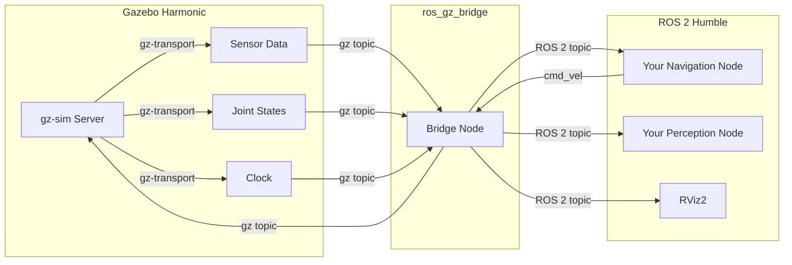

# Chapter 6: Gazebo Simulation

In Module 1 you learned to write ROS 2 nodes that publish and subscribe to topics. But where do those messages go? Without a robot or an environment, your nodes are talking into the void. This chapter gives your code a place to live: a fully simulated 3D world powered by physics, sensors, and gravity. Welcome to Gazebo.

## Learning Objectives

By the end of this chapter, you will be able to:

- **Explain** why simulation is essential before deploying code to physical robots.
- **Describe** the high-level architecture of Gazebo Harmonic and how it separates physics, rendering, and transport.
- **Launch** a Gazebo simulation from a ROS 2 Python launch file.
- **Spawn** a robot model into a running Gazebo world programmatically.
- **Bridge** Gazebo topics to ROS 2 topics using `ros_gz_bridge`.

## 6.1 Introduction: Why Simulate Before You Deploy

Imagine you have written a navigation algorithm and you want to test it. You could flash it onto a real robot and press "go" -- but what happens when the algorithm has a bug? The robot might drive off a table, crash into a wall, or worse, injure someone. Fixing the robot costs money and time. Fixing a simulated robot costs nothing.

Simulation gives you three superpowers:

1. **Safety** -- Crash as many times as you need. No hardware damage, no injuries.
2. **Speed** -- You can run hundreds of tests overnight. Some simulators even run faster than real time.
3. **Reproducibility** -- The same initial conditions produce the same results every time, which makes debugging dramatically easier.

In industry, this practice is called **digital twin** development. Companies like NVIDIA, Boston Dynamics, and Tesla train their robots for millions of hours in simulation before a single motor turns in the real world. The simulator is not a shortcut; it is a required step in the robotics development pipeline.

:::tip The Simulation Mindset
Think of simulation as "unit testing for robots." Just as you would never ship a web application without running tests, you should never deploy robot code without running it in simulation first.
:::

## 6.2 Gazebo Harmonic Architecture

Gazebo (formerly known as Ignition Gazebo) is an open-source robotics simulator maintained by Open Robotics. The version we use throughout this book is **Gazebo Harmonic**, which is the recommended pairing with ROS 2 Humble.

### A Brief History

You may encounter references to "Gazebo Classic" (versions 1 through 11) online. Gazebo Classic was a monolithic application -- physics, rendering, and transport were all tightly coupled. The modern Gazebo (Harmonic, Garden, Fortress, etc.) was redesigned as a collection of independent libraries, making it far more modular and maintainable. In this book, "Gazebo" always refers to the modern version.

### The Library Architecture

Modern Gazebo is built from a set of libraries, each with a focused responsibility:

| Library | Responsibility |
|---------|---------------|
| **gz-sim** | The simulation server. Manages entities (models, lights, sensors) and runs the physics loop. |
| **gz-physics** | Pluggable physics engines (DART, Bullet, TPE). Handles collisions, gravity, and dynamics. |
| **gz-rendering** | 3D rendering using OGRE2. Produces camera images and visualization. |
| **gz-sensors** | Simulates sensors (LiDAR, cameras, IMUs) using the rendering and physics data. |
| **gz-transport** | A high-performance publish/subscribe middleware internal to Gazebo (separate from ROS 2). |
| **gz-gui** | The Qt-based graphical user interface. |

The key insight is that **Gazebo has its own transport layer** (`gz-transport`) that is independent of ROS 2. This is why you need a bridge to connect the two systems.

### How Gazebo and ROS 2 Communicate

The `ros_gz_bridge` package translates messages between Gazebo's `gz-transport` topics and ROS 2 topics. For example, a simulated LiDAR sensor publishes laser scan data on a `gz-transport` topic. The bridge subscribes to that Gazebo topic and republishes the data as a `sensor_msgs/msg/LaserScan` message on a ROS 2 topic. Your ROS 2 nodes never need to know they are talking to a simulator instead of real hardware.



This diagram shows the bidirectional flow. Sensor data flows from Gazebo to your ROS 2 nodes. Commands (like velocity commands on `/cmd_vel`) flow from your ROS 2 nodes back into Gazebo to move the robot.

## 6.3 Worlds and Models

Gazebo organizes simulation into two core concepts:

- **World**: The environment itself -- ground plane, lighting, gravity settings, and any static objects (walls, tables, obstacles). A world is defined in an **SDF file** (Simulation Description Format, covered in depth in [Chapter 7](./ch07-urdf-sdf.md)).
- **Model**: A single entity in the world -- a robot, a chair, a ball. Models have links (rigid bodies), joints (connections between links), sensors, and plugins.

Gazebo ships with a library of pre-built models and worlds. You can also download community models from the [Gazebo Fuel](https://app.gazebosim.org/fuel) model repository.

### The Empty World

The simplest possible world contains just a ground plane and a light source. This is your starting point for most development work. Here is what the default empty world SDF looks like conceptually:

```xml
<?xml version="1.0" ?>
<sdf version="1.9">
  <world name="empty_world">
    <!-- Physics configuration -->
    <physics type="dart">
      <max_step_size>0.001</max_step_size>
      <real_time_factor>1.0</real_time_factor>
    </physics>

    <!-- A directional light (the sun) -->
    <light type="directional" name="sun">
      <direction>-0.5 0.1 -0.9</direction>
    </light>

    <!-- The ground plane -->
    <model name="ground_plane">
      <static>true</static>
      <link name="link">
        <collision name="collision">
          <geometry><plane><normal>0 0 1</normal></plane></geometry>
        </collision>
        <visual name="visual">
          <geometry><plane><normal>0 0 1</normal><size>100 100</size></plane></geometry>
        </visual>
      </link>
    </model>
  </world>
</sdf>
```

You do not need to write this file from scratch every time. Gazebo includes built-in worlds you can reference by name.

## 6.4 Launching Gazebo from a ROS 2 Launch File

In [Chapter 5](../module-1/ch05-ros2-packages-python.md) you learned about ROS 2 launch files. Now you will use one to start Gazebo. The `ros_gz_sim` package provides launch actions that integrate Gazebo into the ROS 2 launch system.

### Prerequisites

Make sure you have the required packages installed:

```bash
# Install Gazebo Harmonic (Ubuntu 22.04)
sudo apt update
sudo apt install ros-humble-ros-gz

# This metapackage installs:
#   ros-humble-ros-gz-sim       (launch Gazebo from ROS 2)
#   ros-humble-ros-gz-bridge    (topic bridging)
#   ros-humble-ros-gz-image     (image bridging)
```

### Code Example 1: Launch File to Start Gazebo with an Empty World

Create a file called `gazebo_empty_world.launch.py` inside your package's `launch/` directory:

```python
"""ROS 2 launch file that starts Gazebo Harmonic with an empty world."""

from launch import LaunchDescription
from launch.actions import DeclareLaunchArgument, IncludeLaunchDescription
from launch.launch_description_sources import PythonLaunchDescriptionSource
from launch.substitutions import LaunchConfiguration, PathJoinSubstitution
from launch_ros.substitutions import FindPackageShare


def generate_launch_description():
    """Generate a launch description to start Gazebo with an empty world."""

    # Declare a launch argument so users can override the world file
    world_arg = DeclareLaunchArgument(
        'world',
        default_value='empty.sdf',
        description='Name of the Gazebo world file to load'
    )

    # Locate the ros_gz_sim package which provides the Gazebo launch files
    gz_sim_share = FindPackageShare('ros_gz_sim')

    # Include the upstream Gazebo launch file from ros_gz_sim
    gazebo_launch = IncludeLaunchDescription(
        PythonLaunchDescriptionSource(
            PathJoinSubstitution([gz_sim_share, 'launch', 'gz_sim.launch.py'])
        ),
        launch_arguments={
            'gz_args': LaunchConfiguration('world'),
        }.items(),
    )

    return LaunchDescription([
        world_arg,
        gazebo_launch,
    ])
```

**How to run it:**

```bash
# From your workspace root (after colcon build and source install/setup.bash)
ros2 launch my_robot_pkg gazebo_empty_world.launch.py
```

**Expected output:**

```
[INFO] [launch]: All log files can be found below /home/user/.ros/log/...
[INFO] [launch]: Default logging verbosity is set to INFO
[INFO] [ruby_node-1]: process started with pid [12345]
[ruby_node-1] [Msg] Loading SDF world: empty.sdf
[ruby_node-1] [Msg] Serving world [empty_world]
```

A Gazebo window should open showing a flat ground plane with a sky above it. If you are running on a headless server, add `--headless-rendering -s` to the `gz_args` to run without a GUI.

## 6.5 Spawning a Robot Model Programmatically

Having an empty world is not very interesting. Let us spawn a robot into it. The `ros_gz_sim` package provides a `create` node that can insert a model into a running Gazebo simulation.

### Code Example 2: Launch File That Spawns a Robot

This launch file starts Gazebo and then spawns a robot from a URDF/SDF file:

```python
"""Launch Gazebo and spawn a robot model into the simulation."""

import os

from ament_index_python.packages import get_package_share_directory
from launch import LaunchDescription
from launch.actions import IncludeLaunchDescription, ExecuteProcess
from launch.launch_description_sources import PythonLaunchDescriptionSource
from launch.substitutions import PathJoinSubstitution
from launch_ros.actions import Node
from launch_ros.substitutions import FindPackageShare


def generate_launch_description():
    """Start Gazebo and spawn a robot at the origin."""

    # Path to ros_gz_sim launch file
    gz_sim_share = FindPackageShare('ros_gz_sim')

    # Start Gazebo with the empty world
    start_gazebo = IncludeLaunchDescription(
        PythonLaunchDescriptionSource(
            PathJoinSubstitution([gz_sim_share, 'launch', 'gz_sim.launch.py'])
        ),
        launch_arguments={'gz_args': 'empty.sdf'}.items(),
    )

    # Path to the robot's SDF or URDF model file
    # Replace 'my_robot_pkg' with your actual package name
    robot_pkg_share = get_package_share_directory('my_robot_pkg')
    robot_model_path = os.path.join(robot_pkg_share, 'models', 'my_robot.sdf')

    # Spawn the robot using the ros_gz_sim 'create' node
    spawn_robot = Node(
        package='ros_gz_sim',
        executable='create',
        arguments=[
            '-name', 'my_robot',
            '-file', robot_model_path,
            '-x', '0.0',
            '-y', '0.0',
            '-z', '0.5',    # Spawn 0.5m above ground to avoid collision
        ],
        output='screen',
    )

    return LaunchDescription([
        start_gazebo,
        spawn_robot,
    ])
```

**Expected output:**

```
[INFO] [launch]: All log files can be found below /home/user/.ros/log/...
[INFO] [create-2]: process started with pid [12346]
[create-2] [INFO] [ros_gz_sim]: Requesting to spawn entity [my_robot]
[create-2] [INFO] [ros_gz_sim]: Successfully spawned entity [my_robot]
[create-2]: process has finished cleanly [pid 12346]
```

The robot model should appear in the Gazebo window at position (0, 0, 0.5). It will drop to the ground under gravity once the simulation starts running.

### Key Parameters for the Spawn Node

| Parameter | Description |
|-----------|-------------|
| `-name` | Unique name for the entity in the simulation |
| `-file` | Path to an SDF or URDF file |
| `-topic` | Alternative: read the model description from a ROS 2 topic (useful for URDF published by `robot_state_publisher`) |
| `-x`, `-y`, `-z` | Initial position in meters |
| `-R`, `-P`, `-Y` | Initial orientation in radians (Roll, Pitch, Yaw) |

## 6.6 Bridging Gazebo and ROS 2 Topics

Once your robot is in the simulation, you need to send commands to it and receive sensor data from it. This is where `ros_gz_bridge` comes in.

The bridge maps Gazebo message types to ROS 2 message types. You configure it by specifying which topics to bridge and in which direction.

```bash
# Example: bridge the /cmd_vel topic (ROS 2 -> Gazebo) and /scan topic (Gazebo -> ROS 2)
ros2 run ros_gz_bridge parameter_bridge \
  /cmd_vel@geometry_msgs/msg/Twist]gz.msgs.Twist \
  /scan@sensor_msgs/msg/LaserScan[gz.msgs.LaserScan
```

The syntax uses special characters to indicate direction:

| Symbol | Direction |
|--------|-----------|
| `[` | Gazebo to ROS 2 (subscribe from Gazebo, publish to ROS 2) |
| `]` | ROS 2 to Gazebo (subscribe from ROS 2, publish to Gazebo) |
| `@` | Bidirectional |

You can also configure the bridge in a launch file as a node with parameters, which is the recommended approach for production use.

```python
# Add this to your launch file to bridge cmd_vel and laser scan topics
bridge_node = Node(
    package='ros_gz_bridge',
    executable='parameter_bridge',
    arguments=[
        '/cmd_vel@geometry_msgs/msg/Twist]gz.msgs.Twist',
        '/scan@sensor_msgs/msg/LaserScan[gz.msgs.LaserScan',
        '/clock@rosgraph_msgs/msg/Clock[gz.msgs.Clock',
    ],
    output='screen',
)
```

:::note Clock Bridging
Always bridge the `/clock` topic. Gazebo publishes simulation time, and your ROS 2 nodes need to use simulation time (not wall-clock time) for consistent behavior. Set `use_sim_time: true` in your node parameters.
:::

## Summary

In this chapter you learned:

- **Why simulation matters**: Safety, speed, and reproducibility make simulation a required step, not an optional shortcut.
- **Gazebo Harmonic architecture**: A modular set of libraries (gz-sim, gz-physics, gz-rendering, gz-sensors, gz-transport) that work together to create a physics-accurate 3D simulation.
- **Worlds and models**: Worlds define the environment; models define the robots and objects within it.
- **ROS 2 integration**: The `ros_gz_bridge` package translates messages between Gazebo's internal transport and ROS 2 topics, allowing your ROS 2 nodes to work identically with simulated and real robots.
- **Launch files**: You can start Gazebo and spawn models entirely from ROS 2 Python launch files, making simulation part of your automated workflow.

## Hands-On Exercise: Launch Gazebo and Spawn TurtleBot3

In this exercise you will launch Gazebo, spawn the TurtleBot3 Waffle model, and verify it appears correctly in the simulation.

### Prerequisites

```bash
# Install TurtleBot3 packages for ROS 2 Humble
sudo apt install ros-humble-turtlebot3-gazebo ros-humble-turtlebot3-description

# Set the TurtleBot3 model environment variable
export TURTLEBOT3_MODEL=waffle
echo 'export TURTLEBOT3_MODEL=waffle' >> ~/.bashrc
```

### Steps

**Step 1:** Launch the TurtleBot3 Gazebo simulation.

```bash
ros2 launch turtlebot3_gazebo turtlebot3_world.launch.py
```

**Step 2:** Wait for Gazebo to fully load. You should see the TurtleBot3 Waffle robot on a small track with obstacles.

**Step 3:** Open a new terminal and verify the robot is present by listing active topics.

```bash
ros2 topic list
```

**Expected output (partial):**

```
/camera/camera_info
/camera/image_raw
/clock
/cmd_vel
/imu
/joint_states
/odom
/scan
/tf
/tf_static
```

**Step 4:** Send a velocity command to make the robot move forward.

```bash
ros2 topic pub --once /cmd_vel geometry_msgs/msg/Twist \
  "{linear: {x: 0.2, y: 0.0, z: 0.0}, angular: {x: 0.0, y: 0.0, z: 0.0}}"
```

**Step 5:** Observe the robot moving forward in the Gazebo window.

### Verification

Your exercise is complete when:

- [ ] Gazebo opens and displays the TurtleBot3 world with obstacles
- [ ] The TurtleBot3 Waffle robot is visible in the simulation
- [ ] `ros2 topic list` shows sensor topics (`/scan`, `/camera/image_raw`, `/imu`)
- [ ] The robot moves forward when you publish a `/cmd_vel` message

## Further Reading

- [Gazebo Harmonic Documentation](https://gazebosim.org/docs/harmonic) -- Official tutorials and API reference.
- [ros_gz GitHub Repository](https://github.com/gazebosim/ros_gz) -- Source code and examples for the ROS 2-Gazebo integration packages.
- [Gazebo Fuel](https://app.gazebosim.org/fuel) -- Community model and world repository.
- [ROS 2 Humble Documentation](https://docs.ros.org/en/humble/) -- Official ROS 2 docs for cross-reference.
- [TurtleBot3 e-Manual](https://emanual.robotis.com/docs/en/platform/turtlebot3/overview/) -- Comprehensive guide for the TurtleBot3 platform.

---

*In the next chapter, [Chapter 7: Robot Description -- URDF and SDF](./ch07-urdf-sdf.md), you will learn how to define your own robot models from scratch using XML-based description formats.*
