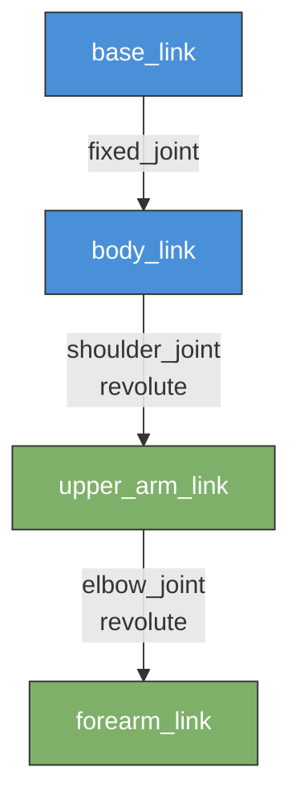

# Chapter 7: Robot Description -- URDF and SDF

In [Chapter 6](./ch06-gazebo-simulation.md) you launched Gazebo and spawned a pre-built robot model. But where did that model come from? Someone had to describe every link, joint, sensor, and visual element of the robot in a structured file. That file is the robot description, and learning to write one is like learning to draw a blueprint before building a house.

This chapter teaches you the two primary formats for robot description -- URDF and SDF -- and introduces xacro, a tool that makes complex descriptions manageable.

## Learning Objectives

By the end of this chapter, you will be able to:

- **Explain** the purpose of robot description files and why they are needed.
- **Write** a minimal URDF file that defines links, joints, visual geometry, and collision geometry.
- **Distinguish** between URDF and SDF in terms of features and use cases.
- **Use** xacro to parameterize and modularize robot descriptions.
- **Visualize** a URDF in RViz2 and verify the TF (transform) tree.

## 7.1 Introduction: Why Robots Need a Description File

A robot is a collection of rigid bodies (links) connected by joints. To simulate or visualize a robot, software needs to know:

- **What are the parts?** How many links does the robot have? What shape is each one?
- **How are they connected?** Which links are connected by joints? What type of joint -- revolute (hinge), prismatic (slider), or fixed?
- **What do they look like?** What color, texture, or mesh should be used for rendering?
- **How do they collide?** What simplified geometry should the physics engine use for collision detection?
- **What are the physical properties?** Mass, inertia, friction coefficients.

Without this information, Gazebo cannot simulate the robot, RViz2 cannot display it, and motion planners cannot compute trajectories. The robot description file is the single source of truth for the robot's physical structure.

Think of it this way: a robot description is to a robot what HTML is to a web page. It is a structured, declarative document that tells the rendering engine what to draw and how things relate to each other.

## 7.2 URDF: The Unified Robot Description Format

URDF is an XML format created by the ROS community. It is the most widely used robot description format in the ROS ecosystem. Nearly every ROS-compatible robot -- from TurtleBot to industrial arms -- ships with a URDF file.

### The Tree Structure

A URDF describes a robot as a **tree** of links connected by joints. There is exactly one root link (typically called `base_link`), and every other link is a child connected through a joint. URDF does not allow loops or closed kinematic chains.



In this diagram, `base_link` is the root. A fixed joint connects it to `body_link`. Two revolute joints create a simple 2-DOF (degree of freedom) arm. Each joint defines the relationship between a parent link and a child link.

### Links: The Rigid Bodies

A link represents a single rigid body. It has three main components:

| Component | Purpose | Required? |
|-----------|---------|-----------|
| `<visual>` | Defines what the link looks like in visualization tools (RViz2, Gazebo GUI). Uses meshes or primitive shapes. | No, but recommended |
| `<collision>` | Defines the simplified geometry used by the physics engine for collision detection. Often a bounding box or cylinder. | No, but needed for simulation |
| `<inertial>` | Defines mass and the 3x3 inertia matrix. Required for the physics engine to simulate dynamics correctly. | No, but needed for non-fixed joints |

:::tip Visual vs Collision Geometry
Use a detailed mesh (STL or DAE file) for `<visual>` so the robot looks realistic. Use a simple primitive (box, cylinder, sphere) for `<collision>` so the physics engine runs fast. The collision geometry does not need to match the visual geometry exactly -- it just needs to be a reasonable approximation.
:::

### Joints: The Connections

A joint connects a parent link to a child link. URDF supports these joint types:

| Joint Type | Motion | Example |
|------------|--------|---------|
| `revolute` | Rotates around an axis, with upper and lower limits | Elbow, shoulder |
| `continuous` | Rotates around an axis, no limits | Wheel |
| `prismatic` | Slides along an axis, with upper and lower limits | Linear actuator |
| `fixed` | No motion -- rigidly connects two links | Sensor mount |
| `floating` | Six degrees of freedom (rarely used in URDF) | Free-floating base |
| `planar` | Motion in a plane (rarely used) | -- |

### Code Example 1: A Minimal 2-Link Robot Arm URDF

Here is a complete URDF file that defines a simple robot arm with a base and one rotating link. Save this as `simple_arm.urdf`:

```xml
<?xml version="1.0"?>
<!--
  simple_arm.urdf
  A minimal 2-link robot arm for learning URDF structure.
  - base_link: a fixed box sitting on the ground
  - arm_link:  a cylinder that rotates around the Z-axis
-->
<robot name="simple_arm">

  <!-- ================= BASE LINK ================= -->
  <!-- The root of the kinematic tree. A heavy box that sits on the ground. -->
  <link name="base_link">
    <!-- Visual: what you see in RViz2 / Gazebo -->
    <visual>
      <geometry>
        <box size="0.2 0.2 0.1"/>  <!-- 20cm x 20cm x 10cm box -->
      </geometry>
      <material name="blue">
        <color rgba="0.0 0.0 0.8 1.0"/>  <!-- RGBA: blue, fully opaque -->
      </material>
    </visual>

    <!-- Collision: simplified geometry for physics -->
    <collision>
      <geometry>
        <box size="0.2 0.2 0.1"/>
      </geometry>
    </collision>

    <!-- Inertial: mass and inertia tensor -->
    <inertial>
      <mass value="5.0"/>  <!-- 5 kg -->
      <inertia ixx="0.01" ixy="0.0" ixz="0.0"
               iyy="0.01" iyz="0.0" izz="0.01"/>
    </inertial>
  </link>

  <!-- ================= ARM LINK ================= -->
  <!-- A cylinder that rotates relative to the base. -->
  <link name="arm_link">
    <visual>
      <!-- Offset the visual so the cylinder extends upward from the joint -->
      <origin xyz="0.0 0.0 0.2" rpy="0 0 0"/>
      <geometry>
        <cylinder radius="0.04" length="0.4"/>  <!-- 4cm radius, 40cm long -->
      </geometry>
      <material name="orange">
        <color rgba="1.0 0.5 0.0 1.0"/>
      </material>
    </visual>

    <collision>
      <origin xyz="0.0 0.0 0.2" rpy="0 0 0"/>
      <geometry>
        <cylinder radius="0.04" length="0.4"/>
      </geometry>
    </collision>

    <inertial>
      <mass value="1.0"/>  <!-- 1 kg -->
      <origin xyz="0.0 0.0 0.2" rpy="0 0 0"/>
      <inertia ixx="0.005" ixy="0.0" ixz="0.0"
               iyy="0.005" iyz="0.0" izz="0.001"/>
    </inertial>
  </link>

  <!-- ================= JOINT ================= -->
  <!-- Revolute joint: arm_link rotates around the Z-axis relative to base_link -->
  <joint name="base_to_arm" type="revolute">
    <parent link="base_link"/>
    <child link="arm_link"/>
    <!-- Place the joint at the top center of the base -->
    <origin xyz="0.0 0.0 0.05" rpy="0 0 0"/>
    <!-- Rotation axis: Z-axis (pointing up) -->
    <axis xyz="0 0 1"/>
    <!-- Joint limits: rotate +/- 90 degrees, max effort 10 Nm, max velocity 1 rad/s -->
    <limit lower="-1.5708" upper="1.5708" effort="10.0" velocity="1.0"/>
  </joint>

</robot>
```

**Key observations in this file:**

- The `<origin>` tag inside `<visual>` offsets the cylinder so it extends upward from the joint rather than being centered on it.
- The `<limit>` tag on the joint restricts rotation to approximately plus and minus 90 degrees.
- The `<axis>` tag defines which direction the joint rotates around.

**To verify this URDF is valid:**

```bash
# Install the urdf_parser if not already available
sudo apt install liburdfdom-tools

# Check for syntax errors
check_urdf simple_arm.urdf
```

**Expected output:**

```
robot name is: simple_arm
---------- Successfully Coverage [simple_arm] ----------
root Link: base_link has 1 child(ren)
    child(1):  arm_link
        child(1):  arm_link
```

## 7.3 SDF: The Simulation Description Format

SDF (Simulation Description Format) is Gazebo's native format. While URDF was designed for ROS, SDF was designed for simulation. It can describe everything URDF can, plus additional features.

### URDF vs SDF: Key Differences

| Feature | URDF | SDF |
|---------|------|-----|
| **Scope** | Single robot only | Entire world (robots, lights, terrain, physics settings) |
| **Kinematic structure** | Tree only (no loops) | Supports closed kinematic chains |
| **Sensors** | Not supported natively (requires Gazebo plugins) | First-class sensor definitions |
| **Physics properties** | Basic (mass, inertia) | Full physics configuration (friction, damping, solver settings) |
| **Multiple robots** | One robot per file | Multiple models in one world file |
| **ROS integration** | Native -- used by `robot_state_publisher`, MoveIt, RViz2 | Requires conversion for ROS tools |

### When to Use Which

- **Use URDF** when your primary audience is the ROS ecosystem: RViz2 visualization, `robot_state_publisher`, MoveIt motion planning, and TF tree publishing. Most ROS tutorials and tools expect URDF.
- **Use SDF** when you need to define complete simulation worlds, closed kinematic chains, or advanced physics properties. Gazebo reads SDF natively and converts URDF to SDF internally when you spawn a URDF model.

In practice, most robotics teams maintain a **URDF (or xacro) file** as the primary robot description and let Gazebo handle the conversion to SDF internally. This gives you the best of both worlds: full ROS tool compatibility plus Gazebo simulation.

## 7.4 Xacro: Macros for Robot Description

Real robots are complex. A humanoid might have 30+ joints, each with similar link definitions. Writing all of that by hand in raw URDF is tedious and error-prone. **Xacro** (XML Macros) solves this problem by adding variables, math expressions, and reusable macros to URDF.

Xacro files use the `.urdf.xacro` extension and are processed into plain URDF at build time or launch time.

### Code Example 2: Parameterized Robot with Xacro

Save this as `simple_arm.urdf.xacro`:

```xml
<?xml version="1.0"?>
<!--
  simple_arm.urdf.xacro
  The same 2-link arm, but parameterized with xacro.
  Change the properties at the top to resize the entire robot.
-->
<robot xmlns:xacro="http://www.ros.org/wiki/xacro" name="simple_arm">

  <!-- =============== PROPERTIES (like variables) =============== -->
  <xacro:property name="base_width"  value="0.2"/>
  <xacro:property name="base_height" value="0.1"/>
  <xacro:property name="base_mass"   value="5.0"/>

  <xacro:property name="arm_radius"  value="0.04"/>
  <xacro:property name="arm_length"  value="0.4"/>
  <xacro:property name="arm_mass"    value="1.0"/>

  <!-- =============== MACRO: a reusable link template =============== -->
  <xacro:macro name="cylinder_link" params="name radius length mass color_r color_g color_b">
    <link name="${name}">
      <visual>
        <origin xyz="0 0 ${length/2}" rpy="0 0 0"/>
        <geometry>
          <cylinder radius="${radius}" length="${length}"/>
        </geometry>
        <material name="${name}_color">
          <color rgba="${color_r} ${color_g} ${color_b} 1.0"/>
        </material>
      </visual>
      <collision>
        <origin xyz="0 0 ${length/2}" rpy="0 0 0"/>
        <geometry>
          <cylinder radius="${radius}" length="${length}"/>
        </geometry>
      </collision>
      <inertial>
        <mass value="${mass}"/>
        <origin xyz="0 0 ${length/2}" rpy="0 0 0"/>
        <!-- Simplified inertia for a solid cylinder -->
        <inertia ixx="${(1.0/12.0)*mass*(3*radius*radius + length*length)}"
                 ixy="0" ixz="0"
                 iyy="${(1.0/12.0)*mass*(3*radius*radius + length*length)}"
                 iyz="0"
                 izz="${0.5*mass*radius*radius}"/>
      </inertial>
    </link>
  </xacro:macro>

  <!-- =============== BUILD THE ROBOT =============== -->

  <!-- Base link: a box (defined inline since it differs from the macro) -->
  <link name="base_link">
    <visual>
      <geometry>
        <box size="${base_width} ${base_width} ${base_height}"/>
      </geometry>
      <material name="blue">
        <color rgba="0.0 0.0 0.8 1.0"/>
      </material>
    </visual>
    <collision>
      <geometry>
        <box size="${base_width} ${base_width} ${base_height}"/>
      </geometry>
    </collision>
    <inertial>
      <mass value="${base_mass}"/>
      <inertia ixx="0.01" ixy="0" ixz="0" iyy="0.01" iyz="0" izz="0.01"/>
    </inertial>
  </link>

  <!-- Arm link: use the macro -->
  <xacro:cylinder_link name="arm_link"
                       radius="${arm_radius}"
                       length="${arm_length}"
                       mass="${arm_mass}"
                       color_r="1.0" color_g="0.5" color_b="0.0"/>

  <!-- Joint connecting base to arm -->
  <joint name="base_to_arm" type="revolute">
    <parent link="base_link"/>
    <child link="arm_link"/>
    <origin xyz="0 0 ${base_height/2}" rpy="0 0 0"/>
    <axis xyz="0 0 1"/>
    <limit lower="-1.5708" upper="1.5708" effort="10.0" velocity="1.0"/>
  </joint>

</robot>
```

**What xacro gives you:**

1. **Properties** (`xacro:property`): Define a value once, use it everywhere with `${name}`. Change `arm_length` from 0.4 to 0.6 and the entire robot updates consistently.
2. **Math expressions**: Write `${length/2}` or `${(1.0/12.0)*mass*(3*radius*radius + length*length)}` directly in attribute values. The inertia tensor is computed from the cylinder formulas automatically.
3. **Macros** (`xacro:macro`): Define a template once, instantiate it many times with different parameters. In a real humanoid, you might use one macro for all arm segments and another for all leg segments.

**To process xacro into URDF:**

```bash
# Generate plain URDF from the xacro file
xacro simple_arm.urdf.xacro > simple_arm_generated.urdf

# Verify the generated URDF
check_urdf simple_arm_generated.urdf
```

**Expected output:**

```
robot name is: simple_arm
---------- Successfully Parsed [simple_arm] ----------
root Link: base_link has 1 child(ren)
    child(1):  arm_link
```

At launch time, `robot_state_publisher` can process xacro files directly, so you rarely need to generate the URDF manually.

## 7.5 Loading URDF into ROS 2

The `robot_state_publisher` node reads a URDF (or xacro) and does two things:

1. **Publishes the TF tree**: It broadcasts the transforms between all links based on the joint states it receives on the `/joint_states` topic.
2. **Publishes the robot description**: It makes the full URDF available on the `/robot_description` topic so tools like RViz2 can display the robot.

Here is how you load the URDF in a launch file:

```python
"""Launch robot_state_publisher with our simple_arm URDF."""

import os
from ament_index_python.packages import get_package_share_directory
from launch import LaunchDescription
from launch_ros.actions import Node
import xacro


def generate_launch_description():
    """Process the xacro file and start robot_state_publisher."""

    # Locate the xacro file in your package
    pkg_share = get_package_share_directory('my_robot_pkg')
    xacro_path = os.path.join(pkg_share, 'urdf', 'simple_arm.urdf.xacro')

    # Process xacro into a URDF string
    robot_description = xacro.process_file(xacro_path).toxml()

    # Start robot_state_publisher
    robot_state_pub = Node(
        package='robot_state_publisher',
        executable='robot_state_publisher',
        parameters=[{'robot_description': robot_description}],
        output='screen',
    )

    # Start joint_state_publisher_gui for interactive control
    joint_state_pub_gui = Node(
        package='joint_state_publisher_gui',
        executable='joint_state_publisher_gui',
        output='screen',
    )

    # Start RViz2 for visualization
    rviz_node = Node(
        package='rviz2',
        executable='rviz2',
        output='screen',
    )

    return LaunchDescription([
        robot_state_pub,
        joint_state_pub_gui,
        rviz_node,
    ])
```

When you run this launch file, a GUI slider appears for each non-fixed joint. Moving the slider publishes joint states, `robot_state_publisher` updates the TF tree, and RViz2 displays the robot moving in real time.

## Summary

In this chapter you learned:

- **Why robot descriptions exist**: Simulators, visualizers, and motion planners all need a structured definition of the robot's links, joints, and physical properties.
- **URDF fundamentals**: Links (visual, collision, inertial), joints (revolute, continuous, prismatic, fixed), and the tree structure rooted at `base_link`.
- **SDF vs URDF**: SDF is Gazebo's native format with richer features (worlds, sensors, closed chains). URDF is the ROS ecosystem standard. Most teams maintain URDF and let Gazebo convert it internally.
- **Xacro**: A macro language that adds variables, math, and reusable templates to URDF, making complex robots manageable.
- **ROS 2 integration**: `robot_state_publisher` loads the URDF, publishes transforms, and makes the description available to the rest of the ROS 2 system.

## Hands-On Exercise: Create a URDF and Visualize It in RViz2

In this exercise you will create a simple 2-link robot URDF, load it into RViz2, and verify the TF tree.

### Prerequisites

```bash
# Install required packages
sudo apt install ros-humble-joint-state-publisher-gui \
                 ros-humble-robot-state-publisher \
                 ros-humble-rviz2 \
                 ros-humble-xacro \
                 liburdfdom-tools
```

### Steps

**Step 1:** Create a workspace and package (skip if you already have one).

```bash
mkdir -p ~/ros2_ws/src
cd ~/ros2_ws/src
ros2 pkg create --build-type ament_python my_robot_description
mkdir -p my_robot_description/urdf
mkdir -p my_robot_description/launch
```

**Step 2:** Copy the `simple_arm.urdf` from Code Example 1 into `my_robot_description/urdf/simple_arm.urdf`.

**Step 3:** Create a launch file at `my_robot_description/launch/view_robot.launch.py`:

```python
"""Launch file to view simple_arm in RViz2."""

import os
from ament_index_python.packages import get_package_share_directory
from launch import LaunchDescription
from launch_ros.actions import Node


def generate_launch_description():
    pkg_share = get_package_share_directory('my_robot_description')
    urdf_path = os.path.join(pkg_share, 'urdf', 'simple_arm.urdf')

    with open(urdf_path, 'r') as f:
        robot_description = f.read()

    return LaunchDescription([
        Node(
            package='robot_state_publisher',
            executable='robot_state_publisher',
            parameters=[{'robot_description': robot_description}],
        ),
        Node(
            package='joint_state_publisher_gui',
            executable='joint_state_publisher_gui',
        ),
        Node(
            package='rviz2',
            executable='rviz2',
        ),
    ])
```

**Step 4:** Update `setup.py` to install the URDF and launch files. Add these entries to `data_files`:

```python
# Inside setup.py data_files list, add:
(os.path.join('share', package_name, 'urdf'), glob('urdf/*')),
(os.path.join('share', package_name, 'launch'), glob('launch/*.py')),
```

**Step 5:** Build and launch.

```bash
cd ~/ros2_ws
colcon build --packages-select my_robot_description
source install/setup.bash
ros2 launch my_robot_description view_robot.launch.py
```

**Step 6:** In RViz2, add the **RobotModel** display:

1. Click "Add" in the Displays panel.
2. Select "RobotModel" and click OK.
3. Set the "Fixed Frame" (top of Displays panel) to `base_link`.
4. You should see the blue base box and the orange arm cylinder.

**Step 7:** Add the **TF** display to see the coordinate frames:

1. Click "Add" again, select "TF", click OK.
2. You should see coordinate frame axes at `base_link` and `arm_link`.

**Step 8:** Use the Joint State Publisher GUI slider to rotate the arm and confirm the TF tree updates in real time.

### Verification

Your exercise is complete when:

- [ ] RViz2 displays the robot with a blue base and orange arm
- [ ] The TF display shows frames for `base_link` and `arm_link`
- [ ] Moving the slider in Joint State Publisher GUI rotates the arm in RViz2
- [ ] Running `ros2 run tf2_tools view_frames` generates a `frames.pdf` showing the correct tree: `base_link` -> `arm_link`

## Further Reading

- [URDF Specification (ROS Wiki)](http://wiki.ros.org/urdf/XML) -- Complete reference for all URDF XML elements.
- [SDF Specification](http://sdformat.org/spec) -- Official SDF format specification.
- [Xacro Documentation (ROS Wiki)](http://wiki.ros.org/xacro) -- Full guide to xacro macros and features.
- [robot_state_publisher (ROS 2)](https://github.com/ros/robot_state_publisher) -- Source and documentation for the transform publisher.
- [RViz2 User Guide](https://docs.ros.org/en/humble/Tutorials/Intermediate/RViz/RViz-User-Guide/RViz-User-Guide.html) -- How to configure RViz2 displays.
- [MoveIt 2 URDF Tutorial](https://moveit.picknik.ai/humble/doc/tutorials/getting_started/getting_started.html) -- Using URDF with the MoveIt motion planning framework.

---

*In the previous chapter, [Chapter 6: Gazebo Simulation](./ch06-gazebo-simulation.md), you learned how to launch and work with the Gazebo simulator. In the next chapter, [Chapter 8: NVIDIA Isaac](../module-3/ch08-nvidia-isaac.md), you will explore NVIDIA's platform for AI-powered robot perception and simulation.*
