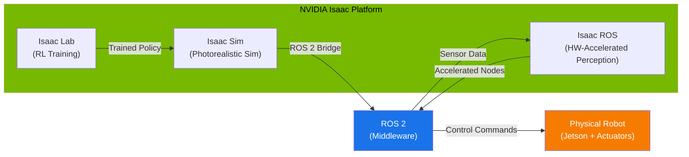

# Chapter 8: NVIDIA Isaac — AI for Robotics

## Learning Objectives

By the end of this chapter, you will be able to:

- **Describe** the three pillars of the NVIDIA Isaac platform (Isaac Sim, Isaac Lab, Isaac ROS) and how they connect to ROS 2.
- **Explain** why GPU-accelerated simulation matters for training and testing robot AI at scale.
- **Create** a basic Isaac Sim scene programmatically using the Python Standalone API.
- **Connect** Isaac Sim to ROS 2 and publish simulated sensor data to ROS topics.
- **Navigate** the Isaac Sim user interface and load a pre-built robot asset.

## Introduction

In Modules 1 and 2 you learned how to build ROS 2 nodes, describe robots with URDF/SDF, and simulate them in Gazebo. Gazebo is excellent for learning, but as your robots and environments grow more complex, you will hit limits: rendering realism, simulation speed, and the ability to generate training data at scale.

This is the problem NVIDIA Isaac solves. Think of it this way: if Gazebo is a well-equipped home workshop, NVIDIA Isaac is an industrial factory. Both let you build and test things, but the factory can produce thousands of variants in parallel, with photorealistic quality, all powered by GPU hardware.

NVIDIA Isaac is not a single tool. It is an **ecosystem** of tools that span the full lifecycle of robot development — from training AI in simulation, to deploying perception on real hardware. In this chapter, you will learn what each piece does, why it matters, and how to get started writing Python code against the Isaac Sim API.

:::caution Hardware Required

NVIDIA Isaac Sim requires an **NVIDIA RTX GPU** (RTX 3070 or higher recommended, with at least 12 GB VRAM). Standard laptops and non-NVIDIA machines **will not run Isaac Sim locally**.

**Cloud alternative:** You can use [NVIDIA Omniverse Cloud](https://www.nvidia.com/en-us/omniverse/cloud/) or an AWS `g5.2xlarge` instance (A10G GPU, 24 GB VRAM) to run Isaac Sim without local hardware. See Appendix A3 for cloud setup instructions.

:::

## 8.1 The NVIDIA Isaac Ecosystem

Before diving into code, you need a mental map of the Isaac ecosystem. There are three major components, and they serve different roles in the robot development pipeline.

| Component | What It Does | When You Use It |
|-----------|-------------|-----------------|
| **Isaac Sim** | Photorealistic physics simulation built on NVIDIA Omniverse | Design environments, test robot behavior, generate synthetic training data |
| **Isaac Lab** | Reinforcement learning framework built on top of Isaac Sim | Train robot policies (walking, grasping) using GPU-parallel environments |
| **Isaac ROS** | Hardware-accelerated ROS 2 packages for perception | Deploy real-time perception (SLAM, object detection, depth) on Jetson hardware |

The key insight is that these three components form a **pipeline**: you train in Isaac Lab, test in Isaac Sim, and deploy with Isaac ROS.

### Mermaid: The Isaac Ecosystem



**How to read this diagram:** Isaac Lab trains a policy (for example, a walking gait). You validate that policy in Isaac Sim's photorealistic world. When you are satisfied, you deploy the policy onto a real robot whose perception stack runs Isaac ROS nodes, all coordinated through ROS 2.

### Why GPU-Accelerated Simulation Matters

Traditional CPU-based simulators like Gazebo run one environment at a time. If you want to test 1,000 variations of a robot task (different lighting, friction, object positions), you run 1,000 sequential simulations. That can take days.

GPU-accelerated simulators like Isaac Sim and Isaac Lab can run **thousands of environments in parallel** on a single GPU. What took days now takes minutes. This is not a nice-to-have — it is a fundamental requirement for modern techniques like reinforcement learning and domain randomization, both of which you will encounter in Chapters 9 and 10.

Additionally, Isaac Sim uses **RTX ray tracing** for photorealistic rendering. This matters because if your robot's camera sees realistic images during training, it will perform better when deployed in the real world. This concept is called **sim-to-real transfer**, and it is the subject of Chapter 10.

## 8.2 Isaac Sim Architecture and Scene Setup

Isaac Sim is built on top of **NVIDIA Omniverse**, a platform for 3D collaboration and simulation. Everything in Isaac Sim is represented using **USD (Universal Scene Description)** — a file format originally created by Pixar for describing 3D scenes. A USD file can contain geometry, materials, physics properties, and even robot joint definitions.

The Isaac Sim Python API lets you script everything: creating objects, loading robots, configuring physics, stepping the simulation, and reading sensor data. There are two ways to use the Python API:

1. **Standalone scripts** — Run from the command line using the Isaac Sim Python interpreter.
2. **Extension scripts** — Run inside the Isaac Sim GUI as Omniverse extensions.

We will focus on standalone scripts because they are easier to automate and integrate with CI/CD pipelines.

### Code Example 1: Creating a Simple Scene

The following script creates a ground plane, adds a red cube, and runs the simulation for 500 steps. This is the "Hello World" of Isaac Sim.

```python
"""
Isaac Sim Standalone Script: Create a ground plane and a cube.
Run with: ~/.local/share/ov/pkg/isaac-sim-4.2.0/python.sh scene_hello.py
"""

from isaacsim import SimulationApp

# Launch Isaac Sim in headless mode (no GUI window).
# Set headless=False if you want to see the viewport.
simulation_app = SimulationApp({"headless": True})

# --- After SimulationApp is created, we can import Omniverse modules ---
import omni.isaac.core.utils.prims as prim_utils
from omni.isaac.core import World
from omni.isaac.core.objects import DynamicCuboid, GroundPlane

# Create a simulation world with default physics settings.
world = World(stage_units_in_meters=1.0)

# Add a ground plane at the origin.
world.scene.add_default_ground_plane()

# Add a dynamic cube 0.5 meters above the ground.
# It will fall due to gravity when the simulation starts.
cube = world.scene.add(
    DynamicCuboid(
        prim_path="/World/my_cube",
        name="red_cube",
        position=[0.0, 0.0, 0.5],   # x, y, z in meters
        size=0.1,                     # 10 cm cube
        color=[1.0, 0.0, 0.0],       # RGB red
    )
)

# Reset the world (initializes physics, sets initial positions).
world.reset()

# Step the simulation for 500 physics steps.
for step in range(500):
    world.step(render=False)  # render=False for headless mode
    if step % 100 == 0:
        position, orientation = cube.get_world_pose()
        print(f"Step {step:>3d}: cube position = {position}")

# Clean up.
simulation_app.close()
```

**Expected output:**

```text
Step   0: cube position = [0.0, 0.0, 0.5]
Step 100: cube position = [0.0, 0.0, 0.10035]
Step 200: cube position = [0.0, 0.0, 0.05000]
Step 300: cube position = [0.0, 0.0, 0.05000]
Step 400: cube position = [0.0, 0.0, 0.05000]
```

The cube starts at 0.5 m, falls under gravity, and comes to rest on the ground plane at 0.05 m (half its size, since position is measured from the center). The exact numbers depend on your physics timestep, but the pattern — falling then resting — will be consistent.

**Key concepts in this code:**

- `SimulationApp` must be created **first**, before importing any Omniverse modules.
- `World` manages the physics scene, timestep, and all objects.
- `DynamicCuboid` is a convenience class that creates a USD prim with rigid-body physics.
- `world.step()` advances the simulation by one physics timestep (default: 1/60 second).

## 8.3 Connecting Isaac Sim to ROS 2

One of Isaac Sim's greatest strengths is its native ROS 2 bridge. This bridge allows simulated sensors (cameras, LiDARs, IMUs) to publish data to ROS 2 topics, and ROS 2 nodes to send commands back into the simulation. From the perspective of your ROS 2 code, the simulated robot looks identical to a real robot.

Isaac Sim ships with built-in **OmniGraph** nodes for ROS 2 integration. OmniGraph is Omniverse's visual programming system — think of it as a dataflow graph that connects simulation events to ROS publishers and subscribers. You can configure OmniGraph visually in the GUI, or programmatically via Python.

### Code Example 2: Publishing a Camera Image to ROS 2

The following standalone script creates a scene with a camera, enables the ROS 2 bridge, and publishes camera images to a ROS 2 topic.

```python
"""
Isaac Sim + ROS 2: Publish a simulated camera image to a ROS 2 topic.
Run with: ~/.local/share/ov/pkg/isaac-sim-4.2.0/python.sh camera_ros2.py

Prerequisites:
  - ROS 2 Humble sourced in the environment
  - Isaac Sim ROS 2 bridge extension enabled
"""

from isaacsim import SimulationApp

simulation_app = SimulationApp({"headless": True})

# --- Omniverse imports (must come after SimulationApp) ---
import omni.isaac.core.utils.prims as prim_utils
from omni.isaac.core import World
from omni.isaac.core.objects import DynamicCuboid, GroundPlane
from omni.isaac.sensor import Camera

# Enable the ROS 2 bridge extension.
import omni.kit.app
ext_manager = omni.kit.app.get_app().get_extension_manager()
ext_manager.set_extension_enabled_immediate("omni.isaac.ros2_bridge", True)

# Create the world and populate the scene.
world = World(stage_units_in_meters=1.0)
world.scene.add_default_ground_plane()

world.scene.add(
    DynamicCuboid(
        prim_path="/World/target_cube",
        name="target_cube",
        position=[1.0, 0.0, 0.05],
        size=0.1,
        color=[0.0, 0.0, 1.0],  # Blue cube
    )
)

# Add a camera sensor looking at the cube.
camera = Camera(
    prim_path="/World/my_camera",
    position=[0.0, 0.0, 0.5],
    frequency=30,           # 30 Hz publish rate
    resolution=(640, 480),
)

world.reset()
camera.initialize()

# Set up ROS 2 publisher via OmniGraph.
import omni.graph.core as og

# Create an OmniGraph that publishes the camera image.
keys = og.Controller.Keys
(graph_handle, nodes, _, _) = og.Controller.edit(
    {"graph_path": "/World/ROS2CameraGraph", "evaluator_name": "execution"},
    {
        keys.CREATE_NODES: [
            ("OnPlaybackTick", "omni.graph.action.OnPlaybackTick"),
            ("CameraHelper", "omni.isaac.ros2_bridge.ROS2CameraHelper"),
        ],
        keys.SET_VALUES: [
            ("CameraHelper.inputs:topicName", "/isaac_sim/camera/rgb"),
            ("CameraHelper.inputs:type", "rgb"),
            ("CameraHelper.inputs:cameraPrim", "/World/my_camera"),
            ("CameraHelper.inputs:frameId", "sim_camera"),
        ],
        keys.CONNECT: [
            ("OnPlaybackTick.outputs:tick", "CameraHelper.inputs:execIn"),
        ],
    },
)

print("ROS 2 camera publisher active on topic: /isaac_sim/camera/rgb")
print("In another terminal, run: ros2 topic echo /isaac_sim/camera/rgb sensor_msgs/msg/Image")

# Run the simulation for 300 steps (10 seconds at 30 Hz).
for step in range(300):
    world.step(render=True)  # render=True needed for camera data

simulation_app.close()
```

**Expected output (in the Isaac Sim terminal):**

```text
ROS 2 camera publisher active on topic: /isaac_sim/camera/rgb
In another terminal, run: ros2 topic echo /isaac_sim/camera/rgb sensor_msgs/msg/Image
```

**Verification (in a separate ROS 2 terminal):**

```bash
# Source ROS 2 and check the topic
source /opt/ros/humble/setup.bash
ros2 topic list
# You should see: /isaac_sim/camera/rgb

ros2 topic hz /isaac_sim/camera/rgb
# Expected: average rate ~30 Hz
```

**Key concepts in this code:**

- The ROS 2 bridge extension (`omni.isaac.ros2_bridge`) must be explicitly enabled.
- **OmniGraph** wires simulation events (each tick) to ROS 2 publisher nodes.
- `ROS2CameraHelper` is a convenience node that handles frame conversion and message formatting.
- `render=True` is required when camera data needs to be generated — the renderer must produce pixels.
- From ROS 2's perspective, this camera image is indistinguishable from a real camera feed.

### The Isaac Sim + ROS 2 Communication Flow

When you run the script above, the following happens on every simulation tick:

1. Isaac Sim advances the physics by one timestep.
2. The RTX renderer produces a camera frame.
3. The OmniGraph `ROS2CameraHelper` node converts the frame to a `sensor_msgs/msg/Image` message.
4. The message is published on the `/isaac_sim/camera/rgb` topic via the ROS 2 DDS layer.
5. Any ROS 2 subscriber (your perception node, RViz2, etc.) receives the image.

This is the same pattern used for LiDAR, IMU, depth cameras, and joint states. The simulation becomes a drop-in replacement for real hardware.

## 8.4 Loading Robot Assets

Isaac Sim ships with a library of robot assets in USD format, including popular robots like the Franka Emika Panda arm, the Unitree quadrupeds, and the NVIDIA Carter mobile robot. You can also import your own URDF files — the same ones you built in [Chapter 7](../module-2/ch07-urdf-sdf.md).

To load a built-in robot, you use the `Nucleus` asset server or a local path:

```python
# Load the Franka Panda arm from the Isaac Sim asset library.
from omni.isaac.core.utils.stage import add_reference_to_stage

add_reference_to_stage(
    usd_path="/Isaac/Robots/Franka/franka_alt_fingers.usd",
    prim_path="/World/Franka",
)
```

The Franka arm is a 7-degree-of-freedom manipulator commonly used in research. You will work with it extensively in [Chapter 9](./ch09-perception-manipulation.md) for perception and manipulation tasks.

## Summary

In this chapter, you learned:

- **The NVIDIA Isaac ecosystem** consists of three pillars: Isaac Sim (photorealistic simulation), Isaac Lab (reinforcement learning), and Isaac ROS (hardware-accelerated perception for deployment).
- **GPU-accelerated simulation** enables parallel training across thousands of environments and photorealistic rendering for better sim-to-real transfer.
- **Isaac Sim's Python API** uses a `SimulationApp` entry point, a `World` object for managing physics, and USD prims for representing objects and robots.
- **The ROS 2 bridge** connects Isaac Sim to the ROS 2 ecosystem via OmniGraph, allowing simulated sensors to publish data on standard ROS 2 topics.
- **Robot assets** are stored in USD format and can be loaded from the built-in Nucleus library or imported from URDF files.

The key takeaway is that Isaac Sim is not a replacement for ROS 2 — it is a **complement**. ROS 2 remains your middleware for robot control. Isaac Sim provides the high-fidelity simulation environment that makes your ROS 2 code better by letting you test it in realistic conditions at scale.

## Hands-On Exercise

**Goal:** Load the Franka robot in Isaac Sim, start the simulation, and observe the robot in the viewport.

**Prerequisites:**
- NVIDIA Isaac Sim 4.x installed (or access via NVIDIA Omniverse Cloud)
- ROS 2 Humble sourced in your environment
- An NVIDIA RTX GPU with at least 8 GB VRAM

**Steps:**

1. **Launch Isaac Sim** from the Omniverse Launcher or via command line:
   ```bash
   cd ~/.local/share/ov/pkg/isaac-sim-4.2.0
   ./isaac-sim.sh
   ```

2. **Open the Franka example scene:**
   - In the Isaac Sim GUI, go to **File > Open**.
   - Navigate to: `Isaac/Samples/Isaac_SDK/Robots/Franka/franka_basic.usd`
   - Alternatively, use the Content browser to find the Franka assets.

3. **Press Play** (the triangle button in the toolbar, or the spacebar).

4. **Observe the robot:** The Franka arm should appear in its default home position. Gravity is active — if the joints are not controlled, the arm may slump.

5. **Open a ROS 2 terminal** and check for published topics:
   ```bash
   source /opt/ros/humble/setup.bash
   ros2 topic list
   ```

6. **Verify joint states are published:**
   ```bash
   ros2 topic echo /joint_states
   ```

**Expected output:** You should see a `sensor_msgs/msg/JointState` message with 7 joint positions (one for each Franka joint) updating at the simulation rate.

**Verification checklist:**
- [ ] Isaac Sim launches without GPU errors
- [ ] The Franka robot is visible in the viewport
- [ ] Pressing Play starts the physics simulation
- [ ] `ros2 topic list` shows topics from the simulation
- [ ] Joint state values change over time as the simulation runs

## Further Reading

- [NVIDIA Isaac Sim Documentation](https://docs.omniverse.nvidia.com/isaacsim/latest/index.html) — Official user guide covering installation, tutorials, and API reference.
- [NVIDIA Isaac Lab Documentation](https://isaac-sim.github.io/IsaacLab/) — Framework for reinforcement learning on top of Isaac Sim.
- [Isaac ROS Documentation](https://nvidia-isaac-ros.github.io/) — Hardware-accelerated ROS 2 packages for NVIDIA Jetson.
- [OpenUSD Specification](https://openusd.org/release/index.html) — The Universal Scene Description format used by Isaac Sim.
- [ROS 2 Humble Documentation](https://docs.ros.org/en/humble/) — The ROS 2 distribution used throughout this textbook.
- Previous: [Chapter 7: URDF and SDF](../module-2/ch07-urdf-sdf.md) | Next: [Chapter 9: Perception and Manipulation](./ch09-perception-manipulation.md)
