# Chapter 9: Perception and Manipulation

## Learning Objectives

By the end of this chapter, you will be able to:

- **Trace** the complete robot perception pipeline from raw camera data to actionable object detections.
- **Implement** a ROS 2 node that subscribes to a camera topic and performs basic object detection with OpenCV.
- **Describe** the role of Isaac ROS packages (AprilTag detection, DNN inference) in hardware-accelerated perception.
- **Use** MoveIt 2 to plan and execute a simple arm motion for a robotic manipulator.
- **Design** a pick-and-place workflow that combines perception and manipulation.

## Introduction

A robot without perception is blind. A robot without manipulation is paralyzed. In this chapter, you will learn how to give your robot both eyes and hands.

Consider what happens when you pick up a coffee mug from a table. Your eyes locate the mug, estimate its position and orientation, and guide your hand toward it. Your brain plans an arm trajectory that avoids obstacles, and your fingers close around the handle with just the right amount of force. This entire process — perception, planning, execution — happens in under a second.

For a robot, each of these steps is a distinct software component, and making them work together reliably is one of the central challenges of robotics. In this chapter, you will build each piece and connect them into a working pipeline.

We will use tools from three ecosystems:
- **OpenCV** for basic computer vision (accessible and educational)
- **Isaac ROS** for GPU-accelerated perception (production-grade)
- **MoveIt 2** for motion planning and arm control (the industry standard)

By the end, you will have a complete perception-to-manipulation pipeline running in Isaac Sim with a Franka Panda arm.

## 9.1 The Robot Perception Pipeline

Robot perception answers three questions: **What** is in the scene? **Where** is it? **How** should I interact with it?

The pipeline flows from raw sensor data to high-level scene understanding:

```mermaid
flowchart LR
    Camera["Camera\n(RGB + Depth)"] --> Preprocess["Preprocessing\n(Resize, Denoise)"]
    Preprocess --> Detection["Object Detection\n(DNN / Color Filter)"]
    Detection --> Pose["Pose Estimation\n(3D Position + Orientation)"]
    Pose --> Planning["Motion Planning\n(MoveIt 2)"]
    Planning --> Execution["Arm Execution\n(Joint Commands)"]
    Execution --> Gripper["Gripper Control\n(Open / Close)"]

    style Camera fill:#1a73e8,color:#fff
    style Detection fill:#e8710a,color:#fff
    style Planning fill:#76b900,color:#000
    style Execution fill:#f57c00,color:#fff
```



Let us walk through each stage:

1. **Camera input.** A camera (RGB, depth, or RGB-D) captures images at a fixed rate (typically 30 Hz). In Isaac Sim, this is the simulated camera you set up in Chapter 8. On a real robot, this is typically an Intel RealSense or similar depth camera.

2. **Preprocessing.** Raw images often need resizing, color space conversion, or noise reduction before a detection algorithm can process them.

3. **Object detection.** This is where the robot identifies objects of interest. Methods range from simple (color thresholding) to sophisticated (deep neural networks like YOLO or SSD). Isaac ROS provides GPU-accelerated DNN inference nodes.

4. **Pose estimation.** Knowing that a "mug" exists in the image is not enough — the robot needs the mug's 3D position and orientation (6-DoF pose) relative to the robot's base frame. This requires combining the 2D detection with depth data and camera calibration.

5. **Motion planning.** Given the object's 3D pose, the robot's planner (MoveIt 2) computes a collision-free trajectory from the arm's current configuration to the grasp pose.

6. **Execution.** The planned trajectory is sent as joint commands to the arm controller. The gripper opens, the arm moves, and the gripper closes around the object.

### Isaac ROS for Perception

For production robots, you would not write your own YOLO inference node from scratch. NVIDIA provides **Isaac ROS** — a collection of ROS 2 packages that run perception algorithms on NVIDIA GPUs (both desktop RTX and Jetson edge devices). Key packages include:

| Package | Function |
|---------|----------|
| `isaac_ros_apriltag` | Detects AprilTag fiducial markers (great for calibration and simple object tracking) |
| `isaac_ros_dnn_inference` | Runs TensorRT-optimized neural networks for object detection and segmentation |
| `isaac_ros_visual_slam` | GPU-accelerated Visual SLAM for localization and mapping |
| `isaac_ros_depth_segmentation` | Segments objects from depth images |
| `isaac_ros_centerpose` | Estimates 6-DoF pose of objects from a single RGB image |

These packages are designed to be drop-in ROS 2 nodes. You subscribe to a camera topic, and they publish detections, poses, or maps on output topics. The GPU acceleration means they can run in real time on a Jetson Orin — something that would be impossible with CPU-only inference.

## 9.2 Camera-Based Object Detection with OpenCV

Before using GPU-accelerated pipelines, it is important to understand the fundamentals. In this section, you will build a ROS 2 node that subscribes to a camera topic, detects objects by color, and publishes the detection results.

Color-based detection is the simplest form of object detection: you convert the image to HSV color space, define a color range (for example, "red"), and find contours that match. It is not robust enough for production, but it teaches the core pattern that all detection nodes follow.

### Code Example 1: ROS 2 Color Detection Node

```python
"""
ROS 2 node that subscribes to a camera image topic, detects objects
by color (red), and publishes bounding box information.

Usage:
  ros2 run perception_pkg color_detector

Subscribes to: /camera/image_raw (sensor_msgs/msg/Image)
Publishes to:  /detections (std_msgs/msg/String)
"""

import rclpy
from rclpy.node import Node
from sensor_msgs.msg import Image
from std_msgs.msg import String
from cv_bridge import CvBridge
import cv2
import numpy as np


class ColorDetectorNode(Node):
    """Detects red objects in camera images using HSV thresholding."""

    def __init__(self):
        super().__init__("color_detector")

        # Subscribe to the camera image topic.
        self.image_sub = self.create_subscription(
            Image,
            "/camera/image_raw",
            self.image_callback,
            10,
        )

        # Publish detection results as a simple string.
        self.detection_pub = self.create_publisher(String, "/detections", 10)

        # CvBridge converts between ROS Image messages and OpenCV arrays.
        self.bridge = CvBridge()

        # Define the HSV range for "red" color detection.
        # Red wraps around the hue spectrum, so we need two ranges.
        self.lower_red_1 = np.array([0, 120, 70])
        self.upper_red_1 = np.array([10, 255, 255])
        self.lower_red_2 = np.array([170, 120, 70])
        self.upper_red_2 = np.array([180, 255, 255])

        self.get_logger().info("Color detector node started. Waiting for images...")

    def image_callback(self, msg: Image):
        """Process each incoming camera frame."""
        # Convert ROS Image message to OpenCV BGR image.
        cv_image = self.bridge.imgmsg_to_cv2(msg, desired_encoding="bgr8")

        # Convert BGR to HSV color space.
        hsv = cv2.cvtColor(cv_image, cv2.COLOR_BGR2HSV)

        # Create masks for red color (two ranges because red wraps in HSV).
        mask1 = cv2.inRange(hsv, self.lower_red_1, self.upper_red_1)
        mask2 = cv2.inRange(hsv, self.lower_red_2, self.upper_red_2)
        mask = mask1 | mask2

        # Find contours in the mask.
        contours, _ = cv2.findContours(mask, cv2.RETR_EXTERNAL, cv2.CHAIN_APPROX_SIMPLE)

        detections = []
        for contour in contours:
            area = cv2.contourArea(contour)
            if area < 500:
                continue  # Ignore small noise

            # Get bounding box.
            x, y, w, h = cv2.boundingRect(contour)
            center_x = x + w // 2
            center_y = y + h // 2
            detections.append(f"red_object at ({center_x}, {center_y}), area={area:.0f}")

        if detections:
            result = "; ".join(detections)
            self.detection_pub.publish(String(data=result))
            self.get_logger().info(f"Detected: {result}")


def main(args=None):
    rclpy.init(args=args)
    node = ColorDetectorNode()
    rclpy.spin(node)
    node.destroy_node()
    rclpy.shutdown()


if __name__ == "__main__":
    main()
```

**Expected output (when a red cube is visible in the camera):**

```text
[INFO] [color_detector]: Color detector node started. Waiting for images...
[INFO] [color_detector]: Detected: red_object at (320, 240), area=4523
[INFO] [color_detector]: Detected: red_object at (318, 242), area=4501
[INFO] [color_detector]: Detected: red_object at (321, 239), area=4538
```

**Key concepts:**

- **CvBridge** converts between ROS `Image` messages and NumPy arrays that OpenCV can process. This is the standard bridge between the ROS ecosystem and computer vision.
- **HSV thresholding** is more robust than RGB for color detection because it separates hue (color) from saturation and value (brightness). This makes it less sensitive to lighting changes.
- The node follows the standard ROS 2 pattern: subscribe to input, process, publish output. You could replace the color detection with a neural network and the node structure would remain the same.

## 9.3 Motion Planning with MoveIt 2

Perception tells you where objects are. **MoveIt 2** tells the robot arm how to reach them.

MoveIt 2 is the motion planning framework for ROS 2. It handles:

- **Inverse kinematics (IK):** Converting a target position/orientation in 3D space to the joint angles needed to reach it.
- **Path planning:** Finding a collision-free trajectory from the current joint configuration to the target.
- **Collision avoidance:** Using a model of the robot and the environment to ensure the arm does not hit anything.
- **Trajectory execution:** Sending the planned trajectory to the robot's joint controllers.

### MoveIt 2 Concepts

Before writing code, you need to understand three MoveIt 2 concepts:

- **Move Group:** A named set of joints that move together. For the Franka Panda, the main move group is called `panda_arm` (7 joints) and the gripper group is `panda_hand` (2 finger joints).
- **Planning Scene:** A representation of the robot and its environment used for collision checking. It includes the robot's own geometry plus any obstacles you add.
- **Plan and Execute:** MoveIt 2 separates planning (computing the trajectory) from execution (sending it to controllers). You can plan, inspect the result, and then decide whether to execute.

### Code Example 2: Planning an Arm Motion with MoveIt 2

The following script uses the `moveit_py` Python bindings to plan and execute a simple arm motion.

```python
"""
MoveIt 2 Python script: Plan and execute arm motion for the Franka Panda.

Prerequisites:
  - MoveIt 2 installed and configured for the Franka Panda
  - Franka MoveIt config package launched:
    ros2 launch franka_moveit_config moveit.launch.py

Usage:
  ros2 run manipulation_pkg plan_arm_motion
"""

import rclpy
from rclpy.node import Node
from geometry_msgs.msg import Pose, Point, Quaternion

# MoveIt 2 Python bindings.
from moveit.core.robot_state import RobotState
from moveit.planning import MoveItPy, PlanRequestParameters


class ArmPlannerNode(Node):
    """Plans and executes a simple arm motion using MoveIt 2."""

    def __init__(self):
        super().__init__("arm_planner")
        self.get_logger().info("Initializing MoveIt 2...")

        # Initialize MoveIt 2 Python interface.
        self.moveit = MoveItPy(node_name="arm_planner_moveit")
        self.panda_arm = self.moveit.get_planning_component("panda_arm")
        self.get_logger().info("MoveIt 2 ready.")

    def plan_and_execute(self):
        """Plan a motion to a target pose and execute it."""
        # Define target pose: 40 cm in front, 30 cm to the right, 40 cm up.
        target_pose = Pose()
        target_pose.position = Point(x=0.4, y=-0.3, z=0.4)
        # Orientation: gripper pointing downward (quaternion).
        target_pose.orientation = Quaternion(x=1.0, y=0.0, z=0.0, w=0.0)

        # Set the target for the planning component.
        self.panda_arm.set_start_state_to_current_state()
        self.panda_arm.set_goal_state(
            pose_stamped_msg=self._make_pose_stamped(target_pose),
            pose_link="panda_link8",  # End-effector link
        )

        # Plan the motion.
        self.get_logger().info("Planning motion to target pose...")
        plan_result = self.panda_arm.plan()

        if plan_result:
            self.get_logger().info(
                f"Plan found! Trajectory has "
                f"{len(plan_result.trajectory.joint_trajectory.points)} waypoints."
            )
            # Execute the planned trajectory.
            self.get_logger().info("Executing trajectory...")
            robot_trajectory = plan_result.trajectory
            self.moveit.execute(robot_trajectory, controllers=[])
            self.get_logger().info("Execution complete.")
        else:
            self.get_logger().error("Planning failed! Target may be unreachable.")

    def _make_pose_stamped(self, pose: Pose):
        """Wrap a Pose in a PoseStamped message."""
        from geometry_msgs.msg import PoseStamped
        ps = PoseStamped()
        ps.header.frame_id = "panda_link0"  # Base frame of the Franka
        ps.pose = pose
        return ps


def main(args=None):
    rclpy.init(args=args)
    node = ArmPlannerNode()

    # Plan and execute the motion.
    node.plan_and_execute()

    node.destroy_node()
    rclpy.shutdown()


if __name__ == "__main__":
    main()
```

**Expected output:**

```text
[INFO] [arm_planner]: Initializing MoveIt 2...
[INFO] [arm_planner]: MoveIt 2 ready.
[INFO] [arm_planner]: Planning motion to target pose...
[INFO] [arm_planner]: Plan found! Trajectory has 47 waypoints.
[INFO] [arm_planner]: Executing trajectory...
[INFO] [arm_planner]: Execution complete.
```

**Key concepts:**

- **`MoveItPy`** is the Python entry point for MoveIt 2. It connects to the move group action server and planning scene.
- **`set_start_state_to_current_state()`** tells the planner to start from wherever the arm currently is. This is essential — you never want to plan from a stale state.
- **`set_goal_state()`** accepts a target pose (position + orientation) and the link that should reach that pose. For the Franka, `panda_link8` is the end-effector flange.
- **Plan then execute** is the safe pattern. In a real lab, you would inspect the plan in RViz before executing.
- The number of waypoints (47 in the example) varies depending on the start and goal configurations and the planner used.

## 9.4 Putting It Together: The Pick-and-Place Pattern

With perception and manipulation working separately, the final step is combining them. A typical pick-and-place task follows this sequence:

1. **Perceive:** Camera detects the target object and estimates its 3D pose.
2. **Plan approach:** MoveIt 2 plans a trajectory to a "pre-grasp" pose above the object.
3. **Approach:** Arm moves to the pre-grasp pose.
4. **Descend:** Arm moves straight down to the grasp pose.
5. **Grasp:** Gripper closes.
6. **Lift:** Arm moves straight up, lifting the object.
7. **Move to place:** MoveIt 2 plans to the placement location.
8. **Place:** Gripper opens, releasing the object.
9. **Retreat:** Arm moves back to a safe home position.

Each step is a separate ROS 2 action or service call. The orchestration — deciding what to do next — is handled by a state machine or a behavior tree (covered in later chapters).

## Summary

In this chapter, you learned:

- The **robot perception pipeline** flows from raw camera data through detection and pose estimation to produce actionable 3D information.
- **OpenCV** provides fundamental vision tools (color thresholding, contour detection) that teach the core patterns used by all detection nodes.
- **Isaac ROS** packages provide GPU-accelerated, production-grade perception (AprilTag detection, DNN inference, Visual SLAM) as drop-in ROS 2 nodes.
- **MoveIt 2** is the standard motion planning framework for ROS 2, handling inverse kinematics, collision-free path planning, and trajectory execution.
- **Pick-and-place** combines perception and manipulation in a structured sequence: detect, plan, approach, grasp, transport, place, retreat.

The critical insight is that perception and manipulation are **not separate problems** — they are two halves of a feedback loop. The camera sees the object, the arm reaches for it, and the camera verifies success. Building reliable robots means making this loop fast, accurate, and robust to error.

## Hands-On Exercise

**Goal:** Use Isaac Sim with the Franka Panda arm, detect a colored cube using the simulated camera, and plan a grasp motion using MoveIt 2.

**Prerequisites:**
- Isaac Sim 4.x running with the Franka robot loaded (from the Chapter 8 exercise)
- ROS 2 Humble with MoveIt 2 installed
- OpenCV and cv_bridge installed (`sudo apt install ros-humble-cv-bridge`)

**Steps:**

1. **Launch Isaac Sim** with the Franka scene and enable the ROS 2 bridge. Ensure the camera topic is publishing (verify with `ros2 topic list`).

2. **Add a red cube** to the Isaac Sim scene. Place it within the Franka's workspace (about 0.5 m in front of the robot):
   ```python
   # In your Isaac Sim script, add:
   world.scene.add(
       DynamicCuboid(
           prim_path="/World/red_target",
           position=[0.5, 0.0, 0.05],
           size=0.05,
           color=[1.0, 0.0, 0.0],
       )
   )
   ```

3. **Launch MoveIt 2** for the Franka:
   ```bash
   ros2 launch franka_moveit_config moveit.launch.py
   ```

4. **Run the color detector node** from Code Example 1. Verify it detects the red cube by checking the `/detections` topic:
   ```bash
   ros2 topic echo /detections
   ```

5. **Run the arm planner node** from Code Example 2 to move the arm toward the cube's position.

6. **Visualize in RViz 2:**
   ```bash
   ros2 launch franka_moveit_config rviz.launch.py
   ```
   You should see the Franka arm model, the planned trajectory, and the camera image.

**Expected output:**
- The color detector publishes detections at approximately 30 Hz.
- MoveIt 2 successfully plans a trajectory (check for "Plan found!" in the log).
- In RViz 2, you see the planned trajectory as a series of ghost arm poses.

**Verification checklist:**
- [ ] Camera topic is active: `ros2 topic hz /camera/image_raw` shows ~30 Hz
- [ ] Color detector publishes detections with reasonable pixel coordinates
- [ ] MoveIt 2 plans a trajectory without errors
- [ ] RViz 2 shows the arm model and planned path

## Further Reading

- [MoveIt 2 Documentation](https://moveit.picknik.ai/main/index.html) — Tutorials, concepts, and API reference for motion planning in ROS 2.
- [OpenCV Python Tutorials](https://docs.opencv.org/4.x/d6/d00/tutorial_py_root.html) — Comprehensive guide to computer vision with OpenCV.
- [Isaac ROS Documentation](https://nvidia-isaac-ros.github.io/) — GPU-accelerated ROS 2 perception packages.
- [Isaac ROS AprilTag](https://nvidia-isaac-ros.github.io/repositories_and_packages/isaac_ros_apriltag/index.html) — Fiducial marker detection for calibration and tracking.
- [Franka Emika ROS 2 Packages](https://github.com/frankaemika/franka_ros2) — Official ROS 2 drivers and MoveIt configuration for the Franka Panda.
- Previous: [Chapter 8: NVIDIA Isaac](./ch08-nvidia-isaac.md) | Next: [Chapter 10: Sim-to-Real Transfer](./ch10-sim-to-real.md)
