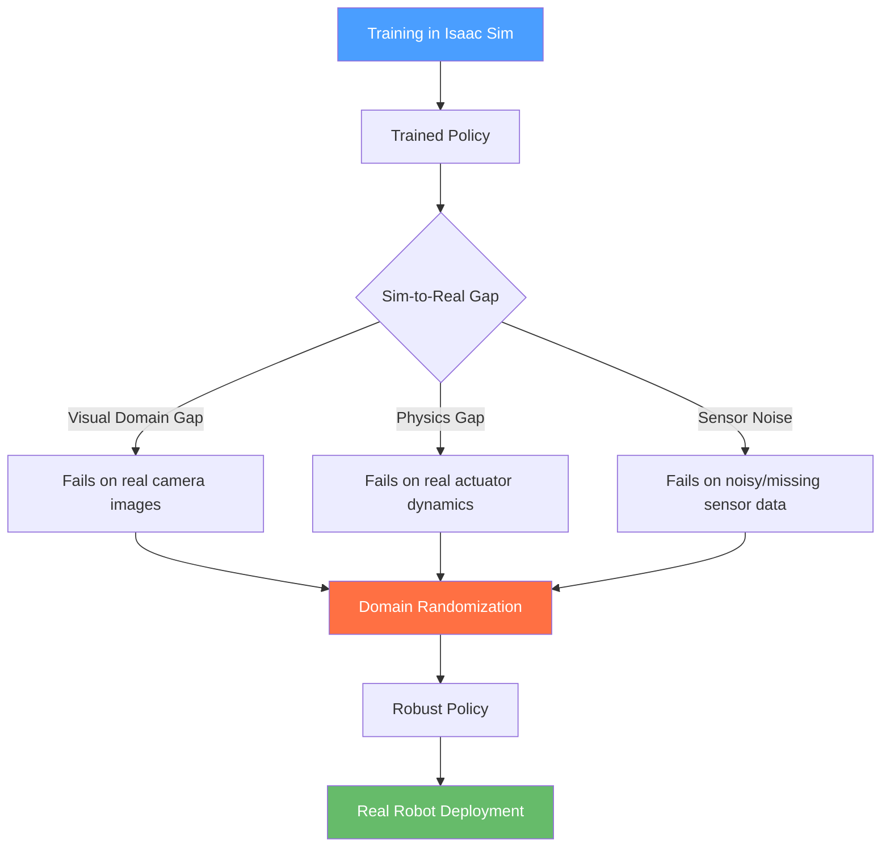

# Chapter 10: Sim-to-Real Transfer

## Learning Objectives

By the end of this chapter, you will be able to:

- **Explain** the three sources of the sim-to-real gap: visual domain gap, physics gap, and sensor noise.
- **Describe** domain randomization and why it produces more robust policies.
- **Export** a trained PyTorch policy to ONNX format for hardware-agnostic deployment.
- **Build** a ROS 2 node that loads an ONNX model and runs inference on sensor observations.
- **Evaluate** real-world policy performance using success rate, latency, and domain transfer metrics.

---

## Introduction

In late 2022, a team at ETH Zurich did something remarkable: they trained a quadruped robot entirely in simulation — never touching physical hardware during training — and then deployed the policy directly to a real robot. The robot walked across grass, gravel, stairs, and even snow, all without any real-world fine-tuning.

The trick was not better physics simulation. The trick was teaching the policy to expect variation. By training in thousands of randomized simulation environments — different ground friction values, different motor delays, different lighting conditions — the policy became robust enough to handle the inevitable gap between simulation and reality.

This is the core insight of **sim-to-real transfer**: you cannot perfectly simulate reality, but you can train policies that are robust to the kinds of differences between simulation and the real world. This chapter covers the techniques that make this work: understanding the sim-to-real gap, applying domain randomization in NVIDIA Isaac Sim, exporting trained policies to ONNX format, and deploying them in a ROS 2 node on physical hardware.

---

## The Sim-to-Real Gap

The **sim-to-real gap** refers to the performance degradation that occurs when a policy trained in simulation is deployed on a real robot. It has three primary sources:

### 1. Visual Domain Gap

Simulation renderers, even photorealistic ones like Isaac Sim's RTX renderer, produce images that differ from real cameras in subtle but consequential ways. Textures are too clean. Reflections are too perfect. Depth noise follows the wrong distribution. A visual policy trained on simulated images can fail catastrophically on real images even when the scene looks very similar to a human.

### 2. Physics Gap

No simulator perfectly models the real world. Joint friction, actuator response times, ground contact dynamics, and object deformability are all approximated. A walking policy trained with perfect joint control may struggle when real motors have 5ms of latency. A grasping policy trained with simplified contact models may fail on objects with unexpected surface properties.

### 3. Sensor Noise

Real sensors add noise, drop readings, and experience interference. A LiDAR might return `inf` for transparent glass. An IMU drifts over time. Simulation sensors typically have clean, perfect data unless noise is explicitly added.



---

## Domain Randomization

**Domain randomization** addresses the sim-to-real gap by training across a distribution of simulation environments rather than a single fixed one. If a policy learns to walk across surfaces with friction coefficients between 0.3 and 1.2, it will likely generalize to the real surface's friction value, whatever it turns out to be.

### What to Randomize

| Category | Parameter | Example Range |
|----------|-----------|---------------|
| **Physics** | Ground friction | 0.3 – 1.2 |
| **Physics** | Object mass | ±20% of nominal |
| **Physics** | Motor torque | ±10% |
| **Physics** | Actuator delay | 0 – 10 ms |
| **Visual** | Lighting intensity | 0.5 – 2.0× |
| **Visual** | Object textures | Random from library |
| **Visual** | Camera noise | σ = 0 – 0.02 |
| **Sensors** | IMU noise | Add Gaussian noise |
| **Sensors** | LiDAR drop rate | 0 – 5% missing |

### Domain Randomization in Isaac Sim

```python
# File: ~/isaac_sim_projects/domain_rand/randomizer.py
# Domain randomization setup using Isaac Sim Python API.
# Run from within Isaac Sim's Script Editor.

from omni.isaac.core.utils.prims import get_prim_at_path
from omni.isaac.core.physics_context import PhysicsContext
import omni.isaac.core.utils.numpy.rotations as rot_utils
import numpy as np

class DomainRandomizer:
    """Applies random perturbations to simulation parameters each episode."""

    def __init__(self, physics_context: PhysicsContext):
        self.physics = physics_context
        self.rng = np.random.default_rng(seed=42)

    def randomize_episode(self):
        """Call this at the start of each training episode."""
        # Randomize gravity direction slightly (±2°) to simulate uneven terrain
        gravity_angle = self.rng.uniform(-0.035, 0.035)  # radians
        self.physics.set_gravity(
            value=[np.sin(gravity_angle) * 9.81, 0.0, -np.cos(gravity_angle) * 9.81]
        )

        # Randomize ground friction
        ground_prim = get_prim_at_path('/World/ground_plane')
        friction = self.rng.uniform(0.4, 1.2)
        if ground_prim.HasAttribute('physxMaterial:staticFriction'):
            ground_prim.GetAttribute('physxMaterial:staticFriction').Set(friction)

        # Randomize robot joint friction (simulates wear)
        joint_friction = self.rng.uniform(0.0, 0.05)

        print(f'Episode randomization: gravity_angle={gravity_angle:.3f} rad, '
              f'friction={friction:.2f}, joint_friction={joint_friction:.4f}')

        return {
            'gravity_angle': gravity_angle,
            'ground_friction': friction,
            'joint_friction': joint_friction
        }
```

---

## Exporting Policies to ONNX

Once a policy is trained in simulation (typically with PyTorch), the next step is exporting it to **ONNX (Open Neural Network Exchange)** format. ONNX is a hardware-agnostic model format supported by NVIDIA TensorRT, Intel OpenVINO, and the `onnxruntime` Python library — making it ideal for deployment on robot hardware.

```python
# File: ~/training/export_policy.py
# Export a trained PyTorch policy to ONNX format.

import torch
import torch.nn as nn

class WalkingPolicy(nn.Module):
    """Simple MLP policy: 48 observations -> 12 joint targets."""

    def __init__(self):
        super().__init__()
        self.network = nn.Sequential(
            nn.Linear(48, 256),    # Input: joint positions, velocities, IMU
            nn.ELU(),
            nn.Linear(256, 256),
            nn.ELU(),
            nn.Linear(256, 12),    # Output: 12 target joint positions
            nn.Tanh()              # Normalize to [-1, 1]
        )

    def forward(self, obs: torch.Tensor) -> torch.Tensor:
        return self.network(obs)


def export_to_onnx(checkpoint_path: str, output_path: str):
    """Load a trained checkpoint and export to ONNX."""
    # Load the trained weights
    policy = WalkingPolicy()
    checkpoint = torch.load(checkpoint_path, map_location='cpu')
    policy.load_state_dict(checkpoint['policy_state_dict'])
    policy.eval()  # Set to inference mode (disables dropout, etc.)

    # Create a dummy input with the correct shape
    # batch_size=1, obs_dim=48
    dummy_input = torch.zeros(1, 48)

    # Export to ONNX
    torch.onnx.export(
        policy,
        dummy_input,
        output_path,
        input_names=['observations'],    # Name the input tensor
        output_names=['actions'],        # Name the output tensor
        dynamic_axes={
            'observations': {0: 'batch_size'},  # Allow variable batch size
            'actions': {0: 'batch_size'}
        },
        opset_version=17,               # ONNX opset version (17 = recent stable)
    )
    print(f'Policy exported to {output_path}')
    print(f'Input: observations [batch, 48] -> Output: actions [batch, 12]')


if __name__ == '__main__':
    export_to_onnx(
        checkpoint_path='./runs/walking_v3/checkpoint_5000.pt',
        output_path='./exported/walking_policy.onnx'
    )
```

**Expected output**:
```
Policy exported to ./exported/walking_policy.onnx
Input: observations [batch, 48] -> Output: actions [batch, 12]
```

---

## Code Example: Deploying an ONNX Policy as a ROS 2 Node

Once you have an ONNX file, you can run it inside a ROS 2 node that subscribes to sensor topics, runs inference, and publishes action commands.

```python
# File: ~/ros2_ws/src/sim_to_real/sim_to_real/policy_node.py
# Loads a trained ONNX policy and runs real-time inference.

import rclpy
from rclpy.node import Node
from sensor_msgs.msg import JointState, Imu
from std_msgs.msg import Float64MultiArray
import numpy as np
import onnxruntime as ort  # pip install onnxruntime

class PolicyNode(Node):
    """
    Runs an ONNX locomotion policy at 50 Hz.
    Subscribes to: /joint_states, /imu/data
    Publishes to:  /joint_position_targets
    """

    OBS_DIM = 48   # Must match the exported policy's input dimension
    ACT_DIM = 12   # Must match the exported policy's output dimension
    CONTROL_RATE = 50  # Hz — how often to run inference

    def __init__(self):
        super().__init__('policy_node')

        # Parameter: path to the ONNX model file
        self.declare_parameter('model_path', '/tmp/walking_policy.onnx')
        model_path = self.get_parameter('model_path').get_parameter_value().string_value

        # Load the ONNX model into an inference session
        self.get_logger().info(f'Loading ONNX model from: {model_path}')
        self.session = ort.InferenceSession(
            model_path,
            providers=['CPUExecutionProvider']  # Use 'CUDAExecutionProvider' on GPU
        )
        self.get_logger().info('ONNX model loaded successfully.')

        # Internal state buffers — filled by sensor callbacks
        self.joint_positions = np.zeros(12)
        self.joint_velocities = np.zeros(12)
        self.imu_orientation = np.zeros(4)   # quaternion [x, y, z, w]
        self.imu_angular_vel = np.zeros(3)
        self.imu_linear_acc = np.zeros(3)

        # Subscribers
        self.joint_sub = self.create_subscription(
            JointState, '/joint_states', self.joint_callback, 10
        )
        self.imu_sub = self.create_subscription(
            Imu, '/imu/data', self.imu_callback, 10
        )

        # Publisher for joint position targets
        self.action_pub = self.create_publisher(
            Float64MultiArray, '/joint_position_targets', 10
        )

        # Control timer: runs policy inference at CONTROL_RATE Hz
        self.timer = self.create_timer(
            1.0 / self.CONTROL_RATE, self.run_inference
        )

    def joint_callback(self, msg: JointState):
        """Update joint state buffer from /joint_states."""
        n = min(len(msg.position), 12)
        self.joint_positions[:n] = msg.position[:n]
        self.joint_velocities[:n] = msg.velocity[:n]

    def imu_callback(self, msg: Imu):
        """Update IMU buffer from /imu/data."""
        q = msg.orientation
        self.imu_orientation = np.array([q.x, q.y, q.z, q.w])
        av = msg.angular_velocity
        self.imu_angular_vel = np.array([av.x, av.y, av.z])
        la = msg.linear_acceleration
        self.imu_linear_acc = np.array([la.x, la.y, la.z])

    def build_observation(self) -> np.ndarray:
        """Concatenate sensor buffers into a single 48-dim observation vector."""
        obs = np.concatenate([
            self.joint_positions,   # 12 values
            self.joint_velocities,  # 12 values
            self.imu_orientation,   # 4 values
            self.imu_angular_vel,   # 3 values
            self.imu_linear_acc,    # 3 values
            np.zeros(14),           # Padding to reach 48 dims (e.g., command velocity)
        ])
        return obs.astype(np.float32)

    def run_inference(self):
        """Run the ONNX policy and publish joint targets."""
        obs = self.build_observation()

        # ONNX expects shape [batch_size, obs_dim] = [1, 48]
        obs_input = obs[np.newaxis, :]  # Add batch dimension

        # Run inference — returns list of output arrays
        outputs = self.session.run(
            output_names=['actions'],
            input_feed={'observations': obs_input}
        )

        # actions shape: [1, 12] — remove batch dimension
        actions = outputs[0][0]

        # Publish joint targets
        msg = Float64MultiArray()
        msg.data = actions.tolist()
        self.action_pub.publish(msg)


def main(args=None):
    rclpy.init(args=args)
    node = PolicyNode()
    rclpy.spin(node)
    node.destroy_node()
    rclpy.shutdown()
```

**Install onnxruntime**:
```bash
pip install onnxruntime   # CPU
# or for GPU (Jetson):
pip install onnxruntime-gpu
```

---

## Evaluating Sim-to-Real Performance

After deployment, measure these metrics to quantify how well the transfer worked:

| Metric | Definition | How to Measure |
|--------|-----------|----------------|
| **Success rate** | % of trials where task completes | Run 20+ trials, count successes |
| **Policy latency** | Inference time per step | `time.perf_counter()` around `session.run()` |
| **Domain transfer score** | (Real performance) / (Sim performance) | Compare against sim baseline |
| **Failure mode distribution** | Types of failures observed | Log and categorize each failure |

A domain transfer score above 0.8 (real performance ≥ 80% of sim performance) is considered a successful transfer. Below 0.5 suggests significant domain mismatch and more domain randomization is needed.

---

## Summary

In this chapter, you learned:

- The **sim-to-real gap** has three sources: visual domain gap, physics gap, and sensor noise.
- **Domain randomization** trains policies across diverse simulation parameters, producing robust behaviors that generalize to real hardware.
- **ONNX export** converts PyTorch models to a portable format deployable on any hardware with `onnxruntime`.
- A **ROS 2 policy node** subscribes to sensor topics, builds an observation vector, runs ONNX inference, and publishes action commands — completing the sim-to-real deployment pipeline.
- Success is measured by **domain transfer score**: real-world performance relative to simulation performance.

---

## Hands-On Exercise: Export and Deploy a Policy

**Time estimate**: 45–60 minutes

**Prerequisites**:
- Python 3.10+, PyTorch, onnxruntime installed
- ROS 2 Humble installed ([Appendix A2](../appendices/a2-software-installation.md))
- Chapter 8 (Isaac Sim) completed

### Steps

1. **Install onnxruntime**:
   ```bash
   pip install onnxruntime torch torchvision
   ```

2. **Create a dummy trained policy** (for testing without real training):
   ```python
   import torch
   from export_policy import WalkingPolicy
   policy = WalkingPolicy()
   torch.save({'policy_state_dict': policy.state_dict()}, 'dummy_checkpoint.pt')
   ```

3. **Export to ONNX**:
   ```bash
   python export_policy.py
   # Expected: Policy exported to ./exported/walking_policy.onnx
   ```

4. **Verify the ONNX model**:
   ```python
   import onnxruntime as ort
   import numpy as np
   sess = ort.InferenceSession('./exported/walking_policy.onnx')
   dummy_obs = np.zeros((1, 48), dtype=np.float32)
   actions = sess.run(['actions'], {'observations': dummy_obs})
   print(f'Output shape: {actions[0].shape}')  # Expected: (1, 12)
   ```

5. **Create and build the ROS 2 package**:
   ```bash
   cd ~/ros2_ws/src
   ros2 pkg create sim_to_real --build-type ament_python --dependencies rclpy sensor_msgs std_msgs
   # Add policy_node.py as shown above
   colcon build --packages-select sim_to_real
   source install/setup.bash
   ```

6. **Run with a mock model path**:
   ```bash
   ros2 run sim_to_real policy_node \
       --ros-args -p model_path:=/path/to/walking_policy.onnx
   ```

### Verification

```bash
# Confirm the action topic is being published
ros2 topic hz /joint_position_targets
```
Expected: `average rate: 50.000`

---

## Further Reading

- **Previous**: [Chapter 9: Perception & Manipulation](ch09-perception-manipulation.md) — object detection pipeline
- **Next**: [Chapter 11: Humanoid Kinematics](../module-4/ch11-humanoid-kinematics.md) — kinematic chains and IK
- **Related**: [Appendix D: Jetson Deployment](../appendices/a4-jetson-deployment.md) — running ONNX inference on edge hardware

**Official documentation**:
- [ONNX Runtime documentation](https://onnxruntime.ai/docs/)
- [Isaac Sim Domain Randomization](https://docs.omniverse.nvidia.com/isaacsim/latest/replicator_tutorials/)
- [ETH Zurich Legged Locomotion paper](https://leggedrobotics.github.io/legged_gym/)
