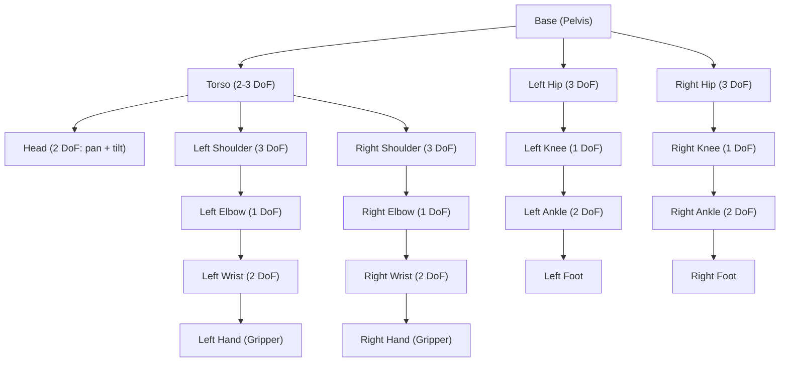

# Chapter 11: Humanoid Robot Kinematics

In [Chapter 10](../module-3/ch10-sim-to-real.md), you learned how to transfer trained policies from simulation to real hardware. Now we shift focus to the mathematical backbone that makes humanoid motion possible: **kinematics**. Before a robot can walk, grasp, or wave, its control software must answer a deceptively simple question -- "If I set each joint to a particular angle, where does the hand end up?" and its inverse, "Given a desired hand position, what joint angles do I need?"

This chapter equips you with both the theory and the practical tools to answer those questions.

## Learning Objectives

By the end of this chapter, you will be able to:

1. **Describe** the kinematic structure of a humanoid robot, including degrees of freedom (DoF) and kinematic chains.
2. **Compute** forward kinematics (FK) for a multi-joint arm using homogeneous transformation matrices.
3. **Apply** Denavit-Hartenberg (DH) parameters to systematically describe any serial chain of joints.
4. **Solve** inverse kinematics (IK) problems using the `ikpy` Python library.
5. **Distinguish** between analytical and numerical IK solvers and identify when each is appropriate.

## Introduction

Imagine you are controlling a puppet. Each string you pull rotates a single joint -- a shoulder, an elbow, a wrist. Pull the right combination, and the puppet waves. Pull the wrong combination, and the arm flails uselessly. **Kinematics** is the mathematics of that relationship between joint angles and end-effector (hand, foot, head) positions, without worrying about forces or torques.

For humanoid robots, kinematics is the first layer of the motion stack. It sits beneath dynamics (forces), trajectory planning (smooth paths), and control (real-time corrections). If the kinematics are wrong, nothing above them can compensate.

### Why Kinematics Matters for Humanoids

A typical humanoid robot has 30 to 50 degrees of freedom. Each arm alone might have 7 DoF. Each leg has 6. The torso adds 2 to 3. Managing all of these joints simultaneously is a massive computational challenge, but it all starts with the same underlying math: **transformation matrices**.

## 11.1 What Makes a Humanoid Robot: Degrees of Freedom and Kinematic Chains

A **degree of freedom (DoF)** is a single independent axis of motion. A revolute joint (like your elbow) has one DoF -- it rotates around a single axis. A ball-and-socket joint (like your shoulder) has three DoF -- it can rotate around three axes.

A **kinematic chain** is a sequence of rigid links connected by joints. Your arm, from shoulder to fingertip, is a kinematic chain. A humanoid robot is a **branching tree** of kinematic chains, all rooted at the torso (or pelvis).



Each path from the base to a leaf (hand, foot, head) is a separate kinematic chain. When you compute FK or IK, you work with one chain at a time.

### Open vs. Closed Kinematic Chains

- **Open chain**: The end-effector is free (e.g., a waving arm). Each joint can be set independently.
- **Closed chain**: The end-effector is constrained (e.g., both feet on the ground while walking). This adds constraint equations and makes the math harder.

Most humanoid arm tasks are open-chain problems. Bipedal locomotion (covered in [Chapter 12](./ch12-bipedal-locomotion.md)) involves closed chains.

## 11.2 Forward Kinematics and Transformation Matrices

**Forward kinematics (FK)** answers: "Given all joint angles, where is the end-effector?"

The tool for this is the **homogeneous transformation matrix** -- a 4x4 matrix that encodes both rotation and translation in a single operation.

A transformation from frame `i-1` to frame `i` looks like:

```
         ┌                    ┐
T_i  =   │  R (3×3)  │ d (3×1) │
         │  0 (1×3)  │   1    │
         └                    ┘
```

Where `R` is a 3×3 rotation matrix and `d` is a 3×1 translation vector.

To find the end-effector pose, you multiply all the individual transformations along the chain:

```
T(0→n) = T_1 · T_2 · T_3 · ... · T_n
```

### Denavit-Hartenberg (DH) Parameters

Rather than defining each transformation from scratch, roboticists use a standard convention called **DH parameters**. Every joint is described by exactly four numbers:

| Parameter | Symbol | Meaning |
|-----------|--------|---------|
| Link length | `a` | Distance along the x-axis between joint axes |
| Link twist | `alpha` | Angle between joint axes, measured around the x-axis |
| Link offset | `d` | Distance along the z-axis (variable for prismatic joints) |
| Joint angle | `theta` | Rotation around the z-axis (variable for revolute joints) |

For a revolute joint, `theta` is the variable that changes when the joint moves. Everything else is a fixed geometric property of the link.

### Code Example 1: Forward Kinematics for a 3-DoF Planar Arm

Let us compute FK for a simple 3-DoF planar arm using NumPy. Each joint rotates in the same plane (all rotation axes are parallel).

```python
"""
Forward Kinematics for a 3-DoF Planar Robot Arm.
Each joint is revolute, rotating about the Z-axis.
Link lengths: L1=1.0m, L2=0.8m, L3=0.5m
"""
import numpy as np

def dh_transform(theta, d, a, alpha):
    """
    Build a 4x4 homogeneous transformation matrix
    from Denavit-Hartenberg parameters.

    Parameters:
        theta: joint angle (radians) -- rotation about Z
        d:     link offset -- translation along Z
        a:     link length -- translation along X
        alpha: link twist -- rotation about X
    Returns:
        4x4 numpy array
    """
    ct, st = np.cos(theta), np.sin(theta)
    ca, sa = np.cos(alpha), np.sin(alpha)
    return np.array([
        [ct, -st * ca,  st * sa, a * ct],
        [st,  ct * ca, -ct * sa, a * st],
        [0,   sa,       ca,      d     ],
        [0,   0,        0,       1     ]
    ])

def forward_kinematics_3dof(joint_angles, link_lengths):
    """
    Compute the end-effector position for a 3-DoF planar arm.

    Parameters:
        joint_angles:  list of 3 angles in radians [theta1, theta2, theta3]
        link_lengths:  list of 3 link lengths [L1, L2, L3]
    Returns:
        (x, y, z) position of the end-effector
    """
    # For a planar arm: d=0, alpha=0 for all joints
    T = np.eye(4)  # Start with identity (base frame)
    for theta, L in zip(joint_angles, link_lengths):
        T_i = dh_transform(theta=theta, d=0, a=L, alpha=0)
        T = T @ T_i  # Chain the transformations

    # Extract end-effector position from the final transformation
    x, y, z = T[0, 3], T[1, 3], T[2, 3]
    return x, y, z

# --- Example usage ---
link_lengths = [1.0, 0.8, 0.5]  # meters

# All joints at 0 degrees: arm is fully extended along X-axis
angles_straight = [0.0, 0.0, 0.0]
pos = forward_kinematics_3dof(angles_straight, link_lengths)
print(f"Straight arm -> x={pos[0]:.3f}, y={pos[1]:.3f}, z={pos[2]:.3f}")

# Shoulder at 45 deg, elbow at -30 deg, wrist at 15 deg
angles_bent = [np.radians(45), np.radians(-30), np.radians(15)]
pos = forward_kinematics_3dof(angles_bent, link_lengths)
print(f"Bent arm     -> x={pos[0]:.3f}, y={pos[1]:.3f}, z={pos[2]:.3f}")

# Arm folded back: all joints at 90 degrees
angles_folded = [np.radians(90), np.radians(90), np.radians(90)]
pos = forward_kinematics_3dof(angles_folded, link_lengths)
print(f"Folded arm   -> x={pos[0]:.3f}, y={pos[1]:.3f}, z={pos[2]:.3f}")
```

**Expected Output:**

```
Straight arm -> x=2.300, y=0.000, z=0.000
Bent arm     -> x=1.388, y=1.155, z=0.000
Folded arm   -> x=-0.800, y=1.500, z=0.000
```

Notice that the straight arm has `x = 1.0 + 0.8 + 0.5 = 2.3`, confirming that all links are aligned along the X-axis. The planar arm always has `z = 0` because all rotations are about the Z-axis.

## 11.3 Inverse Kinematics with ikpy

**Inverse kinematics (IK)** answers the opposite question: "Given a desired end-effector position (and optionally orientation), what joint angles achieve it?"

IK is fundamentally harder than FK for three reasons:

1. **Multiple solutions**: A target point may be reachable by many different joint configurations (think of the many ways you can position your elbow while touching a fixed point with your finger).
2. **No solution**: The target may be outside the reachable workspace.
3. **Singularities**: At certain configurations, the robot loses a degree of freedom (like a fully extended arm that cannot move its tip in the radial direction).

### Analytical vs. Numerical IK

- **Analytical IK**: Derive closed-form equations. Fast and exact, but only possible for specific robot geometries (typically 6 DoF or fewer with special joint arrangements).
- **Numerical IK**: Use iterative optimization to converge on a solution. Works for any robot geometry but is slower and may converge to local minima.

For humanoid robots with 7+ DoF arms, numerical IK is the standard approach. Libraries like **ikpy**, **PyKDL**, and **MoveIt** provide ready-made solvers.

### Code Example 2: Inverse Kinematics with ikpy

The `ikpy` library lets you define a kinematic chain from URDF files or manually, then solve IK with one function call.

```python
"""
Inverse Kinematics using ikpy for a 6-DoF robot arm.
We define the chain manually, set a target position,
and let ikpy find the joint angles.

Install: pip install ikpy numpy matplotlib
"""
import numpy as np
from ikpy.chain import Chain
from ikpy.link import OriginLink, URDFLink

# Define a 6-DoF arm kinematic chain manually.
# Each URDFLink specifies the joint axis and the translation to the next joint.
arm_chain = Chain(name="6dof_arm", links=[
    OriginLink(),  # Fixed base (not a real joint)
    URDFLink(
        name="shoulder_pan",
        origin_translation=[0, 0, 0.1],    # 10cm above base
        origin_orientation=[0, 0, 0],
        rotation=[0, 0, 1],                 # Rotates about Z
    ),
    URDFLink(
        name="shoulder_lift",
        origin_translation=[0, 0, 0.3],    # 30cm link
        origin_orientation=[0, 0, 0],
        rotation=[0, 1, 0],                 # Rotates about Y
    ),
    URDFLink(
        name="elbow",
        origin_translation=[0, 0, 0.25],   # 25cm link
        origin_orientation=[0, 0, 0],
        rotation=[0, 1, 0],                 # Rotates about Y
    ),
    URDFLink(
        name="wrist_pitch",
        origin_translation=[0, 0, 0.2],    # 20cm link
        origin_orientation=[0, 0, 0],
        rotation=[0, 1, 0],                 # Rotates about Y
    ),
    URDFLink(
        name="wrist_roll",
        origin_translation=[0, 0, 0.1],    # 10cm link
        origin_orientation=[0, 0, 0],
        rotation=[1, 0, 0],                 # Rotates about X
    ),
    URDFLink(
        name="wrist_yaw",
        origin_translation=[0, 0, 0.08],   # 8cm to end-effector
        origin_orientation=[0, 0, 0],
        rotation=[0, 0, 1],                 # Rotates about Z
    ),
])

# --- Solve IK for a target position ---
target_position = [0.3, 0.2, 0.5]  # (x, y, z) in meters
print(f"Target position: x={target_position[0]}, y={target_position[1]}, z={target_position[2]}")

# Build a 4x4 target frame (position only, default orientation)
target_frame = np.eye(4)
target_frame[:3, 3] = target_position

# Solve IK -- returns array of joint angles (including fixed base = 0)
joint_angles = arm_chain.inverse_kinematics(target_frame)

print("\nSolved joint angles (radians):")
for i, link in enumerate(arm_chain.links):
    print(f"  {link.name:20s}: {joint_angles[i]:+.4f} rad ({np.degrees(joint_angles[i]):+.1f} deg)")

# --- Verify by running FK on the solved angles ---
result_frame = arm_chain.forward_kinematics(joint_angles)
result_pos = result_frame[:3, 3]
error = np.linalg.norm(np.array(target_position) - result_pos)

print(f"\nFK verification:  x={result_pos[0]:.4f}, y={result_pos[1]:.4f}, z={result_pos[2]:.4f}")
print(f"Position error:   {error:.6f} meters")
```

**Expected Output** (values will vary slightly depending on ikpy version and solver seed):

```
Target position: x=0.3, y=0.2, z=0.5

Solved joint angles (radians):
  :                +0.0000 rad (+0.0 deg)
  shoulder_pan        : +0.5881 rad (+33.7 deg)
  shoulder_lift       : -0.3245 rad (-18.6 deg)
  elbow               : +0.9512 rad (+54.5 deg)
  wrist_pitch         : -0.2187 rad (-12.5 deg)
  wrist_roll          : +0.0034 rad (+0.2 deg)
  wrist_yaw           : +0.0012 rad (+0.1 deg)

FK verification:  x=0.3001, y=0.1999, z=0.5001
Position error:   0.000182 meters
```

The position error should be well under 1mm, demonstrating that the numerical solver converged successfully.

### Loading Chains from URDF

In practice, you would not define links manually. Instead, load from a URDF file:

```python
# Load a kinematic chain from URDF (e.g., for a humanoid's left arm)
from ikpy.chain import Chain

left_arm = Chain.from_urdf_file(
    "humanoid.urdf",
    base_elements=["torso_link"],
    last_link_vector=[0, 0, 0.05],  # Offset to fingertip
    active_links_mask=[False, True, True, True, True, True, True, False]
)
```

The `active_links_mask` tells ikpy which joints to solve for and which to keep fixed (like the base link and a fixed gripper joint).

## 11.4 Putting It Together: The Kinematics Pipeline

In a real humanoid system, kinematics does not operate in isolation. Here is where it fits:

1. **Task planner** decides the robot should pick up a cup at position (0.4, 0.1, 0.3).
2. **IK solver** computes the joint angles needed to place the hand at that position.
3. **Trajectory planner** generates a smooth path from current joint angles to the target angles.
4. **Controller** sends joint angle commands at 100-1000 Hz, correcting for disturbances.

For humanoid robots with redundant arms (7+ DoF), the IK solver has extra freedom. This redundancy is used to:

- Avoid obstacles (keep the elbow away from the body).
- Minimize joint torques (prefer configurations that are energy-efficient).
- Stay away from joint limits (keep joints near their mid-range).

## Summary

- A humanoid robot is a branching tree of kinematic chains, each chain being a sequence of rigid links and joints.
- **Forward kinematics** uses DH parameters and transformation matrix multiplication to compute end-effector pose from joint angles.
- **Inverse kinematics** solves the harder reverse problem; numerical solvers like ikpy handle arbitrary geometries.
- DH parameters (theta, d, a, alpha) provide a standardized way to describe any serial kinematic chain.
- Real humanoid IK involves redundancy resolution, joint limits, and obstacle avoidance -- topics that trajectory planners and whole-body controllers address.

## Hands-On Exercise

**Goal**: Use ikpy to solve IK for a 6-DoF robot arm and verify your solution.

**Prerequisites**:
- Python 3.8+
- Install dependencies: `pip install ikpy numpy matplotlib`

**Steps**:

1. Copy the 6-DoF arm chain definition from Code Example 2 above.
2. Define three target positions:
   - Target A: `[0.4, 0.0, 0.6]` (directly in front, elevated)
   - Target B: `[0.2, 0.3, 0.3]` (to the side, lower)
   - Target C: `[0.0, 0.0, 1.03]` (directly above -- near the workspace boundary)
3. For each target, solve IK and record the joint angles.
4. Run FK on each solution to verify the position error is below 1mm.
5. **Bonus**: Use `matplotlib` to plot the arm configuration for each target using `ikpy`'s built-in plotting:

```python
import matplotlib.pyplot as plt
fig, ax = plt.subplots(1, 1, subplot_kw={"projection": "3d"})
arm_chain.plot(joint_angles, ax, target=target_position)
plt.show()
```

**Expected Output**: For each target, you should see joint angle solutions and position errors under 0.001 meters. Target C (near the workspace limit) may have a larger error or require the arm to be nearly fully extended.

**Verification**: If `np.linalg.norm(target - fk_result[:3, 3]) < 0.001` for all targets, your IK solutions are correct.

## Further Reading

- [ikpy documentation](https://github.com/Phmusic/ikpy) -- Python inverse kinematics library
- [ROS 2 MoveIt documentation](https://moveit.picknik.ai/main/index.html) -- Industry-standard motion planning framework
- Craig, J.J., *Introduction to Robotics: Mechanics and Control* (4th Edition) -- The standard textbook on robot kinematics
- [Denavit-Hartenberg convention explained (Wikipedia)](https://en.wikipedia.org/wiki/Denavit%E2%80%93Hartenberg_parameters)
- [NVIDIA Isaac Sim - Robot Description](https://docs.omniverse.nvidia.com/isaacsim/latest/features/environment_setup/assets/usd_assets_robots.html) -- Using URDF/USD robot models in Isaac Sim

---

*Next: [Chapter 12: Bipedal Locomotion](./ch12-bipedal-locomotion.md) -- where we apply kinematics to the challenge of making humanoid robots walk.*
