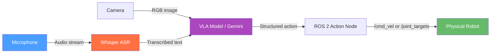

# Chapter 13: Conversational Robotics & VLA

## Learning Objectives

By the end of this chapter, you will be able to:

- **Explain** what Vision-Language-Action (VLA) models are and how they differ from traditional robot controllers.
- **Build** a Whisper-based ROS 2 node that transcribes voice commands in real time.
- **Integrate** the Gemini API to parse natural language commands into structured robot actions.
- **Design** a safety layer with command confirmation and fallback behaviors.
- **Implement** an end-to-end voice-to-motion pipeline: microphone → text → JSON action → Twist command.

---

## Introduction

In 2023, a team at Google DeepMind published RT-2: Robotic Transformer 2. They took a Vision-Language Model trained on internet-scale text and images, and fine-tuned it to also output robot actions. The result was a robot that could follow novel instructions it had never been explicitly trained for: "pick up the sushi" when there was no sushi in the training set, because the model already understood what sushi was from the internet.

This marked the beginning of a new paradigm in robotics: instead of programming robots with explicit rules for every situation, you ground language models in the physical world, and they bring everything they know about the world to bear on robot control.

In this chapter, you will build a simpler but complete version of this idea: a robot that listens to your voice, uses Whisper to transcribe what you said, sends that text to the Gemini API to determine what action to take, and then executes that action by publishing to ROS 2 topics. This is conversational robotics — a robot you can talk to.

---

## Vision-Language-Action Models

A **Vision-Language-Action (VLA) model** is a neural network that takes visual observations (camera frames) and language instructions as input, and outputs robot actions (joint positions or velocity commands) as output.

The key insight is that language and vision share deep structure. Words like "grasp," "push," and "stack" correspond to visual patterns and physical affordances that a model trained on internet data has implicitly learned. By fine-tuning on robot demonstrations, these associations can be connected to actual robot motions.

### Notable VLA Models

| Model | Organization | Input | Output |
|-------|-------------|-------|--------|
| RT-2 | Google DeepMind | Image + text | End-effector commands |
| OpenVLA | Stanford | Image + text | Joint deltas |
| π0 (Pi Zero) | Physical Intelligence | Multi-image + text | Joint positions |
| RoboFlamingo | ByteDance | Multi-image + text | EE trajectory |

### The VLA Pipeline



In this chapter, we use Gemini as the language reasoning component (handling text commands) instead of a full VLA model, which provides an accessible entry point. The architecture is identical — you can swap in a full VLA model when you have the compute.

---

## Speech Recognition with Whisper

**OpenAI Whisper** is an open-source automatic speech recognition (ASR) model that runs locally, with no API calls required. It supports 99 languages and runs on CPU (slowly) or GPU (in real time).

We use `faster-whisper` — a community-maintained reimplementation that runs 4-8× faster than the original with the same model weights.

### Installing faster-whisper

```bash
pip install faster-whisper sounddevice numpy
```

### Whisper ROS 2 Node

```python
# File: ~/ros2_ws/src/conversational_robotics/conversational_robotics/whisper_node.py
# Records audio from microphone and publishes transcribed text to /voice_command.

import rclpy
from rclpy.node import Node
from std_msgs.msg import String
import sounddevice as sd     # pip install sounddevice
import numpy as np
import threading
from faster_whisper import WhisperModel  # pip install faster-whisper

class WhisperNode(Node):
    """
    Continuously listens for voice input and publishes transcriptions.
    Uses faster-whisper for CPU-efficient speech recognition.
    """

    SAMPLE_RATE = 16000   # Whisper requires 16 kHz audio
    CHUNK_SECONDS = 3     # Record 3-second chunks and transcribe each
    MODEL_SIZE = 'tiny'   # Use 'base' or 'small' for better accuracy

    def __init__(self):
        super().__init__('whisper_node')

        # Load the Whisper model (downloads ~39MB for 'tiny' on first run)
        self.get_logger().info(f'Loading Whisper model ({self.MODEL_SIZE})...')
        self.model = WhisperModel(
            self.MODEL_SIZE,
            device='cpu',           # Change to 'cuda' if GPU available
            compute_type='int8'     # int8 quantization for CPU speed
        )
        self.get_logger().info('Whisper model loaded.')

        # Publisher: sends transcribed text to /voice_command topic
        self.publisher = self.create_publisher(String, '/voice_command', 10)

        # Start recording in a background thread (non-blocking)
        self.running = True
        self.thread = threading.Thread(target=self.record_loop, daemon=True)
        self.thread.start()
        self.get_logger().info(
            f'Listening for voice commands ({self.CHUNK_SECONDS}s chunks)...'
        )

    def record_loop(self):
        """Background thread: continuously record audio and transcribe."""
        while self.running:
            # Record audio chunk
            samples = sd.rec(
                int(self.CHUNK_SECONDS * self.SAMPLE_RATE),
                samplerate=self.SAMPLE_RATE,
                channels=1,
                dtype='float32'
            )
            sd.wait()  # Block until recording is complete

            # Flatten from [N, 1] to [N]
            audio = samples.flatten()

            # Transcribe with Whisper (returns generator of Segment objects)
            segments, info = self.model.transcribe(
                audio,
                language='en',          # Force English for faster inference
                beam_size=1,            # Greedy decoding (fastest)
                vad_filter=True,        # Skip silent segments
                vad_parameters={'min_silence_duration_ms': 500}
            )

            # Collect all text segments
            text = ' '.join(segment.text.strip() for segment in segments)

            # Only publish if non-empty and not just noise
            if text and len(text) > 3:
                self.get_logger().info(f'Transcribed: "{text}"')
                msg = String()
                msg.data = text
                self.publisher.publish(msg)

    def destroy_node(self):
        self.running = False
        super().destroy_node()


def main(args=None):
    rclpy.init(args=args)
    node = WhisperNode()
    rclpy.spin(node)
    node.destroy_node()
    rclpy.shutdown()
```

---

## Code Example: Gemini Action Planner

The Gemini planner receives transcribed text and returns a structured JSON action that the robot can execute.

```python
# File: ~/ros2_ws/src/conversational_robotics/conversational_robotics/gemini_planner.py
# Converts voice command text to structured robot actions using Gemini API.

import rclpy
from rclpy.node import Node
from std_msgs.msg import String
from geometry_msgs.msg import Twist
import google.generativeai as genai  # pip install google-generativeai
import json
import os

# System prompt: defines what Gemini should do and what output format it should use
SYSTEM_PROMPT = """You are a robot action planner.
Given a voice command, respond ONLY with a JSON object in this exact format:
{
  "action": "navigate|rotate|stop|pick|place|greet|unknown",
  "direction": "forward|backward|left|right|null",
  "speed": 0.1 to 1.0,
  "duration_seconds": 1 to 10,
  "target": "object or location name or null",
  "confidence": 0.0 to 1.0,
  "explanation": "brief reasoning"
}

Examples:
- "move forward slowly" -> {"action":"navigate","direction":"forward","speed":0.2,...}
- "turn left" -> {"action":"rotate","direction":"left","speed":0.5,...}
- "stop" -> {"action":"stop","direction":null,"speed":0.0,...}
- "pick up the cup" -> {"action":"pick","target":"cup","speed":0.3,...}
Do not include any text outside the JSON object."""

class GeminiPlannerNode(Node):
    """
    Subscribes to /voice_command, calls Gemini API to parse the command,
    and publishes velocity commands to /cmd_vel.
    """

    def __init__(self):
        super().__init__('gemini_planner')

        # Parameter: Gemini API key (set via environment variable)
        api_key = os.environ.get('GEMINI_API_KEY', '')
        if not api_key:
            self.get_logger().error(
                'GEMINI_API_KEY environment variable not set! '
                'Export it: export GEMINI_API_KEY=your_key_here'
            )

        # Configure Gemini
        genai.configure(api_key=api_key)
        self.model = genai.GenerativeModel(
            model_name='gemini-2.0-flash',
            system_instruction=SYSTEM_PROMPT
        )

        # Subscribe to transcribed voice commands
        self.voice_sub = self.create_subscription(
            String, '/voice_command', self.command_callback, 10
        )

        # Publishers
        self.cmd_pub = self.create_publisher(Twist, '/cmd_vel', 10)
        self.response_pub = self.create_publisher(String, '/robot_response', 10)

        self.get_logger().info('Gemini planner ready. Waiting for voice commands...')

    def command_callback(self, msg: String):
        """Called when a new transcribed voice command arrives."""
        text = msg.data
        self.get_logger().info(f'Processing command: "{text}"')

        try:
            # Send to Gemini for parsing
            response = self.model.generate_content(text)
            response_text = response.text.strip()

            # Parse the JSON response
            action = json.loads(response_text)
            self.get_logger().info(f'Gemini response: {action}')

            # Safety check: ignore low-confidence commands
            if action.get('confidence', 0) < 0.5:
                self.get_logger().warn(
                    f'Low confidence ({action["confidence"]:.2f}), ignoring command.'
                )
                return

            # Execute the action
            self.execute_action(action)

        except json.JSONDecodeError as e:
            self.get_logger().error(f'Gemini returned invalid JSON: {e}')
        except Exception as e:
            self.get_logger().error(f'Gemini API error: {e}')

    def execute_action(self, action: dict):
        """Convert a parsed action dict to ROS 2 commands."""
        cmd = Twist()  # Default: all zeros (stopped)

        action_type = action.get('action', 'unknown')
        direction = action.get('direction', 'null')
        speed = float(action.get('speed', 0.3))

        if action_type == 'navigate':
            if direction == 'forward':
                cmd.linear.x = speed
            elif direction == 'backward':
                cmd.linear.x = -speed
            elif direction == 'left':
                cmd.linear.x = speed * 0.5
                cmd.angular.z = speed
            elif direction == 'right':
                cmd.linear.x = speed * 0.5
                cmd.angular.z = -speed

        elif action_type == 'rotate':
            if direction == 'left':
                cmd.angular.z = speed
            elif direction == 'right':
                cmd.angular.z = -speed

        elif action_type == 'stop':
            pass  # cmd is already all zeros

        elif action_type == 'greet':
            # A simple greeting: rotate in place briefly
            cmd.angular.z = 1.0
            self.cmd_pub.publish(cmd)
            import time; time.sleep(1.0)
            cmd.angular.z = 0.0

        self.cmd_pub.publish(cmd)

        # Publish explanation as robot speech response
        explanation = action.get('explanation', '')
        if explanation:
            response_msg = String()
            response_msg.data = explanation
            self.response_pub.publish(response_msg)
            self.get_logger().info(f'Robot: {explanation}')


def main(args=None):
    rclpy.init(args=args)
    node = GeminiPlannerNode()
    rclpy.spin(node)
    node.destroy_node()
    rclpy.shutdown()
```

**Setup**:
```bash
pip install google-generativeai
export GEMINI_API_KEY=your_api_key_here
```

---

## Safety: Command Confirmation and Fallbacks

Conversational robots must handle ambiguous or dangerous commands gracefully. Three safety patterns:

### 1. Confidence Threshold
Ignore commands where the planner's confidence is below a threshold (shown above: `confidence < 0.5`). This prevents acting on misheard or ambiguous speech.

### 2. Command Confirmation for Irreversible Actions
For actions that cannot be undone — moving at high speed, opening a valve, releasing a held object — require a spoken confirmation:

```python
# Pattern: require "confirm" before executing high-consequence actions
if action_type in ['pick', 'place'] and action.get('speed', 0) > 0.8:
    self.get_logger().warn('High-speed manipulation: say "confirm" to proceed.')
    self.pending_action = action
    return  # Don't execute yet
```

### 3. Emergency Stop on "Stop" or "Cancel"
Always implement a hard stop that overrides all pending commands:

```python
# In command_callback, check for stop words before calling Gemini
stop_words = {'stop', 'halt', 'cancel', 'emergency', 'abort'}
if any(word in text.lower() for word in stop_words):
    self.cmd_pub.publish(Twist())  # Publish zero velocity immediately
    self.get_logger().warn('EMERGENCY STOP triggered by voice command.')
    return
```

---

## Summary

In this chapter, you learned:

- **VLA models** ground language understanding in robot actions, enabling novel instruction following without task-specific programming.
- **Whisper** provides CPU-capable, open-source speech recognition that runs locally without API calls — critical for real-time robot use.
- The **Gemini API** can parse natural language commands into structured JSON actions using a carefully designed system prompt.
- The complete pipeline is: **microphone → Whisper → text → Gemini → JSON → ROS 2 → robot motion**.
- Safety requires **confidence thresholds**, **command confirmation** for high-consequence actions, and **emergency stop** that bypasses the AI pipeline.

---

## Hands-On Exercise: Voice-Commanded Robot

**Time estimate**: 45–60 minutes

**Prerequisites**:
- Gemini API key ([Google AI Studio](https://aistudio.google.com/app/apikey))
- ROS 2 Humble installed ([Appendix A2](../appendices/a2-software-installation.md))
- Microphone connected
- Chapter 4 (Nodes & Topics) completed

### Steps

1. **Install dependencies**:
   ```bash
   pip install faster-whisper sounddevice google-generativeai
   ```

2. **Create the ROS 2 package**:
   ```bash
   cd ~/ros2_ws/src
   ros2 pkg create conversational_robotics \
       --build-type ament_python \
       --dependencies rclpy std_msgs geometry_msgs
   ```

3. **Create both nodes** — save `whisper_node.py` and `gemini_planner.py` from this chapter.

4. **Update `setup.py`** with entry points for both nodes.

5. **Build**:
   ```bash
   cd ~/ros2_ws
   colcon build --packages-select conversational_robotics
   source install/setup.bash
   ```

6. **Set your API key** and run:
   ```bash
   export GEMINI_API_KEY=your_key_here

   # Terminal 1: voice recognition
   ros2 run conversational_robotics whisper_node

   # Terminal 2: action planning
   ros2 run conversational_robotics gemini_planner
   ```

7. **Test with voice**: Say "move forward slowly" and verify:
   ```bash
   ros2 topic echo /cmd_vel
   ```
   Expected: `linear: x: 0.2` appearing within 5 seconds

### Verification

```bash
# Publish a test command manually (without microphone):
ros2 topic pub --once /voice_command std_msgs/msg/String "data: 'move forward slowly'"
# Then check:
ros2 topic echo /cmd_vel --once
```

---

## Further Reading

- **Previous**: [Chapter 12: Bipedal Locomotion](ch12-bipedal-locomotion.md) — walking controllers
- **Next**: [Capstone: Autonomous Humanoid](../capstone/ch14-autonomous-humanoid.md) — integrating all modules
- **Related**: [Chapter 1: Physical AI Introduction](../module-1/ch01-intro-physical-ai.md) — why language + robotics matters

**Official documentation**:
- [Gemini API documentation](https://ai.google.dev/gemini-api/docs)
- [faster-whisper on GitHub](https://github.com/SYSTRAN/faster-whisper)
- [RT-2 paper (Google DeepMind)](https://robotics-transformer2.github.io/)
- [OpenVLA (Stanford)](https://openvla.github.io/)
