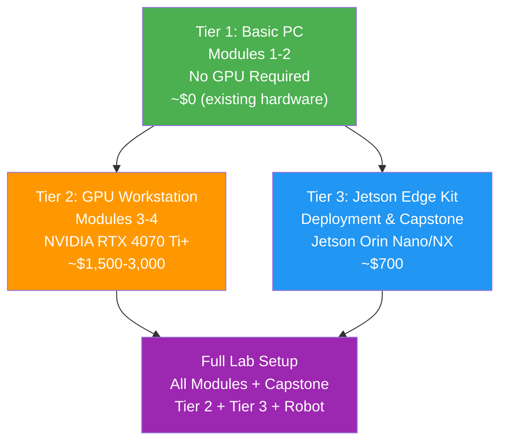

# ضمیمہ الف: ہارڈ ویئر سیٹ اپ گائیڈ

## جائزہ (Overview)

<div dir="rtl">

یہ ضمیمہ آپ کو اس ہارڈ ویئر (Hardware) سے آگاہ کرتا ہے جس کی آپ کو اس درسی کتاب کے ہر ماڈیول (Module) پر عمل کرنے کے لیے ضرورت ہوگی۔ ہر کسی کو ایک ہی سامان کی ضرورت نہیں ہوتی -- یہ کورس **تین ہارڈ ویئر ٹیئرز (Hardware Tiers)** کے ساتھ ڈیزائن کیا گیا ہے تاکہ آپ حصہ لے سکیں چاہے آپ کے پاس ایک بنیادی لیپ ٹاپ (Laptop) ہو یا مکمل طور پر لیس روبوٹکس لیب (Robotics Lab)۔

**کس کو اس کی ضرورت ہے:** ہر پڑھنے والے کو باب 1 شروع کرنے سے پہلے اس ضمیمے کا جائزہ لینا چاہیے تاکہ یہ سمجھ سکے کہ کون سا ہارڈ ویئر ٹیئر ان پر لاگو ہوتا ہے۔

**متوقع وقت:** جائزہ لینے کے لیے 30 منٹ؛ ہارڈ ویئر کی خریداری کا وقت مختلف ہو سکتا ہے۔

</div>

## پیشگی ضروریات (Prerequisites)

<div dir="rtl">

*   اپنے سیٹ اپ کے لیے بجٹ کا تخمینہ (نیچے ٹیئر ٹیبل دیکھیں)
*   کمپیوٹر کی تفصیلات (سی پی یو (CPU)، جی پی یو (GPU)، ریم (RAM)) سے بنیادی واقفیت
*   خریداری اور ڈاؤن لوڈنگ کے لیے انٹرنیٹ تک رسائی

</div>

## A.1 ہارڈ ویئر ٹیئر کا جائزہ (Hardware Tier Overview)

<div dir="rtl">

کورس اس طرح ترتیب دیا گیا ہے کہ ابتدائی ماڈیولز (1-2 ماڈیولز) کو صرف ایک معیاری کمپیوٹر کی ضرورت ہوتی ہے، جبکہ بعد کے ماڈیولز (3-4 ماڈیولز) این ویڈیا جی پی یو ہارڈ ویئر (NVIDIA GPU Hardware) سے نمایاں طور پر فائدہ اٹھاتے ہیں۔ درج ذیل خاکہ تین ٹیئرز (Tiers) کی وضاحت کرتا ہے۔

</div>



### ٹیئر کا خلاصہ جدول (Tier Summary Table)

| ٹیئر | کیا شامل ہے | جی پی یو (GPU) کی ضرورت ہے | متوقع لاگت | یہ کس کے لیے ہے |
| :----------------------- | :---------------------------------- | :-------------------------------- | :--------------- | :------------------------------------------ |
| **ٹیئر 1: بنیادی پی سی (Basic PC)** | ماڈیولز 1-2 (آر او ایس 2 (ROS 2)، گزیبو (Gazebo) بنیادی باتیں) | نہیں | $0 (موجودہ ہارڈ ویئر) | ابتدائی، صرف سافٹ ویئر سیکھنے والے |
| **ٹیئر 2: جی پی یو ورک سٹیشن (GPU Workstation)** | ماڈیولز 3-4 (آئزک سم (Isaac Sim)، وی ایل اے (VLA)) | ہاں (این ویڈیا آر ٹی ایکس (NVIDIA RTX)) | $1,500--$3,000 | آئزک سم مقامی طور پر چلانے والے طلباء |
| **ٹیئر 3: جیٹسن ایج کٹ (Jetson Edge Kit)** | تعیناتی، کیپ اسٹون (Capstone) | جیٹسن اورن (Jetson Orin) بلٹ ان | ~$700 | ایج اے آئی (Edge AI) تعیناتی کی مشق |

## A.2 ٹیئر 1: بنیادی پی سی (Basic PC) (ماڈیولز 1-2)

<div dir="rtl">

پہلے دو ماڈیولز کے لیے، آپ آر او ایس 2 (ROS 2) اور بنیادی گزیبو سمولیشن (Gazebo Simulation) کے ساتھ کام کریں گے۔ ان کے لیے جی پی یو (GPU) کی ضرورت نہیں ہوتی۔

</div>

### کم از کم ضروریات (Minimum Requirements)

| جزو | کم از کم تفصیلات | تجویز کردہ |
| :---------- | :------------------------------------ | :------------------------------------ |
| **سی پی یو (CPU)** | Intel Core i5 (8th Gen+) or AMD Ryzen 5 | Intel Core i7 (12th Gen+) or AMD Ryzen 7 |
| **ریم (RAM)** | 8 GB | 16 GB |
| **سٹوریج** | 50 GB مفت (SSD کو ترجیح دی جاتی ہے) | 100 GB مفت SSD |
| **او ایس (OS)** | Ubuntu 22.04 LTS | Ubuntu 22.04 LTS |
| **نیٹ ورک (Network)** | براڈ بینڈ انٹرنیٹ | وائرڈ ایتھرنیٹ (Ethernet) کو ترجیح دی جاتی ہے |

:::tip ونڈوز اور میک او ایس (macOS) صارفین
<div dir="rtl">

اگر آپ ونڈوز 10/11 پر ہیں، تو آپ ڈوئل بوٹنگ (dual-booting) کے بغیر اوبنٹو 22.04 چلانے کے لیے **ڈبلیو ایس ایل ٹو (WSL2)** (ونڈوز سب سسٹم فار لینکس) استعمال کر سکتے ہیں۔ ڈبلیو ایس ایل ٹو سیٹ اپ ہدایات کے لیے [ضمیمہ ب: سافٹ ویئر انسٹالیشن گائیڈ](./a2-software-installation.md) دیکھیں۔ میک او ایس (macOS) صارفین ڈوکر (Docker) پر مبنی آر او ایس 2 سیٹ اپس استعمال کر سکتے ہیں، لیکن مقامی اوبنٹو کو سختی سے تجویز کیا جاتا ہے۔

</div>
:::

### اوبنٹو (Ubuntu) پر اپنے ہارڈ ویئر کی تصدیق (Verifying Your Hardware)

<div dir="rtl">

ایک ٹرمینل کھولیں اور اپنے سسٹم کو چیک کرنے کے لیے درج ذیل کمانڈز چلائیں۔

</div>

```bash
# Check CPU info
lscpu | grep "Model name"
```

Expected output:
```
Model name:   Intel(R) Core(TM) i7-12700H
```

```bash
# Check available RAM
free -h | grep Mem
```

Expected output:
```
Mem:            15Gi       4.2Gi       8.1Gi       0.3Gi       3.4Gi      10.7Gi
```

```bash
# Check available disk space
df -h / | tail -1
```

Expected output:
```
/dev/sda1       234G   45G  177G  21% /
```

## A.3 ٹیئر 2: جی پی یو ورک سٹیشن (GPU Workstation) (ماڈیولز 3-4)

<div dir="rtl">

این ویڈیا آئزک سم (NVIDIA Isaac Sim) ایک اومنیورس (Omniverse) ایپلیکیشن ہے جس کے لیے **آر ٹی ایکس رے ٹریسنگ (RTX ray-tracing)** کی صلاحیتوں کی ضرورت ہوتی ہے۔ معیاری انٹیگریٹڈ گرافکس یا غیر-این ویڈیا جی پی یوز کام نہیں کریں گے۔

</div>

### تجویز کردہ تفصیلات (Recommended Specifications)

| جزو | کم از کم تفصیلات | مثالی تفصیلات |
| :---------- | :-------------------------- | :--------------------------- |
| **جی پی یو (GPU)** | NVIDIA RTX 4070 Ti (12 GB VRAM) | NVIDIA RTX 3090 / 4090 (24 GB VRAM) |
| **سی پی یو (CPU)** | Intel Core i7 (13th Gen+) or AMD Ryzen 9 | Intel Core i9 or AMD Ryzen 9 7950X |
| **ریم (RAM)** | 32 GB DDR5 | 64 GB DDR5 |
| **سٹوریج** | 256 GB SSD مفت | 512 GB NVMe SSD مفت |
| **او ایس (OS)** | Ubuntu 22.04 LTS | Ubuntu 22.04 LTS |
| **ڈسپلے** | 1920x1080 | ڈوئل مانیٹر (Monitor) تجویز کردہ |

:::caution 64 جی بی ریم (RAM) کیوں تجویز کی جاتی ہے
<div dir="rtl">

آئزک سم (Isaac Sim) پیچیدہ یو ایس ڈی (USD) (یونیورسل سین ڈسکرپشن) اثاثے فزکس سمولیشن (Physics Simulation) اور اے آئی انفرنس (AI inference) کے ساتھ میموری میں لوڈ کرتا ہے۔ 32 جی بی کے ساتھ، آپ کو پیچیدہ ہیومنائیڈ (Humanoid) مناظر کے دوران کریشز (crashes) کا سامنا کرنا پڑ سکتا ہے۔ اگر بجٹ تنگ ہے، تو 32 جی بی سے شروع کریں اور بعد میں مزید شامل کریں۔

</div>
:::

### اپنے این ویڈیا (NVIDIA) جی پی یو (GPU) کی تصدیق (Verifying Your NVIDIA GPU)

```bash
# Check if NVIDIA driver is installed and GPU is detected
nvidia-smi
```

Expected output (example with RTX 4070 Ti):
```
+-----------------------------------------------------------------------------+
| NVIDIA-SMI 535.183.01   Driver Version: 535.183.01   CUDA Version: 12.2     |
|-------------------------------+----------------------+----------------------+
| GPU  Name        Persistence-M| Bus-Id        Disp.A | Volatile Uncorr. ECC |
| Fan  Temp  Perf  Pwr:Usage/Cap|         Memory-Usage | GPU-Util  Compute M. |
|===============================+======================+======================|
|   0  NVIDIA GeForce ...  Off  | 00000000:01:00.0  On |                  N/A |
|  0%   38C    P8    12W / 285W |    512MiB / 12288MiB |      2%      Default |
+-------------------------------+----------------------+----------------------+
```

<div dir="rtl">

اگر `nvidia-smi` ایرر (error) واپس کرتا ہے، تو آپ کو این ویڈیا ڈرائیورز (NVIDIA drivers) انسٹال کرنے کی ضرورت ہے۔ ڈرائیور کی تنصیب کے لیے [ضمیمہ ب](./a2-software-installation.md) دیکھیں۔

</div>

```bash
# Check VRAM amount
nvidia-smi --query-gpu=memory.total --format=csv,noheader
```

Expected output:
```
12288 MiB
```

<div dir="rtl">

آئزک سم (Isaac Sim) کے لیے آپ کو کم از کم 12 جی بی (12288 MiB) وی ریم (VRAM) کی ضرورت ہے۔

</div>

## A.4 ٹیئر 3: این ویڈیا جیٹسن ایج کٹ (NVIDIA Jetson Edge Kit)

<div dir="rtl">

جیٹسن اورن (Jetson Orin) روبوٹکس تعیناتی کے لیے صنعت کا معیاری ایج اے آئی پلیٹ فارم ہے۔ آپ اسے کیپ اسٹون (Capstone) میں اور سم-ٹو-ریل (sim-to-real) منتقلی کی مشقوں کے لیے استعمال کریں گے۔

</div>

### اکنامی سٹوڈنٹ کٹ (Economy Student Kit) (~$700)

| جزو | ماڈل | تقریباً قیمت | مقصد |
| :------------ | :------------------------------------------- | :------------ | :----------------------------------------- |
| **برین** | این ویڈیا جیٹسن اورن نینو سپر ڈویلپمنٹ کٹ (NVIDIA Jetson Orin Nano Super Dev Kit) (8 GB) | $249 | 40 ٹاپس (TOPS) اے آئی انفرنس، آر او ایس 2 (ROS 2) چلاتا ہے |
| **آئز** | انٹیل ریل سینس ڈی 435 آئی (Intel RealSense D435i) | $349 | آر جی بی (RGB) + ڈیپتھ کیمرہ (Depth camera) بلٹ ان آئی ایم یو (IMU) کے ساتھ |
| **ایئرز** | ری اسپیکر یو ایس بی مائیک ایرے وی 2.0 (ReSpeaker USB Mic Array v2.0) | $69 | وائس کمانڈز کے لیے فار-فیلڈ مائیکروفون |
| **سٹوریج** | 128 GB ہائی-اینڈیورنس مائیکرو ایس ڈی (microSD) | $30 | او ایس (OS) اور ایپلیکیشن سٹوریج |
| **کل** | | **~$700** | |

:::tip ڈی 435 آئی (D435i) خریدیں، ڈی 435 (D435) نہیں۔
<div dir="rtl">

انٹیل ریل سینس D435**i** پر "i" کا لاحقہ کا مطلب ہے کہ اس میں ایک انرشیل میژرمنٹ یونٹ (IMU) (Inertial Measurement Unit) شامل ہے۔ ماڈیول 3 میں ویژول سلام (Visual SLAM) کی مشقوں کے لیے آئی ایم یو (IMU) ضروری ہے۔ غیر "i" ورژن میں یہ سینسر (Sensor) موجود نہیں ہوتا۔

</div>
:::

### اختیاری: جیٹسن اورن این ایکس (Jetson Orin NX) اپ گریڈ (Upgrade)

<div dir="rtl">

اگر آپ کا بجٹ اجازت دیتا ہے، تو **جیٹسن اورن این ایکس (Jetson Orin NX) (16 جی بی)** زیادہ وی ریم (VRAM) اور کمپیوٹ (Compute) (100 ٹاپس بمقابلہ 40 ٹاپس) فراہم کرتا ہے، جس سے آپ ڈیوائس پر بڑے پرسیپشن ماڈلز (Perception Models) چلا سکتے ہیں۔

</div>

## A.5 اختیاری روبوٹ ہارڈ ویئر (Robot Hardware)

<div dir="rtl">

فزیکل روبوٹس (Physical Robots) اس کورس کے لیے اختیاری ہیں -- تمام مشقیں سمولیشن (Simulation) میں مکمل کی جا سکتی ہیں۔ تاہم، اگر آپ حقیقی ہارڈ ویئر کے ساتھ عملی تجربہ چاہتے ہیں، تو یہاں تجویز کردہ آپشنز (Options) ہیں۔

</div>

### آپشن اے: موبائل روبوٹ (Mobile Robot) (بجٹ کے موافق)

<div dir="rtl">

*   **ٹرٹل بوٹ 3 برگر (TurtleBot3 Burger)** (~$550): ایک چھوٹا ڈیفرینشل ڈرائیو روبوٹ (differential-drive robot) ہے جس میں بہترین آر او ایس 2 (ROS 2) سپورٹ ہے۔ نیویگیشن مشقوں (Nav2) کے لیے مثالی ہے۔ اس میں 360-ڈگری لیڈار (LiDAR) اور ایک اوپن سی آر (OpenCR) کنٹرولر بورڈ شامل ہے۔
*   **ٹرٹل بوٹ 3 وافل پائی (TurtleBot3 Waffle Pi)** (~$1,800): ڈیپتھ پرسیپشن (depth perception) کے لیے ایک انٹیل ریل سینس (Intel RealSense) کیمرہ (Camera) شامل کرتا ہے۔

</div>

### آپشن بی: روبوٹک آرم (Robotic Arm)

<div dir="rtl">

*   **یونیورسل روبوٹس یو آر 5 ای (Universal Robots UR5e)** (صنعتی، ~$35,000): صنعت کا معیاری 6-ڈی او ایف (DOF) آرم (Arm) ہے جس میں ایک موو اِٹ 2 (MoveIt 2) ڈرائیور ہے۔ کئی یونیورسٹی لیبز (University Labs) میں دستیاب ہے۔
*   **مائی کوبوٹ 280 (MyCobot 280)** (~$600): آر او ایس 2 (ROS 2) سپورٹ کے ساتھ ایک بجٹ 6-ڈی او ایف ڈیسک ٹاپ آرم (Desktop Arm)۔ مینیپولیشن (Manipulation) مشقوں کے لیے موزوں ہے۔

</div>

### آپشن سی: ہیومنائیڈ روبوٹ (Humanoid Robot)

<div dir="rtl">

*   **یونٹری جی 1 (Unitree G1)** (~$16,000): آر او ایس 2 ایس ڈی کے (ROS 2 SDK) سپورٹ کے ساتھ سب سے زیادہ قابل رسائی مکمل ہیومنائیڈ روبوٹس میں سے ایک۔
*   **ہائی ونڈر ٹونی پائی پرو (Hiwonder TonyPi Pro)** (~$600): کائینیٹکس (Kinematics) کے تجربات کے لیے ایک چھوٹا ہیومنائیڈ۔ نوٹ کریں کہ یہ راسبیری پائی (Raspberry Pi) پر چلتا ہے اور آئزک آر او ایس (Isaac ROS) نہیں چلا سکتا -- اسے صرف واکنگ کائینیٹکس (Walking Kinematics) کے لیے استعمال کریں۔

</div>

### وی ایل اے (VLA) (ماڈیول 4) کے لیے پیریفرل ضروریات (Peripheral Requirements)

<div dir="rtl">

ویژن-لینگویج-ایکشن ماڈیول کے لیے، آپ کو درج ذیل کی ضرورت ہوگی:

</div>

| پیریفرل | مقصد | کم از کم تفصیلات |
| :------------ | :------------------------------- | :------------------------------------ |
| **ویب کیم (Webcam)** | وی ایل اے ماڈلز کے لیے بصری ان پٹ | 720p USB ویب کیم (Logitech C270 or similar) |
| **مائیکروفون (Microphone)** | وسپر (Whisper) کے ذریعے صوتی کمانڈز | کوئی بھی USB مائیکروفون؛ فار-فیلڈ کے لیے ری اسپیکر (ReSpeaker) |
| **سپیکر (Speaker)** | کنورسیشنل روبوٹکس (Conversational Robotics) کے لیے آڈیو آؤٹ پٹ | کوئی بھی 3.5mm یا USB سپیکر |

## تصدیق (Verification)

<div dir="rtl">

اپنے ہارڈ ویئر کے تیار ہونے کی تصدیق کرنے کے لیے درج ذیل چیک لسٹ (checklist) کو چلائیں۔

</div>

```bash
# 1. Check OS version (should be Ubuntu 22.04)
lsb_release -a 2>/dev/null | grep Description
```

Expected output:
```
Description:    Ubuntu 22.04.4 LTS
```

```bash
# 2. Check CPU meets minimum (4+ cores)
nproc
```

Expected output (should be 4 or higher):
```
8
```

```bash
# 3. Check RAM (should be 8 GB minimum)
free -h | awk '/Mem:/{print $2}'
```

Expected output:
```
15Gi
```

```bash
# 4. Check GPU (Tier 2 only)
nvidia-smi --query-gpu=name,memory.total --format=csv,noheader 2>/dev/null || echo "No NVIDIA GPU detected (OK for Tier 1)"
```

Expected output (Tier 2):
```
NVIDIA GeForce RTX 4070 Ti, 12288 MiB
```

Expected output (Tier 1):
```
No NVIDIA GPU detected (OK for Tier 1)
```

## خرابیوں کا ازالہ (Troubleshooting)

### مسئلہ 1: `nvidia-smi` کمانڈ نہیں ملی

<div dir="rtl">

**وجہ:** این ویڈیا ڈرائیورز (NVIDIA drivers) انسٹال نہیں ہیں۔

**حل:**

</div>

```bash
sudo apt update
sudo apt install -y nvidia-driver-535
sudo reboot
```

<div dir="rtl">

ری بوٹ کے بعد، `nvidia-smi` دوبارہ چلائیں۔ اگر یہ پھر بھی ناکام ہوتا ہے، تو چیک کریں کہ آپ کا جی پی یو جسمانی طور پر صحیح طریقے سے بیٹھا ہوا ہے اور سیکیور بوٹ (Secure Boot) بائیو ایس (BIOS) میں غیر فعال ہے۔

</div>

### مسئلہ 2: آئزک سم (Isaac Sim) کے لیے ناکافی ڈسک اسپیس

<div dir="rtl">

**وجہ:** آئزک سم کو انسٹالیشن کے لیے تقریباً 30 جی بی ڈسک اسپیس کی ضرورت ہوتی ہے، نیز یو ایس ڈی (USD) اثاثوں کے لیے اضافی جگہ۔

**حل:**

</div>

```bash
# Check disk usage and identify large files
du -sh /home/$USER/* | sort -rh | head -10
```

<div dir="rtl">

جگہ خالی کریں یا ایک بیرونی ایس ایس ڈی (SSD) شامل کریں۔ آئزک سم کو کسٹم انسٹالیشن پاتھ (custom installation path) کی وضاحت کر کے ایک بیرونی ڈرائیو پر انسٹال کیا جا سکتا ہے۔

</div>

### مسئلہ 3: جیٹسن (Jetson) پر انٹیل ریل سینس (Intel RealSense) کیمرہ (camera) کا پتہ نہیں چلا

<div dir="rtl">

**وجہ:** `librealsense2` لائبریری انسٹال نہیں ہو سکتی ہے، یا یو ایس بی (USB) پورٹ کافی پاور فراہم نہیں کر سکتا۔

**حل:**

</div>

```bash
# Install librealsense on Jetson
sudo apt-key adv --keyserver keyserver.ubuntu.com --recv-key F6E65AC044F831AC80A06380C8B3A55A6F3EFCDE
sudo add-apt-repository "deb https://librealsense.intel.com/Debian/apt-repo $(lsb_release -cs) main"
sudo apt update
sudo apt install -y librealsense2-utils
# Test the camera
realsense-viewer
```

<div dir="rtl">

اگر کیمرہ وقفے وقفے سے منقطع ہوتا ہے، تو ایک **پاورڈ یو ایس بی ہب (powered USB hub)** استعمال کریں -- جیٹسن کے یو ایس بی (USB) پورٹس D435i کے لیے کافی کرنٹ فراہم نہیں کر سکتے۔

</div>

### مسئلہ 4: گزیبو (Gazebo) سمولیشن (Simulation) کے دوران سسٹم (System) منجمد ہو جاتا ہے

<div dir="rtl">

**وجہ:** ناکافی ریم (RAM)۔ پیچیدہ دنیاؤں کے ساتھ گزیبو 4-8 جی بی ریم استعمال کر سکتا ہے۔

**حل:** گزیبو لانچ کرنے سے پہلے دیگر ایپلیکیشنز بند کریں۔ اگر آپ کے پاس صرف 8 جی بی ریم ہے تو، سویپ اسپیس (swap space) شامل کریں:

</div>

```bash
sudo fallocate -l 4G /swapfile
sudo chmod 600 /swapfile
sudo mkswap /swapfile
sudo swapon /swapfile
# Make it persistent
echo '/swapfile none swap sw 0 0' | sudo tee -a /etc/fstab
```

## اگلے اقدامات (Next Steps)

<div dir="rtl">

ایک بار جب آپ اپنے ہارڈ ویئر کے تیار ہونے کی تصدیق کر لیں، تو اوبنٹو 22.04، آر او ایس 2 ہمبل (ROS 2 Humble)، اور مطلوبہ ڈویلپمنٹ ٹولز (Development Tools) انسٹال کرنے کے لیے [ضمیمہ ب: سافٹ ویئر انسٹالیشن گائیڈ](./a2-software-installation.md) پر آگے بڑھیں۔

</div>