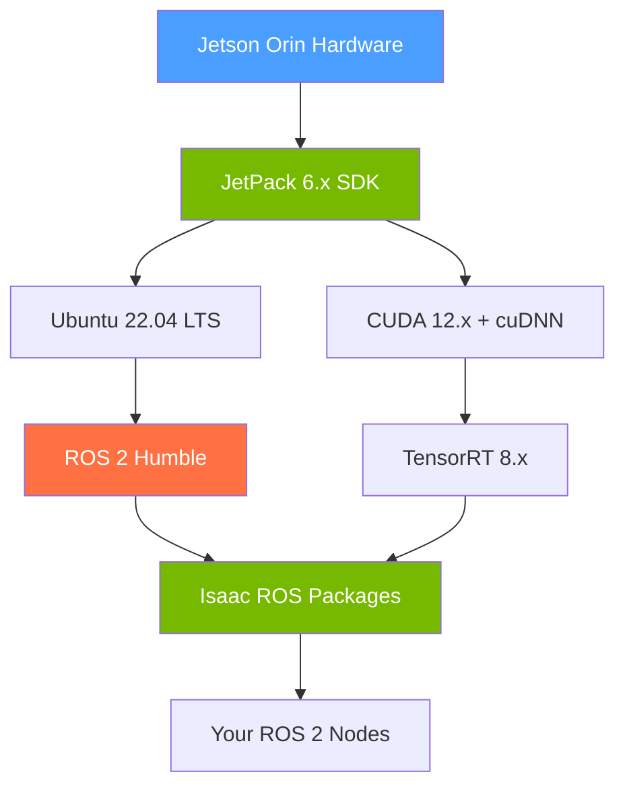

# ضمیمہ ڈی: جیٹسن کی تنصیب کی گائیڈ (Appendix D: Jetson Deployment Guide)

## جائزہ (Overview)

<div dir="rtl">

یہ ضمیمہ آپ کو **این ویڈیا جیٹسن اورن** (NVIDIA Jetson Orin) ایج اے آئی (Edge AI) ماڈیولز (modules) (نانو 8GB، این ایکس 16GB، اے جی ایکس اورن 32GB/64GB) کی فیملی پر ایک مکمل آر او ایس ٹو (ROS 2) + اے آئی (AI) روبوٹکس (robotics) اسٹیک (stack) کو تعینات کرنے میں رہنمائی کرتا ہے۔ جیٹسن اورن (Jetson Orin) ایک اے آر ایم 64 (ARM64) سی پی یو (CPU) کو این ویڈیا ایمپئر (NVIDIA Ampere) جی پی یو (GPU) اور وقف شدہ ڈیپ لرننگ ایکسیلیریٹرز (Deep Learning Accelerators) (ڈی ایل اے ایس - DLAs) کے ساتھ جوڑتا ہے، جس سے یہ فزیکل اے آئی (Physical AI) کے لیے معیاری ایج ہارڈویئر (edge hardware) پلیٹ فارم بن جاتا ہے۔

</div>

<div dir="rtl">

**تخمینہ شدہ وقت**: 60–90 منٹ (علاوہ 20–30 منٹ ڈاؤن لوڈز کے لیے)

</div>

<div dir="rtl">

**اس ضمیمے کو کب استعمال کریں**:
- باب 10 کی او این این ایکس (ONNX) پالیسی (policy) کو فزیکل ہارڈویئر پر تعینات کرنا
- ایک فزیکل ہیومنائڈ (humanoid) یا موبائل روبوٹ (mobile robot) سیٹ کرنا
- ڈیوائس پر آئزک آر او ایس (Isaac ROS) پرسپشن پائپ لائنز (perception pipelines) چلانا

</div>



---

## پیشگی ضروریات (Prerequisites)

<div dir="rtl">

شروع کرنے سے پہلے، آپ کو درکار ہے:

</div>

<div dir="rtl">

- **جیٹسن اورن ماڈیول** (Jetson Orin module) (نانو، این ایکس، یا اے جی ایکس) کیریئر بورڈ (carrier board) کے ساتھ
- **ہوسٹ پی سی** (Host PC) جس پر اوبنٹو (Ubuntu) 22.04 چل رہا ہو (ایس ڈی کے مینیجر (SDK Manager) فلیشنگ (flashing) کے لیے)
- **یو ایس بی سی کیبل** (USB-C cable) یا مائیکرو یو ایس بی کیبل (Micro-USB cable) فلیشنگ کے لیے
- **مائیکرو ایس ڈی کارڈ** (MicroSD card) (جیٹسن اورن نانو کے لیے 64GB+) یا این وی ایم ای ایس ایس ڈی (NVMe SSD) (اے جی ایکس/این ایکس کے لیے)
- جیٹسن پر **انٹرنیٹ کنکشن** (setup کے دوران ایتھرنیٹ (Ethernet) کو ترجیح دی جاتی ہے)
- فلیشنگ کے بعد جیٹسن پر کم از کم 20GB خالی ڈسک اسپیس (disk space)

</div>

---

## جیٹ پیک 6 کو فلیش کرنا (Flashing JetPack 6)

<div dir="rtl">

جیٹ پیک (JetPack) این ویڈیا کا جیٹسن کے لیے مکمل ایس ڈی کے (SDK) ہے — یہ لینکس کرنل (Linux kernel)، کیوڈ اے (CUDA)، کیو ڈی این این (cuDNN)، ٹینسر آر ٹی (TensorRT)، اور ہارڈویئر ڈرائیورز (hardware drivers) کو ایک واحد فلیش شدہ امیج (flashed image) میں جمع کرتا ہے۔

</div>

### آپشن اے: ایس ڈی کے مینیجر (اے جی ایکس اورن کے لیے تجویز کردہ) (Option A: SDK Manager (Recommended for AGX Orin))

<div dir="rtl">

اپنے **ہوسٹ پی سی** پر (جیٹسن پر نہیں):

</div>

```bash
# 1. Download SDK Manager from NVIDIA Developer website
# https://developer.nvidia.com/sdk-manager
# Install the .deb package:
sudo apt install ./sdkmanager_2.x.x-xxxxx_amd64.deb

# 2. Put Jetson into recovery mode:
#    - Hold RECOVERY button
#    - Press and release RESET button
#    - Release RECOVERY after 2 seconds

# 3. Verify Jetson is in recovery mode:
lsusb | grep NVIDIA
# Expected: Bus 00x Device 00x: ID 0955:7323 NVIDIA Corp. APX

# 4. Launch SDK Manager and follow the GUI:
sdkmanager
```

<div dir="rtl">

منتخب کریں:

</div>

<div dir="rtl">

- **ٹارگٹ ہارڈویئر** (Target Hardware): جیٹسن اے جی ایکس اورن (یا آپ کا ماڈیول)
- **جیٹ پیک ورژن** (JetPack Version): 6.x (تازہ ترین)
- **کمپونینٹس** (Components): ✓ جیٹسن او ایس (Jetson OS)، ✓ جیٹسن ایس ڈی کے کمپونینٹس (Jetson SDK Components) (کیوڈ اے، کیو ڈی این این، ٹینسر آر ٹی)

</div>

### آپشن بی: پہلے سے تیار کردہ ایس ڈی کارڈ امیج (صرف جیٹسن اورن نانو کے لیے) (Option B: Pre-built SD Card Image (Jetson Orin Nano Only))

<div dir="rtl">

جیٹسن اورن نانو 8GB کے لیے، این ویڈیا ایک پہلے سے تیار کردہ ایس ڈی کارڈ امیج فراہم کرتا ہے:

</div>

```bash
# On host PC: download and flash to SD card
# Download from: https://developer.nvidia.com/embedded/learn/get-started-jetson-orin-nano-devkit

# Flash with Balena Etcher or dd:
sudo dd if=jetson-orin-nano-jp6-r36.x.x.img of=/dev/sdX bs=4M status=progress
sync
```

---

## جیٹ پیک کی تنصیب کی تصدیق (Verifying JetPack Installation)

<div dir="rtl">

پہلی بوٹ (first boot) کے بعد، جیٹسن پر جیٹ پیک ورژن اور کیوڈ اے کی دستیابی کی تصدیق کریں:

</div>

```bash
# Verify JetPack version
cat /etc/nv_tegra_release
# Expected output:
# R36 (release), REVISION: 4.0, GCID: 37698959, BOARD: t234ref,
# EABI: aarch64, DATE: Fri Oct 18 02:32:45 UTC 2024

# Check CUDA version
nvcc --version
# Expected:
# nvcc: NVIDIA (R) Cuda compiler driver
# Cuda compilation tools, release 12.6, V12.6.68

# Verify GPU is accessible
python3 -c "import torch; print(torch.cuda.is_available()); print(torch.cuda.get_device_name(0))"
# Expected: True  /  Orin (nvgpu)

# Check available GPU memory (in MB)
tegrastats | head -1
# Shows: RAM 2048/7772MB  SWAP 0/3886MB  CPU [12%@729,...] GPU [45%@624MHz]
```

---

## جیٹسن (اے آر ایم 64) پر آر او ایس ٹو ہمبل انسٹال کرنا (Installing ROS 2 Humble on Jetson (ARM64))

<div dir="rtl">

آر او ایس ٹو ہمبل (ROS 2 Humble) اے آر ایم 64 کو x86 کی طرح ہی ایپٹ ریپوزٹری (apt repository) کے ذریعے نیٹوولی (natively) سپورٹ کرتا ہے۔ تنصیب کا عمل (installation process) اوبنٹو 22.04 x86 سے مماثل ہے — جیٹ پیک 6 (JetPack 6) اوبنٹو 22.04 کے ساتھ آتا ہے۔

</div>

```bash
# 1. Set locale
sudo locale-gen en_US en_US.UTF-8
sudo update-locale LC_ALL=en_US.UTF-8 LANG=en_US.UTF-8
export LANG=en_US.UTF-8

# 2. Enable the Universe repository
sudo apt install software-properties-common
sudo add-apt-repository universe

# 3. Add the ROS 2 apt repository GPG key
sudo apt update && sudo apt install curl -y
sudo curl -sSL https://raw.githubusercontent.com/ros/rosdistro/master/ros.key \
    -o /usr/share/keyrings/ros-archive-keyring.gpg

# 4. Add the ROS 2 repository source
echo "deb [arch=$(dpkg --print-architecture) signed-by=/usr/share/keyrings/ros-archive-keyring.gpg] \
    https://packages.ros.org/ros2/ubuntu $(. /etc/os-release && echo $UBUNTU_CODENAME) main" | \
    sudo tee /etc/apt/sources.list.d/ros2.list > /dev/null

# 5. Install ROS 2 Humble (desktop install includes rviz2 — use base for headless)
sudo apt update
sudo apt install ros-humble-ros-base python3-argcomplete -y
# Note: Use ros-humble-desktop if you have a display connected

# 6. Install development tools
sudo apt install python3-colcon-common-extensions python3-rosdep -y

# 7. Initialize rosdep
sudo rosdep init
rosdep update

# 8. Source ROS 2 automatically in every new terminal
echo "source /opt/ros/humble/setup.bash" >> ~/.bashrc
source ~/.bashrc

# 9. Verify installation
ros2 run demo_nodes_py talker
# Expected: [INFO] [talker]: Publishing: 'Hello World: 0'
```

---

## جیٹسن پر آئزک آر او ایس انسٹال کرنا (Installing Isaac ROS on Jetson)

<div dir="rtl">

آئزک آر او ایس این ویڈیا کا جی پی یو ایکسیلیریٹڈ (GPU-accelerated) آر او ایس ٹو پیکیجز (ROS 2 packages) کا مجموعہ ہے جو پرسپشن (perception)، مینیپولیشن (manipulation)، اور نیویگیشن (navigation) کے لیے ہے۔ تجویز کردہ تنصیب کا طریقہ (recommended installation method) **ڈوکر** (Docker) کے ذریعے ہے، جو تمام این ویڈیا ڈیپنڈنسیز (NVIDIA dependencies) کو بنڈل کرتا ہے۔

</div>

### ڈوکر پر مبنی تنصیب (تجویز کردہ) (Docker-Based Install (Recommended))

```bash
# 1. Install Docker if not present
sudo apt install docker.io -y
sudo usermod -aG docker $USER
newgrp docker

# 2. Install NVIDIA Container Toolkit (enables GPU in Docker)
sudo apt install nvidia-container-toolkit -y
sudo systemctl restart docker

# 3. Verify GPU access in Docker
docker run --rm --gpus all ubuntu:22.04 nvidia-smi
# Expected: shows GPU info for Jetson integrated GPU

# 4. Pull the Isaac ROS base container (JetPack 6 compatible)
docker pull nvcr.io/nvidia/isaac/ros:aarch64-ros2_humble_jp6.0

# 5. Clone Isaac ROS workspace
mkdir -p ~/workspaces/isaac_ros_dev/src
cd ~/workspaces/isaac_ros_dev
git clone https://github.com/NVIDIA-ISAAC-ROS/isaac_ros_common.git src/isaac_ros_common

# 6. Launch the Isaac ROS development container
cd ~/workspaces/isaac_ros_dev/src/isaac_ros_common
./scripts/run_dev.sh ~/workspaces/isaac_ros_dev

# Inside the container, build Isaac ROS packages:
cd /workspaces/isaac_ros_dev
colcon build --symlink-install
source install/setup.bash
```

### آئزک آر او ایس کی تصدیق (Verifying Isaac ROS)

```bash
# Inside the Isaac ROS container:
# Verify Isaac ROS AprilTag detection (no camera needed)
ros2 launch isaac_ros_apriltag isaac_ros_apriltag.launch.py
# Expected: node launches without errors

# Check container is running with GPU access
docker ps | grep isaac
# Should show the running isaac ros container
```

---

## جیٹسن پر اپنے آر او ایس ٹو نوڈز چلانا (Running Your ROS 2 Nodes on Jetson)

<div dir="rtl">

اپنی ورک اسپیس (workspace) کو اپنی ڈیولپمنٹ مشین (development machine) سے جیٹسن پر کاپی کریں اور اسے بلڈ (build) کریں:

</div>

```bash
# On your development machine:
rsync -avz ~/ros2_ws/src/ jetson@<jetson-ip>:~/ros2_ws/src/

# On Jetson:
cd ~/ros2_ws
rosdep install --from-paths src --ignore-src -y  # Install any missing deps
colcon build --symlink-install
source install/setup.bash

# Run your Chapter 10 ONNX policy node:
pip3 install onnxruntime-gpu  # GPU-accelerated inference on Jetson
ros2 run sim_to_real policy_node \
    --ros-args -p model_path:=/home/jetson/models/walking_policy.onnx
```

### کارکردگی کی ٹپ: اون این ایکس رن ٹائم کے لیے جی پی یو استعمال کریں (Performance Tip: Use GPU for onnxruntime)

<div dir="rtl">

جیٹسن پر، سی پی یو سے جی پی یو انفرنس (GPU inference) پر سوئچ کرنے سے پالیسی لیٹنسی (policy latency) ~20ms سے ~3ms تک کم ہو سکتی ہے:

</div>

```python
# In policy_node.py — change the provider:
self.session = ort.InferenceSession(
    model_path,
    providers=['CUDAExecutionProvider', 'CPUExecutionProvider']  # Try GPU first
)
```

---

## تصدیقی چیک لسٹ (Verification Checklist)

<div dir="rtl">

جیٹسن کی صحت مند ڈیپلائمنٹ (Jetson deployment) کی تصدیق (verify) کرنے کے لیے یہ کمانڈز (commands) چلائیں:

</div>

```bash
# 1. JetPack version
cat /etc/nv_tegra_release | head -1
# Expected: R36 (release), REVISION: 4.x

# 2. CUDA compiler
nvcc --version | grep release
# Expected: release 12.x

# 3. ROS 2 working
ros2 run demo_nodes_py talker &
ros2 topic echo /chatter --once
# Expected: data: 'Hello World: N'

# 4. GPU accessible in Python
python3 -c "import torch; assert torch.cuda.is_available(), 'No GPU!'; print('GPU OK')"

# 5. Isaac ROS container available
docker images | grep isaac
# Expected: nvcr.io/nvidia/isaac/ros  aarch64-ros2_humble_jp6.0  ...

# 6. onnxruntime with GPU
python3 -c "
import onnxruntime as ort
providers = ort.get_available_providers()
print('Available providers:', providers)
assert 'CUDAExecutionProvider' in providers, 'No CUDA provider!'
print('ONNX GPU inference OK')
"
```

---

## خرابیوں کا ازالہ (Troubleshooting)

### خرابی: nvcc: کمانڈ نہیں ملی (Error: `nvcc: command not found`)

<div dir="rtl">

کیوڈ اے انسٹال ہے لیکن پاتھ (PATH) پر نہیں ہے۔ اسے شامل کریں:

</div>

```bash
echo 'export PATH=/usr/local/cuda/bin:$PATH' >> ~/.bashrc
echo 'export LD_LIBRARY_PATH=/usr/local/cuda/lib64:$LD_LIBRARY_PATH' >> ~/.bashrc
source ~/.bashrc
```

### خرابی: torch.cuda.is_available() غلط نتیجہ دیتا ہے (Error: `torch.cuda.is_available()` returns `False`)

<div dir="rtl">

پپ (pip) کے ذریعے انسٹال شدہ پائی ٹارچ (PyTorch) ورژن میں جیٹسن جی پی یو سپورٹ (Jetson GPU support) نہیں ہو سکتی۔ این ویڈیا کی فراہم کردہ پائی ٹارچ وہیل (PyTorch wheel) استعمال کریں:

</div>

```bash
# Find the correct wheel for your JetPack version:
# https://forums.developer.nvidia.com/t/pytorch-for-jetson/72048
pip3 install torch-2.x.x+nv24.x-cp310-cp310-linux_aarch64.whl
```

### خرابی: ڈوکر جی پی یو تک رسائی حاصل نہیں کر سکتا (Error: Docker cannot access GPU)

```bash
# Check nvidia-container-runtime is configured:
sudo nvidia-ctk runtime configure --runtime=docker
sudo systemctl restart docker
# Then retry: docker run --rm --gpus all ubuntu:22.04 nvidia-smi
```

### خرابی: جیٹسن پر آر او ایس ٹو نوڈز لیپ ٹاپ سے بات چیت نہیں کر سکتے (Error: ROS 2 nodes on Jetson cannot communicate with laptop)

<div dir="rtl">

وہ مختلف آر او ایس ڈومین آئی ڈی (ROS_DOMAIN_ID) ویلیوز پر ہیں۔ انہیں ہم آہنگ (synchronize) کریں:

</div>

```bash
# On both machines, use the same domain ID:
export ROS_DOMAIN_ID=42
# Add to ~/.bashrc on both machines for persistence
```

---

## مزید مطالعہ (Further Reading)

<div dir="rtl">

- **متعلقہ ابواب**: [باب 10: سِم ٹو رئیل ٹرانسفر (Chapter 10: Sim-to-Real Transfer)](../module-3/ch10-sim-to-real.md) — او این این ایکس پالیسی کی تنصیب (ONNX policy deployment)
- **متعلقہ ضمیمہ**: [ضمیمہ اے ٹو: سافٹ ویئر کی تنصیب (Appendix A2: Software Installation)](a2-software-installation.md) — ڈیولپمنٹ مشین سیٹ اپ (development machine setup)

</div>

<div dir="rtl">

**سرکاری دستاویزات**:
- [این ویڈیا جیٹسن اورن سے آغاز کرنا (NVIDIA Jetson Orin Getting Started)](https://developer.nvidia.com/embedded/learn/get-started-jetson-orin-nano-devkit)
- [جیٹ پیک ایس ڈی کے دستاویزات (JetPack SDK documentation)](https://developer.nvidia.com/embedded/jetpack)
- [آئزک آر او ایس گٹ ہب (Isaac ROS GitHub)](https://github.com/NVIDIA-ISAAC-ROS)
- [جیٹسن کے لیے پائی ٹارچ (PyTorch for Jetson)](https://forums.developer.nvidia.com/t/pytorch-for-jetson/72048)

</div>
---