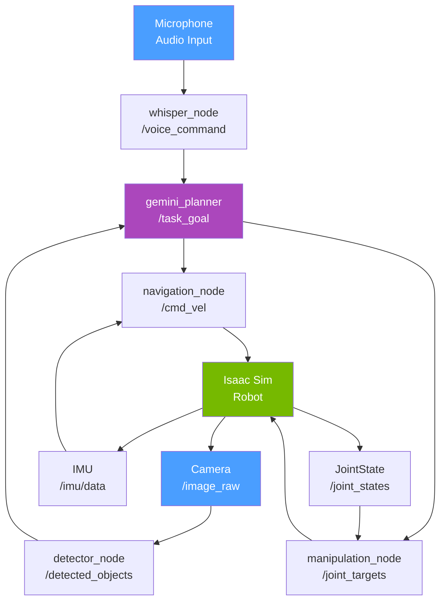

# باب 14: کیپ اسٹون پراجیکٹ — خود مختار ہیومنائڈ

## سیکھنے کے مقاصد

<div dir="rtl">
اس پراجیکٹ کے اختتام تک، آپ درج ذیل کے قابل ہو جائیں گے:
</div>

<div dir="rtl">
<ul>
<li>**ضم** کریں تمام چار کورس ماڈیولز (Modules) کو ایک واحد کام کرنے والے روبوٹک سسٹم (Robotic System) میں۔</li>
<li>ایک مکمل خود مختار پائپ لائن (Autonomous Pipeline) کے لیے ایک ملٹی-نوڈ (Multi-Node) آر او ایس ٹو (ROS 2) آرکیٹیکچر (Architecture) کو **ڈیزائن** کریں۔</li>
<li>ایک وائس ٹو ایکشن پائپ لائن (Voice-to-Action Pipeline) کو **نافذ** کریں جو نیویگیشن (Navigation) اور مینیپولیشن (Manipulation) کو چلاتی ہے۔</li>
<li>این ویڈیا (NVIDIA) آئزک سم (Isaac Sim) میں مکمل سسٹم کو **ڈپلائے** اور ٹیسٹ کریں۔</li>
<li>پرسیپشن (Perception)، پلاننگ (Planning) اور ایگزیکیوشن (Execution) کے لحاظ سے سسٹم کی کارکردگی کا **جائزہ** لیں۔</li>
</ul>
</div>

---

## تعارف: سب کچھ ایک ساتھ آتا ہے

<div dir="rtl">
آپ نے تیرہ ہفتے فزیکل اے آئی (Physical AI) کے اجزاء سیکھنے میں گزارے ہیں: آر او ایس ٹو (ROS 2) کمیونیکیشن، سمولیشن (Simulation)، پرسیپشن، مینیپولیشن، لوکوموشن (Locomotion) اور کنورسیشنل انٹرفیسز (Conversational Interfaces)۔ ہر باب نے پہیلی کا ایک ٹکڑا متعارف کرایا۔ یہ کیپ اسٹون (Capstone) وہ جگہ ہے جہاں آپ اس پہیلی کو جمع کرتے ہیں۔
</div>

<div dir="rtl">
پراجیکٹ کا ہدف پرجوش لیکن قابل حصول ہے: ایک سمیولیٹڈ (Simulated) ہیومنائڈ روبوٹ (Humanoid Robot) جو ایک بولا ہوا وائس کمانڈ (Voice Command) وصول کر سکے — "میز سے سرخ کپ لاؤ" — اور خود مختاری (Autonomously) سے رویے کی پوری زنجیر کو انجام دے سکے:
</div>

<div dir="rtl">
<ol>
<li>**سنیں**: وسپر (Whisper) کے ساتھ وائس کمانڈ کو ٹرانسکرائب (Transcribe) کریں۔</li>
<li>**سمجھیں**: جیمنی (Gemini) کے ساتھ ارادے اور ہدف آبجیکٹ کو پارس (Parse) کریں۔</li>
<li>**دیکھیں**: تربیت یافتہ ڈیٹیکٹر (Detector) کا استعمال کرتے ہوئے کیمرہ فیڈ (Camera Feed) میں ہدف آبجیکٹ کا پتہ لگائیں۔</li>
<li>**نیویگیٹ کریں**: آبجیکٹ (Object) کے مقام تک ٹکراؤ سے پاک راستہ کی منصوبہ بندی کریں۔</li>
<li>**پکڑیں**: آبجیکٹ کو اٹھانے کے لیے ایک مینیپولیشن تسلسل انجام دیں۔</li>
<li>**واپس جائیں**: واپس نیویگیٹ کریں اور ٹاسک (Task) کی تکمیل کا اعلان کریں۔</li>
</ol>
</div>

<div dir="rtl">
یہ کوئی کھلونے کا ڈیمو (Demo) نہیں ہے۔ یہ وہی آرکیٹیکچرل پیٹرن (Architectural Pattern) ہے جو حقیقی دنیا کے سروس روبوٹس (Service Robots) میں استعمال ہوتا ہے جو ہسپتالوں، گوداموں اور گھروں میں تعینات کیے جاتے ہیں۔ اسے خود بنا کر، آپ ہر انٹیگریشن (Integration) پوائنٹ — اور ہر وہ جگہ جہاں چیزیں غلط ہو سکتی ہیں — کی گہری سمجھ حاصل کرتے ہیں۔
</div>

:::tip کورس جمع کرانے کا دائرہ کار
<div dir="rtl">
کورس جمع کرانے کے لیے، فیز 1 (نیویگیشن) اور فیز 2 (پرسیپشن + پک) کو نافذ کریں۔ فیز 3 (واپسی + اعلان) اختیاری ہے لیکن یہ ٹاسک کی مکمل تکمیل کو ظاہر کرتا ہے۔
</div>
:::

---

## سسٹم آرکیٹیکچر (System Architecture)

<div dir="rtl">
کیپ اسٹون سسٹم سات آر او ایس ٹو (ROS 2) نوڈز (Nodes) پر مشتمل ہے جو گیارہ ٹاپکس (Topics) اور دو سروسز (Services) پر بات چیت کرتے ہیں۔ کوڈ لکھنے سے پہلے اس آرکیٹیکچر کو سمجھنا ضروری ہے۔
</div>



### نوڈ (Node) کی ذمہ داریاں

| نوڈ (Node) | ان پٹ ٹاپکس (Topics) | آؤٹ پٹ ٹاپکس (Topics) | ماڈیول (Module) کا حوالہ |
|------|-------------|---------------|-----------------|
| `whisper_node` | microphone | `/voice_command` | باب 13 |
| `detector_node` | `/image_raw` | `/detected_objects` | باب 9 |
| `gemini_planner` | `/voice_command`, `/detected_objects` | `/task_goal`, `/task_status` | باب 13 |
| `navigation_node` | `/task_goal`, `/scan`, `/imu/data` | `/cmd_vel` | باب 5، 6 |
| `manipulation_node` | `/task_goal`, `/joint_states` | `/joint_targets` | باب 9، 11 |

---

## مرحلہ 1: بنیادی سیٹ اپ

### مرحلہ 1: کیپ اسٹون ورک اسپیس (Workspace) بنائیں

```bash
# Create a dedicated capstone package
cd ~/ros2_ws/src
ros2 pkg create autonomous_humanoid \
    --build-type ament_python \
    --dependencies rclpy std_msgs geometry_msgs sensor_msgs nav_msgs

mkdir -p autonomous_humanoid/autonomous_humanoid/
touch autonomous_humanoid/autonomous_humanoid/__init__.py
```

### مرحلہ 2: ٹاسک کوآرڈینیٹر (Task Coordinator) نوڈ

<div dir="rtl">
ٹاسک کوآرڈینیٹر سسٹم کا دماغ ہے۔ یہ جیمنی پلانر (Planner) سے ایک پارسڈ ٹاسک گول (Parsed Task Goal) وصول کرتا ہے اور اسٹیٹ مشین (State Machine) کو چلاتا ہے جو نیویگیشن اور مینیپولیشن کو ترتیب دیتی ہے۔
</div>

```python
# File: ~/ros2_ws/src/autonomous_humanoid/autonomous_humanoid/task_coordinator.py
# The state machine that sequences navigation, perception, and manipulation.

import rclpy
from rclpy.node import Node
from std_msgs.msg import String
from geometry_msgs.msg import PoseStamped, Twist
from sensor_msgs.msg import Image
import json
from enum import Enum, auto

class TaskState(Enum):
    IDLE = auto()
    NAVIGATING_TO_OBJECT = auto()
    SCANNING_FOR_OBJECT = auto()
    REACHING_FOR_OBJECT = auto()
    GRASPING = auto()
    NAVIGATING_TO_GOAL = auto()
    PLACING_OBJECT = auto()
    COMPLETE = auto()
    FAILED = auto()

class TaskCoordinator(Node):
    """
    Central state machine for the autonomous humanoid capstone.
    Orchestrates navigation → perception → manipulation → delivery.
    """

    def __init__(self):
        super().__init__('task_coordinator')

        # Current state
        self.state = TaskState.IDLE
        self.current_task = None
        self.target_object = None
        self.object_detected = False
        self.navigation_complete = False

        # Subscribe to parsed task goals from Gemini planner
        self.task_sub = self.create_subscription(
            String, '/task_goal', self.task_callback, 10
        )

        # Subscribe to object detection results
        self.detect_sub = self.create_subscription(
            String, '/detected_objects', self.detection_callback, 10
        )

        # Subscribe to navigation status
        self.nav_status_sub = self.create_subscription(
            String, '/navigation_status', self.nav_status_callback, 10
        )

        # Publishers
        self.nav_goal_pub = self.create_publisher(PoseStamped, '/navigate_to', 10)
        self.arm_cmd_pub = self.create_publisher(String, '/arm_command', 10)
        self.status_pub = self.create_publisher(String, '/task_status', 10)
        self.speech_pub = self.create_publisher(String, '/robot_speech', 10)

        # State machine update loop at 5 Hz
        self.timer = self.create_timer(0.2, self.update_state_machine)

        self.get_logger().info('Task coordinator ready. Waiting for task goals...')

    def task_callback(self, msg: String):
        """Receive a new task goal from the Gemini planner."""
        try:
            task = json.loads(msg.data)
            self.current_task = task
            self.target_object = task.get('target', 'unknown')

            if task.get('action') in ['pick', 'fetch', 'bring']:
                self.state = TaskState.NAVIGATING_TO_OBJECT
                self.navigation_complete = False
                self.object_detected = False
                self.say(f'Starting task: fetch the {self.target_object}')
                self.get_logger().info(f'New task: {task}')

                # Send navigation goal to the table area (pre-mapped location)
                self.send_nav_goal(x=2.0, y=1.5, theta=0.0)

        except json.JSONDecodeError:
            self.get_logger().error(f'Invalid task JSON: {msg.data}')

    def detection_callback(self, msg: String):
        """Update detection status — called when objects are spotted."""
        try:
            detections = json.loads(msg.data)
            if any(d['label'] == self.target_object for d in detections):
                self.object_detected = True
        except:
            pass

    def nav_status_callback(self, msg: String):
        """Track navigation completion status."""
        if msg.data == 'REACHED':
            self.navigation_complete = True

    def update_state_machine(self):
        """Called at 5 Hz. Advances the task state machine."""
        if self.state == TaskState.IDLE:
            return

        elif self.state == TaskState.NAVIGATING_TO_OBJECT:
            if self.navigation_complete:
                self.state = TaskState.SCANNING_FOR_OBJECT
                self.say('Arrived at target area. Scanning for object.')

        elif self.state == TaskState.SCANNING_FOR_OBJECT:
            if self.object_detected:
                self.state = TaskState.REACHING_FOR_OBJECT
                self.arm_cmd_pub.publish(self._make_arm_cmd('REACH'))
                self.say(f'Found the {self.target_object}. Reaching now.')

        elif self.state == TaskState.REACHING_FOR_OBJECT:
            # After a brief delay, attempt to grasp
            self.state = TaskState.GRASPING
            self.arm_cmd_pub.publish(self._make_arm_cmd('GRASP'))

        elif self.state == TaskState.GRASPING:
            self.state = TaskState.COMPLETE
            self.say(f'Task complete! I have the {self.target_object}.')
            self.publish_status('COMPLETE')
            self.state = TaskState.IDLE

        elif self.state == TaskState.FAILED:
            self.say('Task failed. Please try again.')
            self.publish_status('FAILED')
            self.state = TaskState.IDLE

    def send_nav_goal(self, x: float, y: float, theta: float):
        """Send a navigation goal pose."""
        goal = PoseStamped()
        goal.header.stamp = self.get_clock().now().to_msg()
        goal.header.frame_id = 'map'
        goal.pose.position.x = x
        goal.pose.position.y = y
        # Theta to quaternion (simplified: rotation around z-axis only)
        import math
        goal.pose.orientation.z = math.sin(theta / 2)
        goal.pose.orientation.w = math.cos(theta / 2)
        self.nav_goal_pub.publish(goal)

    def say(self, text: str):
        """Publish text to speech synthesis topic."""
        msg = String()
        msg.data = text
        self.speech_pub.publish(msg)
        self.get_logger().info(f'[SPEECH] {text}')

    def publish_status(self, status: str):
        msg = String()
        msg.data = status
        self.status_pub.publish(msg)

    def _make_arm_cmd(self, command: str) -> String:
        msg = String()
        msg.data = command
        return msg


def main(args=None):
    rclpy.init(args=args)
    node = TaskCoordinator()
    rclpy.spin(node)
    node.destroy_node()
    rclpy.shutdown()
```

---

## مرحلہ 2: آئزک سم (Isaac Sim) میں نیویگیشن

<div dir="rtl">
نیویگیشن نوڈ باب 2 سے لیڈار (LiDAR) ڈیٹا (Data) کا استعمال کرتے ہوئے آبسٹیکل اواڈنس (Obstacle Avoidance) کو نافذ کرتا ہے، جسے آئزک سم کے فزکس انجن (Physics Engine) کے ساتھ ضم کیا گیا ہے۔
</div>

```python
# File: ~/ros2_ws/src/autonomous_humanoid/autonomous_humanoid/navigation_node.py
# Navigates to goal poses using LiDAR-based obstacle avoidance.

import rclpy
from rclpy.node import Node
from geometry_msgs.msg import PoseStamped, Twist
from sensor_msgs.msg import LaserScan
from std_msgs.msg import String
import math

class NavigationNode(Node):
    """
    Simple goal-directed navigation with LiDAR obstacle avoidance.
    For production use, replace with Nav2 stack.
    """

    GOAL_TOLERANCE = 0.2    # meters — how close counts as "reached"
    FORWARD_SPEED = 0.3     # m/s
    TURN_SPEED = 0.8        # rad/s
    OBSTACLE_THRESHOLD = 0.6  # meters

    def __init__(self):
        super().__init__('navigation_node')

        self.current_goal = None
        self.current_x = 0.0
        self.current_y = 0.0
        self.current_theta = 0.0
        self.nearest_obstacle = float('inf')

        # Subscriptions
        self.goal_sub = self.create_subscription(
            PoseStamped, '/navigate_to', self.goal_callback, 10
        )
        self.scan_sub = self.create_subscription(
            LaserScan, '/scan', self.scan_callback, 10
        )

        # Publishers
        self.cmd_pub = self.create_publisher(Twist, '/cmd_vel', 10)
        self.status_pub = self.create_publisher(String, '/navigation_status', 10)

        # Control loop at 10 Hz
        self.timer = self.create_timer(0.1, self.control_loop)
        self.get_logger().info('Navigation node ready.')

    def goal_callback(self, msg: PoseStamped):
        self.current_goal = msg
        self.get_logger().info(
            f'New goal: ({msg.pose.position.x:.2f}, {msg.pose.position.y:.2f})'
        )

    def scan_callback(self, msg: LaserScan):
        """Track nearest obstacle in the forward arc."""
        total = len(msg.ranges)
        center = total // 2
        cone = total // 8   # ±22.5° forward cone
        front = msg.ranges[center - cone : center + cone]
        valid = [r for r in front if msg.range_min < r < msg.range_max]
        self.nearest_obstacle = min(valid) if valid else float('inf')

    def control_loop(self):
        """Drive toward goal, stop if obstacle too close."""
        if self.current_goal is None:
            return

        cmd = Twist()

        # Check distance to goal (simplified: ignores orientation)
        gx = self.current_goal.pose.position.x
        gy = self.current_goal.pose.position.y
        dist = math.sqrt((gx - self.current_x) ** 2 + (gy - self.current_y) ** 2)

        if dist < self.GOAL_TOLERANCE:
            # Reached goal
            self.cmd_pub.publish(Twist())  # Stop
            status = String()
            status.data = 'REACHED'
            self.status_pub.publish(status)
            self.current_goal = None
            self.get_logger().info('Goal reached!')
            return

        if self.nearest_obstacle < self.OBSTACLE_THRESHOLD:
            # Obstacle detected — turn to find clear path
            cmd.angular.z = self.TURN_SPEED
        else:
            # Path clear — drive toward goal
            cmd.linear.x = self.FORWARD_SPEED

        self.cmd_pub.publish(cmd)


def main(args=None):
    rclpy.init(args=args)
    node = NavigationNode()
    rclpy.spin(node)
    node.destroy_node()
    rclpy.shutdown()
```

---

## مرحلہ 3: آئزک سم (Isaac Sim) لانچ کنفیگریشن

<div dir="rtl">
مکمل کیپ اسٹون سسٹم شروع کرنے کے لیے اس لانچ فائل (Launch File) کا استعمال کریں:
</div>

```python
# File: ~/ros2_ws/src/autonomous_humanoid/launch/capstone.launch.py
# Launches all capstone nodes together.

from launch import LaunchDescription
from launch_ros.actions import Node
from launch.actions import DeclareLaunchArgument
from launch.substitutions import LaunchConfiguration

def generate_launch_description():
    return LaunchDescription([
        # Whisper speech recognition
        Node(
            package='conversational_robotics',
            executable='whisper_node',
            name='whisper_node',
            output='screen',
        ),

        # Gemini action planner
        Node(
            package='conversational_robotics',
            executable='gemini_planner',
            name='gemini_planner',
            output='screen',
            parameters=[{
                'model_name': 'gemini-2.0-flash',
            }]
        ),

        # Object detector (from Chapter 9)
        Node(
            package='perception_demo',
            executable='color_detector',
            name='detector_node',
            output='screen',
        ),

        # Task coordinator (this chapter)
        Node(
            package='autonomous_humanoid',
            executable='task_coordinator',
            name='task_coordinator',
            output='screen',
        ),

        # Navigation node
        Node(
            package='autonomous_humanoid',
            executable='navigation_node',
            name='navigation_node',
            output='screen',
        ),
    ])
```

<div dir="rtl">
**لانچ فائل** کو `setup.py` میں رجسٹر کریں:
</div>
```python
data_files=[
    ...
    ('share/autonomous_humanoid/launch', ['launch/capstone.launch.py']),
],
```

<div dir="rtl">
**مکمل سسٹم چلائیں**:
</div>
```bash
# First, start Isaac Sim with your humanoid scene
# Then in a new terminal:
cd ~/ros2_ws
colcon build --packages-select autonomous_humanoid
source install/setup.bash
ros2 launch autonomous_humanoid capstone.launch.py
```

---

## تشخیصی ربرک (Rubric)

<div dir="rtl">
اپنی کیپ اسٹون جمع کرانے کا جائزہ لینے کے لیے اس ربرک کا استعمال کریں:
</div>

| معیار | وزن | 0 پوائنٹس | 1 پوائنٹ | 2 پوائنٹس |
|-----------|--------|-------|------|-------|
| **آرکیٹیکچر (Architecture)** | 20% | ایک واحد مونو لیتھک نوڈ | متعدد نوڈز، غیر واضح علیحدگی | آرکیٹیکچر ڈایاگرام (Architecture Diagram) سے مماثل نوڈ کی صاف علیحدگی |
| **وائس انٹرفیس (Voice Interface)** | 15% | نافذ نہیں کیا گیا | ٹرانسکرپشن (Transcription) کام کرتی ہے، پلاننگ (Planning) خراب ہے | مکمل وائس (Voice) → ایکشن پائپ لائن (Action Pipeline) کام کر رہی ہے |
| **نیویگیشن (Navigation)** | 20% | روبوٹ حرکت نہیں کرتا | روبوٹ حرکت کرتا ہے لیکن آبسٹیکلز (Obstacles) سے ٹکراتا ہے | روبوٹ آبسٹیکلز سے بچتے ہوئے گول (Goal) تک نیویگیٹ کرتا ہے |
| **پرسیپشن (Perception)** | 20% | کوئی آبجیکٹ ڈیٹیکشن (Object Detection) نہیں | آبجیکٹس کا پتہ چلا لیکن لوکلائز (Localize) نہیں ہوئے | آبجیکٹس کا پتہ چلا اور پوزیشن کا تخمینہ لگایا گیا |
| **مینیپولیشن (Manipulation)** | 15% | بازو کی کوئی حرکت نہیں | بازو حرکت کرتا ہے لیکن آبجیکٹ کو نہیں پکڑتا | پکڑنے کی کوشش 50% سے زیادہ ٹرائلز (Trials) میں کامیاب ہوتی ہے |
| **انٹیگریشن (Integration)** | 10% | ماڈیولز منسلک نہیں | جزوی پائپ لائن کام کر رہی ہے | مکمل اینڈ ٹو اینڈ (End-to-End) ڈیمو (Demo): وائس → پک → مکمل |

<div dir="rtl">
**کل: 100 پوائنٹس۔** 70+ کا سکور (Score) پاسنگ گریڈ (Passing Grade) حاصل کرتا ہے۔ 90+ کا سکور ایڈوانسڈ لیڈر بورڈ (Advanced Leaderboard) کے لیے اہل بناتا ہے۔
</div>

---

## عام انٹیگریشن (Integration) مسائل اور ان کے حل

### مسئلہ: نوڈز (Nodes) بات چیت نہیں کر سکتے (کوئی پیغامات موصول نہیں ہوئے)

```bash
# Check all nodes are in same ROS domain
ros2 node list
# Check topic connectivity
ros2 topic info /task_goal --verbose
```

### مسئلہ: نیویگیشن (Navigation) گول (Goal) کبھی حاصل نہیں ہوا

<div dir="rtl">
اوپر دیا گیا سادہ نیویگیشن نوڈ یہ فرض کرتا ہے کہ آپ کے پاس اوڈومیٹری (Odometry) پر مبنی پوزیشن ٹریکنگ (Position Tracking) ہے۔ آئزک سم میں، گراؤنڈ ٹروتھ پوز (Ground Truth Pose) استعمال کریں:
</div>

```bash
# Check if /odom or /tf is publishing robot position:
ros2 topic list | grep -E "odom|tf"
```

### مسئلہ: جیمنی (Gemini) اے پی آئی (API) ریٹ لیمٹ (Rate Limit) تجاوز کر گئی

<div dir="rtl">
اے پی آئی (API) کالز (Calls) کے درمیان کم از کم تاخیر شامل کریں:
</div>

```python
import time
self.last_api_call = 0

def command_callback(self, msg):
    now = time.time()
    if now - self.last_api_call < 2.0:  # 2-second cooldown
        return
    self.last_api_call = now
    # ... rest of callback
```

---

## خلاصہ

<div dir="rtl">
اس کیپ اسٹون پراجیکٹ (Project) میں، آپ نے:
</div>

<div dir="rtl">
<ul>
<li>تمام چار کورس ماڈیولز کو **ضم** کیا: آر او ایس ٹو فنڈامینٹلز (Fundamentals) (M1)، سمولیشن (M2)، پرسیپشن/مینیپولیشن (M3)، اور ہیومنائڈ کنٹرول (Control) + کنورسیشنل اے آئی (Conversational AI) (M4)۔</li>
<li>واضح علیحدگی کے ساتھ ایک سات نوڈ آر او ایس ٹو آرکیٹیکچر کو **ڈیزائن** کیا۔</li>
<li>ایک اسٹیٹ مشین ٹاسک کوآرڈینیٹر کو **نافذ** کیا جو نیویگیشن، پرسیپشن اور مینیپولیشن کو ترتیب دیتا ہے۔</li>
<li>وسپر → جیمنی → آر او ایس ٹو کا استعمال کرتے ہوئے ایک مکمل وائس ٹو ایکشن پائپ لائن **بنائی**۔</li>
<li>آئزک سم میں سسٹم کو **ٹیسٹ** کیا، یہ وہی سمولیشن ماحول ہے جسے این ویڈیا کی اپنی روبوٹ ریسرچ ٹیمیں استعمال کرتی ہیں۔</li>
</ul>
</div>

<div dir="rtl">
یہ آرکیٹیکچر صرف ایک کورس پراجیکٹ نہیں ہے — یہ حقیقی دنیا کی سروس روبوٹکس (Robotics) کے لیے ایک بلیو پرنٹ (Blueprint) ہے۔ وہی پیٹرن ایمازون (Amazon) کے گودام روبوٹس، ہسپتال ڈیلیوری روبوٹس اور ہوم اسسٹنٹ پلیٹ فارمز (Platforms) میں ظاہر ہوتے ہیں۔ اب آپ سمجھتے ہیں کہ وہ اندر سے کیسے کام کرتے ہیں۔
</div>

---

## مزید پڑھنا

<div dir="rtl">
<ul>
<li>**ماڈیول 1**: [Chapter 5: ROS 2 Packages](../module-1/ch05-ros2-packages-python.md) — ورک اسپیس اسٹرکچر (Structure) کا جائزہ</li>
<li>**ماڈیول 2**: [Chapter 6: Gazebo Simulation](../module-2/ch06-gazebo-simulation.md) — سمولیشن کی بنیادیں</li>
<li>**ماڈیول 3**: [Chapter 10: Sim-to-Real](../module-3/ch10-sim-to-real.md) — فزیکل ہارڈ ویئر (Physical Hardware) پر تعینات کرنا</li>
<li>**ماڈیول 4**: [Chapter 13: Conversational Robotics](../module-4/ch13-conversational-robotics.md) — وائس کمانڈ پائپ لائن</li>
</ul>
</div>

<div dir="rtl">
**اس کورس کے بعد اگلے مراحل**:
</div>

<ul>
<li>[Nav2 — the standard ROS 2 navigation stack](https://nav2.org/)</li>
<li>[MoveIt 2 — industrial-grade manipulation planning](https://moveit.picknik.ai/)</li>
<li>[Isaac ROS — GPU-accelerated perception](https://github.com/NVIDIA-ISAAC-ROS)</li>
<li>[Physical Intelligence π0 model](https://www.physicalintelligence.company/blog/pi0)</li>
</ul>

---