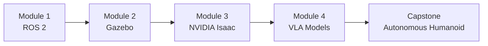

# پیش لفظ اور کورس کا جائزہ (Preface & Course Overview)

## سیکھنے کے مقاصد (Learning Objectives)

<div dir="rtl">

اس باب کے اختتام تک، آپ اس قابل ہو جائیں گے کہ:

- **فزیکل اے آئی (Physical AI)** کی تعریف کریں اور اسے روایتی صرف سافٹ ویئر والی مصنوعی ذہانت سے ممتاز کریں۔
- اس کورس کے چار ماڈیولز کی **شناخت** کریں اور وضاحت کریں کہ وہ ایک دوسرے پر کس طرح بنتے ہیں۔
- **ROS 2 (آر او ایس ٹو)** اور **روبوٹ (Robot)** سمیولیشن (Simulation) کے لیے موزوں ڈویلپمنٹ ماحول کو **ترتیب** دیں۔
- **پائتھون (Python)** میں ایک کم سے کم **ROS 2 پبلشر نوڈ (publisher node)** کو **چلائیں** اور اس کے آؤٹ پٹ کی تشریح کریں۔
- تجویز کردہ پڑھنے کے راستے اور باہمی حوالوں کا استعمال کرتے ہوئے اس درسی کتاب کو مؤثر طریقے سے **نیویگیٹ** کریں۔

</div>

---

## تعارف (Introduction)

<div dir="rtl">

صبح 3 بجے ایک مصروف ہسپتال میں داخل ہونے کا تصور کریں۔ راہداریوں میں ایک ہلکی سی آواز کے سوا سناٹا ہے۔ ایک **ہیومنائیڈ روبوٹ (humanoid robot)** نرسنگ اسٹیشن پر ادویات کی ٹرے لیے ہوئے گھومتا ہے، ہر دوا مریض کے کمرے کے نمبر کے مطابق ترتیب دی گئی ہے۔ یہ ایک دروازے پر رکتا ہے، گہرائی والے کیمروں سے کمرے کو اسکین کرتا ہے، مریض کے کلائی کے بینڈ کی شناخت کرتا ہے، اور احتیاط سے صحیح دوا کو بستر کے کنارے والی میز پر رکھ دیتا ہے۔ کسی انسانی نرس کو اسٹیشن چھوڑنا نہیں پڑا۔ دوا کی کوئی غلطی نہیں ہوئی۔

</div>

<div dir="rtl">

یہ سائنس فکشن نہیں ہے۔ **Boston Dynamics**, **Tesla**, **Figure AI**, اور **Agility Robotics** جیسی کمپنیاں فعال طور پر ایسی مشینیں بنا رہی ہیں جو انسانوں کے لیے ڈیزائن کی گئی جگہوں پر کام کرتی ہیں۔ گودام، ہسپتال، گھر، اور تعمیراتی مقامات سب **روبوٹ (robot)** کے لیے آزمائشی میدان بن رہے ہیں جو دیکھ سکتے ہیں، چل سکتے ہیں، پکڑ سکتے ہیں اور بولی جانے والی زبان کا جواب دے سکتے ہیں۔

</div>

<div dir="rtl">

یہ ملاپ اب ہو رہا ہے کیونکہ تین ٹیکنالوجیز ایک ہی وقت میں پختہ ہوئیں۔ **لارج لینگویج ماڈلز (Large Language Models)** نے مشینوں کو قدرتی زبان کی ہدایات کو سمجھنے کی صلاحیت دی۔ **جی پی یو (GPU)-ایکسیلریٹڈ سمیولیشن (GPU-accelerated simulation)** نے **روبوٹ (robot)** کے رویوں کو حقیقی دنیا کے مقابلے میں لاکھوں گنا تیزی سے ورچوئل دنیا میں تربیت دینا ممکن بنایا۔ اور **ایڈج اے آئی ہارڈ ویئر (edge AI hardware)** جیسے کہ **NVIDIA (این ویڈیا)** **جیٹسن (Jetson)**، حقیقی وقت میں **روبوٹ (robot)** کے جسم پر ان تربیت یافتہ ماڈلز کو چلانے کے لیے کافی طاقتور ہو گیا۔

</div>

<div dir="rtl">

یہ درسی کتاب آپ کو یہ سکھانے کے لیے موجود ہے کہ یہ تمام حصے کیسے آپس میں ملتے ہیں۔ آپ کو سابقہ **روبوٹکس (robotics)** کے تجربے کی ضرورت نہیں ہے۔ آپ کو تجسس، بنیادی **پائتھون (Python)** کی مہارت، اور عملی مشقوں کے ذریعے کام کرنے کی خواہش کی ضرورت ہے جو تھیوری کو پریکٹس سے جوڑتی ہیں۔

</div>

---

## فزیکل اے آئی (Physical AI) کیا ہے؟

<div dir="rtl">

**فزیکل اے آئی (Physical AI)** سے مراد مصنوعی ذہانت کے وہ سسٹمز ہیں جو مادی دنیا میں ادراک کرتے ہیں، اس کے بارے میں استدلال کرتے ہیں، اور اس کے اندر عمل کرتے ہیں۔ ایک چیٹ بوٹ کے برعکس جو متن پر کارروائی کرتا ہے یا ایک امیج کلاسیفائر جو تصاویر کو لیبل کرتا ہے، ایک **فزیکل اے آئی (Physical AI)** سسٹم کو کشش ثقل، رگڑ، رکاوٹوں، اور حقیقی ماحول کی غیر متوقع نوعیت کا مقابلہ کرنا پڑتا ہے۔

</div>

<div dir="rtl">

اسے یوں سمجھیں: ایک روایتی **اے آئی (AI)** ماڈل ایک سرور ریک کے اندر رہتا ہے۔ یہ ڈیٹا وصول کرتا ہے، ایک جواب کا حساب لگاتا ہے، اور اسے واپس بھیجتا ہے۔ ایک **فزیکل اے آئی (Physical AI)** سسٹم ایک جسم کے اندر رہتا ہے۔ اسے کیمروں اور **لائیڈار (LiDAR)** کے ذریعے دنیا کو محسوس کرنا ہوتا ہے، فیصلہ کرنا ہوتا ہے کہ کیا کرنا ہے، اور پھر اس فیصلے کو پورا کرنے کے لیے موٹرز، جوڑوں اور **ایکچویٹرز (actuators)** کو حرکت دینا ہوتی ہے۔ اگر فیصلہ غلط ہے، تو **روبوٹ (robot)** گر جاتا ہے۔ اس کے خطرات واقعی مادی ہوتے ہیں۔

</div>

### حقیقی دنیا کی مثالیں (Real-World Examples)

<div dir="rtl">

یہ شعبہ تیزی سے ترقی کر رہا ہے۔ یہاں تین تاریخی سسٹمز ہیں جو **فزیکل اے آئی (Physical AI)** کی موجودہ حالت کی تعریف کرتے ہیں:

- **Boston Dynamics Atlas**: اصل میں ایک ہائیڈرولک ریسرچ پلیٹ فارم، **ایٹلس (Atlas)** نے بیک فلپس، پارکور، اور متحرک رکاوٹوں کو عبور کرنے کا مظاہرہ کیا۔ نیا الیکٹرک **ایٹلس (Atlas)** گودام کی لاجسٹکس پر توجہ مرکوز کرتا ہے۔ یہ متحرک بائیپیڈل لوکوموشن کی انتہا کی نمائندگی کرتا ہے۔

- **Tesla Optimus (Gen 2)**: **ٹیسلا (Tesla)** کا **ہیومنائیڈ روبوٹ (humanoid robot)** بار بار فیکٹری کے کاموں کے لیے ڈیزائن کیا گیا ہے۔ یہ وہی ویژن پر مبنی نیورل نیٹ ورکس استعمال کرتا ہے جو **ٹیسلا (Tesla)** کی خودکار ڈرائیونگ کاروں کو طاقت دیتے ہیں، جسے بائیپیڈل جسم کے لیے دوبارہ استعمال کیا گیا ہے۔ **آپٹیمس (Optimus)** ظاہر کرتا ہے کہ آٹوموٹو **اے آئی (AI)** پائپ لائنیں **ہیومنائیڈ روبوٹکس (humanoid robotics)** میں کیسے منتقل ہو سکتی ہیں۔

- **Figure 01/02**: **فِگر اے آئی (Figure AI)** کا **ہیومنائیڈ (humanoid)** **اوپن اے آئی (OpenAI)** کے لینگویج ماڈلز کو مربوط کرتا ہے تاکہ بولی جانے والی کمانڈز کو سمجھ سکے۔ ایک وسیع پیمانے پر شیئر کیے گئے ڈیمو میں، **فِگر 01 (Figure 01)** سے پوچھا گیا "کیا آپ مجھے کچھ کھانے کو دے سکتے ہیں؟" اور اس نے صحیح طور پر ایک سیب کی شناخت کی، اٹھایا، اور دے دیا۔ اس سے **ویژن-لینگویج-ایکشن (Vision-Language-Action (VLA)) ماڈلز** کو **فزیکل روبوٹ (physical robot)** باڈی کے ساتھ جوڑنے کی طاقت کا مظاہرہ ہوا۔

</div>

<div dir="rtl">

یہ سسٹمز ایک عام سافٹ ویئر آرکیٹیکچر کا اشتراک کرتے ہیں: ایک پرسیپشن پرت (کیمرے، **سینسر (Sensor)**)، ایک استدلال کی پرت (**اے آئی (AI)** ماڈلز)، اور ایک ایکچوئیشن پرت (موٹرز، جوڑ)۔ یہ درسی کتاب آپ کو سکھاتی ہے کہ کھلے ذرائع کے اوزاروں کا استعمال کرتے ہوئے یہ تمام تین پرتیں کیسے بنائی جاتی ہیں۔

</div>

:::note
<div dir="rtl">

آپ اس کورس میں ایک **فزیکل ہیومنائیڈ روبوٹ (physical humanoid robot)** نہیں بنائیں گے۔ اس کے بجائے، آپ مکمل سافٹ ویئر اسٹیک بنائیں گے اور اسے ہائی-فیڈیلیٹی **سمیولیشن (simulation)** میں جانچیں گے۔ جو سافٹ ویئر آپ لکھتے ہیں وہ وہی سافٹ ویئر ہے جو حقیقی **روبوٹ (robot)** پر چلتا ہے۔ **سمیولیشن (Simulation)** کوئی شارٹ کٹ نہیں ہے؛ یہ وہ طریقہ ہے جس سے صنعت کام کرتی ہے۔

</div>
:::

---

## کورس کی ساخت (Course Structure)

<div dir="rtl">

یہ کورس چار ماڈیولز میں منظم ہے، ہر ایک پچھلے پر بنتا ہے، جس کا اختتام ایک کیپ اسٹون پروجیکٹ میں ہوتا ہے جہاں آپ سب کچھ اکٹھا کرتے ہیں۔

</div>



### ماڈیول 1: روبوٹک نروس سسٹم (ROS 2) (Module 1: The Robotic Nervous System (ROS 2))

<div dir="rtl">

**باب 1-5** **روبوٹ آپریٹنگ سسٹم 2 (Robot Operating System 2)** کو متعارف کراتے ہیں، جو کہ مڈل ویئر ہے جسے تقریباً ہر جدید **روبوٹ (robot)** استعمال کرتا ہے۔ آپ سیکھیں گے کہ **ROS 2 (آر او ایس ٹو)** سافٹ ویئر کو **نوڈز (nodes)** میں کیسے منظم کرتا ہے جو **ٹاپکس (topics)**، **سروسز (services)**، اور **ایکشنز (actions)** کے ذریعے بات چیت کرتے ہیں۔ اس ماڈیول کے اختتام تک، آپ **پائتھون (Python)** پروگرام لکھ رہے ہوں گے جو سمیولیٹڈ **روبوٹ (robot)** جوڑوں کو کمانڈز بھیجتے ہیں اور بدلے میں **سینسر (sensor)** ڈیٹا وصول کرتے ہیں۔ آپ **URDF (Unified Robot Description Format)** بھی سیکھیں گے، جو کہ ایک **XML (ایکس ایم ایل)** پر مبنی زبان ہے جو **روبوٹ (robot)** کے جسم کو بیان کرنے کے لیے استعمال ہوتی ہے۔

</div>

### ماڈیول 2: ڈیجیٹل ٹوئن (Gazebo) (Module 2: The Digital Twin (Gazebo))

<div dir="rtl">

**باب 6-7** آپ کے **ROS 2 (آر او ایس ٹو)** پروگراموں کو ایک 3D فزکس **سمیولیٹر (simulator)** میں منتقل کرتے ہیں جسے **گیزبو (Gazebo)** کہتے ہیں۔ آپ کشش ثقل، رگڑ، اور تصادم کے ساتھ ورچوئل دنیا بنائیں گے۔ آپ ایک ورچوئل **روبوٹ (robot)** سے سمیولیٹڈ **سینسر (sensor)** — **لائیڈار (LiDAR)**، گہرائی والے کیمرے، **آئی ایم یو (IMUs)** — منسلک کریں گے اور حقیقی وقت میں آپ کے **ROS 2 نوڈز (nodes)** کو اس **سینسر (sensor)** ڈیٹا پر کارروائی کرتے ہوئے دیکھیں گے۔ یہ وہ جگہ ہے جہاں آپ کا کوڈ ایک جسم کو کنٹرول کرنا شروع کر دیتا ہے، چاہے وہ جسم پکسلز کا ہی کیوں نہ بنا ہو۔

</div>

### ماڈیول 3: اے آئی-روبوٹ برین (NVIDIA Isaac) (Module 3: The AI-Robot Brain (NVIDIA Isaac))

<div dir="rtl">

**باب 8-10** **NVIDIA (این ویڈیا)** **آئزک (Isaac)** کو متعارف کراتے ہیں، جو **اے آئی (AI)** سے چلنے والے **روبوٹ (robot)** بنانے کا ایک پلیٹ فارم ہے۔ **آئزک سِم (Isaac Sim)** فوٹو ریئلسٹک **سمیولیشن (simulation)** اور **سینتھیٹک ڈیٹا جنریشن (synthetic data generation)** فراہم کرتا ہے۔ **آئزک آر او ایس (Isaac ROS)** **ہارڈ ویئر (hardware)** سے تیز رفتار پرسیپشن پائپ لائنیں فراہم کرتا ہے جس میں **ویژوئل سلام (Visual SLAM)** (بیک وقت لوکلائزیشن اور میپنگ) اور **نیو ٹو (Nav2)** کے ذریعے خود مختار نیویگیشن شامل ہے۔ آپ **سِم-ٹو-ریئل ٹرانسفر (sim-to-real transfer)** بھی سیکھیں گے، جو **روبوٹ (robot)** کو **سمیولیشن (simulation)** میں تربیت دینے اور سیکھے ہوئے رویوں کو **فزیکل ہارڈ ویئر (physical hardware)** پر تعینات کرنے کی تکنیک ہے۔

</div>

### ماڈیول 4: ویژن-لینگویج-ایکشن ماڈلز (Module 4: Vision-Language-Action Models)

<div dir="rtl">

**باب 11-13** **ہیومنائیڈ کینی میٹکس (humanoid kinematics)**، **بائیپیڈل لوکوموشن (bipedal locomotion)**، اور **بات چیت کرنے والی روبوٹکس (conversational robotics)** جیسے جدید ترین موضوعات سے نمٹتے ہیں۔ آپ آواز کے احکامات کو قبول کرنے کے لیے **اسپیچ ریکگنیشن (speech recognition)** (وہسپر) کو مربوط کریں گے، قدرتی زبان کو **روبوٹ (robot)** کے ایکشن پلانز میں ترجمہ کرنے کے لیے **لارج لینگویج ماڈلز (Large Language Models)** کا استعمال کریں گے، اور **ویژن (vision)** اور **لینگویج (language)** کو ایک متحد کنٹرول پائپ لائن میں یکجا کریں گے۔

</div>

### کیپ اسٹون: خود مختار ہیومنائیڈ (Capstone: The Autonomous Humanoid)

<div dir="rtl">

**باب 14** وہ جگہ ہے جہاں سب کچھ اکٹھا ہو جاتا ہے۔ آپ کا حتمی پروجیکٹ ایک سمیولیٹڈ **ہیومنائیڈ روبوٹ (humanoid robot)** ہے جو ایک صوتی کمانڈ وصول کرتا ہے، رکاوٹوں والے ماحول میں ایک راستہ کا منصوبہ بناتا ہے، ایک ہدف والی چیز تک پہنچتا ہے، اسے **کمپیوٹر ویژن (computer vision)** کا استعمال کرتے ہوئے شناخت کرتا ہے، اور اس میں ہیرا پھیری کرتا ہے۔ ہر ماڈیول اس کیپ اسٹون میں شامل ہوتا ہے۔

</div>

---

## اس درسی کتاب کو کیسے استعمال کریں (How to Use This Textbook)

### مطالعے کا راستہ (Reading Path)

<div dir="rtl">

یہ درسی کتاب باب 1 سے باب 14 تک خطی طور پر پڑھنے کے لیے ڈیزائن کی گئی ہے۔ ہر باب پچھلے ابواب سے علم کا مفروضہ کرتا ہے۔ اگر آپ **ROS 2 (آر او ایس ٹو)** سے پہلے ہی واقف ہیں، تو آپ باب 3-5 کو سرسری نظر سے دیکھ سکتے ہیں، لیکن اس بات کو یقینی بنائیں کہ آپ ماڈیول 2 میں جانے سے پہلے وہاں استعمال ہونے والے کوڈ کے نمونوں سے واقف ہیں۔

</div>

### پیشگی شرائط (Prerequisites)

<div dir="rtl">

باب 1 شروع کرنے سے پہلے آپ کو درج ذیل چیزوں کی ضرورت ہے:

- **پائتھون (Python) 3.10+**: آپ کو **پائتھون (Python)** فنکشنز، کلاسز لکھنے، اور پیکیجز انسٹال کرنے کے لیے `pip` استعمال کرنے میں آسانی ہونی چاہیے۔ آپ کو ماہر ہونے کی ضرورت نہیں ہے۔
- **لینکس (Linux) کی بنیادی باتیں**: آپ کو یہ معلوم ہونا چاہیے کہ ٹرمینل کیسے کھولا جائے، `cd` اور `ls` کے ساتھ ڈائریکٹریوں میں کیسے نیویگیٹ کیا جائے، اور فائلوں میں کیسے ترمیم کی جائے۔ **اوبنٹو (Ubuntu) 22.04** تجویز کردہ آپریٹنگ سسٹم ہے۔
- **روبوٹکس (robotics) کا کوئی سابقہ تجربہ نہیں**: یہ درسی کتاب صفر سے شروع ہوتی ہے۔ ہم ہر **روبوٹکس (robototics)** تصور کو استعمال کرنے سے پہلے اس کی وضاحت کرتے ہیں۔

</div>

### ہارڈ ویئر کے اختیارات (Hardware Options)

<div dir="rtl">

یہ کورس کمپیوٹیشنل طور پر مشکل ہے۔ آپ کے پاس دو راستے ہیں:

</div>

| Path | What You Need | Best For |
|------|--------------|----------|
| **مقامی ورک سٹیشن (Local Workstation)** | **اوبنٹو (Ubuntu) 22.04**, **NVIDIA (این ویڈیا)** **RTX 4070 Ti** یا اس سے زیادہ، 64 GB RAM | **آئزک سِم (Isaac Sim)** سمیت مکمل تجربہ |
| **کلاؤڈ لیب (Cloud Lab)** | کوئی بھی لیپ ٹاپ + **AWS g5.2xlarge instance** (~$1.50/hr) | **RTX GPU (جی پی یو)** کے بغیر طلباء کے لیے |

<div dir="rtl">

تفصیلی ہارڈ ویئر کی خصوصیات اور **اکانومی جیٹسن اسٹوڈنٹ کٹ (Economy Jetson Student Kit)** ($700) کے لیے، [ضمیمہ A1: ہارڈ ویئر سیٹ اپ (Appendix A1: Hardware Setup)](../appendices/a1-hardware-setup.md) دیکھیں۔ قدم بہ قدم سافٹ ویئر انسٹالیشن کے لیے، [ضمیمہ A2: سافٹ ویئر انسٹالیشن (Appendix A2: Software Installation)](../appendices/a2-software-installation.md) دیکھیں۔

</div>

:::tip
<div dir="rtl">

اگر آپ کے پاس **NVIDIA (این ویڈیا)** **GPU (جی پی یو)** نہیں ہے، تو یہ آپ کو نہ روکے۔ باب 1-5 (مکمل **ROS 2 (آر او ایس ٹو)** ماڈیول) کسی بھی جدید کمپیوٹر پر چلتے ہیں۔ آپ کو **GPU (جی پی یو)** ہارڈ ویئر کی ضرورت صرف ماڈیول 2 سے شروع ہوتی ہے، اور تب بھی، کلاؤڈ کے اختیارات دستیاب ہیں۔ ابھی سیکھنا شروع کریں اور ہارڈ ویئر کا انتظام بعد میں کریں۔

</div>
:::

### اس کتاب میں استعمال ہونے والے کنونشنز (Conventions Used in This Book)

<div dir="rtl">

اس درسی کتاب کے دوران، آپ کو درج ذیل نمونے نظر آئیں گے:

- **کوڈ بلاکس (Code blocks)** میں کام کرنے والے، کاپی-پیسٹ کے لیے تیار مثالیں شامل ہیں۔ ہر کوڈ بلاک ایک ہیڈر کمنٹ میں فائل کا نام بتاتا ہے۔
- **مرمیڈ ڈایاگرام (Mermaid diagrams)** آرکیٹیکچر، ڈیٹا فلو، اور اسٹیٹ مشینوں کی وضاحت کرتے ہیں۔ وہ اس کتاب کے ویب ورژن میں خود بخود رینڈر ہوتے ہیں۔
- **ایڈمونیشن باکسز (Admonition boxes)** (جیسے اوپر کا ٹپ) اہم نوٹس، انتباہات، اور بہترین طریقوں کو نمایاں کرتے ہیں۔
- ہر باب کے آخر میں **مشقیں (Exercises)** نظریاتی سوالات سے لے کر مکمل کوڈنگ چیلنجز تک ہوتی ہیں۔

</div>

---

## ROS 2 کا آپ کا پہلا تجربہ (Your First Taste of ROS 2)

<div dir="rtl">

تھیوری میں جانے سے پہلے، آئیے ایک مکمل **ROS 2 (آر او ایس ٹو)** پروگرام کو دیکھتے ہیں۔ اگر آپ کو ابھی ہر لائن سمجھ نہیں آتی ہے تو پریشان نہ ہوں۔ مقصد **ROS 2 (آر او ایس ٹو)** ایپلی کیشن کی شکل دیکھنا اور ماڈیول 1 میں آنے والی چیزوں کے لیے جوش پیدا کرنا ہے۔

</div>

<div dir="rtl">

مندرجہ ذیل پروگرام ایک **پبلشر نوڈ (publisher node)** بناتا ہے --- ایک چھوٹا پروگرام جو ایک نامی چینل پر پیغامات بھیجتا ہے جسے **ٹاپک (topic)** کہتے ہیں۔ **روبوٹکس (robotics)** میں، یہ نمونہ ہر جگہ استعمال ہوتا ہے: ایک کیمرہ **نوڈ (node)** تصاویر شائع کرتا ہے، ایک موٹر کنٹرولر ویلوسیٹی کمانڈز کو سبسکرائب کرتا ہے، اور ایک پلانر نیویگیشن وے پوائنٹس شائع کرتا ہے۔

</div>

```python
# filename: physical_ai_publisher.py
# A minimal ROS 2 publisher node that sends robot commands once per second.

import rclpy                          # ROS 2 Python client library
from rclpy.node import Node           # Base class for all ROS 2 nodes
from std_msgs.msg import String       # A simple message type containing one string field

class PhysicalAIPublisher(Node):
    """A ROS 2 node that publishes command strings to a topic."""

    def __init__(self):
        # Initialize the node with the name 'physical_ai_publisher'.
        # This name appears in tools like `ros2 node list`.
        super().__init__('physical_ai_publisher')

        # Create a publisher that sends String messages on the 'robot_command' topic.
        # The '10' is the queue size: how many unsent messages to buffer.
        self.publisher_ = self.create_publisher(String, 'robot_command', 10)

        # Create a timer that fires every 1.0 second.
        # Each tick calls self.publish_command.
        self.timer = self.create_timer(1.0, self.publish_command)

        # A counter so we can see each message is unique.
        self.count = 0

    def publish_command(self):
        """Called once per second by the timer. Builds and publishes a message."""
        msg = String()                                  # Create an empty String message
        msg.data = f'Navigate to target #{self.count}'  # Fill in the data field
        self.publisher_.publish(msg)                    # Send it onto the topic
        self.get_logger().info(f'Published: "{msg.data}"')  # Log to the terminal
        self.count += 1


def main(args=None):
    rclpy.init(args=args)                     # Initialize the ROS 2 runtime
    node = PhysicalAIPublisher()              # Create an instance of our node
    rclpy.spin(node)                          # Keep the node running until Ctrl+C
    node.destroy_node()                       # Clean up the node
    rclpy.shutdown()                          # Shut down the ROS 2 runtime


if __name__ == '__main__':
    main()
```

<div dir="rtl">

جب آپ اس پروگرام کو چلاتے ہیں (**ROS 2 (آر او ایس ٹو)** انسٹال کرنے کے بعد، جس کا ہم باب 3 میں احاطہ کریں گے)، تو آپ کو اس طرح کا آؤٹ پٹ نظر آئے گا:

</div>

```
[INFO] [1717012345.678] [physical_ai_publisher]: Published: "Navigate to target #0"
[INFO] [1717012346.678] [physical_ai_publisher]: Published: "Navigate to target #1"
[INFO] [1717012347.678] [physical_ai_publisher]: Published: "Navigate to target #2"
[INFO] [1717012348.678] [physical_ai_publisher]: Published: "Navigate to target #3"
```

<div dir="rtl">

آئیے دیکھتے ہیں کہ کیا ہو رہا ہے:

1.  **`rclpy.init()`** **ROS 2 (آر او ایس ٹو)** کمیونیکیشن لیئر شروع کرتا ہے۔ اس کال کے بغیر، کوئی پیغام بھیجا یا وصول نہیں کیا جا سکتا۔
2.  **`Node.__init__('physical_ai_publisher')`** اس پروگرام کو **ROS 2 (آر او ایس ٹو)** نیٹ ورک میں ایک نامزد شریک کے طور پر رجسٹر کرتا ہے۔ دوسرے **نوڈز (nodes)** اسے نام سے دریافت کر سکتے ہیں۔
3.  **`create_publisher(String, 'robot_command', 10)`** اعلان کرتا ہے کہ یہ **نوڈ (node)** `robot_command` **ٹاپک (topic)** پر `String` پیغامات بھیجے گا۔ کوئی بھی دوسرا **نوڈ (node)** جو اس **ٹاپک (topic)** کو سبسکرائب کرتا ہے وہ ہر پیغام وصول کرے گا۔
4.  **`create_timer(1.0, self.publish_command)`** ایک کال بیک سیٹ اپ کرتا ہے جو ہر سیکنڈ میں فائر ہوتا ہے۔ **ٹائمر (Timers)** وہ طریقہ ہیں جس سے **ROS 2 نوڈز (nodes)** بلاک کیے بغیر وقفے وقفے سے کام کرتے ہیں۔
5.  **`rclpy.spin(node)`** ایک ایونٹ لوپ میں داخل ہوتا ہے۔ **نوڈ (node)** زندہ رہتا ہے، ٹائمر کال بیکس اور آنے والے پیغامات پر کارروائی کرتا ہے، جب تک کہ آپ Ctrl+C نہ دبائیں۔

</div>

<div dir="rtl">

یہ تمام **ROS 2 (آر او ایس ٹو)** پروگرامنگ کا بنیادی نمونہ ہے۔ باب 4 میں، آپ پبلشرز اور سبسکرائبرز دونوں بنائیں گے، انہیں جوڑیں گے، اور **نوڈز (nodes)** کے درمیان ڈیٹا کے بہاؤ کو دیکھیں گے۔ بعد کے ماڈیولز میں، `String` پیغام کو **سینسر (sensor)** ڈیٹا، ویلوسیٹی کمانڈز، اور نیویگیشن گولز سے تبدیل کیا جائے گا۔

</div>

---

## خلاصہ (Summary)

<div dir="rtl">

اس باب نے ان اہم نظریات کو متعارف کرایا ہے جنہیں آپ اس درسی کتاب کے بقیہ حصے میں دریافت کریں گے:

- **فزیکل اے آئی (Physical AI)** وہ **اے آئی (AI)** ہے جو حقیقی دنیا میں ایک فزیکل جسم کے ذریعے کام کرتی ہے، کشش ثقل، رگڑ، اور غیر متوقع ماحول کا مقابلہ کرتی ہے۔
- کورس کو **چار ترقی پسند ماڈیولز (four progressive modules)** میں تقسیم کیا گیا ہے: **ROS 2 (آر او ایس ٹو)** کے بنیادی اصول، **گیزبو (Gazebo)** **سمیولیشن (simulation)**، **NVIDIA (این ویڈیا)** **آئزک (Isaac)** پرسیپشن اور نیویگیشن، اور **ویژن-لینگویج-ایکشن (Vision-Language-Action)** ماڈلز۔
- شروع کرنے کے لیے آپ کو **بنیادی پائتھون (Python)** اور **لینکس (Linux)** کی مہارت کی ضرورت ہے۔ **روبوٹکس (robotics)** کے کسی سابقہ تجربے کی ضرورت نہیں ہے۔
- درسی کتاب **مقامی ورک سٹیشن (local workstation)** اور **کلاؤڈ (cloud)** پر مبنی ترقیاتی راستوں دونوں کی حمایت کرتی ہے۔
- ایک **ROS 2 پبلشر نوڈ (publisher node)** **روبوٹ (robot)** سافٹ ویئر کا بنیادی عمارت کا بلاک ہے۔ یہ ایک نامی **ٹاپک (topic)** پر پیغامات بھیجتا ہے جسے دوسرے **نوڈز (nodes)** سبسکرائب کر سکتے ہیں۔

</div>

<div dir="rtl">

یہاں متعارف کرایا گیا ہر تصور آنے والے ابواب میں وسیع، مشق، اور لاگو کیا جائے گا۔ اس کورس کے اختتام تک، آپ نے **سمیولیشن (simulation)** میں ایک مکمل خود مختار **ہیومنائیڈ روبوٹ (humanoid robot)** سسٹم بنا لیا ہوگا۔

</div>

---

## عملی مشق: روبوٹ ڈیمو کو دریافت کریں (Hands-On Exercise: Explore a Robot Demo)

<div dir="rtl">

یہ مشق اس بات کی تصدیق کرتی ہے کہ آپ کا ترقیاتی ماحول تیار ہے اور آپ کو آنے والی چیزوں کا مزہ دیتی ہے۔

</div>

### حصہ 1: ماحولیاتی جانچ (Part 1: Environment Check)

<div dir="rtl">

اپنے ٹرمینل میں درج ذیل کمانڈز چلائیں اور تصدیق کریں کہ ہر ایک کامیاب ہوتی ہے۔ اگر کوئی کمانڈ ناکام ہوتی ہے، تو خرابیوں کا سراغ لگانے کے لیے [ضمیمہ A2: سافٹ ویئر انسٹالیشن (Appendix A2: Software Installation)](../appendices/a2-software-installation.md) سے رجوع کریں۔

</div>

```bash
# Check that Python 3.10+ is installed
python3 --version

# Check that pip is available
pip3 --version

# If you have already installed ROS 2, verify it
ros2 --help
```

### حصہ 2: ROS 2 ڈیمو دیکھیں (کسی انسٹالیشن کی ضرورت نہیں) (Part 2: Watch a ROS 2 Demo (No Installation Required))

<div dir="rtl">

اگر آپ نے ابھی تک **ROS 2 (آر او ایس ٹو)** انسٹال نہیں کیا ہے، تو یہ متبادل مشق مکمل کریں:

1.  آفیشل **ROS 2 (آر او ایس ٹو)** دستاویزات [https://docs.ros.org/en/humble/](https://docs.ros.org/en/humble/) پر دیکھیں۔
2.  "What is ROS 2?" جائزہ صفحہ پڑھیں۔
3.  ٹٹوریلز سیکشن سے منسلک **ٹورٹلسِم (Turtlesim)** ڈیمو ویڈیو دیکھیں۔ **ٹورٹلسِم (Turtlesim)** ایک سادہ 2D **سمیولیٹر (simulator)** ہے جہاں ایک ورچوئل کچھوا **ROS 2 (آر او ایس ٹو)** کمانڈز کا جواب دیتا ہے۔
4.  تین سوالات لکھیں جو آپ کے ذہن میں **ROS 2 (آر او ایس ٹو)** کے کام کرنے کے طریقے کے بارے میں ہیں۔ ان سوالات کو باب 3 میں لائیں، جہاں ہم ان کا منظم طریقے سے جواب دیں گے۔

</div>

### حصہ 3: پبلشر چلائیں (اگر ROS 2 انسٹال ہے) (Part 3: Run the Publisher (If ROS 2 Is Installed))

<div dir="rtl">

اگر آپ کے پاس **ROS 2 (آر او ایس ٹو)** ہمبل یا آئرن انسٹال ہے:

1.  "Your First Taste of ROS 2" سیکشن سے **پبلشر (publisher)** کوڈ کو `physical_ai_publisher.py` نامی فائل میں محفوظ کریں۔
2.  ایک ٹرمینل کھولیں، اپنی **ROS 2 (آر او ایس ٹو)** سیٹ اپ فائل سورس کریں (`source /opt/ros/humble/setup.bash`)، اور چلائیں:

</div>

```bash
python3 physical_ai_publisher.py
```

<div dir="rtl">

3.  ایک دوسرا ٹرمینل کھولیں، **ROS 2 (آر او ایس ٹو)** کو دوبارہ سورس کریں، اور **ٹاپک (topic)** پر سنیں:

</div>

```bash
ros2 topic echo /robot_command
```

<div dir="rtl">

4.  آپ کو دوسرے ٹرمینل میں پیغامات ظاہر ہوتے ہوئے نظر آنے چاہئیں۔ مبارک ہو --- آپ نے ابھی **ROS 2 (آر او ایس ٹو)** **ٹاپکس (topics)** کے ذریعے بین-عمل مواصلات (inter-process communication) کا مشاہدہ کیا ہے۔

</div>

---

## مزید مطالعہ (Further Reading)

<div dir="rtl">

- **اگلا باب (Next chapter)**: [باب 1: فزیکل اے آئی کا تعارف (Chapter 1: Introduction to Physical AI)](../module-1/ch01-intro-physical-ai.md) --- **فزیکل اے آئی (Physical AI)** کے اصولوں، تاریخ، اور منظر نامے میں گہرائی سے غوطہ۔
- **سافٹ ویئر سیٹ اپ (Software setup)**: [ضمیمہ A2: سافٹ ویئر انسٹالیشن (Appendix A2: Software Installation)](../appendices/a2-software-installation.md) --- **اوبنٹو (Ubuntu) 22.04** پر **ROS 2 (آر او ایس ٹو)**، **گیزبو (Gazebo)**، اور **NVIDIA (این ویڈیا)** **آئزک (Isaac)** انسٹال کرنے کے لیے قدم بہ قدم گائیڈ۔
- **ہارڈ ویئر گائیڈ (Hardware guide)**: [ضمیمہ A1: ہارڈ ویئر سیٹ اپ (Appendix A1: Hardware Setup)](../appendices/a1-hardware-setup.md) --- ورک سٹیشن کی خصوصیات، **جیٹسن کٹس (Jetson kits)**، اور کلاؤڈ کے متبادل۔
- **کلاؤڈ لیب (Cloud lab)**: [ضمیمہ A3: کلاؤڈ لیب سیٹ اپ (Appendix A3: Cloud Lab Setup)](../appendices/a3-cloud-lab-setup.md) --- **AWS (اے ڈبلیو ایس)** پر **GPU (جی پی یو)**-شدید **سمیولیشنز (simulations)** کو کیسے چلایا جائے۔
- **ROS 2 (آر او ایس ٹو)** سرکاری دستاویزات: [https://docs.ros.org/en/humble/](https://docs.ros.org/en/humble/)
- **NVIDIA (این ویڈیا)** **آئزک (Isaac)** دستاویزات: [https://developer.nvidia.com/isaac](https://developer.nvidia.com/isaac)
- **گیزبو (Gazebo)** دستاویزات: [https://gazebosim.org/docs](https://gazebosim.org/docs)

</div>
---