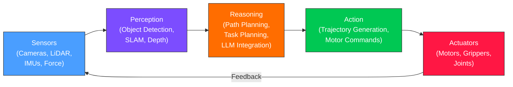

# باب 1: فزیکل اے آئی (Physical AI) کا تعارف

## سیکھنے کے مقاصد

<div dir="rtl">

اس باب کے اختتام تک، آپ اس قابل ہو جائیں گے:

*   **فزیکل اے آئی (Physical AI)** کی تعریف کر سکیں گے اور وضاحت کر سکیں گے کہ یہ روایتی سافٹ ویئر پر مبنی اے آئی (AI) سے کس طرح مختلف ہے۔
*   فزیکل اے آئی (Physical AI) اسٹیک (سینسرز (Sensors)، پرسیپشن (Perception)، ریزننگ (Reasoning)، ایکشن (Action)، ایکچوئیٹرز (Actuators)) اور ہر تہہ کے کردار کو **بیان** کر سکیں گے۔
*   کم از کم تین حقیقی ہیومنائیڈ روبوٹ (Robot) پلیٹ فارمز اور ان کی امتیازی صلاحیتوں کی **شناخت** کر سکیں گے۔
*   یہ **وضاحت** کر سکیں گے کہ آر او ایس ٹو (ROS 2) جدید فزیکل اے آئی (Physical AI) سسٹمز کی ریڑھ کی ہڈی کے طور پر کیوں کام کرتا ہے۔
*   ایک سادہ پائتھون سینسر (Sensor) سمولیشن (Simulation) لوپ کو **چلا** سکیں گے اور اس کی آؤٹ پٹ کی تشریح کر سکیں گے۔

</div>

---

## تعارف

<div dir="rtl">

آدھی رات کے وقت ایک گودام کا تصور کریں۔ شیلفوں کی قطاریں دور تک پھیلی ہوئی ہیں، جن میں ہزاروں پیکجز بھرے ہیں۔ ایک ہیومنائیڈ **روبوٹ (Robot)** ایک راہداری میں چلتا ہے، اپنے سینے پر لگے کیمرے سے بارکوڈ پڑھتا ہے، دو ہاتھوں سے 10 کلو گرام کا ڈبہ اٹھاتا ہے، اور اسے کنویئر بیلٹ پر رکھتا ہے۔ یہ بغیر کسی وقفے، بغیر کسی شکایت، اور بغیر کوئی پیکج گرائے آٹھ گھنٹے مسلسل یہ کام کرتا ہے۔

یہ منظر 2040 کے لیے کوئی تخمینہ نہیں ہے۔ کمپنیاں آج ایسے روبوٹ تعینات کر رہی ہیں۔ لیکن یہاں وہ سوال ہے جو آپ کے لیے ایک سیکھنے والے کے طور پر اہمیت رکھتا ہے: **روبوٹ کو کیسے معلوم ہوتا ہے کہ اسے کیا کرنا ہے؟**

اس کا جواب **فزیکل اے آئی (Physical AI)** ہے --- مصنوعی ذہانت جو ایک جسم کے اندر رہتی ہے اور حقیقی، گندی، غیر متوقع فزیکل دنیا میں کام کرتی ہے۔ ایک چیٹ باٹ (chatbot) کے برعکس جو سرور پر ٹیکسٹ پروسیس کرتا ہے، ایک فزیکل اے آئی (Physical AI) سسٹم کو رکاوٹیں دیکھنی پڑتی ہیں، حرکات کی منصوبہ بندی کرنی پڑتی ہے، اور موٹرز (motors) کو حقیقی وقت میں کمانڈ کرنا پڑتا ہے۔ اگر اس کا سافٹ ویئر کوئی غلط فیصلہ کرتا ہے، تو روبوٹ صرف ایک ایرر میسج (error message) واپس نہیں کرتا، بلکہ وہ گر جاتا ہے۔

یہ باب فزیکل اے آئی کے پیچھے کے بنیادی خیالات کا تعارف کراتا ہے۔ آپ تہوں پر مبنی آرکیٹیکچر (architecture) سیکھیں گے جو ہر فزیکل اے آئی سسٹم میں مشترک ہے، ان روبوٹ سے ملیں گے جو موجودہ بہترین حالت کی تعریف کرتے ہیں، اور سمجھیں گے کہ **آر او ایس ٹو (ROS 2)** نامی ایک **مڈل ویئر فریم ورک (Middleware Framework)** ہر چیز کو آپس میں کیوں جوڑتا ہے۔ آخر تک، آپ پائتھون (Python) میں اپنا پہلا **سمولیشن (Simulation)** سینسر لوپ چلا چکے ہوں گے، روبوٹ سافٹ ویئر بنانے کی جانب پہلا قدم اٹھاتے ہوئے۔

</div>

---

## 1.1 فزیکل اے آئی (Physical AI) کیا ہے؟

### بنیادی خیال

<div dir="rtl">

**فزیکل اے آئی (Physical AI)** سے مراد وہ اے آئی (AI) سسٹمز ہیں جو فزیکل دنیا میں پرسیو (perceive) کرتے ہیں، اس کے بارے میں ریزن (reason) کرتے ہیں، اور ایکٹ (act) کرتے ہیں۔ کلیدی لفظ 'ایکٹ' ہے۔ ایک لینگویج ماڈل (language model) کمرے کی صفائی کا منصوبہ بنا سکتا ہے، لیکن وہ جراب نہیں اٹھا سکتا۔ ایک فزیکل اے آئی سسٹم یہ کر سکتا ہے۔

اے آئی کو ایک اسپیکٹرم (spectrum) پر موجود تصور کریں۔

</div>

| Type | Input | Output | Example |
|------|-------|--------|---------|
| **Digital AI** | Text, images, data | Text, images, predictions | ChatGPT, DALL-E |
| **Cyber-Physical AI** | Sensor streams | Control signals | Self-driving cars |
| **Physical AI** | Sensor streams from a body | Motor commands to that body | Humanoid robots |

<div dir="rtl">

فزیکل اے آئی اس اسپیکٹرم کے دور دراز سرے پر ہے۔ اسے ایک جسم کی ضرورت ہوتی ہے --- آنکھوں کے لیے کیمرے، پٹھوں کے لیے موٹرز، اور دماغ کے لیے کمپیوٹر۔ سافٹ ویئر کو حقیقی وقت میں چلنا چاہیے کیونکہ فزیکل دنیا روبوٹ کے سوچنے کے دوران نہیں رکتی۔

</div>

### اب کیوں؟

<div dir="rtl">

تین کامیابیوں کے یکجا ہونے سے فزیکل اے آئی عملی بن گئی:

1.  **بڑے پیمانے پر سمولیشن**: **این ویڈیا (NVIDIA)** **آئزک سم (Isaac Sim)** جیسے پلیٹ فارمز فوٹو ریئلسٹک (photorealistic) ورچوئل (virtual) دنیا میں لاکھوں روبوٹ تعاملات کی سمولیشن کر سکتے ہیں۔ روبوٹ سمولیشن میں سیکھتے ہیں، پھر وہ مہارتیں حقیقی ہارڈ ویئر (hardware) میں منتقل کرتے ہیں۔
2.  **فاؤنڈیشن ماڈلز (Foundation Models)**: **ویژن-لینگویج-ایکشن (Vision-Language-Action - VLA) ماڈلز** روبوٹ کو "سرخ کپ اٹھاؤ" جیسے بولے گئے کمانڈز کو سمجھنے اور انہیں موٹر ایکشنز (actions) میں ترجمہ کرنے کی اجازت دیتے ہیں۔
3.  **ایج اے آئی ہارڈ ویئر (Edge AI Hardware)**: **این ویڈیا جیٹسن اورن (NVIDIA Jetson Orin)** جیسی چپس (chips) نیورل نیٹ ورکس (neural networks) کو براہ راست روبوٹ پر چلا سکتی ہیں، جس سے کلاؤڈ پر مبنی انفرنس (inference) کی لیٹینسی (latency) ختم ہو جاتی ہے۔

یہ تین ستون --- سمولیشن، فاؤنڈیشن ماڈلز، اور ایج کمپیوٹ (edge compute) --- وہ تکنیکی بنیاد بناتے ہیں جس پر یہ پوری درسی کتاب بنی ہے۔

</div>

---

## 1.2 فزیکل اے آئی (Physical AI) اسٹیک

<div dir="rtl">

ہر فزیکل اے آئی سسٹم، گودام کے بازو سے لے کر ہیومنائیڈ روبوٹ تک، اسی تہہ دار آرکیٹیکچر کی پیروی کرتا ہے۔ اس اسٹیک کو سمجھنا اس باب کا واحد سب سے اہم تصور ہے۔

</div>



<div dir="rtl">

آئیے ہر تہہ کو دیکھتے ہیں۔

</div>

### سینسرز (Input Layer)

<div dir="rtl">

**سینسرز (Sensors)** روبوٹ کے حواس ہیں۔ وہ فزیکل مظاہر کو ڈیجیٹل (digital) ڈیٹا (data) میں تبدیل کرتے ہیں:

*   **کیمرے** (RGB اور ڈیپتھ (depth)) بصری معلومات فراہم کرتے ہیں۔ انٹیل ریل سنس ڈی435آئی (Intel RealSense D435i) جیسا ڈیپتھ کیمرہ ہر پکسل (pixel) کے لیے رنگین تصویر اور فاصلے کی پیمائش دونوں پیدا کرتا ہے۔
*   **لائیڈار (LiDAR)** (لائٹ ڈیٹیکشن اینڈ رینجنگ) لیزر پلسز (laser pulses) خارج کرتا ہے اور یہ پیمائش کرتا ہے کہ انہیں واپس آنے میں کتنا وقت لگتا ہے، جس سے آس پاس کے ماحول کا ایک درست 3D نقشہ بنتا ہے۔
*   **آئی ایم یوز (IMUs)** (انرشیل میژرمنٹ یونٹس) ایکسلریشن (acceleration) اور اینگولر ویلوسٹی (angular velocity) کی پیمائش کرتے ہیں --- انہیں روبوٹ کے اندرونی کان سمجھیں، جو توازن کی معلومات فراہم کرتے ہیں۔
*   **فورس/ٹارک (Force/Torque) سینسر** اس بات کی پیمائش کرتے ہیں کہ روبوٹ کتنی سختی سے پکڑ رہا ہے یا دھکیل رہا ہے، جس سے نازک مینیپولیشن (manipulation) ممکن ہوتی ہے۔

</div>

### پرسیپشن (Perception) (سمجھنے کی تہہ)

<div dir="rtl">

خام سینسر ڈیٹا اس وقت تک بے کار ہے جب تک اس کی تشریح نہ کی جائے۔ پرسیپشن تہہ کیمرے کے پکسلز کو شناخت شدہ آبجیکٹس (objects) میں، لائیڈار پوائنٹ کلاؤڈز (point clouds) کو نیویگیبل (navigable) نقشوں میں، اور آئی ایم یو ریڈنگز (readings) کو اورینٹیشن (orientation) تخمینوں میں تبدیل کرتی ہے۔ کلیدی **الگورتھم (Algorithm)** میں شامل ہیں:

*   **آبجیکٹ ڈیٹیکشن (Object Detection)**: "1.2 میٹر آگے ایک کپ ہے۔"
*   **سلام (SLAM)** (سائمولٹینئس لوکلائزیشن اینڈ میپنگ): "میں اس طرح کے کمرے میں (3.5، 2.1) پوزیشن (position) پر ہوں۔"
*   **ڈیپتھ ایسٹیمیشن (Depth Estimation)**: "ٹیبل (table) کی سطح میرے گریپر (gripper) سے 0.75 میٹر نیچے ہے۔"

</div>

### ریزننگ (Reasoning) (فیصلے کی تہہ)

<div dir="rtl">

**ریزوننگ (Reasoning)** تہہ یہ فیصلہ کرتی ہے کہ کیا کرنا ہے۔ پرسیپشن تہہ کی دنیا کے بارے میں سمجھ کو دیکھتے ہوئے، یہ ایکشنز کی منصوبہ بندی کرتی ہے:

*   **ٹاسک پلاننگ (Task Planning)**: "ٹیبل صاف کرنے کے لیے، پہلے پلیٹ اٹھائیں، پھر سطح صاف کریں، پھر پلیٹ واپس رکھیں۔"
*   **پاتھ پلاننگ (Path Planning)**: "کچن (kitchen) تک پہنچنے کے لیے، 3 میٹر آگے جائیں، بائیں مڑیں، 5 میٹر جائیں۔"
*   **ایل ایل ایم انٹیگریشن (LLM Integration)**: "صارف نے 'مجھے پینے کو کچھ لاؤ' کہا۔ اس کا مطلب ہے: ایک کپ تلاش کرو، اسے اٹھاؤ، صارف تک جاؤ، اسے دے دو۔"

</div>

### ایکشن (Action) (عمل درآمد کی تہہ)

<div dir="rtl">

**ایکشن (Action)** تہہ ہائی-لیول (high-level) منصوبوں کو مخصوص موٹر کمانڈز (commands) میں تبدیل کرتی ہے۔ ایک پاتھ پلان (path plan) جو کہتا ہے "3 میٹر آگے بڑھو" ہر ٹانگ اور ہر موٹر کے لیے جوائنٹ اینگلز (joint angles)، ویلوسٹیز (velocities)، اور ٹارکس (torques) کی ایک ترتیب بن جاتا ہے۔

</div>

### ایکچوئیٹرز (Actuators) (آؤٹ پٹ تہہ)

<div dir="rtl">

**ایکچوئیٹرز (Actuators)** روبوٹ کے پٹھے ہیں۔ الیکٹرک موٹرز (electric motors) جوائنٹس (joints) کو گھماتی ہیں، لینیئر ایکچوئیٹرز (linear actuators) اعضاء کو پھیلاتے ہیں، اور گریپرز (grippers) کھلتے اور بند ہوتے ہیں۔ ڈایاگرام (diagram) میں فیڈ بیک (feedback) تیر (arrow) اہم ہے: ہر ایکشن کے بعد، سینسر نتیجہ کی پیمائش کرتے ہیں، اور یہ چکر دہرایا جاتا ہے۔

</div>

### اس کورس میں اسٹیک

<div dir="rtl">

اس درسی کتاب کا ہر ماڈیول (module) براہ راست فزیکل اے آئی اسٹیک کی تہوں سے تعلق رکھتا ہے:

</div>

| Module | Stack Layers Covered |
|--------|---------------------|
| Module 1 (ROS 2) | Communication between all layers |
| Module 2 (Gazebo) | Simulated sensors and actuators |
| Module 3 (Isaac) | Perception and navigation |
| Module 4 (VLA) | Reasoning and action |

---

## 1.3 حقیقی روبوٹ (Robot) جو میدان کی تشکیل کر رہے ہیں

<div dir="rtl">

خلاصہ میں فزیکل اے آئی کو سمجھنا مفید ہے، لیکن حقیقی سسٹمز کو دیکھنا تھیوری (theory) کو بنیاد فراہم کرتا ہے۔ یہاں تین پلیٹ فارمز ہیں جو موجودہ بہترین حالت کی تعریف کرتے ہیں۔

</div>

### بوسٹن ڈائنامکس (Boston Dynamics) سپاٹ (Spot) اور ایٹلس (Atlas)

<div dir="rtl">

بوسٹن ڈائنامکس (Boston Dynamics) تین دہائیوں سے زیادہ عرصے سے ڈائنامک (dynamic) روبوٹس بنا رہا ہے۔ **سپاٹ (Spot)**، ان کا کواڈروپیڈ (quadruped) (چار ٹانگوں والا) روبوٹ، پاور پلانٹس (power plants)، تعمیراتی مقامات، اور کانوں میں خودکار معائنہ کے لیے تجارتی طور پر تعینات کیا گیا ہے۔ سپاٹ لائیڈار، سٹیریو کیمروں، اور ایک جدید لوکوموشن کنٹرولر (locomotion controller) کا استعمال کرتا ہے تاکہ مشکل علاقے پر چل سکے۔

**ایٹلس (Atlas)**، ان کا ہیومنائیڈ (humanoid)، شاید دنیا کا سب سے زیادہ پہچانا جانے والا روبوٹ ہے۔ ایٹلس کا الیکٹرک (electric) ورژن (جو 2024 میں متعارف کرایا گیا) گودام کی لاجسٹکس (logistics) پر توجہ مرکوز کرتا ہے --- بھاری ڈبے اٹھانا، تنگ جگہوں میں نیویگیٹ (navigate) کرنا، اور انسانوں کے لیے ڈیزائن کیے گئے ماحول میں کام کرنا۔ ایٹلس یہ ظاہر کرتا ہے کہ بائیپیڈل (bipedal) روبوٹ ڈائنامک، پورے جسم کی مینیپولیشن انجام دے سکتے ہیں۔

</div>

### ٹیسلا (Tesla) اوپٹیمس (Optimus)

<div dir="rtl">

ٹیسلا کا **اوپٹیمس (Optimus)** (جسے ٹیسلا بوٹ (Tesla Bot) بھی کہا جاتا ہے) ایک مختلف فلسفہ کی نمائندگی کرتا ہے: آٹوموٹو (automotive) مینوفیکچرنگ (manufacturing) پیمانے پر ایک عام مقصد والا ہیومنائیڈ بنائیں۔ اوپٹیمس ٹیسلا کی خودکار ڈرائیونگ کاروں (self-driving cars) کے لیے تیار کردہ وہی ویژن نیورل نیٹ ورکس (vision neural networks) استعمال کرتا ہے، جسے چلتے ہوئے جسم کے لیے دوبارہ تیار کیا گیا ہے۔ ٹیسلا نے اوپٹیمس کو اشیاء کی ترتیب، کپڑے فولڈنگ، اور ناہموار زمین پر چلتے ہوئے دکھایا ہے۔ ٹیسلا کے نقطہ نظر سے کلیدی بصیرت یہ ہے کہ خود مختار ڈرائیونگ (autonomous driving) اور ہیومنائیڈ روبوٹکس (humanoid robotics) ایک ہی بنیادی مسئلہ کا اشتراک کرتے ہیں: کیمروں سے دنیا کو پرسیو کرنا اور حقیقی وقت میں اس پر ایکٹ کرنا۔

</div>

### فگر 02 (Figure 02)

<div dir="rtl">

**فگر اے آئی (Figure AI)** خاص طور پر تجارتی کام کے لیے ڈیزائن کیے گئے ہیومنائیڈز بناتا ہے۔ ان کا فگر 02 روبوٹ بڑے لینگویج ماڈلز (large language models) کو مربوط کرتا ہے۔ ایک اہم مظاہرے میں، فگر 01 (Figure 01) سے پوچھا گیا کہ "کیا آپ مجھے کھانے کو کچھ دے سکتے ہیں؟" اور اس نے میز پر موجود سیب کی صحیح شناخت کی، اسے اٹھایا، اور شخص کو دے دیا۔ اس نے ویژن-لینگویج-ایکشن (VLA) ماڈلز کو فزیکل روبوٹ باڈی (body) کے ساتھ جوڑنے کی عملی طاقت کو ظاہر کیا۔ فگر 02 بہتر مینیپولیشن اور تیز رفتار انفرنس (inference) کے ساتھ اس کو مزید آگے بڑھاتا ہے۔

</div>

### مشترکہ دھاگہ

<div dir="rtl">

اپنے اختلافات کے باوجود، یہ تمام تینوں پلیٹ فارمز سیکشن 1.2 میں بیان کردہ وہی فزیکل اے آئی اسٹیک کا اشتراک کرتے ہیں، اور یہ سب مواصلات کے لیے آر او ایس ٹو (یا اس سے متاثر آرکیٹیکچرز) کا استعمال کرتے ہیں۔

</div>

---

## 1.4 آر او ایس ٹو (ROS 2) ریڑھ کی ہڈی کیوں ہے؟

<div dir="rtl">

آپ سوچ سکتے ہیں: روبوٹ سافٹ ویئر (software) کے لیے ہمیں ایک خاص فریم ورک (framework) کی ضرورت کیوں ہے؟ ہم صرف پائتھون اسکرپٹس (Python scripts) کیوں نہیں لکھتے جو سینسر پڑھیں اور موٹرز کو کمانڈ کریں؟

جواب پیچیدگی ہے۔ ایک حقیقی روبوٹ درجنوں سافٹ ویئر پروسیسز (processes) کو بیک وقت چلاتا ہے: ہر کیمرے کے لیے ایک، سلام کے لیے ایک، پاتھ پلاننگ (path planning) کے لیے ایک، موٹر کنٹرول (motor control) کے لیے ایک، سیفٹی مانیٹرنگ (safety monitoring) کے لیے ایک۔ ان پروسیسز کو حقیقی وقت میں، قابل اعتماد طریقے سے، اور مختلف کمپیوٹرز (computers) پر مواصلت کرنی چاہیے۔ روبوٹ کے سر پر موجود ایک کیمرہ **نوڈ (Node)** تصاویر کو روبوٹ کے مین کمپیوٹر (main computer) پر ایک پرسیپشن نوڈ پر بھیجتا ہے، جو شناخت شدہ آبجیکٹس کو ایک پلاننگ نوڈ پر بھیجتا ہے، جو موٹر کمانڈز کو روبوٹ کی ٹانگوں میں کنٹرولرز (controllers) کو بھیجتا ہے۔

**آر او ایس ٹو (ROS 2)** (روبوٹ آپریٹنگ سسٹم (Robot Operating System) 2) مواصلاتی انفراسٹرکچر (infrastructure) فراہم کرتا ہے جو اسے ممکن بناتا ہے۔ یہ روایتی معنوں میں (جیسے لینکس (Linux) یا ونڈوز (Windows)) ایک آپریٹنگ سسٹم (operating system) نہیں ہے۔ یہ ایک مڈل ویئر فریم ورک ہے --- لائبریریوں (libraries) اور ٹولز (tools) کا ایک سیٹ (set) جو میسج پاسنگ (message passing)، نوڈ ڈسکوری (node discovery)، اور لائف سائیکل مینجمنٹ (lifecycle management) کو ہینڈل (handle) کرتا ہے۔

آر او ایس ٹو کے صنعت کا معیار ہونے کی کلیدی وجوہات:

*   **پبلشر-سبسکرائبر میسجنگ (Publisher-Subscriber Messaging)**: نوڈز نامی **ٹاپکس (Topics)** پر میسجز (messages) پبلش (publish) کرکے مواصلت کرتے ہیں۔ کوئی بھی نوڈ کسی بھی ٹاپک کو سبسکرائب (subscribe) کر سکتا ہے۔ یہ سافٹ ویئر اجزاء کو ڈیکپل (decouple) کرتا ہے، جس سے سسٹمز (systems) ماڈیولر (modular) اور ٹیسٹ ایبل (testable) بنتے ہیں۔
*   **ڈی ڈی ایس مڈل ویئر (DDS Middleware)**: آر او ایس ٹو **ڈیٹا ڈسٹری بیوشن سروس (Data Distribution Service - DDS)** کا استعمال کرتا ہے، جو حقیقی وقت کے ڈیٹا ایکسچینج (exchange) کے لیے ایک صنعتی درجہ کا پروٹوکول (protocol) ہے۔ ڈی ڈی ایس ڈسکوری (discovery) (نوڈز ایک دوسرے کو خود بخود تلاش کرتے ہیں) اور کوالٹی آف سروس (quality-of-service) (آپ قابل اعتمادی، لیٹینسی (latency)، اور ترجیح کو ترتیب دے سکتے ہیں) کو ہینڈل کرتا ہے۔
*   **لینگویج سپورٹ (Language Support)**: آر او ایس ٹو میں پائتھون اور سی++ (C++) کے لیے فرسٹ-کلاس (first-class) سپورٹ (support) ہے۔ آپ اس درسی کتاب میں پائتھون کا استعمال کریں گے۔
*   **ایکو سسٹم (Ecosystem)**: نیویگیشن (navigation)، مینیپولیشن، پرسیپشن، اور سمولیشن کے لیے ہزاروں پیکیجز (packages) موجود ہیں۔ آپ کو ہر چیز شروع سے بنانے کی ضرورت نہیں ہے۔
*   **سمولیشن انٹیگریشن (Simulation Integration)**: آر او ایس ٹو **گیزبو (Gazebo)** اور این ویڈیا آئزک سم کے ساتھ بغیر کسی رکاوٹ کے ضم ہوتا ہے، جو اس کورس میں شامل دو سمولیشن پلیٹ فارمز ہیں۔

آپ باب 3 میں آر او ایس ٹو کو انسٹال (install) کرنا اور استعمال کرنا شروع کریں گے۔ فی الحال، یہ سمجھ لیں کہ آر او ایس ٹو وہ گوند ہے جو فزیکل اے آئی اسٹیک کی ہر تہہ کو جوڑتا ہے۔

</div>

---

## 1.5 آپ کا پہلا سینسر (Sensor) سمولیشن (Simulation)

<div dir="rtl">

آئیے کوڈ لکھتے ہیں۔ آر او ایس ٹو کو انسٹال کرنے سے پہلے بھی، آپ فزیکل اے آئی کے بنیادی پیٹرن (pattern) کی سمولیشن کر سکتے ہیں: ایک سینسر ریڈنگ لوپ (reading loop)۔ روبوٹکس (robotics) میں، سینسر مسلسل ڈیٹا پیدا کرتے ہیں، اور سافٹ ویئر کو ہر ریڈنگ کو اس کے آنے کے ساتھ ہی پروسیس (process) کرنا چاہیے۔

مندرجہ ذیل پائتھون اسکرپٹ تین سینسرز کے ساتھ ایک روبوٹ کی سمولیشن کرتا ہے: ایک ٹمپریچر سینسر (temperature sensor)، ایک ڈسٹنس سینسر (distance sensor) (جیسے لائیڈار)، اور ایک بیٹری لیول مانیٹر (battery level monitor)۔ یہ ایک لوپ (loop) میں ویلیوز (values) پڑھتا ہے، بالکل اسی طرح جیسے ایک حقیقی روبوٹ کرے گا۔

</div>

```python
# filename: sensor_simulation.py
# A simple simulation of robot sensor readings.
# No ROS 2 required — pure Python to illustrate the sensor loop concept.

import random
import time

def read_temperature():
    """Simulate a temperature sensor (Celsius). Normal range: 20-30."""
    return round(20.0 + random.uniform(0, 10), 1)

def read_distance():
    """Simulate a LiDAR distance reading (meters). Range: 0.1 to 5.0."""
    return round(random.uniform(0.1, 5.0), 2)

def read_battery():
    """Simulate battery level (percent). Slowly drains over time."""
    # We use a global counter to simulate drain
    read_battery.level = getattr(read_battery, 'level', 100.0)
    read_battery.level -= random.uniform(0.1, 0.5)
    return round(max(read_battery.level, 0.0), 1)

def main():
    print("=== Robot Sensor Simulation ===")
    print(f"{'Time':>6}  {'Temp (C)':>9}  {'Distance (m)':>13}  {'Battery (%)':>12}")
    print("-" * 48)

    for tick in range(10):
        temp = read_temperature()
        dist = read_distance()
        batt = read_battery()

        # Flag warnings — this is what a reasoning layer would do
        warning = ""
        if temp > 28.0:
            warning += " [WARN: HIGH TEMP]"
        if dist < 0.5:
            warning += " [WARN: OBSTACLE CLOSE]"
        if batt < 20.0:
            warning += " [WARN: LOW BATTERY]"

        print(f"{tick:>6}  {temp:>9}  {dist:>13}  {batt:>12}{warning}")
        time.sleep(0.5)  # Simulate 2 Hz sensor rate

    print("\nSimulation complete.")

if __name__ == "__main__":
    main()
```

**Expected output** (values will vary due to randomness):

```
=== Robot Sensor Simulation ===
  Time   Temp (C)  Distance (m)  Battery (%)
------------------------------------------------
     0       23.4           3.21         99.7
     1       27.1           0.43         99.3 [WARN: OBSTACLE CLOSE]
     2       29.5           2.87         98.9 [WARN: HIGH TEMP]
     3       21.8           4.12         98.5
     4       25.6           1.05         98.1
     5       28.3           0.22         97.8 [WARN: HIGH TEMP] [WARN: OBSTACLE CLOSE]
     6       24.9           3.56         97.4
     7       22.1           2.33         97.0
     8       26.7           1.78         96.5
     9       20.3           4.89         96.1
```

### یہ کوڈ کیا سکھاتا ہے

<div dir="rtl">

یہ سادہ اسکرپٹ چار بنیادی فزیکل اے آئی تصورات کو ظاہر کرتا ہے:

1.  **سینسر پولنگ لوپ (Sensor Polling Loop)**: حقیقی روبوٹ سینسرز کو ایک مقررہ شرح (rate) پر پڑھتے ہیں (یہاں 2 ہرٹز (Hz))۔ آر او ایس ٹو میں، یہ پیٹرن ایک نوڈ کے اندر ایک ٹائمر کال بیک (timer callback) بن جاتا ہے۔
2.  **متعدد سینسر سٹریمز (Multiple Sensor Streams)**: ایک روبوٹ ایک ساتھ بہت سے ڈیٹا سٹریمز (streams) کو پروسیس کرتا ہے۔ ہر `read_*` فنکشن (function) ایک مختلف سینسر کی نمائندگی کرتا ہے۔
3.  **تھریشولڈ پر مبنی ریزننگ (Threshold-based Reasoning)**: وارننگ (warning) منطق اس کا ایک قدیم ورژن (version) ہے جو ریزننگ تہہ کرتی ہے --- سینسر ڈیٹا کی تشریح کرنا اور اہم حالات کو جھنڈا لگانا۔
4.  **ٹائم سیریز ڈیٹا (Time-Series Data)**: سینسر کی قدریں وقت کے ساتھ بدلتی ہیں۔ بیٹری (battery) ڈرین (drain) ہوتی ہے۔ فاصلہ میں اتار چڑھاؤ آتا ہے۔ ایک روبوٹ کو اس مسلسل بہاؤ کو ہینڈل کرنا چاہیے۔

باب 3 میں، آپ اس خام پائتھون لوپ کو ایک مناسب آر او ایس ٹو نوڈ سے بدل دیں گے جو ٹاپکس پر سینسر ڈیٹا پبلش کرتا ہے، جس سے دوسرے نوڈز کو سبسکرائب کرنے اور رد عمل ظاہر کرنے کی اجازت ملتی ہے۔

</div>

---

## 1.6 سمولیشن (Simulation) سے حقیقت کی طرف

<div dir="rtl">

ایک سوال جو آپ کے ذہن میں آ سکتا ہے: "اگر ہم سمولیشن میں کام کر رہے ہیں، تو کیا اس سے فرق پڑتا ہے؟" جواب ایک پرجوش ہاں ہے۔ اس کی وجہ یہ ہے۔

جدید روبوٹ کی ترقی ایک **سم-ٹو-ریل (sim-to-real) پائپ لائن (pipeline)** کی پیروی کرتی ہے:

1.  آر او ایس ٹو نوڈز کا استعمال کرتے ہوئے سافٹ ویئر اسٹیک بنائیں۔ (ماڈیول 1 اور 2)
2.  لاکھوں ٹرائلز (trials) کا استعمال کرتے ہوئے سمولیشن میں رویوں کو تربیت دیں۔ (ماڈیول 3)
3.  تصادفی ماحول اور سینسر شور (noise) کے ساتھ سمولیشن میں توثیق کریں۔
4.  کم سے کم کوڈ (code) تبدیلیوں کے ساتھ حقیقی ہارڈ ویئر پر تعینات کریں۔

کلیدی بصیرت یہ ہے کہ جو آر او ایس ٹو کوڈ آپ سمولیشن میں لکھتے ہیں وہی کوڈ ہے جو ایک حقیقی روبوٹ پر چلتا ہے۔ صرف ایک چیز جو بدلتی ہے وہ ڈیٹا کا ماخذ (source) ہے: ایک سمولیشن کیمرے کے بجائے، آپ ایک حقیقی کیمرہ جوڑتے ہیں۔ آر او ایس ٹو کا پبلشر-سبسکرائبر آرکیٹیکچر اس تبادلے کو ہموار بناتا ہے۔

یہی وجہ ہے کہ این ویڈیا، بوسٹن ڈائنامکس، اور ٹیسلا سب سمولیشن میں بھاری سرمایہ کاری کرتے ہیں۔ یہ کوئی شارٹ کٹ (shortcut) نہیں ہے --- یہ فزیکل اے آئی کے لیے معیاری ترقی کا ورک فلو (workflow) ہے۔

</div>

```python
# filename: sim_vs_real.py
# Demonstrates how the same processing logic works with different data sources.
# In a real system, you would swap SimulatedSensor for a hardware driver.

class SimulatedSensor:
    """Produces fake distance readings for testing."""
    def __init__(self):
        import random
        self._random = random

    def read(self):
        return round(self._random.uniform(0.5, 4.0), 2)

class RealSensor:
    """Placeholder for a real hardware sensor driver."""
    def read(self):
        # In production, this would read from USB, I2C, or a ROS 2 topic.
        raise NotImplementedError("Connect real hardware to use this.")

def process_reading(distance):
    """Same logic regardless of data source."""
    if distance < 1.0:
        return "STOP — obstacle too close"
    elif distance < 2.0:
        return "SLOW — approaching obstacle"
    else:
        return "CLEAR — full speed ahead"

# --- Usage ---
sensor = SimulatedSensor()  # Swap to RealSensor() on hardware
for i in range(5):
    d = sensor.read()
    action = process_reading(d)
    print(f"Reading {i}: {d:.2f}m -> {action}")
```

**Expected output** (values will vary):

```
Reading 0: 2.45m -> CLEAR — full speed ahead
Reading 1: 0.87m -> STOP — obstacle too close
Reading 2: 1.53m -> SLOW — approaching obstacle
Reading 3: 3.21m -> CLEAR — full speed ahead
Reading 4: 1.02m -> SLOW — approaching obstacle
```

<div dir="rtl">

`process_reading` فنکشن کو اس بات کی پرواہ نہیں ہے کہ فاصلہ ایک سمولیشن سینسر سے آیا ہے یا ایک حقیقی لائیڈار سے۔ خدشات کی یہ علیحدگی اس بات کی بنیادی بنیاد ہے کہ پیشہ ورانہ روبوٹ سافٹ ویئر کو کیسے ڈیزائن کیا جاتا ہے۔

</div>

---

## خلاصہ

<div dir="rtl">

اس باب نے ان بنیادی تصورات کا تعارف کرایا جو پوری درسی کتاب کی بنیاد ہیں۔

*   **فزیکل اے آئی** ایک مصنوعی ذہانت ہے جو سینسرز اور ایکچوئیٹرز کے ساتھ ایک جسم کے ذریعے فزیکل دنیا میں پرسیو، ریزن، اور ایکٹ کرتی ہے۔
*   **فزیکل اے آئی اسٹیک** (سینسرز، پرسیپشن، ریزننگ، ایکشن، ایکچوئیٹرز) ہر روبوٹ کے ذریعے مشترک ایک عالمی آرکیٹیکچر ہے، گودام کے بازوؤں سے لے کر ہیومنائیڈز تک۔
*   بوسٹن ڈائنامکس ایٹلس، ٹیسلا اوپٹیمس، اور فگر 02 جیسے حقیقی روبوٹ یہ ظاہر کرتے ہیں کہ فزیکل اے آئی پہلے ہی تجارتی طور پر قابل عمل ہے، نہ کہ کوئی دور کا تحقیقی ہدف۔
*   **آر او ایس ٹو** وہ مڈل ویئر فریم ورک ہے جو اسٹیک کی تمام تہوں کو جوڑتا ہے، جو پبلشر-سبسکرائبر میسجنگ، حقیقی وقت میں مواصلت، اور سمولیشن ٹولز (tools) کے ساتھ انٹیگریشن (integration) فراہم کرتا ہے۔
*   **سم-ٹو-ریل پائپ لائن** کا مطلب ہے کہ جو کوڈ آپ سمولیشن میں لکھتے ہیں وہی کوڈ حقیقی ہارڈ ویئر پر چلتا ہے۔
*   ایک **سینسر لوپ** فزیکل اے آئی کا بنیادی پیٹرن ہے: سینسرز پڑھیں، ڈیٹا پروسیس کریں، ایکشنز کا فیصلہ کریں، دہرائیں۔

</div>

---

## ہینڈز-آن ایکسرسائز

### مقصد

<div dir="rtl">

اس کورس کے لیے اپنے ڈویلپمنٹ انوائرمنٹ (development environment) کو پائتھون اور (اختیاری طور پر) آر او ایس ٹو کی تنصیبات کی جانچ کرکے، پھر سینسر سمولیشن کو بڑھا کر تیار کریں۔

</div>

### پیشگی ضروریات

<div dir="rtl">

*   اوبنٹو (Ubuntu) 22.04 (تجویز کردہ) یا پائتھون 3.10+ کے ساتھ کوئی بھی آپریٹنگ سسٹم (OS) چلانے والا کمپیوٹر (computer)
*   ایک ٹرمینل (terminal) / کمانڈ لائن (command line)

</div>

### اقدامات

<div dir="rtl">

1.  **اپنے پائتھون ورژن (version) کی جانچ کریں**:

</div>

```bash
python3 --version
```

<div dir="rtl">

آپ کو `Python 3.10.x` یا اس سے زیادہ نظر آنا چاہیے۔

2.  **سینسر سمولیشن چلائیں**:

    سیکشن 1.5 سے `sensor_simulation.py` کوڈ کو ایک فائل (file) میں محفوظ کریں اور اسے چلائیں:

</div>

```bash
python3 sensor_simulation.py
```

<div dir="rtl">

تصدیق کریں کہ آپ کو وقفے وقفے سے وارننگز (warnings) کے ساتھ سینسر ریڈنگز کی 10 لائنیں نظر آتی ہیں۔

3.  **سمولیشن کو بڑھائیں**: ایک چوتھا سینسر فنکشن `read_orientation()` شامل کریں جو 0 اور 360 ڈگری (degrees) کے درمیان ایک بے ترتیب زاویہ (angle) واپس کرتا ہے (ایک کمپاس ہیڈنگ (compass heading) کی سمولیشن کرتے ہوئے)۔ اسے آؤٹ پٹ (output) ٹیبل (table) میں شامل کریں اور اگر ہیڈنگ (heading) مسلسل ریڈنگز (readings) کے درمیان 45 ڈگری سے زیادہ تبدیل ہوتی ہے تو ایک وارننگ شامل کریں۔

4.  **(اختیاری) آر او ایس ٹو کی تصدیق کریں**: اگر آپ نے پہلے ہی آر او ایس ٹو ہبل (ROS 2 Humble) انسٹال کر لیا ہے، تو چلائیں:

</div>

```bash
source /opt/ros/humble/setup.bash
ros2 --version
```

<div dir="rtl">

آپ کو `ros2 0.9.x` جیسی آؤٹ پٹ نظر آنی چاہیے (صحیح نمبر آپ کے پیچ لیول (patch level) پر منحصر ہے)۔ اگر آپ نے ابھی تک آر او ایس ٹو انسٹال نہیں کیا ہے، تو پریشان نہ ہوں --- ہم باب 3 میں تنصیب کے ذریعے آپ کی رہنمائی کریں گے۔

</div>

### متوقع نتیجہ

<div dir="rtl">

مرحلہ 3 مکمل کرنے کے بعد، آپ کی توسیعی سمولیشن اسی طرح کی آؤٹ پٹ پیدا کرے گی:

</div>

```
  Time   Temp (C)  Distance (m)  Battery (%)  Heading (deg)
---------------------------------------------------------------
     0       23.4           3.21         99.7          182.3
     1       27.1           0.43         99.3           47.5 [WARN: HEADING JUMP]
     ...
```

### تصدیق

<div dir="rtl">

اگر آپ نے یہ مشق کامیابی سے مکمل کر لی ہے تو:
*   پائتھون 3.10+ کی تنصیب کی تصدیق ہو گئی ہے۔
*   سینسر سمولیشن بغیر کسی خرابی کے چلتی ہے اور آؤٹ پٹ کی 10 قطاریں پیدا کرتی ہے۔
*   آپ کی توسیعی سمولیشن میں ہیڈنگ کالم (column) اور ہیڈنگ جمپ وارننگز (heading-jump warnings) شامل ہیں۔

</div>

---

## مزید مطالعہ

<div dir="rtl">

*   **پچھلا**: [پیش لفظ اور کورس کا جائزہ](../intro/index.md) --- درسی کتاب کا تعارف اور کورس کا ڈھانچہ۔
*   **اگلا**: [باب 2: مجسم ذہانت](ch02-embodied-intelligence.md) --- ذہانت کے لیے جسم کیوں اہمیت رکھتے ہیں اور سینسری موٹر لوپ (sensorimotor loop)۔
*   **آر او ایس ٹو (ROS 2) آفیشل ڈاکومینٹیشن (official documentation)**: [https://docs.ros.org/en/humble/](https://docs.ros.org/en/humble/)
*   **بوسٹن ڈائنامکس ایٹلس (Boston Dynamics Atlas)**: [https://bostondynamics.com/atlas/](https://bostondynamics.com/atlas/)
*   **ٹیسلا اوپٹیمس (Tesla Optimus)**: [https://www.tesla.com/optimus](https://www.tesla.com/optimus)
*   **فگر اے آئی (Figure AI)**: [https://figure.ai/](https://figure.ai/)
*   **این ویڈیا آئزک (NVIDIA Isaac)**: [https://developer.nvidia.com/isaac](https://developer.nvidia.com/isaac)

</div>