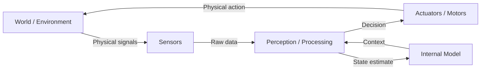

# باب 2: مجسم ذہانت اور سینسرز

## سیکھنے کے مقاصد

<div dir="rtl">

اس باب کے اختتام تک، آپ اس قابل ہو جائیں گے کہ:

- **مجسم ذہانت (embodied intelligence)** کے تصور کی وضاحت کریں اور یہ کہ کس طرح جسمانی مجسم ہونا مصنوعی ذہانت (AI) کی نوعیت کو بدل دیتا ہے۔
- ہیومنائیڈ روبوٹ (humanoid robot) میں استعمال ہونے والے اہم سینسر (sensor) کی اقسام کی نشاندہی کریں (کیمرہ (camera)، لائیڈار (LiDAR)، آئی ایم یو (IMU)، فورس/ٹارک سینسرز (force/torque sensors))۔
- بیان کریں کہ سینسر فیوژن (sensor fusion) کیوں ضروری ہے اور کس طرح متعدد سینسر ایک دوسرے کی تکمیل کرتے ہیں۔
- ایک آر او ایس ٹو (ROS 2) سبسکرائبر نوڈ (subscriber node) لکھیں جو لائیڈار (LiDAR) ٹاپک (topic) سے پڑھے اور رکاوٹوں (obstacles) کی نشاندہی کرے۔
- ایک بنیادی ری ایکٹو کنٹرولر (reactive controller) نافذ کریں جو سینسر ڈیٹا (sensor data) کو ٹکراؤ (collisions) سے بچنے کے لیے استعمال کرتا ہے۔

</div>

---

## تعارف

<div dir="rtl">

1990 میں، روبوٹکسٹ (roboticist) راڈنی بروکس نے ایک مقالہ شائع کیا جس نے مصنوعی ذہانت (AI) کے مروجہ نظریے کو چیلنج کیا۔ روایتی حکمت عملی یہ تھی کہ ذہانت محض کمپیوٹیشنل (computational) ہے — ایک کافی طاقتور کمپیوٹر صحیح الگورتھم (algorithm) چلا کر بالآخر ذہین رویہ (intelligent behavior) پیدا کرے گا۔ بروکس نے اس کے برعکس دلیل دی: ذہانت کوئی ایسی چیز نہیں ہے جو کمپیوٹر کے اندر ہوتی ہے۔ یہ ایک جسم اور اس کے ماحول (environment) کے درمیان تعامل سے ابھرتی ہے۔

انہوں نے اسے **مجسم ذہانت** کا نام دیا — یہ خیال کہ ایک جسمانی جسم کا ہونا، ایسے سینسر (sensor) کے ساتھ جو دنیا کو محسوس کرتے ہیں اور ایسے ایکچوئیٹر (actuators) کے ساتھ جو اسے بدلتے ہیں، ایک روبوٹ (robot) کے لیے نہ صرف مفید ہے بلکہ حقیقی ذہانت کا *بنیادی حصہ* ہے۔ ایک غیر مجسم شطرنج پروگرام، چاہے کتنا ہی نفیس کیوں نہ ہو، یہ نہیں سیکھ سکتا کہ آگ خطرناک ہے یا برف پھسلن بھری ہے۔ صرف ایک جسم جس نے ان چیزوں کا تجربہ کیا ہو، انہیں صحیح معنوں میں جان سکتا ہے۔

یہ باب اس بات کو تلاش کرتا ہے کہ ایک روبوٹ کے لیے دنیا کو محسوس کرنا (perceive) کیا معنی رکھتا ہے۔ آپ ان سینسرز کے بارے میں جانیں گے جو روبوٹس کو ان کے "حواس" دیتے ہیں، یہ سینسر کس طرح ڈیٹا (data) پیدا کرتے ہیں جسے آر او ایس ٹو (ROS 2) پروسیس (process) کر سکتا ہے، اور سینسر ان پٹ پر ردعمل ظاہر کرنے والا کوڈ (code) کیسے لکھنا ہے۔ یہ وہ بنیاد ہے جس پر اس کورس میں ہر چیز کی تعمیر ہوتی ہے — کیونکہ ایک روبوٹ کے استدلال کرنے (reason) یا عمل کرنے (act) سے پہلے، اسے پہلے *محسوس* کرنے کے قابل ہونا چاہیے۔

</div>

---

## مجسم ذہانت کیا ہے؟

<div dir="rtl">

**مجسم ذہانت** اس اصول سے مراد ہے کہ ذہین رویہ ایک ایجنٹ (agent) کے جسم، اس کے سینسر (sensor)، اور طبعی ماحول (physical environment) کے درمیان مسلسل تعامل سے پیدا ہوتا ہے۔ یہ مصنوعی ذہانت (AI) کے کلاسک "برین ان اے ویٹ" ماڈل کے برعکس ہے، جہاں ذہانت محض علامتی کمپیوٹیشن (symbolic computation) ہے جو طبعی دنیا سے منقطع ہوتی ہے۔

غور کریں کہ ایک بچہ کشش ثقل (gravity) کے بارے میں کیسے سیکھتا ہے۔ وہ اسے پہلے درسی کتاب (textbook) سے نہیں سیکھتے۔ وہ اشیاء کو گرا کر، چیزوں سے گر کر، اور اپنے ہاتھوں میں وزن محسوس کر کے سیکھتے ہیں۔ جسم صرف ذہن کے لیے ایک گاڑی نہیں ہے — یہ ادراکی نظام (cognitive system) کا حصہ ہے۔

روبوٹس کے لیے، یہ ایک اہم ڈیزائن اصول میں ترجمہ ہوتا ہے: **ایک سینسر (sensor) کے بغیر روبوٹ (robot) اندھا ہوتا ہے، اور ایک اندھا روبوٹ ذہین نہیں ہو سکتا**۔ ایک روبوٹ کا ہر فیصلہ بالآخر طبعی دنیا سے حاصل کردہ ڈیٹا (data) پر مبنی ہونا چاہیے۔ جتنا زیادہ اور قابل اعتماد وہ ڈیٹا ہو گا، اتنا ہی روبوٹ زیادہ قابل ہو جائے گا۔

</div>

### سینسریموتور لوپ

<div dir="rtl">

تمام جسمانی طور پر مجسم (physically-embodied) مصنوعی ذہانت (AI) کے نظام **سینسریموتور لوپ (sensorimotor loop)** پر کام کرتے ہیں — یہ حس کرنے، پروسیسنگ (processing) کرنے اور عمل کرنے کا ایک مسلسل چکر ہے:

</div>



<div dir="rtl">

یہ لوپ مسلسل چلتا رہتا ہے، عام طور پر ٹاسک (task) کے لحاظ سے 10–1000 ہرٹز (Hz) کی شرح سے۔ ایک روبوٹ (robot) جو ایک بھری ہوئی راہداری میں نیویگیٹ (navigating) کر رہا ہے، وہ لائیڈار (LiDAR) کا استعمال کرتے ہوئے 10 ہرٹز (Hz) پر اپنے رکاوٹ کے نقشے (obstacle map) کو اپ ڈیٹ کر سکتا ہے جبکہ بیک وقت آئی ایم یو (IMU) ڈیٹا (data) کا استعمال کرتے ہوئے 500 ہرٹز (Hz) پر اپنے بیلنس کنٹرولر (balance controller) کو اپ ڈیٹ کر سکتا ہے۔ سینسر شور (sensor noise) اور ایکچوئیٹر کی غلطی (actuator imprecision) کے باوجود — اس لوپ کو حقیقی وقت میں قابل اعتماد طریقے سے مکمل کرنے کی صلاحیت — فزیکل اے آئی (Physical AI) کا بنیادی انجینئرنگ چیلنج (engineering challenge) ہے۔

</div>

---

## ہیومنائیڈ روبوٹس کے لیے سینسر سسٹمز

<div dir="rtl">

ایک ہیومنائیڈ روبوٹ (humanoid robot) عام طور پر سینسرز کا ایک سیٹ رکھتا ہے، جن میں سے ہر ایک دنیا کے بارے میں مختلف قسم کی معلومات فراہم کرتا ہے۔ یہ سمجھنا کہ ہر سینسر (sensor) کیا کرتا ہے، اور کیا نہیں کر سکتا، مضبوط روبوٹک سسٹمز (robotic systems) ڈیزائن کرنے کے لیے ضروری ہے۔

</div>

### آر جی بی کیمرے (RGB Cameras)

<div dir="rtl">

**یہ کیا محسوس کرتے ہیں**: رنگین تصاویر، 30–60 ایف پی ایس (fps) پر ٹو ڈی پکسل ارے (2D pixel array)۔

آر جی بی کیمرے (RGB camera) زیادہ تر روبوٹس پر سب سے زیادہ انفارمیشن-ڈینس سینسر (sensor) ہیں۔ ایک واحد کیمرہ (camera) فریم میں لاکھوں پکسل (pixel) ہوتے ہیں، ہر ایک رنگ اور چمک کو انکوڈ کرتا ہے۔ ایمج ڈیٹا (image data) پر تربیت یافتہ ڈیپ لرننگ ماڈلز (deep learning models) اس سٹریم سے اشیاء، چہرے، متن اور منظر کے لے آؤٹ کو نکال سکتے ہیں۔

**حدود**: کیمرے (camera) براہ راست گہرائی کی معلومات (depth information) فراہم نہیں کرتے۔ بہت مختلف فاصلوں پر موجود دو اشیاء ایک ہی سائز کی نظر آ سکتی ہیں۔ روشنی میں تبدیلی — سائے، چکاچوند، کم روشنی — ویژن الگورتھم (vision algorithms) کو توڑ سکتی ہے جو لیب کے حالات میں بالکل کام کرتے ہیں۔

</div>

### ڈیپتھ کیمرے (RGB-D Depth Cameras)

<div dir="rtl">

**یہ کیا محسوس کرتے ہیں**: رنگین تصاویر + پر-پکسل فاصلے کے تخمینے (per-pixel distance estimates) (پوائنٹ کلاؤڈ (point clouds))۔

انٹیل ریئل سنس ڈی435 (Intel RealSense D435) اور زیڈ 2 (ZED 2) جیسے ڈیپتھ کیمرے (depth camera) ایک آر جی بی کیمرہ (RGB camera) کو ایک انفراریڈ ڈیپتھ سینسر (infrared depth sensor) کے ساتھ جوڑتے ہیں۔ آؤٹ پٹ میں ہر پکسل (pixel) میں رنگ کی قدر اور فاصلے کی پیمائش دونوں ہوتی ہے۔ یہ ایک **پوائنٹ کلاؤڈ (point cloud)** تیار کرتا ہے — مرئی سطحوں کا ایک تھری ڈی میپ (3D map)، عام طور پر 30–90 ایف پی ایس (fps) پر۔

</div>

ROS 2 message type: `sensor_msgs/PointCloud2`

<div dir="rtl">

**حدود**: ڈیپتھ کیمرے (depth camera) عام طور پر 0.3–10 میٹر کی رینج رکھتے ہیں۔ وہ شفاف سطحوں (transparent surfaces) (شیشہ، پانی) اور چمکدار عکاس مواد (reflective materials) کے ساتھ جدوجہد کرتے ہیں۔ بیرونی سورج کی روشنی (outdoor sunlight) انفراریڈ سینسر (sensor) کو مغلوب کر سکتی ہے۔

</div>

### لائیڈار (LiDAR)

<div dir="rtl">

**یہ کیا محسوس کرتے ہیں**: لیزر پلسز (laser pulses) کا استعمال کرتے ہوئے 360° فاصلے کی پیمائش۔

لائیڈار (LiDAR) (Light Detection and Ranging) ایک لیزر بیم (laser beam) کو 360° پر گھماتا ہے اور یہ پیمائش کرتا ہے کہ ہر پلس (pulse) کو واپس آنے میں کتنا وقت لگتا ہے۔ اس کا نتیجہ آر او ایس ٹو (ROS 2) میں ایک `LaserScan` میسج (LaserScan message) ہوتا ہے — فاصلے کی قدروں کا ایک ارے (array)، ہر زاویائی قدم (angular step) (عام طور پر 0.1°–0.5°) کے لیے ایک۔

</div>

ROS 2 message type: `sensor_msgs/LaserScan`

<div dir="rtl">

**اہم فیلڈز**:
- `ranges[]` — میٹر میں فاصلے کی قدروں کا ارے (array)
- `angle_min`, `angle_max` — سکین زاویہ کی رینج (عام طور پر -π سے π)
- `angle_increment` — بیمز کے درمیان زاویائی ریزولوشن
- `range_min`, `range_max` — درست فاصلے کی رینج

**حدود**: لائیڈار (LiDAR) ٹو ڈی یا تھری ڈی پوائنٹ ڈیٹا (2D or 3D point data) پیدا کرتا ہے لیکن کوئی رنگین معلومات نہیں۔ ٹخنے کی اونچائی پر موجود چھوٹی رکاوٹیں افقی طور پر نصب (horizontally-mounted) لائیڈار (LiDAR) سے چھوٹ سکتی ہیں۔

</div>

### آئی ایم یو (Inertial Measurement Unit)

<div dir="rtl">

**یہ کیا محسوس کرتے ہیں**: ایکسلریشن (acceleration) اور گردش کی شرح (rotation rate) (لینیئر موشن (linear motion) + زاویائی موشن (angular motion))۔

ایک آئی ایم یو (IMU) میں ایک **3-ایکسس ایکسلرومیٹر (3-axis accelerometer)** (کشش ثقل (gravity) سمیت لینیئر ایکسلریشن (linear acceleration) کی پیمائش کرتا ہے) اور ایک **3-ایکسس گائروسکوپ (3-axis gyroscope)** (گردش کی شرح (rotation rate) کی پیمائش کرتا ہے) ہوتا ہے۔ یہ دونوں مل کر ایک روبوٹ (robot) کو بہت زیادہ شرحوں (500–2000 ہرٹز (Hz)) پر اپنی اورینٹیشن (orientation) اور موشن (motion) کا اندازہ لگانے کی اجازت دیتے ہیں۔

</div>

ROS 2 message type: `sensor_msgs/Imu`

<div dir="rtl">

ایک دو پیروں والے روبوٹ (bipedal robot) کے لیے، آئی ایم یو (IMU) انتہائی اہم ہے: یہ بیلنس کنٹرولر (balance controller) کو بتاتا ہے کہ "نیچے" کون سی سمت ہے اور جسم کتنی تیزی سے گھوم رہا ہے۔ ایک فعال آئی ایم یو (IMU) کے بغیر، ایک چلنے والا روبوٹ اپنا توازن برقرار نہیں رکھ سکتا۔

</div>

### فورس/ٹارک سینسرز (Force/Torque Sensors)

<div dir="rtl">

**یہ کیا محسوس کرتے ہیں**: روبوٹ جوائنٹس (robot joints) یا اینڈ-ایفیکٹرز (end-effectors) پر رابطہ قوتیں (contact forces) اور مومنٹس (moments)۔

فورس/ٹارک (ایف/ٹی) سینسرز (F/T sensors) یہ پیمائش کرتے ہیں کہ ایک روبوٹ کتنی سختی سے دبا رہا ہے یا دبایا جا رہا ہے۔ ایک روبوٹ کی کلائی میں رکھے گئے، وہ ایک مینیپولیشن سسٹم (manipulation system) کو یہ پتہ لگانے دیتے ہیں کہ ایک گریپر (gripper) نے کسی چیز کو کب پکڑا ہے، اور کتنی مضبوطی سے۔ ایک روبوٹ کے ٹخنے میں رکھے گئے، وہ واکنگ کنٹرولر (walking controller) کو زمینی رابطہ (ground contact) کا پتہ لگانے میں مدد کرتے ہیں۔

</div>

### سینسر کا موازنہ

| سینسر | ڈیٹا کی قسم | Update Rate | رینج | اہم کمزوری |
|--------|-----------|-------------|-------|--------------|
| RGB Camera | 2D image | 30–60 Hz | Line-of-sight | گہرائی نہیں، روشنی سے حساس |
| RGB-D Camera | 3D point cloud | 30–90 Hz | 0.3–10 m | شیشے/عکاس پر ناکام |
| LiDAR | 2D/3D distances | 10–40 Hz | 0.1–100 m | رنگ نہیں، چھوٹی اشیاء کو نظر انداز کرتا ہے |
| IMU | Acceleration/rotation | 500–2000 Hz | N/A | وقت کے ساتھ بہاؤ |
| Force/Torque | Force/moment | 500–1000 Hz | N/A | صرف رابطہ نقطہ پر |

---

## سینسر فیوژن کیوں اہم ہے

<div dir="rtl">

کوئی بھی ایک سینسر (sensor) دنیا کی مکمل تصویر فراہم نہیں کرتا۔ ہر ایک میں بلائنڈ سپاٹس (blind spots)، محدود رینج (limited range)، یا مخصوص حالات سے کمزوری (vulnerability) ہوتی ہے۔ **سینسر فیوژن (Sensor fusion)** متعدد سینسر سٹریمز (sensor streams) کو یکجا کرنے کا عمل ہے تاکہ کسی بھی ایک سینسر کے مقابلے میں زیادہ درست، مکمل، اور مضبوط حالت کا تخمینہ (robust state estimate) پیدا کیا جا سکے۔

ایک کلاسک مثال: لائیڈار (LiDAR) فاصلے کے لیے انتہائی درست ہے لیکن یہ شناخت نہیں کر سکتا کہ کوئی چیز کیا ہے۔ ایک کیمرہ (camera) اشیاء کی درجہ بندی کر (classify objects) سکتا ہے لیکن قابل اعتماد طریقے سے ان کا فاصلہ نہیں ماپ سکتا۔ لائیڈار (LiDAR) کے فاصلے کی پیمائش کو کیمرے (camera) کی اشیاء کی نشاندہی (object detections) کے ساتھ ملا کر، ایک روبوٹ (robot) یہ جان سکتا ہے کہ رکاوٹ (obstacle) *کہاں* ہے اور *کیا* ہے۔

آر او ایس ٹو (ROS 2) میں، سینسر فیوژن (sensor fusion) عام طور پر مخصوص پیکیجز (packages) کے ذریعے سنبھالا جاتا ہے:
- **`robot_localization`** — روبوٹ پوز (robot pose) کا اندازہ لگانے کے لیے آئی ایم یو (IMU) اور اودومیٹری (odometry) کو فیوز کرتا ہے۔
- **`rtabmap_ros`** — تھری ڈی میپنگ (3D mapping) اور لوکلائزیشن (localization) کے لیے آر جی بی-ڈی (RGB-D) + لائیڈار (LiDAR) کو فیوز کرتا ہے۔
- **`depth_image_proc`** — ڈیپتھ امیجز (depth images) کو پوائنٹ کلاؤڈز (point clouds) میں تبدیل کرتا ہے۔

</div>

---

## کوڈ مثال: لائیڈار سبسکرائبر نوڈ

<div dir="rtl">

مندرجہ ذیل آر او ایس ٹو (ROS 2) نوڈ (node) ایک LaserScan ٹاپک (topic) کو سبسکرائب کرتا ہے اور قریب ترین رکاوٹ (obstacle) کا فاصلہ بتاتا ہے۔ یہ رکاوٹ سے آگاہی (obstacle awareness) کی سب سے آسان شکل ہے۔

</div>

```python
# File: ~/ros2_ws/src/sensor_demo/sensor_demo/lidar_reader.py
# Subscribes to /scan (LiDAR data) and prints nearest obstacle distance.

import rclpy
from rclpy.node import Node
from sensor_msgs.msg import LaserScan  # LiDAR message type

class LidarReader(Node):
    """A ROS 2 node that reads LaserScan data and finds the nearest obstacle."""

    def __init__(self):
        super().__init__('lidar_reader')

        # Subscribe to the /scan topic. Queue size 10 means we buffer up to
        # 10 messages before dropping old ones if we fall behind.
        self.subscription = self.create_subscription(
            LaserScan,
            '/scan',
            self.scan_callback,
            10
        )
        self.get_logger().info('LiDAR reader started. Waiting for /scan messages...')

    def scan_callback(self, msg: LaserScan):
        """Called every time a new LaserScan message arrives."""
        # msg.ranges is a list of float distances in meters.
        # Values of 'inf' mean no obstacle was detected at that angle.
        # We filter those out before finding the minimum.
        valid_ranges = [r for r in msg.ranges if r > msg.range_min and r < msg.range_max]

        if not valid_ranges:
            self.get_logger().warn('No valid range readings in scan!')
            return

        # Find the nearest obstacle distance
        min_distance = min(valid_ranges)
        min_index = msg.ranges.index(min(msg.ranges))

        # Convert index to angle in degrees for human-readable output
        angle_rad = msg.angle_min + min_index * msg.angle_increment
        angle_deg = angle_rad * 180.0 / 3.14159

        self.get_logger().info(
            f'Nearest obstacle: {min_distance:.2f} m at {angle_deg:.1f}°'
        )


def main(args=None):
    rclpy.init(args=args)
    node = LidarReader()
    rclpy.spin(node)           # Keep node alive until Ctrl+C
    node.destroy_node()
    rclpy.shutdown()


if __name__ == '__main__':
    main()
```

<div dir="rtl">

**متوقع آؤٹ پٹ** (جب ایک سمولٹڈ روبوٹ دیوار کے قریب ہو):

</div>

```
[INFO] [lidar_reader]: LiDAR reader started. Waiting for /scan messages...
[INFO] [lidar_reader]: Nearest obstacle: 0.82 m at -12.5°
[INFO] [lidar_reader]: Nearest obstacle: 0.80 m at -12.5°
[INFO] [lidar_reader]: Nearest obstacle: 0.79 m at -11.8°
```

### رکاوٹ سے بچنے والا کنٹرولر

<div dir="rtl">

اب آئیے اسے ایک سادہ ری ایکٹو کنٹرولر (reactive controller) میں توسیع دیں جو رکاوٹوں (obstacles) سے دور ہٹاتا ہے:

</div>

```python
# File: ~/ros2_ws/src/sensor_demo/sensor_demo/obstacle_avoider.py
# A proportional controller that steers away from obstacles using LiDAR.

import rclpy
from rclpy.node import Node
from sensor_msgs.msg import LaserScan
from geometry_msgs.msg import Twist  # Velocity command message

class ObstacleAvoider(Node):
    """Steers a robot away from obstacles detected by LiDAR."""

    SAFE_DISTANCE = 0.8   # Meters — stop/turn if obstacle closer than this
    FORWARD_SPEED = 0.2   # m/s — default forward speed
    TURN_SPEED = 0.5      # rad/s — turning speed when obstacle detected

    def __init__(self):
        super().__init__('obstacle_avoider')

        # Subscribe to LiDAR data
        self.scan_sub = self.create_subscription(
            LaserScan, '/scan', self.scan_callback, 10
        )

        # Publish velocity commands to move the robot
        self.cmd_pub = self.create_publisher(Twist, '/cmd_vel', 10)

        self.get_logger().info('Obstacle avoider running.')

    def scan_callback(self, msg: LaserScan):
        """Decide how to move based on the closest obstacle."""
        cmd = Twist()  # All fields default to 0.0 (stopped)

        # Look only at the forward 60° cone (30° left and right of center)
        total_readings = len(msg.ranges)
        center = total_readings // 2
        cone_half = total_readings // 12  # ~30° on each side

        front_ranges = msg.ranges[center - cone_half : center + cone_half]
        valid_front = [r for r in front_ranges if 0.1 < r < 10.0]

        if not valid_front:
            # No valid readings in front — stop and wait
            self.cmd_pub.publish(cmd)
            return

        min_front = min(valid_front)

        if min_front > self.SAFE_DISTANCE:
            # Path is clear — drive forward
            cmd.linear.x = self.FORWARD_SPEED
        else:
            # Obstacle too close — turn in place (left by default)
            cmd.angular.z = self.TURN_SPEED
            self.get_logger().info(f'Obstacle at {min_front:.2f} m — turning!')

        self.cmd_pub.publish(cmd)


def main(args=None):
    rclpy.init(args=args)
    node = ObstacleAvoider()
    rclpy.spin(node)
    node.destroy_node()
    rclpy.shutdown()
```

<div dir="rtl">

**کنٹرولر کیسے کام کرتا**: جب لائیڈار (LiDAR) آگے ایک صاف راستہ (clear path) کی اطلاع دیتا ہے (تمام فاصلے > 0.8 میٹر)، تو روبوٹ (robot) 0.2 میٹر/سیکنڈ کی رفتار سے آگے بڑھتا ہے۔ جب کوئی چیز 0.8 میٹر کے اندر 60° فارورڈ کون (forward cone) میں داخل ہوتی ہے، تو روبوٹ رک جاتا ہے اور بائیں مڑتا ہے۔ اسے **ری ایکٹو کنٹرولر (reactive controller)** کہا جاتا ہے — یہ ایک واضح نقشہ (explicit map) بنائے بغیر براہ راست سینسر (sensor) ان پٹ پر ردعمل ظاہر کرتا ہے۔

</div>

---

## خلاصہ

<div dir="rtl">

اس باب میں، آپ نے سیکھا:

- **مجسم ذہانت** ایک جسمانی جسم، اس کے سینسر (sensor)، اور ماحول (environment) کے درمیان مسلسل لوپ سے ابھرتی ہے — نہ کہ علیحدہ کمپیوٹیشن (isolated computation) سے۔
- روبوٹس **سینسریموتور لوپ (sensorimotor loop)** استعمال کرتے ہیں: محسوس کرنا → پروسیس (process) کرنا → عمل کرنا → دہرانا، جو ٹاسک (task) کے لحاظ سے 10–2000 ہرٹز (Hz) پر چلتا ہے۔
- اہم سینسر (sensor) کی اقسام آر جی بی کیمرے (RGB camera)، ڈیپتھ کیمرے (depth camera) (آر جی بی-ڈی)، لائیڈار (LiDAR)، آئی ایم یو (IMU)، اور فورس/ٹارک سینسرز (force/torque sensors) ہیں — ہر ایک کی اپنی مخصوص صلاحیتیں اور حدود ہیں۔
- **سینسر فیوژن (Sensor fusion)** ایک سے زیادہ سینسر سٹریمز (sensor streams) کو یکجا کرتا ہے تاکہ کسی بھی ایک سینسر (sensor) کے مقابلے میں زیادہ درست اور مضبوط پرسیپشن (perception) پیدا کیا جا سکے۔
- آر او ایس ٹو (ROS 2) میں، آپ ٹاپکس (topics) کو **سبسکرائب (subscribing)** کر کے اور کال بیکس (callbacks) میں میسجز (messages) کو پروسیس (process) کر کے سینسر ڈیٹا (sensor data) تک رسائی حاصل کرتے ہیں۔ لائیڈار (LiDAR) ڈیٹا `sensor_msgs/LaserScan` کے طور پر آتا ہے؛ رفتار کے کمانڈز (velocity commands) `geometry_msgs/Twist` کے طور پر بھیجے جاتے ہیں۔

</div>

---

## ہینڈز-آن مشق: لائیڈار رکاوٹ کی نشاندہی

<div dir="rtl">

**وقت کا تخمینہ**: 30–45 منٹ

**پیشگی ضروریات**:
- آر او ایس ٹو (ROS 2) ہمبل نصب ([ضمیہ الف 2](../appendices/a2-software-installation.md))
- باب 1 مکمل ہو چکا ہو
- پائتھون (Python) کی بنیادی واقفیت

</div>

### اقدامات

<div dir="rtl">

1. **ایک نیا آر او ایس ٹو (ROS 2) پیکیج (package) بنائیں**:

</div>

```bash
cd ~/ros2_ws/src
ros2 pkg create sensor_demo --build-type ament_python --dependencies rclpy sensor_msgs geometry_msgs
```

<div dir="rtl">

2. **لائیڈار (LiDAR) ریڈر نوڈ (node) بنائیں**:
   اوپر دیا گیا `lidar_reader.py` کوڈ `~/ros2_ws/src/sensor_demo/sensor_demo/lidar_reader.py` پر محفوظ کریں۔

3. **نوڈ (node) کو ایک اینٹری پوائنٹ کے طور پر رجسٹر کریں** — `~/ros2_ws/src/sensor_demo/setup.py` میں ترمیم کریں:

</div>

```python
entry_points={
    'console_scripts': [
        'lidar_reader = sensor_demo.lidar_reader:main',
        'obstacle_avoider = sensor_demo.obstacle_avoider:main',
    ],
},
```

<div dir="rtl">

4. **پیکیج (package) بنائیں**:

</div>

```bash
cd ~/ros2_ws
colcon build --packages-select sensor_demo
source install/setup.bash
```

<div dir="rtl">

متوقع آؤٹ پٹ: `Summary: 1 package finished`

5. **ایک سمولٹڈ روبوٹ (simulated robot) لانچ کریں** (باب 6 سے گیزیبو (Gazebo) درکار ہے):

</div>

```bash
# In terminal 1: launch Turtlebot3 in Gazebo
ros2 launch turtlebot3_gazebo turtlebot3_world.launch.py
```

<div dir="rtl">

6. **لائیڈار (LiDAR) ریڈر (reader) چلائیں**:

</div>

```bash
# In terminal 2:
ros2 run sensor_demo lidar_reader
```

<div dir="rtl">

7. **تصدیق کریں**: آپ کو ہر سیکنڈ میں فاصلے کی ریڈنگز پرنٹ ہوتی ہوئی نظر آنی چاہئیں۔ گیزیبو (Gazebo) میں روبوٹ (robot) کے قریب ایک ورچوئل رکاوٹ (virtual obstacle) رکھیں اور فاصلہ کم ہوتے دیکھیں۔

</div>

### تصدیق

```bash
# Confirm the /scan topic is publishing:
ros2 topic hz /scan
```

<div dir="rtl">

آپ کو نظر آنا چاہیے: `average rate: 10.000`

</div>

---

## مزید مطالعہ

<div dir="rtl">

- **پچھلا**: [پیش لفظ اور کورس کا جائزہ](../intro/index.md) — فزیکل اے آئی (Physical AI) کیوں اہم ہے
- **اگلا**: [باب 3: آر او ایس ٹو آرکیٹیکچر](ch03-ros2-architecture.md) — کمپیوٹیشن گراف (computation graph)، ڈی ڈی ایس (DDS)، اور مکمل آر او ایس ٹو (ROS 2) ایکو سسٹم (ecosystem)
- **متعلقہ**: [ضمیہ الف 1: ہارڈ ویئر سیٹ اپ](../appendices/a1-hardware-setup.md) — فزیکل سینسر (sensor) ہارڈ ویئر کی خصوصیات (physical sensor hardware specifications)

**سرکاری دستاویزات**:
- [آر او ایس ٹو (ROS 2) sensor_msgs پیکیج (package)](https://docs.ros.org/en/humble/p/sensor_msgs/)
- [انٹیل ریئل سنس (Intel RealSense) آر او ایس ٹو (ROS 2) پیکیج (package)](https://github.com/IntelRealSense/realsense-ros)
- [راڈنی بروکس — انٹیلی جنس وِداؤٹ ریپریزنٹیشن (1991)](https://people.csail.mit.edu/brooks/papers/representation.pdf)

</div>

---