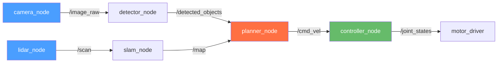
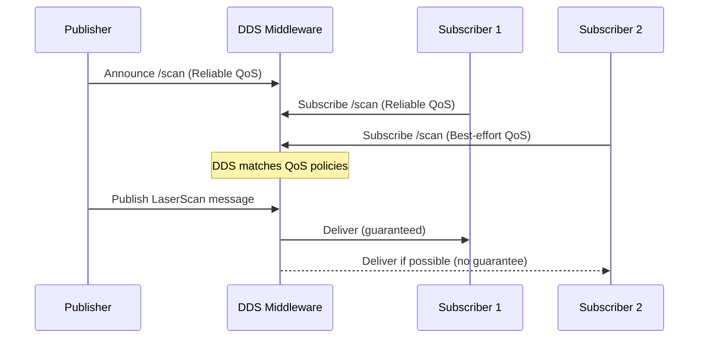

# باب 3: آر او ایس ٹو آرکیٹیکچر (ROS 2 Architecture)

## سیکھنے کے مقاصد (Learning Objectives)

<div dir="rtl">

اس باب کے اختتام تک، آپ اس قابل ہو جائیں گے کہ:

- **وضاحت کریں** کہ آر او ایس ٹو (ROS 2) کو آر او ایس ون (ROS 1) کے متبادل کے طور پر کیوں بنایا گیا، اور ڈی ڈی ایس (DDS) کن مسائل کو حل کرتا ہے۔
- **بیان کریں** ROS 2 کا کمپیوٹیشن گراف (Computation Graph): نوڈز (nodes)، ٹاپکس (topics)، سروسز (services)، ایکشنز (actions)، اور پیرامیٹرز (parameters)۔
- **استعمال کریں** `ros2` سی ایل آئی (CLI) کو ایک لائیو سسٹم کا معائنہ کرنے کے لیے: نوڈز کی فہرست، ٹاپکس کا ایکو، سروسز کو کال کرنا۔
- **نافذ کریں** پائیتھون (Python) میں ROS 2 سروس سرور (Service Server) اور کلائنٹ (Client)۔
- **کنفیگر کریں** قابل اعتماد (Reliable) بمقابلہ بیسٹ ایفرٹ (Best-effort) مواصلت کے لیے کوالٹی آف سروس (Quality of Service - QoS) پروفائلز۔

</div>

---

## تعارف (Introduction)

<div dir="rtl">

2012 تک، ROS 1 دنیا بھر میں ہزاروں روبوٹس (robots) پر چل رہا تھا۔ ریسرچ لیبز، سٹارٹ اپس، اور یونیورسٹیز نے سینکڑوں پیکجز کا ایک ماحولیاتی نظام (ecosystem) بنایا تھا۔ لیکن جیسے جیسے روبوٹکس (robotics) ریسرچ لیبز سے صنعت کی طرف منتقل ہوا، سنگین مسائل سامنے آئے۔

ROS 1 کو ایک قابل اعتماد مقامی نیٹ ورک پر ایک واحد روبوٹ (robot) کے لیے ڈیزائن کیا گیا تھا۔ یہ ایک مرکزی ماسٹر پروسیس — روسکور (`roscore`) — پر انحصار کرتا تھا جس سے ہر نوڈ (node) کو منسلک ہونا پڑتا تھا۔ اگر `roscore` کریش ہو جاتا، تو پورا سسٹم (system) ٹھپ ہو جاتا۔ ریئل ٹائم کنٹرول (real-time control) کے لیے کوئی بلٹ ان سپورٹ (built-in support) نہیں تھی، ملٹی روبوٹ کمیونیکیشن (multi-robot communication) کے لیے کوئی انکرپشن (encryption) نہیں تھی، اور مکمل لینکس ڈیسک ٹاپ (Linux desktop) کے بغیر ایمبیڈڈ سسٹمز (embedded systems) پر چلانے کا کوئی طریقہ نہیں تھا۔

**ROS 2** کو ان مسائل کو حل کرنے کے لیے شروع سے ڈیزائن کیا گیا تھا۔ یہ **DDS** (ڈیٹا ڈسٹری بیوشن سروس - Data Distribution Service) نامی ایک انڈسٹری سٹینڈرڈ مڈل ویئر (middleware) استعمال کرتا ہے جو پیئر ٹو پیئر کمیونیکیشن (peer-to-peer communication)، ناکامی کا کوئی ایک نقطہ نہیں، انکرپشن (encryption)، اور قابل کنفیگر کوالٹی آف سروس (Quality of Service) کی ضمانتیں فراہم کرتا ہے۔ نتیجہ ایک ایسا فریم ورک (framework) ہے جو راسپیری پائی (Raspberry Pi) سے لے کر ڈیٹا سینٹر (data center) تک ہر چیز پر کام کرتا ہے، اور لوگوں کے ساتھ کام کرنے والے پروڈکشن روبوٹس (production robots) میں تعینات (deploy) کرنا محفوظ ہے۔

اس باب میں، آپ سیکھیں گے کہ ROS 2 کس طرح روبوٹ سافٹ ویئر (software) کو ایک تقسیم شدہ کمپیوٹیشن گراف (Computation Graph) میں منظم کرتا ہے اور کسی بھی ROS 2 سسٹم کو سمجھنے اور ڈیبگ (debug) کرنے کے لیے کمانڈ لائن ٹولز (command-line tools) کو کیسے استعمال کیا جائے۔

</div>

---

## کمپیوٹیشن گراف (The Computation Graph)

<div dir="rtl">

ROS 2 میں، ہر چلنے والا پروگرام ایک **نوڈ (node)** ہے۔ نوڈز کمپیوٹیشن (computation) کی بنیادی اکائی (fundamental unit) ہیں۔ ایک روبوٹ سسٹم (robot system) میں عام طور پر درجنوں نوڈز ہوتے ہیں، ہر ایک کسی مخصوص کام کے لیے ذمہ دار ہوتا ہے:

- ایک `camera_node` کیمرہ ہارڈ ویئر سے پڑھتا ہے اور تصاویر پبلش (publishes) کرتا ہے۔
- ایک `detector_node` تصاویر کو سبسکرائب (subscribes) کرتا ہے اور ڈیٹیکٹڈ آبجیکٹس (detected objects) پبلش کرتا ہے۔
- ایک `planner_node` ڈیٹیکٹڈ آبجیکٹس کو سبسکرائب کرتا ہے اور نیویگیشن گولز (navigation goals) پبلش کرتا ہے۔
- ایک `controller_node` نیویگیشن گولز کو سبسکرائب کرتا ہے اور موٹرز کو کنٹرول (controls) کرتا ہے۔

نوڈز کا یہ نیٹ ورک جو ایک دوسرے سے مواصلت (communicate) کرتے ہیں، **کمپیوٹیشن گراف (Computation Graph)** کہلاتا ہے۔

</div>



### مواصلت کے بنیادی اجزاء (Communication Primitives)

<div dir="rtl">

ROS 2 نوڈز کے مواصلت کے لیے چار طریقے فراہم کرتا ہے:

</div>

| Primitive | Pattern | Use Case |
|-----------|---------|----------|
| **Topics** | Publish/Subscribe (async) | مسلسل ڈیٹا سٹریمز (Continuous data streams): سینسر ڈیٹا، ویلوسٹی کمانڈز |
| **Services** | Request/Response (sync) | ایک بار کی درخواستیں (One-time requests): "کیا بازو تیار ہے؟"، "اوڈومیٹری ری سیٹ کریں" |
| **Actions** | Long-running goal + feedback | سیکنڈز لینے والے کام (Tasks taking seconds): "کمرہ 3 پر نیویگیٹ کریں"، "آبجیکٹ اٹھائیں" |
| **Parameters** | Key-value configuration | نوڈ سیٹنگز (Node settings): رفتار کی حد، ٹاپک کے نام، تھریش ہولڈز |

<div dir="rtl">

**Topics** سب سے عام ہیں۔ ایک پبلشر (publisher) پیغامات بھیجتا ہے یہ جانے بغیر کہ انہیں کون وصول کرتا ہے۔ کسی بھی تعداد میں سبسکرائبرز (subscribers) ایک ہی Topic کو سن سکتے ہیں۔ یہ ڈی کپلنگ (decoupling) ہی ROS 2 سسٹمز کو ماڈیولر (modular) اور کمپوزیبل (composable) بناتی ہے۔

**Services** مطابقت پذیر (synchronous) ہوتے ہیں: کلائنٹ (client) ایک درخواست بھیجتا ہے اور سرور (server) کے جواب دینے تک بلاک (blocks) رہتا ہے۔ Services کو غیر معمولی، مجرد کارروائیوں (infrequent, discrete operations) کے لیے استعمال کریں — مسلسل ڈیٹا (continuous data) کے لیے نہیں۔

**Actions** Services کی طرح ہیں لیکن لمبے عرصے تک چلنے والے کاموں کے لیے ڈیزائن کیے گئے ہیں۔ کلائنٹ ایک گول (goal) بھیجتا ہے، سرور کام کرتے ہوئے متواتر فیڈ بیک (feedback) بھیجتا ہے، اور آخر میں ایک نتیجہ (result) بھیجتا ہے۔ اسی طرح نیویگیشن اسٹیک (navigation stack) کام کرتا ہے: آپ ایک گول پوز (goal pose) بھیجتے ہیں، اور نیویگیشن فیڈ بیک (موجودہ پوزیشن، تخمینی وقت) سٹریم کرتی ہے جب تک کہ وہ کامیاب نہ ہو جائے یا ناکام نہ ہو جائے۔

</div>

---

## ڈی ڈی ایس: وہ مڈل ویئر جو ROS 2 کو طاقت دیتا ہے (DDS: The Middleware That Powers ROS 2)

<div dir="rtl">

**DDS (Data Distribution Service)** ریئل ٹائم (real-time)، تقسیم شدہ (distributed)، پبلش-سبسکرائب (publish-subscribe) پیغام رسانی (messaging) کے لیے ایک او ایم جی (OMG) معیار ہے۔ اسے اصل میں فوجی اور ایرو اسپیس سسٹمز کے لیے تیار کیا گیا تھا جہاں قابل اعتمادی (reliability) انتہائی اہم ہے۔

DDS ایک **ڈیٹا سنٹرک (data-centric)** ماڈل پر کام کرتا ہے: نوڈز کے درمیان کنکشن (connections) کے بارے میں سوچنے کے بجائے، آپ ڈیٹا کے بارے میں سوچتے ہیں۔ کوئی بھی DDS پارٹیسپیٹ (participant) جو ایک مخصوص ٹاپک (topic) نام کے ساتھ ڈیٹا پبلش کرتا ہے، اس نام میں دلچسپی رکھنے والے کسی بھی سبسکرائبر (subscriber) کے ذریعے خود بخود دریافت (discovered) ہو سکتا ہے — بغیر کسی مرکزی کوآرڈینیٹر (coordinator) کے۔

ROS 2 میں اہم DDS تصورات:

- **ڈسکوری (Discovery)**: نوڈز ملٹی کاسٹ (multicast) کا استعمال کرتے ہوئے ایک دوسرے کو خود بخود تلاش کر لیتے ہیں۔ `roscore` کی ضرورت نہیں۔
- **کوالٹی آف سروس (Quality of Service - QoS)**: ہر پبلشر (publisher) اور سبسکرائبر (subscriber) اعلان کرتا ہے کہ اسے مواصلت کتنی قابل اعتماد چاہیے۔
- **ڈومین آئی ڈیز (Domain IDs)**: مختلف ڈومین آئی ڈیز (`ROS_DOMAIN_ID` انوائرمنٹ ویری ایبل) کے ساتھ ایک ہی نیٹ ورک پر متعدد آزاد ROS 2 سسٹمز چلائیں۔

</div>



### کوالٹی آف سروس پروفائلز (Quality of Service Profiles)

<div dir="rtl">

QoS آپ کو کارکردگی (performance) کے لیے قابل اعتمادی (reliability) کا سودا کرنے دیتا ہے:

</div>

| Profile | Reliability | Durability | Use Case |
|---------|-------------|------------|----------|
| `SENSOR_DATA` | Best-effort | Volatile | کیمرہ فریمز، لیڈار سکینز |
| `SERVICES_DEFAULT` | Reliable | Volatile | سروس کالز |
| `SYSTEM_DEFAULT` | Reliable | Volatile | زیادہ تر عمومی ٹاپکس |

<div dir="rtl">

**بیسٹ ایفرٹ (Best-effort)** کا مطلب ہے: ایک بار بھیجیں، اگر ضائع ہو جائے تو دوبارہ کوشش نہ کریں۔ یہ سینسر ڈیٹا (sensor data) کے لیے ٹھیک ہے جہاں تازہ ڈیٹا پرانا ری ٹرانسمیٹڈ ڈیٹا سے بہتر ہوتا ہے۔ **قابل اعتماد (Reliable)** کا مطلب ہے: ڈیلیوری کی ضمانت دیں، اگر ضرورت ہو تو دوبارہ بھیجیں۔ اسے اہم کمانڈز (critical commands) کے لیے استعمال کریں۔

</div>

---

## کوڈ کی مثال: سروس سرور اور کلائنٹ (Code Example: Service Server and Client)

<div dir="rtl">

سروسز وہ طریقہ ہے جس سے نوڈز ایک دوسرے سے سوال پوچھتے ہیں۔ یہاں ایک مکمل سروس کی مثال ہے جو بلٹ ان `AddTwoInts` سروس ٹائپ (service type) کا استعمال کرتے ہوئے ریکویسٹ/رسپانس (request/response) پیٹرن (pattern) کو ظاہر کرتی ہے۔

</div>

### سروس سرور (Service Server)

```python
# File: ~/ros2_ws/src/ros2_demo/ros2_demo/add_two_ints_server.py
# A ROS 2 service server that adds two integers.

import rclpy
from rclpy.node import Node
from example_interfaces.srv import AddTwoInts  # Service type: {int64 a, int64 b} -> {int64 sum}

class AddTwoIntsServer(Node):

    def __init__(self):
        super().__init__('add_two_ints_server')

        # Create a service named 'add_two_ints'.
        # The callback 'handle_request' is invoked for every incoming request.
        self.srv = self.create_service(
            AddTwoInts,
            'add_two_ints',
            self.handle_request
        )
        self.get_logger().info('AddTwoInts service ready.')

    def handle_request(self, request, response):
        """Called each time a client sends a request."""
        # request.a and request.b come from the client
        response.sum = request.a + request.b
        self.get_logger().info(
            f'Incoming: {request.a} + {request.b} = {response.sum}'
        )
        return response  # Return value becomes the service response


def main(args=None):
    rclpy.init(args=args)
    node = AddTwoIntsServer()
    rclpy.spin(node)
    node.destroy_node()
    rclpy.shutdown()
```

### سروس کلائنٹ (Service Client)

```python
# File: ~/ros2_ws/src/ros2_demo/ros2_demo/add_two_ints_client.py
# A ROS 2 service client that calls the addition service.

import sys
import rclpy
from rclpy.node import Node
from example_interfaces.srv import AddTwoInts

class AddTwoIntsClient(Node):

    def __init__(self):
        super().__init__('add_two_ints_client')
        # Create a client for the 'add_two_ints' service
        self.client = self.create_client(AddTwoInts, 'add_two_ints')

        # Wait until the server is available (poll every 1 second)
        while not self.client.wait_for_service(timeout_sec=1.0):
            self.get_logger().info('Waiting for service...')

    def send_request(self, a: int, b: int):
        request = AddTwoInts.Request()
        request.a = a
        request.b = b

        # call_async() is non-blocking; spin_until_future_complete() waits for it
        future = self.client.call_async(request)
        rclpy.spin_until_future_complete(self, future)
        return future.result()


def main(args=None):
    rclpy.init(args=args)
    client = AddTwoIntsClient()
    a = int(sys.argv[1]) if len(sys.argv) > 1 else 3
    b = int(sys.argv[2]) if len(sys.argv) > 2 else 5
    result = client.send_request(a, b)
    client.get_logger().info(f'Result: {a} + {b} = {result.sum}')
    client.destroy_node()
    rclpy.shutdown()
```

**متوقع آؤٹ پٹ** — ٹرمینل 1 (سرور):
```
[INFO] [add_two_ints_server]: AddTwoInts service ready.
[INFO] [add_two_ints_server]: Incoming: 3 + 5 = 8
```

ٹرمینل 2 (کلائنٹ):
```
[INFO] [add_two_ints_client]: Result: 3 + 5 = 8
```

---

## ros2 سی ایل آئی (CLI): اپنے سسٹم کا معائنہ کرنا (The ros2 CLI: Introspecting Your System)

<div dir="rtl">

`ros2` کمانڈ لائن ٹول (command-line tool) کسی بھی چلنے والے ROS 2 سسٹم میں آپ کی کھڑکی ہے۔ آپ یہ جانچ سکتے ہیں کہ کون سے نوڈز چل رہے ہیں، کون سا ڈیٹا بہہ رہا ہے، اور کوڈ لکھے بغیر سروسز کو کال کر سکتے ہیں۔

</div>

```bash
# List all running nodes
ros2 node list

# Show detailed info about a node (publishers, subscribers, services)
ros2 node info /camera_node

# List all active topics
ros2 topic list

# Show message type and pub/sub count for a topic
ros2 topic info /scan

# Print every message on a topic (Ctrl+C to stop)
ros2 topic echo /scan

# Measure message rate in Hz
ros2 topic hz /scan

# Call a service from the command line (no code required)
ros2 service call /add_two_ints example_interfaces/srv/AddTwoInts "{a: 10, b: 7}"

# List and get parameters
ros2 param list
ros2 param get /my_node some_param
```

<div dir="rtl">

یہ کمانڈز کسی بھی ROS 2 سسٹم پر کام کرتی ہیں — چاہے وہ مقامی طور پر چل رہا ہو یا وائی فائی (WiFi) پر منسلک کسی فزیکل روبوٹ (physical robot) پر۔

</div>

---

## خلاصہ (Summary)

<div dir="rtl">

اس باب میں، آپ نے سیکھا:

- **ROS 2** کو ROS 1 کی حدود کو ٹھیک کرنے کے لیے بنایا گیا تھا: ناکامی کا کوئی مرکزی نقطہ نہیں، ریئل ٹائم سپورٹ، سیکیورٹی (security)، اور کراس پلیٹ فارم (cross-platform) مطابقت (compatibility)۔
- **DDS** ROS 2 کے نیچے پیئر ٹو پیئر مڈل ویئر ہے۔ یہ مرکزی ماسٹر پروسیس کے بغیر نوڈ ڈسکوری (node discovery) اور پیغام کی ترسیل (message delivery) کو ہینڈل کرتا ہے۔
- **کمپیوٹیشن گراف (Computation Graph)** نوڈز پر مشتمل ہوتا ہے جو ٹاپکس (pub/sub)، سروسز (req/res)، ایکشنز (goal/feedback/result)، اور پیرامیٹرز (configuration) سے جڑے ہوتے ہیں۔
- **QoS پروفائلز (QoS profiles)** آپ کو اپنے استعمال کے کیس کے لحاظ سے قابل اعتماد ڈیلیوری (reliable delivery) (گارنٹیڈ) اور بیسٹ ایفرٹ (lower latency) کے درمیان انتخاب کرنے دیتے ہیں۔
- **ros2 CLI** آپ کو کسی بھی لائیو ROS 2 سسٹم کا معائنہ کرنے دیتا ہے — نوڈز کی فہرست بنانا، ٹاپکس کو ایکو کرنا، سروسز کو کال کرنا — یہ سب کوڈ لکھے بغیر۔

</div>

---

## عملی مشق: ایک لائیو ROS 2 سسٹم کو دریافت کریں (Hands-On Exercise: Explore a Live ROS 2 System)

<div dir="rtl">

**وقت کا تخمینہ**: 20–30 منٹ

**پیشگی ضروریات (Prerequisites)**:
- ROS 2 Humble انسٹال (Appendix A2)
- `demo_nodes_py` پیکیج (`ros-humble-desktop` کے ساتھ شامل)

</div>

### مراحل (Steps)

<div dir="rtl">

1.  **ٹاکر ڈیمو لانچ کریں** (ٹرمینل 1):

</div>

```bash
source /opt/ros/humble/setup.bash
ros2 run demo_nodes_py talker
```

<div dir="rtl">

متوقع آؤٹ پٹ: `Publishing: 'Hello World: 0'` (ہر سیکنڈ بڑھ رہا ہے)

2.  **لیسنر لانچ کریں** (ٹرمینل 2):

</div>

```bash
source /opt/ros/humble/setup.bash
ros2 run demo_nodes_py listener
```

<div dir="rtl">

متوقع آؤٹ پٹ: `I heard: Hello World: 0`

3.  **سسٹم کا معائنہ کریں** (ٹرمینل 3):

</div>

```bash
source /opt/ros/humble/setup.bash
ros2 node list      # Should show: /talker  /listener
ros2 topic list     # Should show: /chatter  /rosout  /parameter_events
ros2 topic info /chatter
ros2 topic echo /chatter
ros2 topic hz /chatter   # Expected: average rate: 1.000
```

<div dir="rtl">

4.  **سروس کی مثال بنائیں اور چلائیں**:

</div>

```bash
cd ~/ros2_ws
colcon build --packages-select ros2_demo
source install/setup.bash
ros2 run ros2_demo add_two_ints_server &
ros2 run ros2_demo add_two_ints_client 42 58
```

### تصدیق (Verification)

```bash
ros2 node list | grep -E "talker|listener"
```

<div dir="rtl">

آپ کو آؤٹ پٹ میں `/talker` اور `/listener` دونوں نظر آنے چاہئیں۔

</div>

---

## مزید مطالعہ (Further Reading)

<div dir="rtl">

- **پچھلا**: [باب 2: امباڈیڈ انٹیلی جنس اور سینسر (Chapter 2: Embodied Intelligence & Sensors)](ch02-embodied-intelligence.md) — سینسر سسٹم اور سینسوری موٹر لوپ
- **اگلا**: [باب 4: آر او ایس ٹو نوڈز اور ٹاپکس (Chapter 4: ROS 2 Nodes and Topics)](ch04-ros2-nodes-topics.md) — شروع سے پبلشرز اور سبسکرائبرز بنانا
- **متعلقہ**: [اپینڈکس A2: سافٹ ویئر انسٹالیشن (Appendix A2: Software Installation)](../appendices/a2-software-installation.md) — ROS 2 Humble انسٹال گائیڈ

**سرکاری دستاویزات (Official documentation)**:
- [ROS 2 Humble تصورات (ROS 2 Humble Concepts)](https://docs.ros.org/en/humble/Concepts.html)
- [ROS 2 میں DDS کو سمجھنا (Understanding DDS in ROS 2)](https://docs.ros.org/en/humble/Concepts/About-Different-Middleware-Vendors.html)
- [ros2 CLI ٹیوٹوریلز (ros2 CLI Tutorials)](https://docs.ros.org/en/humble/Tutorials/Beginner-CLI-Tools.html)

</div>

---