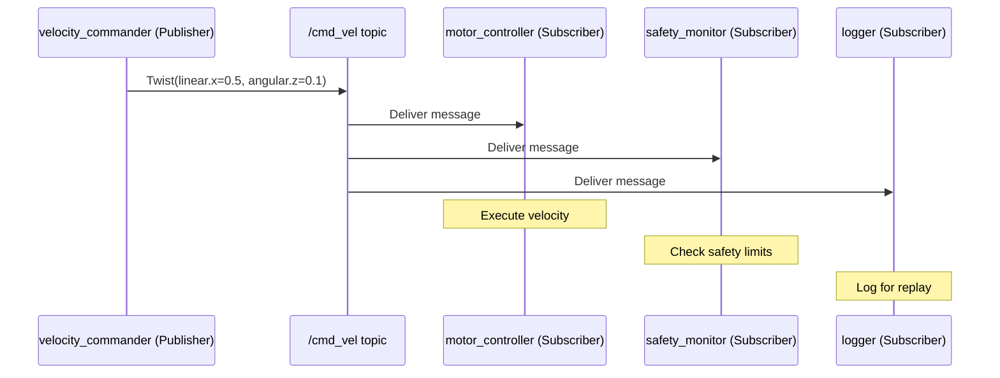

# باب 4: آر او ایس ٹو نوڈز اور ٹاپکس (ROS 2 Nodes and Topics)

## سیکھنے کے مقاصد (Learning Objectives)

<div dir="rtl">

اس باب کے اختتام تک، آپ اس قابل ہو جائیں گے کہ:

- **وضاحت کریں** کہ پبلش/سبسکرائب پیٹرن (publish/subscribe pattern) کیا ہے اور یہ ماڈیولر (modular) روبوٹ (Robot) سافٹ ویئر (software) کو کیوں ممکن بناتا ہے۔
- ایک آر او ایس ٹو پبلشر نوڈ (ROS 2 publisher node) **بنائں** جو `geometry_msgs/Twist` ویلاسٹی کمانڈز (velocity commands) کو ایک مقررہ شرح پر بھیجتا ہے۔
- ایک آر او ایس ٹو سبسکرائبر نوڈ (ROS 2 subscriber node) **بنائں** جو ان ویلاسٹی کمانڈز کو وصول کرتا ہے اور پراسیس (process) کرتا ہے۔
- ٹاپک کمیونیکیشن (topic communication) کو `ros2 topic echo`، `ros2 topic hz` اور `ros2 topic bw` استعمال کرتے ہوئے **ڈیبگ (debug)** کریں۔
- پبلشر آؤٹ پٹ (publisher output) اقدار میں ترمیم کرکے ایک سادہ موشن پیٹرن (motion pattern) **نافذ کریں**۔

</div>

---

## تعارف (Introduction)

<div dir="rtl">

ایک ریستوراں کے کچن (restaurant kitchen) کا تصور کریں۔ وہ شیف (chef) جو یہ فیصلہ کرتا ہے کہ کیا پکانا ہے، اسے یہ جاننے کی ضرورت نہیں ہوتی کہ کون سے ویٹر (waiters) کھانا لے جائیں گے۔ ویٹروں کو یہ جاننے کی ضرورت نہیں ہوتی کہ اسے کس شیف نے تیار کیا ہے۔ وہ ایک مشترکہ آرڈر سسٹم (order system) کے ذریعے بات چیت کرتے ہیں – تیار شدہ پکوان پِک اپ کاؤنٹر (pickup counter) پر رکھے جاتے ہیں، اور ویٹر تیار ہونے پر انہیں اکٹھا کر لیتے ہیں۔ کسی بھی فریق کو دوسرے کے بارے میں براہ راست جاننے کی ضرورت نہیں ہوتی۔

بالکل اسی طرح ROS 2 ٹاپکس (topics) کام کرتے ہیں۔ ایک **پبلشر (publisher)** ایک نامزد ٹاپک (named topic) — ایک قسم کا مشترکہ چینل (shared channel) — پر میسجز (messages) رکھتا ہے۔ کتنے ہی **سبسکرائبرز (subscribers)** اس ٹاپک سے پڑھ سکتے ہیں بغیر پبلشر کو جانے یا اس کی پرواہ کیے۔ یہ ڈی کپلنگ (decoupling) ہی ہے جو ROS 2 سسٹمز (systems) کو سکیل ایبل (scalable) بناتی ہے: آپ نئے نوڈز (nodes) شامل کر سکتے ہیں جو سینسر ڈیٹا (sensor data) استعمال کرتے ہیں بغیر سینسرز میں ترمیم کیے، یا نئے سینسرز شامل کر سکتے ہیں بغیر نیویگیشن اسٹیک (navigation stack) میں ترمیم کیے۔

پچھلے باب میں، آپ نے تصوراتی طور پر یہ سیکھا کہ ٹاپکس کیا ہیں اور CLI (سی ایل آئی) کا استعمال کرتے ہوئے انہیں کیسے معائنہ کیا جائے۔ اس باب میں، آپ انہیں شروع سے بنائیں گے۔ اختتام تک، آپ کے پاس ایک فعال پبلشر/سبسکرائبر جوڑا ہوگا جو روبوٹ ویلاسٹی کمانڈز (robot velocity commands) کا تبادلہ کرے گا — وہی میسج ٹائپ (message type) جو ROS 2 میں ہر ڈیفرنشل-ڈرائیو روبوٹ (differential-drive robot) استعمال کرتا ہے۔

</div>

---

## پبلش/سبسکرائب پیٹرن (The Publish/Subscribe Pattern)

<div dir="rtl">

پب/سب پیٹرن (pub/sub pattern) کی تین اہم خصوصیات ہیں:

1.  **غیر مطابقت پذیر (Asynchronous)**: پبلشر سبسکرائبرز کا انتظار نہیں کرتا۔ یہ بھیجتا ہے اور بھول جاتا ہے۔
2.  **ڈی کپلڈ (Decoupled)**: پبلشرز اور سبسکرائبرز ایک دوسرے کے بارے میں نہیں جانتے۔ وہ صرف ایک ٹاپک نام اور میسج ٹائپ (message type) پر متفق ہوتے ہیں۔
3.  **متعدد سے متعدد (Many-to-many)**: متعدد پبلشرز ایک ہی ٹاپک پر پبلش کر سکتے ہیں؛ متعدد سبسکرائبرز ایک ہی ٹاپک کو بیک وقت سبسکرائب کر سکتے ہیں۔

</div>



<div dir="rtl">

ایک اہم بصیرت: سیفٹی مانیٹر (safety monitor) اور لاگر (logger) کو اصل پبلشر یا موٹر کنٹرولر (motor controller) میں ترمیم کیے بغیر شامل کیا گیا تھا۔ یہ پب/سب (pub/sub) کی طاقت ہے۔

</div>

### آر او ایس ٹو میسج ٹائپس (ROS 2 Message Types)

<div dir="rtl">

میسجز ٹائپڈ ڈیٹا اسٹرکچرز (typed data structures) ہیں جو `.msg` فائلز میں ڈیفائن (define) ہوتے ہیں۔ ROS 2 معیاری میسج پیکیجز (standard message packages) فراہم کرتا ہے:

</div>

| Package | Common Types | Use Case |
|---------|-------------|----------|
| `std_msgs` | `String`, `Float64`, `Bool`, `Int32` | سادہ اقدار (Simple values) |
| `geometry_msgs` | `Twist`, `Pose`, `Vector3`, `Point` | پوزیشنز (Positions)، ویلاسٹی (velocities) |
| `sensor_msgs` | `LaserScan`, `Image`, `Imu`, `PointCloud2` | سینسر ڈیٹا (Sensor data) |
| `nav_msgs` | `Odometry`, `Path`, `OccupancyGrid` | نیویگیشن (Navigation) |

<div dir="rtl">

`geometry_msgs/Twist` میسج ROS 2 میں معیاری ویلاسٹی کمانڈ (standard velocity command) ہے:

</div>

```
# geometry_msgs/Twist structure:
Vector3 linear     # linear.x = forward speed (m/s)
                   # linear.y = lateral speed (m/s, usually 0 for ground robots)
                   # linear.z = vertical speed (m/s, used for drones)
Vector3 angular    # angular.z = rotation rate (rad/s, positive = counter-clockwise)
```

<div dir="rtl">

ایک گراؤنڈ روبوٹ (ground robot) کے لیے، آپ عام طور پر صرف `linear.x` (فارورڈ/بیک ورڈ) اور `angular.z` (لیفٹ/رائٹ مڑنا) استعمال کرتے ہیں۔

</div>

---

## پبلشر نوڈ بنانا (Building a Publisher Node)

<div dir="rtl">

ایک پبلشر نوڈ (publisher node) ایک ٹائمر (timer) پر چلتا ہے اور مقررہ شرح (fixed rate) پر میسجز بھیجتا ہے۔ پیٹرن (pattern) ہمیشہ ایک جیسا ہوتا ہے: ایک پبلشر بنائیں، ایک ٹائمر بنائیں، ٹائمر کال بیک (timer callback) میں ایک میسج بھیجیں۔

</div>

```python
# File: ~/ros2_ws/src/motion_demo/motion_demo/velocity_commander.py
# Publishes Twist velocity commands at 10 Hz (10 messages per second).

import rclpy
from rclpy.node import Node
from geometry_msgs.msg import Twist  # Standard velocity command message
import math

class VelocityCommander(Node):
    """Publishes a circular motion pattern: forward + rotate."""

    def __init__(self):
        super().__init__('velocity_commander')

        # Create a publisher on /cmd_vel.
        # Queue size 10: buffer up to 10 unsent messages before dropping old ones.
        self.publisher = self.create_publisher(Twist, '/cmd_vel', 10)

        # Timer fires every 0.1 seconds = 10 Hz.
        # High-frequency control is smoother than 1 Hz.
        self.timer = self.create_timer(0.1, self.publish_velocity)

        self.count = 0  # Track how many messages we've sent
        self.get_logger().info('Velocity commander started at 10 Hz.')

    def publish_velocity(self):
        """Called 10 times per second. Builds and publishes a velocity command."""
        msg = Twist()

        # Drive in a circle: constant forward speed + constant rotation
        msg.linear.x = 0.3   # 0.3 m/s forward
        msg.angular.z = 0.5  # 0.5 rad/s counter-clockwise (~28.6 degrees/sec)

        self.publisher.publish(msg)
        self.count += 1

        # Log every 10 messages (every second) to avoid console spam
        if self.count % 10 == 0:
            self.get_logger().info(
                f'Published #{self.count}: linear.x={msg.linear.x}, angular.z={msg.angular.z}'
            )


def main(args=None):
    rclpy.init(args=args)
    node = VelocityCommander()
    rclpy.spin(node)           # Run until Ctrl+C
    node.destroy_node()
    rclpy.shutdown()


if __name__ == '__main__':
    main()
```

**متوقع آؤٹ پٹ (Expected output)** (ہر سیکنڈ):
```
[INFO] [velocity_commander]: Velocity commander started at 10 Hz.
[INFO] [velocity_commander]: Published #10: linear.x=0.3, angular.z=0.5
[INFO] [velocity_commander]: Published #20: linear.x=0.3, angular.z=0.5
[INFO] [velocity_commander]: Published #30: linear.x=0.3, angular.z=0.5
```

---

## سبسکرائبر نوڈ بنانا (Building a Subscriber Node)

<div dir="rtl">

ایک سبسکرائبر نوڈ (subscriber node) ایک کال بیک فنکشن (callback function) رجسٹر (register) کرتا ہے جو خود بخود طلب (invoked automatically) ہو جاتا ہے جب بھی ٹاپک پر کوئی نیا میسج آتا ہے۔

</div>

```python
# File: ~/ros2_ws/src/motion_demo/motion_demo/velocity_monitor.py
# Subscribes to /cmd_vel and monitors incoming velocity commands.

import rclpy
from rclpy.node import Node
from geometry_msgs.msg import Twist
import math

class VelocityMonitor(Node):
    """Subscribes to /cmd_vel and prints speed information."""

    # Safety threshold: warn if commanded speed exceeds this
    MAX_SAFE_LINEAR = 1.0   # m/s
    MAX_SAFE_ANGULAR = 2.0  # rad/s

    def __init__(self):
        super().__init__('velocity_monitor')

        # Subscribe to /cmd_vel. The callback runs every time a message arrives.
        self.subscription = self.create_subscription(
            Twist,
            '/cmd_vel',
            self.velocity_callback,
            10
        )
        self.message_count = 0
        self.get_logger().info('Velocity monitor listening on /cmd_vel.')

    def velocity_callback(self, msg: Twist):
        """Called automatically when a Twist message arrives."""
        self.message_count += 1

        linear_speed = msg.linear.x
        angular_speed = msg.angular.z

        # Calculate the equivalent circular radius if both are non-zero
        if abs(angular_speed) > 0.001:
            turn_radius = linear_speed / angular_speed
            radius_str = f'radius={turn_radius:.2f} m'
        else:
            radius_str = 'straight line'

        self.get_logger().info(
            f'[#{self.message_count}] linear.x={linear_speed:.2f} m/s, '
            f'angular.z={angular_speed:.2f} rad/s ({radius_str})'
        )

        # Safety check
        if abs(linear_speed) > self.MAX_SAFE_LINEAR:
            self.get_logger().warn(f'SAFETY: Linear speed {linear_speed:.2f} exceeds limit!')
        if abs(angular_speed) > self.MAX_SAFE_ANGULAR:
            self.get_logger().warn(f'SAFETY: Angular speed {angular_speed:.2f} exceeds limit!')


def main(args=None):
    rclpy.init(args=args)
    node = VelocityMonitor()
    rclpy.spin(node)
    node.destroy_node()
    rclpy.shutdown()
```

**متوقع آؤٹ پٹ (Expected output)** (جب کمانڈر چل رہا ہو):
```
[INFO] [velocity_monitor]: Velocity monitor listening on /cmd_vel.
[INFO] [velocity_monitor]: [#1] linear.x=0.30 m/s, angular.z=0.50 rad/s (radius=0.60 m)
[INFO] [velocity_monitor]: [#2] linear.x=0.30 m/s, angular.z=0.50 rad/s (radius=0.60 m)
```

<div dir="rtl">

ریڈیئس کیلکولیشن (radius calculation) سے پتہ چلتا ہے کہ `linear.x=0.3` اور `angular.z=0.5` پر، روبوٹ 0.6 میٹر ریڈیئس (circular radius) کا ایک دائرہ کھینچے گا — جو ایک ہولا ہوپ (hula hoop) کے سائز کے برابر ہے۔

</div>

---

## ٹاپک نیم اسپیسنگ اور ری میپنگ (Topic Namespacing and Remapping)

<div dir="rtl">

ایک ملٹی-روبوٹ سسٹم (multi-robot system) میں، آپ کو ٹاپک نیم کولیشنز (topic name collisions) سے بچنے کی ضرورت ہے۔ اگر دو روبوٹ دونوں `/cmd_vel` پر پبلش کریں، تو میسجز گڑبڑ ہو جائیں گے۔ ROS 2 اس مسئلے کو نیم اسپیسنگ (namespacing) اور ری میپنگ (remapping) سے حل کرتا ہے۔

**نیم اسپیسنگ (Namespacing)**: ایک نوڈ کو ایک نیم اسپیس (namespace) سے پریفکس (prefix) کریں تاکہ اس کے تمام ٹاپکس اس پریفکس (prefix) کو استعمال کریں۔
</div>

```bash
ros2 run motion_demo velocity_commander --ros-args -r __ns:=/robot1
# Creates topic: /robot1/cmd_vel
```

<div dir="rtl">

**ری میپنگ (Remapping)**: لانچ ٹائم (launch time) پر کسی بھی ٹاپک یا نوڈ کے نام کو کوڈ میں ترمیم کیے بغیر تبدیل کریں:

</div>

```bash
ros2 run motion_demo velocity_commander --ros-args -r /cmd_vel:=/robot1/cmd_vel
```

<div dir="rtl">

یہ ROS 2 کی سب سے طاقتور خصوصیات میں سے ایک ہے: ایک ہی کوڈ کو متعدد روبوٹس کے لیے صرف لانچ کنفیگریشن (launch configuration) میں تبدیلی کرکے ڈیپلائی (deploy) کیا جا سکتا ہے۔

</div>

---

## ٹاپک کمیونیکیشن کی ڈیبگنگ (Debugging Topic Communication)

<div dir="rtl">

جب کچھ کام نہیں کر رہا ہوتا ہے، تو یہ CLI کمانڈز (CLI commands) مسئلے کی تشخیص (diagnose the problem) میں مدد کرتی ہیں:

</div>

```bash
# Is the topic being published at all?
ros2 topic hz /cmd_vel
# Expected for our demo: average rate: 10.000

# How much data is being sent?
ros2 topic bw /cmd_vel
# Shows bytes/second throughput

# Who is publishing and subscribing?
ros2 topic info /cmd_vel --verbose
# Lists publisher and subscriber node names + QoS profiles

# Are QoS profiles compatible? (Mismatch causes silent failure)
ros2 topic info /cmd_vel --verbose | grep -A3 "QoS"
```

<div dir="rtl">

**سائلنٹ فیلور ٹریپ (The silent failure trap)**: اگر ایک پبلشر `BEST_EFFORT` QoS (بیسٹ ایفرٹ کیو او ایس) استعمال کرتا ہے لیکن ایک سبسکرائبر `RELIABLE` کی درخواست کرتا ہے، تو میسجز ڈیلیور (deliver) نہیں ہوں گے اور کوئی ایرر (error) نہیں دکھایا جائے گا۔ جب ایک سبسکرائبر کو کچھ بھی موصول نہ ہو باوجود اس کے کہ ایک پبلشر چل رہا ہو، تو ہمیشہ QoS مطابقت (QoS compatibility) کی جانچ کریں۔

</div>

---

## خلاصہ (Summary)

<div dir="rtl">

اس باب میں، آپ نے سیکھا:

- **پبلش/سبسکرائب پیٹرن (publish/subscribe pattern)** غیر مطابقت پذیر (asynchronous) اور ڈی کپلڈ (decoupled) ہے: پبلشرز سبسکرائبرز کے بارے میں نہیں جانتے، اور اس کے برعکس۔ یہ ماڈیولر (modular)، کمپوزیبل روبوٹ سافٹ ویئر (composable robot software) کو ممکن بناتا ہے۔
- `geometry_msgs/Twist` معیاری ROS 2 ویلاسٹی کمانڈ (velocity command) ہے: فارورڈ سپیڈ (forward speed) کے لیے `linear.x` اور روٹیشن ریٹ (rotation rate) کے لیے `angular.z`۔
- ایک **پبلشر** `create_publisher()` اور ایک ٹائمر کال بیک (timer callback) کا استعمال کرتا ہے تاکہ ایک مقررہ شرح پر میسجز بھیجے جائیں۔
- ایک **سبسکرائبر** `create_subscription()` اور ایک میسج کال بیک (message callback) کا استعمال کرتا ہے جو ہر آنے والے میسج پر خود بخود فائر ہوتا ہے۔
- **ٹاپک نیم اسپیسنگ (Topic namespacing)** اور **ری میپنگ (remapping)** ایک ہی نوڈ کوڈ کو ملٹی-روبوٹ ڈیپلائمنٹس (multi-robot deployments) میں چلانے کی اجازت دیتے ہیں۔
- **کیو او ایس مماثلت کی کمی (QoS mismatches)** خاموشی سے میسج کی ڈیلیوری (message delivery) کو روکتے ہیں — ہمیشہ `ros2 topic info --verbose` کے ساتھ تصدیق کریں۔

</div>

---

## ہینڈز-آن مشق: ایک سرکلر موشن کنٹرولر بنائیں (Hands-On Exercise: Build a Circular Motion Controller)

<div dir="rtl">

**وقت کا تخمینہ (Time estimate)**: 30–45 منٹ

**پیشگی شرائط (Prerequisites)**:
- ROS 2 ہمبل (Humble) انسٹالڈ ([ضمیمہ اے ٹو (Appendix A2)](../appendices/a2-software-installation.md))
- باب 3 کی مشق مکمل (Chapter 3 exercise completed)

</div>

### اقدامات (Steps)

<div dir="rtl">

1.  **پیکیج بنائیں (Create the package)**:
</div>

```bash
cd ~/ros2_ws/src
ros2 pkg create motion_demo --build-type ament_python \
    --dependencies rclpy geometry_msgs
```

<div dir="rtl">

2.  **دونوں نوڈز بنائیں (Create both nodes)**:
    اس باب سے `velocity_commander.py` اور `velocity_monitor.py` کو `~/ros2_ws/src/motion_demo/motion_demo/` میں محفوظ کریں۔

3.  **اینٹری پوائنٹس رجسٹر کریں (Register entry points)** `~/ros2_ws/src/motion_demo/setup.py` میں:
</div>

```python
entry_points={
    'console_scripts': [
        'velocity_commander = motion_demo.velocity_commander:main',
        'velocity_monitor = motion_demo.velocity_monitor:main',
    ],
},
```

<div dir="rtl">

4.  **بنائں (Build)**:
</div>

```bash
cd ~/ros2_ws
colcon build --packages-select motion_demo
source install/setup.bash
```

<div dir="rtl">

متوقع: `Summary: 1 package finished`

5.  **کمانڈر چلائیں (Run the commander)** (ٹرمینل 1):
</div>

```bash
ros2 run motion_demo velocity_commander
```

<div dir="rtl">

6.  **مانیٹر چلائیں (Run the monitor)** (ٹرمینل 2):
</div>

```bash
source ~/ros2_ws/install/setup.bash
ros2 run motion_demo velocity_monitor
```

<div dir="rtl">

7.  **چیلنج (Challenge)**: `velocity_commander.py` میں ترمیم کریں تاکہ روبوٹ فارورڈ ڈرائیونگ (5 سیکنڈ) اور اپنی جگہ پر گھومنے (3 سیکنڈ) کے درمیان متبادل (alternates between driving forward and rotating in place) ہو۔ اشارہ: `self.count` اور ٹائم تھریش ہولڈز (time thresholds) استعمال کریں۔

</div>

### تصدیق (Verification)

```bash
ros2 topic hz /cmd_vel
```

<div dir="rtl">

آپ کو نظر آنا چاہیے: `average rate: 10.000`

</div>

---

## مزید مطالعہ (Further Reading)

<div dir="rtl">

- **پچھلا (Previous)**: [باب 3: آر او ایس ٹو آرکیٹیکچر (ROS 2 Architecture)](ch03-ros2-architecture.md) — ڈی ڈی ایس (DDS)، کمپیوٹیشن گراف (computation graph)، کیو او ایس (QoS)
- **اگلا (Next)**: [باب 5: آر او ایس ٹو پیکیجز پائیتھون کے ساتھ (ROS 2 Packages with Python)](ch05-ros2-packages-python.md) — کوڈ کو مناسب پیکیجز (packages) میں منظم کرنا
- **متعلقہ (Related)**: [باب 6: گیزیبو سمولیشن (Gazebo Simulation)](../module-2/ch06-gazebo-simulation.md) — ایک سمولیٹڈ روبوٹ (simulated robot) پر `/cmd_vel` کمانڈز چلانا

**سرکاری دستاویزات (Official documentation)**:
- [پبلشر/سبسکرائبر لکھنا (پائیتھون) (Writing a publisher/subscriber (Python))](https://docs.ros.org/en/humble/Tutorials/Beginner-Client-Libraries/Writing-A-Simple-Py-Publisher-And-Subscriber.html)
- [geometry_msgs/Twist](https://docs.ros.org/en/humble/p/geometry_msgs/)

</div>