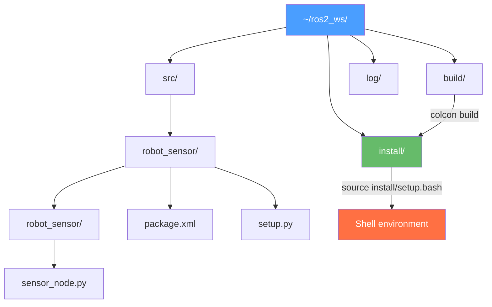

# باب 5: پائتھون کے ساتھ ROS 2 پیکیجز (ROS 2 Packages) کی تعمیر

## سیکھنے کے مقاصد (Learning Objectives)

<div dir="rtl">

اس باب کے اختتام تک، آپ اس قابل ہو جائیں گے:

*   **سمجھائیں** (Explain) کہ ایک ROS 2 (آر او ایس ٹو) پائتھون (Python) پیکیج (Package) کی ساخت کیا ہے اور ہر فائل کیا کرتی ہے۔
*   `ros2 pkg create` کا استعمال کرتے ہوئے صحیح انحصار کے ساتھ ایک نیا پائتھون پیکیج **بنائیں۔**
*   ایگزیکیوٹیبل نوڈز (Node) کو رجسٹر کرنے کے لیے `setup.py` اینٹری پوائنٹس (Entry Points) کو **کنفیگر** (Configure) کریں۔
*   `colcon build` کے ساتھ ایک ورک اسپیس (Workspace) **تعمیر** (Build) کریں اور انسٹال اسپیس (Install Space) کو سورس (Source) کریں۔
*   `declare_parameter` اور `get_parameter` کا استعمال کرتے ہوئے ایک ROS 2 نوڈ میں رن ٹائم پیرامیٹرز (Parameters) کو **ڈیکلیئر (Declare) اور پڑھیں** (Read)۔

</div>

---

## تعارف (Introduction)

<div dir="rtl">

اب تک آپ نے انفرادی نوڈز لکھے ہیں اور انہیں `ros2 run` کے ساتھ چلایا ہے۔ لیکن وہ فائلیں کہاں رہتی ہیں؟ ROS 2 کو کیسے معلوم ہوتا ہے کہ جب آپ `ros2 run motion_demo velocity_commander` ٹائپ کرتے ہیں تو کون سی پائتھون فائل چلانی ہے؟ آپ اپنے روبوٹ (Robot) کوڈ کو کسی ساتھی کے ساتھ کیسے شیئر کر سکتے ہیں تاکہ وہ اسے اپنی مشین پر بنا سکے؟

اس کا جواب **ROS 2 پیکیج (Package)** ہے—جو روبوٹ سافٹ ویئر کی تنظیم کی بنیادی اکائی ہے۔ ایک پیکیج روبوٹ کی مخصوص فعالیت کے لیے درکار تمام پائتھون سورس فائلوں، کنفیگریشن فائلوں، لانچ فائلوں اور انحصار کے اعلانات کو یکجا کرتا ہے۔ `colcon` بلڈ سسٹم (Build System) ان پیکیجز کو پڑھتا ہے، انہیں ایک ورک اسپیس میں انسٹال کرتا ہے، اور انہیں `ros2 run` اور `ros2 launch` کے ذریعے قابل دریافت بناتا ہے۔

اس باب میں، آپ سیکھیں گے کہ پیکیجز اندر سے کیسے کام کرتے ہیں۔ آپ `robot_sensor` نام کا ایک مکمل پیکیج بنائیں گے، ایک نوڈ لکھیں گے جو رن ٹائم کنفیگریشن کے لیے ROS 2 پیرامیٹر سرور (Parameter Server) کا استعمال کرتا ہے، اور colcon بلڈ ورک فلو (Build Workflow) میں مہارت حاصل کریں گے۔ یہ مہارتیں وہ بنیاد ہیں جو آپ ہر آنے والے باب میں استعمال کریں گے۔

</div>

---

## ROS 2 پائتھون پیکیج کی ساخت (Anatomy of a ROS 2 Python Package)

<div dir="rtl">

جب آپ ایک ROS 2 پائتھون پیکیج بناتے ہیں، تو اس کی ایک مخصوص ڈائرکٹری ساخت ہوتی ہے:

</div>

```
robot_sensor/                  ← Package root (same name as package)
├── robot_sensor/              ← Python module (same name as package)
│   ├── __init__.py            ← Makes this a Python module
│   └── sensor_node.py         ← Your node source code
├── resource/
│   └── robot_sensor           ← Ament index resource marker (empty file)
├── test/
│   ├── test_copyright.py      ← Auto-generated linting tests
│   └── test_pep8.py
├── package.xml                ← ROS 2 package manifest (name, deps, maintainer)
├── setup.cfg                  ← Python package configuration
└── setup.py                   ← Build config + entry points for ros2 run
```



### کولکون ورک اسپیس (The colcon Workspace)

<div dir="rtl">

ROS 2 ورک اسپیسز (Workspaces) کا استعمال کرتا ہے—ایک مخصوص لے آؤٹ کے ساتھ ڈائرکٹری ٹریز۔ `~/ros2_ws/` ورک اسپیس جسے آپ استعمال کر رہے ہیں اس میں چار اہم ڈائرکٹریاں ہیں:

*   `src/` — جہاں آپ پیکیج سورس کوڈ (جو آپ ایڈٹ کرتے ہیں) رکھتے ہیں۔
*   `build/` — انٹرمیڈیٹ بلڈ آرٹفیکٹس (خودکار طور پر تیار کردہ، ایڈٹ نہ کریں)۔
*   `install/` — انسٹال شدہ نتیجہ (جسے `ros2 run` پڑھتا ہے)۔
*   `log/` — colcon بلڈ لاگز۔

**کلیدی بصیرت**: آپ `src/` میں فائلیں ایڈٹ کرتے ہیں، `colcon build` کے ساتھ بناتے ہیں، اور `install/` سے چلاتے ہیں۔ کسی بھی کوڈ کی تبدیلی کے بعد، آپ کو دوبارہ بنانا ضروری ہے۔

</div>

:::tip ترقی کے دوران --symlink-install استعمال کریں (Use --symlink-install During Development)
```bash
colcon build --symlink-install
```
<div dir="rtl">

`--symlink-install` کے ساتھ، `install/` میں پائتھون فائلیں `src/` کی سملنکس (Symlinks) ہوتی ہیں۔ اس کا مطلب ہے کہ پائتھون کی تبدیلیاں فوری طور پر دوبارہ بنائے بغیر اثر انداز ہوتی ہیں۔ آپ کو صرف اس وقت دوبارہ بنانے کی ضرورت ہوتی ہے جب آپ `setup.py` میں تبدیلی کریں (نئے اینٹری پوائنٹس شامل کرنا)۔

</div>
:::

---

## کلیدی پیکیج فائلیں (Key Package Files)

### package.xml

<div dir="rtl">

پیکیج مینی فیسٹ (Package Manifest) پیکیج کا نام، ورژن، مینٹیر (Maintainer)، اور انحصار کا اعلان کرتا ہے:

</div>

```xml
<!-- File: ~/ros2_ws/src/robot_sensor/package.xml -->
<?xml version="1.0"?>
<package format="3">
  <name>robot_sensor</name>
  <version>0.1.0</version>
  <description>A sensor publishing package for the Physical AI course.</description>
  <maintainer email="you@example.com">Your Name</maintainer>
  <license>Apache-2.0</license>

  <!-- Build tool dependency (always required for Python packages) -->
  <buildtool_depend>ament_python</buildtool_depend>

  <!-- Runtime dependencies: packages your code imports -->
  <depend>rclpy</depend>
  <depend>sensor_msgs</depend>
  <depend>geometry_msgs</depend>

  <!-- Test dependencies -->
  <test_depend>ament_copyright</test_depend>
  <test_depend>ament_pep8</test_depend>
  <test_depend>pytest</test_depend>
</package>
```

### setup.py

<div dir="rtl">

`setup.py` فائل دو کام کرتی ہے: انسٹالیشن کے لیے پائتھون پیکیج کو کنفیگر کرتی ہے، اور **اینٹری پوائنٹس** کو رجسٹر کرتی ہے—`ros2 run <package> <node>` سے پائتھون فنکشن (Function) تک کی میپنگ۔

</div>

```python
# File: ~/ros2_ws/src/robot_sensor/setup.py
from setuptools import find_packages, setup

package_name = 'robot_sensor'

setup(
    name=package_name,
    version='0.1.0',
    packages=find_packages(exclude=['test']),  # Auto-find all Python submodules
    data_files=[
        # Required: register this package with the ament index
        ('share/ament_index/resource_index/packages',
            ['resource/' + package_name]),
        # Required: install the package.xml manifest
        ('share/' + package_name, ['package.xml']),
    ],
    install_requires=['setuptools'],
    zip_safe=True,
    maintainer='Your Name',
    maintainer_email='you@example.com',
    description='A sensor publishing package.',
    license='Apache-2.0',
    tests_require=['pytest'],
    entry_points={
        'console_scripts': [
            # Format: 'command_name = module.path:function_name'
            # This creates: ros2 run robot_sensor sensor_publisher
            'sensor_publisher = robot_sensor.sensor_node:main',
        ],
    },
)
```

---

## کوڈ کی مثال: پیرامیٹرائزڈ سینسر نوڈ (Code Example: Parameterized Sensor Node)

<div dir="rtl">

ROS 2 **پیرامیٹر سرور (Parameter Server)** آپ کو سورس کوڈ کو تبدیل کیے بغیر لانچ ٹائم پر نوڈ کے رویے کو کنفیگر کرنے دیتا ہے۔ پیرامیٹرز (Parameters) کی-ویلیو (Key-Value) جوڑے ہیں جنہیں ایک نوڈ ڈیفالٹ ویلیوز (Default Values) کے ساتھ ڈکلیئر کرتا ہے؛ صارفین انہیں رن ٹائم (Runtime) پر اوور رائیڈ کر سکتے ہیں۔

</div>

```python
# File: ~/ros2_ws/src/robot_sensor/robot_sensor/sensor_node.py
# A ROS 2 node that publishes mock sensor readings.
# All configuration comes from parameters — no hardcoded values.

import rclpy
from rclpy.node import Node
from sensor_msgs.msg import LaserScan
import math

class SensorPublisher(Node):
    """Publishes simulated LaserScan data with configurable parameters."""

    def __init__(self):
        super().__init__('sensor_publisher')

        # --- Declare parameters with default values ---
        # Users can override these at launch time without editing this file.
        self.declare_parameter('publish_rate', 10.0)   # Hz
        self.declare_parameter('frame_id', 'base_laser')
        self.declare_parameter('obstacle_distance', 2.0)  # meters
        self.declare_parameter('num_beams', 360)

        # --- Read the parameter values ---
        rate = self.get_parameter('publish_rate').get_parameter_value().double_value
        self.frame_id = self.get_parameter('frame_id').get_parameter_value().string_value
        self.obstacle_dist = self.get_parameter('obstacle_distance').get_parameter_value().double_value
        self.num_beams = self.get_parameter('num_beams').get_parameter_value().integer_value

        # Create publisher and timer using the parameter-defined rate
        self.publisher = self.create_publisher(LaserScan, '/scan', 10)
        self.timer = self.create_timer(1.0 / rate, self.publish_scan)

        self.get_logger().info(
            f'Sensor publisher started: {rate} Hz, {self.num_beams} beams, '
            f'frame={self.frame_id}, obstacle at {self.obstacle_dist} m'
        )

    def publish_scan(self):
        """Build and publish a simulated LaserScan message."""
        msg = LaserScan()

        # Header: timestamp and coordinate frame
        msg.header.stamp = self.get_clock().now().to_msg()
        msg.header.frame_id = self.frame_id

        # Angular configuration: full 360° scan
        msg.angle_min = -math.pi         # -180 degrees
        msg.angle_max = math.pi          # +180 degrees
        msg.angle_increment = (2 * math.pi) / self.num_beams

        msg.time_increment = 0.0
        msg.scan_time = 0.1              # 10 Hz scan cycle
        msg.range_min = 0.12             # Minimum valid range: 12 cm
        msg.range_max = 10.0             # Maximum valid range: 10 m

        # Fill ranges: all beams at obstacle_distance (simulated flat wall)
        msg.ranges = [self.obstacle_dist] * self.num_beams

        self.publisher.publish(msg)


def main(args=None):
    rclpy.init(args=args)
    node = SensorPublisher()
    rclpy.spin(node)
    node.destroy_node()
    rclpy.shutdown()
```

### لانچ کے وقت پیرامیٹرز سیٹ کرنا (Setting Parameters at Launch)

<div dir="rtl">

سورس کوڈ کو تبدیل کیے بغیر پیرامیٹرز (Parameters) کو اوور رائیڈ کریں:

</div>

```bash
# Run with default parameters
ros2 run robot_sensor sensor_publisher

# Override the obstacle distance and publish rate
ros2 run robot_sensor sensor_publisher \
    --ros-args \
    -p obstacle_distance:=0.5 \
    -p publish_rate:=20.0 \
    -p frame_id:=laser_front

# Get the current value of a parameter while node is running
ros2 param get /sensor_publisher obstacle_distance
# Returns: Double value is: 0.5

# Change a parameter while the node is running (live reconfiguration)
ros2 param set /sensor_publisher obstacle_distance 3.0
```

<div dir="rtl">

یہ روبوٹ کنفیگریشن (Configuration) کو ہینڈل کرنے کا صحیح طریقہ ہے۔ سینسر (Sensor) ٹاپکس (Topics)، رفتار کی حد، یا فریم (Frame) کے نام جیسی ویلیوز (Values) کو کبھی بھی ہارڈ کوڈ (Hardcode) نہ کریں—ہمیشہ پیرامیٹرز استعمال کریں۔

</div>

---

## کولکون بلڈ ورک فلو (The colcon Build Workflow)

```bash
# 1. Navigate to workspace root (not src/)
cd ~/ros2_ws

# 2. Build all packages in src/
colcon build

# 3. Or build only specific packages (faster during development)
colcon build --packages-select robot_sensor

# 4. With symlink-install for Python development (no rebuild needed after .py edits)
colcon build --symlink-install --packages-select robot_sensor

# 5. Source the install space (REQUIRED after every build, in every new terminal)
source install/setup.bash

# 6. Verify the package is found
ros2 pkg list | grep robot_sensor
# Expected output: robot_sensor

# 7. Run your node
ros2 run robot_sensor sensor_publisher
```

:::warning ہر بلڈ کے بعد سورس (Source After Every Build)
<div dir="rtl">

ہر `colcon build` کے بعد `source install/setup.bash` کو چلانا لازمی ہے۔ اس کے بغیر، `ros2 run` نئے بنائے گئے پیکیجز کو نہیں ڈھونڈ سکے گا۔ اسے خودکار طور پر سورس کرنے کے لیے اپنے `~/.bashrc` میں شامل کریں:

</div>
```bash
echo "source ~/ros2_ws/install/setup.bash" >> ~/.bashrc
```
:::

---

## خلاصہ (Summary)

<div dir="rtl">

اس باب میں، آپ نے سیکھا:

*   ایک **ROS 2 پیکیج** سورس کوڈ (Source Code) کو `package.xml` (مینی فیسٹ)، `setup.py` (اینٹری پوائنٹس)، اور `setup.cfg` (بلڈ کنفگ) کے ساتھ بنڈل (Bundle) کرتا ہے۔
*   **colcon ورک اسپیس** سورس (`src/`)، بلڈ آرٹفیکٹس (`build/`)، اور انسٹال ایبل آؤٹ پٹس (`install/`) کو الگ کرتا ہے۔ ہمیشہ ورک اسپیس روٹ (Root) سے `colcon build` چلائیں، `src/` کے اندر سے نہیں۔
*   `setup.py` میں **اینٹری پوائنٹس** `ros2 run <package> <node>` کمانڈز کو پائتھون `main()` فنکشنز سے میپ (Map) کرتے ہیں۔
*   **ROS 2 پیرامیٹر سرور** آپ کو رن ٹائم پر نوڈ کے رویے کو کنفیگر کرنے دیتا ہے: `declare_parameter()` کے ساتھ ڈکلیئر کریں، `get_parameter()` کے ساتھ پڑھیں، `--ros-args -p key:=value` کے ساتھ اوور رائیڈ کریں۔
*   ترقی کے دوران `--symlink-install` استعمال کریں تاکہ پائتھون فائل کی تبدیلیاں دوبارہ بنائے بغیر اثر انداز ہوں۔

</div>

---

## عملی مشق: robot_sensor کو بنائیں اور پیرامیٹرائز کریں (Hands-On Exercise: Build and Parameterize robot_sensor)

<div dir="rtl">

**وقت کا تخمینہ**: 30–45 منٹ

**پیشگی شرائط**:
*   ROS 2 ہیمبل انسٹالڈ ([ضمیمہ A2](../appendices/a2-software-installation.md))
*   باب 3 اور 4 مکمل ہو چکے ہیں۔

### اقدامات (Steps)

1.  **پیکیج بنائیں**:
    ```bash
    cd ~/ros2_ws/src
    ros2 pkg create robot_sensor \
        --build-type ament_python \
        --dependencies rclpy sensor_msgs geometry_msgs
    ```
    متوقع آؤٹ پٹ (Expected Output): `going to create a new package` + فائل لسٹنگ

2.  **نوڈ فائل بنائیں**:
    اس باب سے `sensor_node.py` کو `~/ros2_ws/src/robot_sensor/robot_sensor/sensor_node.py` میں محفوظ کریں۔

3.  **setup.py اپ ڈیٹ کریں** — اینٹری پوائنٹ (Entry Point) شامل کریں:
    ```python
    entry_points={
        'console_scripts': [
            'sensor_publisher = robot_sensor.sensor_node:main',
        ],
    },
    ```

4.  **symlink-install کے ساتھ بنائیں**:
    ```bash
    cd ~/ros2_ws
    colcon build --symlink-install --packages-select robot_sensor
    source install/setup.bash
    ```

5.  **ڈیفالٹس کے ساتھ چلائیں**:
    ```bash
    ros2 run robot_sensor sensor_publisher
    ```
    متوقع: `Sensor publisher started: 10.0 Hz, 360 beams, frame=base_laser, obstacle at 2.0 m`

6.  **ٹاپک کی تصدیق کریں**:
    ```bash
    # New terminal (source first):
    ros2 topic hz /scan        # Expected: average rate: 10.000
    ros2 topic echo /scan --once  # Print one message
    ```

7.  **پیرامیٹرز کو اوور رائیڈ کریں**:
    ```bash
    ros2 run robot_sensor sensor_publisher \
        --ros-args -p publish_rate:=5.0 -p obstacle_distance:=0.3
    ```
    متوقع: لاگ (Log) میں `obstacle at 0.3 m`

8.  **لائیو پیرامیٹر اپ ڈیٹ**:
    ```bash
    # While node is running in another terminal:
    ros2 param set /sensor_publisher obstacle_distance 5.0
    ```

### تصدیق (Verification)

```bash
ros2 pkg list | grep robot_sensor  # Should output: robot_sensor
ros2 topic hz /scan                # Should output: average rate: 10.000
```

</div>

---

## مزید پڑھنا (Further Reading)

<div dir="rtl">

*   **پچھلا**: [باب 4: ROS 2 نوڈز اور ٹاپکس (Ch04-ros2-nodes-topics.md)] — پب/سب (Pub/Sub) پیٹرن (Pattern)
*   **اگلا**: [باب 6: گیزبو سمولیشن (Module-2/ch06-gazebo-simulation.md)] — اپنے نوڈز کو ٹیسٹ کرنے کے لیے ایک روبوٹ کی سمولیشن (Simulation)
*   **متعلقہ**: [ضمیمہ A2: سافٹ ویئر انسٹالیشن (Appendices/a2-software-installation.md)] — colcon اور ROS 2 سیٹ اپ (Setup)

**سرکاری دستاویزات**:
*   [ایک پائتھون پیکیج بنانا (Creating a Python package)](https://docs.ros.org/en/humble/Tutorials/Beginner-Client-Libraries/Creating-Your-First-ROS2-Package.html)
*   [ROS 2 پیرامیٹرز ٹیوٹوریل (ROS 2 Parameters tutorial)](https://docs.ros.org/en/humble/Tutorials/Beginner-Client-Libraries/Using-Parameters-In-A-Class-Python.html)
*   [colcon دستاویزات (colcon documentation)](https://colcon.readthedocs.io/en/released/)

</div>