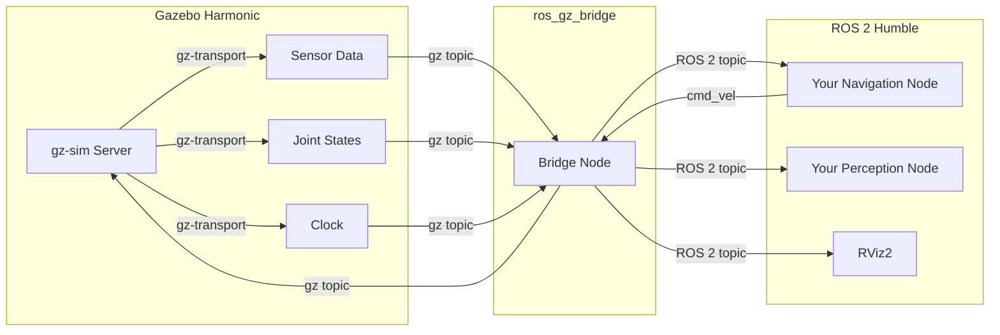

# باب 6: گیزبو سمیولیشن (Gazebo Simulation)

<div dir="rtl">

ماڈیول 1 (Module 1) میں آپ نے ROS 2 (آر او ایس ٹو) نوڈز (Nodes) لکھنا سیکھا جو ٹاپکس (Topics) کو پبلش اور سبسکرائب کرتے ہیں۔ لیکن وہ پیغامات کہاں جاتے ہیں؟ روبوٹ (Robot) یا ماحول (Environment) کے بغیر، آپ کے نوڈز خلا میں بات کر رہے ہوتے ہیں۔ یہ باب آپ کے کوڈ کو رہنے کی جگہ دیتا ہے: ایک مکمل طور پر سمیولیٹڈ (Simulated) تھری ڈی (3D) دنیا جو فزکس (Physics)، سینسرز (Sensors)، اور گریویٹی (Gravity) سے چلتی ہے۔ گیزبو (Gazebo) میں خوش آمدید۔

</div>

## سیکھنے کے مقاصد (Learning Objectives)

<div dir="rtl">

اس باب کے اختتام تک، آپ اس قابل ہو جائیں گے کہ:

- **وضاحت کریں** کہ فزیکل روبوٹس پر کوڈ تعینات کرنے سے پہلے سمیولیشن (Simulation) کیوں ضروری ہے۔
- گیزبو ہارمونک (Gazebo Harmonic) کے اعلیٰ سطحی فن تعمیر (آرکیٹیکچر) کو **بیان کریں** اور یہ کیسے فزکس (Physics)، رینڈرنگ (Rendering)، اور ٹرانسپورٹ (Transport) کو الگ کرتا ہے۔
- ROS 2 (آر او ایس ٹو) پائتھون لانچ فائل سے گیزبو سمیولیشن (Gazebo Simulation) کو **لانچ کریں**۔
- ایک چلتی ہوئی گیزبو ورلڈ (Gazebo World) میں پروگرام کے ذریعے ایک روبوٹ ماڈل (Robot Model) کو **سپان (Spawn)** کریں۔
- `ros_gz_bridge` کا استعمال کرتے ہوئے گیزبو ٹاپکس (Gazebo Topics) کو ROS 2 ٹاپکس (ROS 2 Topics) سے **برج (Bridge)** کریں۔

</div>

## 6.1 تعارف: تعینات کرنے سے پہلے سمیولیٹ کیوں کریں (Introduction: Why Simulate Before You Deploy)

<div dir="rtl">

تصور کریں کہ آپ نے ایک نیویگیشن الگورتھم (Navigation Algorithm) لکھا ہے اور آپ اسے جانچنا چاہتے ہیں۔ آپ اسے ایک حقیقی روبوٹ (Robot) پر فلیش کر سکتے ہیں اور "گو" دبا سکتے ہیں - لیکن کیا ہوتا ہے جب الگورتھم میں کوئی بگ ہو؟ روبوٹ میز سے گر سکتا ہے، دیوار سے ٹکرا سکتا ہے، یا اس سے بدتر، کسی کو زخمی کر سکتا ہے۔ روبوٹ کی مرمت پر پیسے اور وقت خرچ ہوتا ہے۔ ایک سمیولیٹڈ (Simulated) روبوٹ کی مرمت پر کچھ بھی خرچ نہیں ہوتا۔

سمیولیشن (Simulation) آپ کو تین بڑی طاقتیں (superpowers) دیتی ہے:

1.  **حفاظت** – جتنی بار چاہیں کریش کریں۔ ہارڈ ویئر (Hardware) کو کوئی نقصان نہیں، کوئی چوٹ نہیں۔
2.  **رفتار** – آپ راتوں رات سینکڑوں ٹیسٹ چلا سکتے ہیں۔ کچھ سمیولیٹرز (Simulators) حقیقی وقت سے بھی تیز چلتے ہیں۔
3.  **دوبارہ پیدا کرنے کی صلاحیت (Reproducibility)** – ایک ہی ابتدائی حالات ہر بار ایک جیسے نتائج پیدا کرتے ہیں، جو ڈیبگنگ (debugging) کو ڈرامائی طور پر آسان بناتا ہے۔

صنعت میں، اس عمل کو **ڈیجیٹل ٹوئن (Digital Twin)** ڈیولپمنٹ کہا جاتا ہے۔ این ویڈیا (NVIDIA)، بوسٹن ڈائنامکس (Boston Dynamics)، اور ٹیسلا (Tesla) جیسی کمپنیاں اپنے روبوٹس کو حقیقی دنیا میں ایک بھی موٹر چلانے سے پہلے لاکھوں گھنٹوں تک سمیولیشن (Simulation) میں تربیت دیتی ہیں۔ سمیولیٹر (Simulator) کوئی شارٹ کٹ نہیں ہے؛ یہ روبوٹکس (robotics) ڈیولپمنٹ پائپ لائن میں ایک ضروری قدم ہے۔

</div>

:::tip سمیولیشن مائنڈ سیٹ (The Simulation Mindset)
<div dir="rtl">
سمیولیشن (Simulation) کو "روبوٹس کے لیے یونٹ ٹیسٹنگ (Unit Testing)" سمجھیں۔ جس طرح آپ ٹیسٹ چلائے بغیر کبھی کوئی ویب ایپلیکیشن (Web Application) نہیں بھیجیں گے، اسی طرح آپ کو روبوٹ کوڈ کو پہلے سمیولیشن (Simulation) میں چلائے بغیر کبھی تعینات نہیں کرنا چاہیے۔
</div>
:::

## 6.2 گیزبو ہارمونک فن تعمیر (Gazebo Harmonic Architecture)

<div dir="rtl">

گیزبو (Gazebo) (جسے پہلے اگنیشن گیزبو (Ignition Gazebo) کے نام سے جانا جاتا تھا) ایک اوپن سورس (open-source) روبوٹکس سمیولیٹر (robotics simulator) ہے جسے اوپن روبوٹکس (Open Robotics) نے برقرار رکھا ہے۔ اس کتاب میں ہم جو ورژن استعمال کر رہے ہیں وہ **گیزبو ہارمونک (Gazebo Harmonic)** ہے، جو ROS 2 ہبل (ROS 2 Humble) کے ساتھ تجویز کردہ جوڑا ہے۔

</div>

### ایک مختصر تاریخ (A Brief History)

<div dir="rtl">

آپ کو آن لائن "گیزبو کلاسک (Gazebo Classic)" (ورژن 1 سے 11 تک) کے حوالے مل سکتے ہیں۔ گیزبو کلاسک (Gazebo Classic) ایک مونولیتھک ایپلیکیشن (monolithic application) تھی – فزکس (physics)، رینڈرنگ (rendering)، اور ٹرانسپورٹ (transport) سب آپس میں گہرائی سے جڑے ہوئے تھے۔ جدید گیزبو (Harmonic, Garden, Fortress, وغیرہ) کو آزاد لائبریریوں (libraries) کے مجموعہ کے طور پر دوبارہ ڈیزائن کیا گیا تھا، جس سے یہ کہیں زیادہ ماڈیولر (modular) اور قابلِ دیکھ بھال (maintainable) بن گیا۔ اس کتاب میں، "گیزبو" ہمیشہ جدید ورژن کا حوالہ دیتا ہے۔

</div>

### لائبریری کا فن تعمیر (The Library Architecture)

<div dir="rtl">

جدید گیزبو (Gazebo) لائبریریوں (libraries) کے ایک سیٹ سے بنا ہے، ہر ایک کی ایک مخصوص ذمہ داری ہے:

</div>

| Library | Responsibility |
|---------|---------------|
| **gz-sim** | <div dir="rtl">سمیولیشن سرور (Simulation Server)۔ اینٹٹیز (entities) (ماڈلز، لائٹس، سینسرز) کا انتظام کرتا ہے اور فزکس لوپ (Physics Loop) چلاتا ہے۔</div> |
| **gz-physics** | <div dir="rtl">پلگیبل فزکس انجن (Pluggable Physics Engines) (ڈارٹ (DART)، بلٹ (Bullet)، ٹی پی ای (TPE))۔ کولیشنز (Collisions)، گریویٹی (Gravity)، اور ڈائنامکس (Dynamics) کو سنبھالتا ہے۔</div> |
| **gz-rendering** | <div dir="rtl">اوگر 2 (OGRE2) کا استعمال کرتے ہوئے تھری ڈی رینڈرنگ (3D Rendering)۔ کیمرہ امیجز (Camera Images) اور ویژولائزیشن (Visualization) تیار کرتا ہے۔</div> |
| **gz-sensors** | <div dir="rtl">رینڈرنگ (rendering) اور فزکس (physics) ڈیٹا کا استعمال کرتے ہوئے سینسرز (Sensors) (لائیڈر (LiDAR)، کیمرے (cameras)، آئی ایم یوز (IMUs)) کو سمیولیٹ (Simulate) کرتا ہے۔</div> |
| **gz-transport** | <div dir="rtl">گیزبو (Gazebo) کے اندرونی استعمال کے لیے ایک اعلیٰ کارکردگی والا پبلش/سبسکرائب مڈل ویئر (Publish/Subscribe Middleware) (ROS 2 سے الگ)۔</div> |
| **gz-gui** | <div dir="rtl">کیو ٹی بیسڈ گرافیکل یوزر انٹرفیس (Qt-based Graphical User Interface)۔</div> |

<div dir="rtl">

اہم بات یہ ہے کہ **گیزبو (Gazebo) کی اپنی ٹرانسپورٹ (Transport) پرت (`gz-transport`) ہے** جو ROS 2 سے آزاد ہے۔ اسی وجہ سے آپ کو دونوں سسٹم کو جوڑنے کے لیے ایک برج (bridge) کی ضرورت ہوتی ہے۔

</div>

### گیزبو اور ROS 2 کیسے رابطہ کرتے ہیں (How Gazebo and ROS 2 Communicate)

<div dir="rtl">

`ros_gz_bridge` پیکیج گیزبو (Gazebo) کے `gz-transport` ٹاپکس (topics) اور ROS 2 ٹاپکس (topics) کے درمیان پیغامات کا ترجمہ کرتا ہے۔ مثال کے طور پر، ایک سمیولیٹڈ لائیڈر (simulated LiDAR) سینسر ایک `gz-transport` ٹاپک (topic) پر لیزر اسکین (Laser Scan) ڈیٹا پبلش کرتا ہے۔ برج (bridge) اس گیزبو ٹاپک (Gazebo topic) کو سبسکرائب کرتا ہے اور ڈیٹا کو `sensor_msgs/msg/LaserScan` پیغام کے طور پر ایک ROS 2 ٹاپک (ROS 2 topic) پر دوبارہ پبلش کرتا ہے۔ آپ کے ROS 2 نوڈز (nodes) کو کبھی یہ جاننے کی ضرورت نہیں ہوتی کہ وہ حقیقی ہارڈ ویئر (hardware) کی بجائے ایک سمیولیٹر (simulator) سے بات کر رہے ہیں۔

</div>



<div dir="rtl">

یہ ڈائیگرام دو طرفہ بہاؤ کو دکھاتا ہے۔ سینسر ڈیٹا گیزبو (Gazebo) سے آپ کے ROS 2 نوڈز (nodes) کی طرف بہتا ہے۔ کمانڈز (جیسے `/cmd_vel` پر ویلوسیٹی کمانڈز (velocity commands)) آپ کے ROS 2 نوڈز (nodes) سے گیزبو (Gazebo) میں واپس بہتی ہیں تاکہ روبوٹ (robot) کو حرکت دی جا سکے۔

</div>

## 6.3 ورلڈز اور ماڈلز (Worlds and Models)

<div dir="rtl">

گیزبو (Gazebo) سمیولیشن (simulation) کو دو بنیادی تصورات میں منظم کرتا ہے:

- **ورلڈ (World)**: خود ماحول - گراؤنڈ پلین (ground plane)، لائٹنگ (lighting)، گریویٹی سیٹنگز (gravity settings)، اور کوئی بھی سٹیٹک (static) اشیاء (دیواریں، میزیں، رکاوٹیں)۔ ایک ورلڈ (world) کو **ایس ڈی ایف فائل (SDF file)** میں بیان کیا جاتا ہے (سمیولیشن ڈسکرپشن فارمیٹ (Simulation Description Format)، جس کا باب 7 [Chapter 7](./ch07-urdf-sdf.md) میں گہرائی سے احاطہ کیا گیا ہے)۔
- **ماڈل (Model)**: ورلڈ (world) میں ایک واحد اینٹٹی (entity) - ایک روبوٹ (robot)، ایک کرسی، ایک گیند۔ ماڈلز (models) کے لنکس (links) (سخت باڈیز)، جوائنٹس (joints) (لنکس کے درمیان کنکشن)، سینسرز (sensors)، اور پلگ انز (plugins) ہوتے ہیں۔

گیزبو (Gazebo) پہلے سے بنے ہوئے ماڈلز (models) اور ورلڈز (worlds) کی ایک لائبریری کے ساتھ آتا ہے۔ آپ گیزبو فیول (Gazebo Fuel) ماڈل ریپوزٹری سے کمیونٹی ماڈلز بھی ڈاؤن لوڈ کر سکتے ہیں۔

</div>

### خالی ورلڈ (The Empty World)

<div dir="rtl">

سب سے سادہ ممکنہ ورلڈ (world) میں صرف ایک گراؤنڈ پلین (ground plane) اور روشنی کا ذریعہ ہوتا ہے۔ یہ زیادہ تر ترقیاتی کام کے لیے آپ کا نقطہ آغاز ہے۔ یہاں یہ بتایا گیا ہے کہ ڈیفالٹ خالی ورلڈ (empty world) ایس ڈی ایف (SDF) تصوراتی طور پر کیسا لگتا ہے:

</div>

```xml
<?xml version="1.0" ?>
<sdf version="1.9">
  <world name="empty_world">
    <!-- Physics configuration -->
    <physics type="dart">
      <max_step_size>0.001</max_step_size>
      <real_time_factor>1.0</real_time_factor>
    </physics>

    <!-- A directional light (the sun) -->
    <light type="directional" name="sun">
      <direction>-0.5 0.1 -0.9</direction>
    </light>

    <!-- The ground plane -->
    <model name="ground_plane">
      <static>true</static>
      <link name="link">
        <collision name="collision">
          <geometry><plane><normal>0 0 1</normal></plane></geometry>
        </collision>
        <visual name="visual">
          <geometry><plane><normal>0 0 1</normal><size>100 100</size></plane></geometry>
        </visual>
      </link>
    </model>
  </world>
</sdf>
```

<div dir="rtl">

آپ کو ہر بار اس فائل کو شروع سے لکھنے کی ضرورت نہیں ہے۔ گیزبو (Gazebo) میں بلٹ ان ورلڈز (worlds) شامل ہیں جنہیں آپ نام سے حوالہ دے سکتے ہیں۔

</div>

## 6.4 ROS 2 لانچ فائل سے گیزبو لانچ کرنا (Launching Gazebo from a ROS 2 Launch File)

<div dir="rtl">

باب 5 [Chapter 5](../module-1/ch05-ros2-packages-python.md) میں آپ نے ROS 2 لانچ فائلوں کے بارے میں سیکھا تھا۔ اب آپ گیزبو (Gazebo) شروع کرنے کے لیے ان میں سے ایک کا استعمال کریں گے۔ `ros_gz_sim` پیکیج لانچ ایکشنز فراہم کرتا ہے جو گیزبو (Gazebo) کو ROS 2 لانچ سسٹم میں مربوط کرتے ہیں۔

</div>

### پیشگی شرائط (Prerequisites)

<div dir="rtl">

یقینی بنائیں کہ آپ نے مطلوبہ پیکیجز انسٹال کر لیے ہیں:

</div>

```bash
# Install Gazebo Harmonic (Ubuntu 22.04)
sudo apt update
sudo apt install ros-humble-ros-gz

# This metapackage installs:
#   ros-humble-ros-gz-sim       (launch Gazebo from ROS 2)
#   ros-humble-ros-gz-bridge    (topic bridging)
#   ros-humble-ros-gz-image     (image bridging)
```

### کوڈ مثال 1: خالی ورلڈ کے ساتھ گیزبو شروع کرنے کے لیے لانچ فائل (Code Example 1: Launch File to Start Gazebo with an Empty World)

<div dir="rtl">

اپنے پیکیج کی `launch/` ڈائریکٹری کے اندر `gazebo_empty_world.launch.py` نامی ایک فائل بنائیں:

</div>

```python
"""ROS 2 launch file that starts Gazebo Harmonic with an empty world."""

from launch import LaunchDescription
from launch.actions import DeclareLaunchArgument, IncludeLaunchDescription
from launch.launch_description_sources import PythonLaunchDescriptionSource
from launch.substitutions import LaunchConfiguration, PathJoinSubstitution
from launch_ros.substitutions import FindPackageShare


def generate_launch_description():
    """Generate a launch description to start Gazebo with an empty world."""

    # Declare a launch argument so users can override the world file
    world_arg = DeclareLaunchArgument(
        'world',
        default_value='empty.sdf',
        description='Name of the Gazebo world file to load'
    )

    # Locate the ros_gz_sim package which provides the Gazebo launch files
    gz_sim_share = FindPackageShare('ros_gz_sim')

    # Include the upstream Gazebo launch file from ros_gz_sim
    gazebo_launch = IncludeLaunchDescription(
        PythonLaunchDescriptionSource(
            PathJoinSubstitution([gz_sim_share, 'launch', 'gz_sim.launch.py'])
        ),
        launch_arguments={
            'gz_args': LaunchConfiguration('world'),
        }.items(),
    )

    return LaunchDescription([
        world_arg,
        gazebo_launch,
    ])
```

**اسے کیسے چلائیں:**

```bash
# From your workspace root (after colcon build and source install/setup.bash)
ros2 launch my_robot_pkg gazebo_empty_world.launch.py
```

**متوقع آؤٹ پٹ:**

```
[INFO] [launch]: All log files can be found below /home/user/.ros/log/...
[INFO] [launch]: Default logging verbosity is set to INFO
[INFO] [ruby_node-1]: process started with pid [12345]
[ruby_node-1] [Msg] Loading SDF world: empty.sdf
[ruby_node-1] [Msg] Serving world [empty_world]
```

<div dir="rtl">

ایک گیزبو (Gazebo) ونڈو کھلنی چاہیے جو اوپر آسمان کے ساتھ ایک ہموار گراؤنڈ پلین (ground plane) دکھا رہی ہو۔ اگر آپ ہیڈ لیس سرور (headless server) پر چل رہے ہیں، تو بغیر جی یو آئی (GUI) کے چلانے کے لیے `gz_args` میں `--headless-rendering -s` شامل کریں۔

</div>

## 6.5 پروگرام کے ذریعے ایک روبوٹ ماڈل سپان کرنا (Spawning a Robot Model Programmatically)

<div dir="rtl">

ایک خالی ورلڈ (world) کا ہونا زیادہ دلچسپ نہیں ہے۔ آئیے اس میں ایک روبوٹ (robot) سپان (spawn) کرتے ہیں۔ `ros_gz_sim` پیکیج ایک `create` نوڈ (node) فراہم کرتا ہے جو ایک چلتی ہوئی گیزبو سمیولیشن (Gazebo simulation) میں ایک ماڈل (model) ڈال سکتا ہے۔

</div>

### کوڈ مثال 2: ایک روبوٹ سپان کرنے والی لانچ فائل (Code Example 2: Launch File That Spawns a Robot)

<div dir="rtl">

یہ لانچ فائل گیزبو (Gazebo) شروع کرتی ہے اور پھر ایک URDF/SDF فائل سے ایک روبوٹ (robot) سپان (spawn) کرتی ہے:

</div>

```python
"""Launch Gazebo and spawn a robot model into the simulation."""

import os

from ament_index_python.packages import get_package_share_directory
from launch import LaunchDescription
from launch.actions import IncludeLaunchDescription, ExecuteProcess
from launch.launch_description_sources import PythonLaunchDescriptionSource
from launch.substitutions import PathJoinSubstitution
from launch_ros.actions import Node
from launch_ros.substitutions import FindPackageShare


def generate_launch_description():
    """Start Gazebo and spawn a robot at the origin."""

    # Path to ros_gz_sim launch file
    gz_sim_share = FindPackageShare('ros_gz_sim')

    # Start Gazebo with the empty world
    start_gazebo = IncludeLaunchDescription(
        PythonLaunchDescriptionSource(
            PathJoinSubstitution([gz_sim_share, 'launch', 'gz_sim.launch.py'])
        ),
        launch_arguments={'gz_args': 'empty.sdf'}.items(),
    )

    # Path to the robot's SDF or URDF model file
    # Replace 'my_robot_pkg' with your actual package name
    robot_pkg_share = get_package_share_directory('my_robot_pkg')
    robot_model_path = os.path.join(robot_pkg_share, 'models', 'my_robot.sdf')

    # Spawn the robot using the ros_gz_sim 'create' node
    spawn_robot = Node(
        package='ros_gz_sim',
        executable='create',
        arguments=[
            '-name', 'my_robot',
            '-file', robot_model_path,
            '-x', '0.0',
            '-y', '0.0',
            '-z', '0.5',    # Spawn 0.5m above ground to avoid collision
        ],
        output='screen',
    )

    return LaunchDescription([
        start_gazebo,
        spawn_robot,
    ])
```

**متوقع آؤٹ پٹ:**

```
[INFO] [launch]: All log files can be found below /home/user/.ros/log/...
[INFO] [create-2]: process started with pid [12346]
[create-2] [INFO] [ros_gz_sim]: Requesting to spawn entity [my_robot]
[create-2] [INFO] [ros_gz_sim]: Successfully spawned entity [my_robot]
[create-2]: process has finished cleanly [pid 12346]
```

<div dir="rtl">

روبوٹ ماڈل (Robot model) گیزبو (Gazebo) ونڈو میں پوزیشن (0, 0, 0.5) پر ظاہر ہونا چاہیے۔ سمیولیشن (simulation) شروع ہونے کے بعد یہ گریویٹی (gravity) کے تحت زمین پر گرے گا۔

</div>

### سپان نوڈ کے لیے کلیدی پیرامیٹرز (Key Parameters for the Spawn Node)

| Parameter | Description |
|-----------|-------------|
| `-name` | <div dir="rtl">سمیولیشن (simulation) میں اینٹٹی (entity) کے لیے منفرد نام</div> |
| `-file` | <div dir="rtl">ایک ایس ڈی ایف (SDF) یا یو آر ڈی ایف (URDF) فائل کا پاتھ (path)</div> |
| `-topic` | <div dir="rtl">متبادل: ROS 2 ٹاپک (topic) سے ماڈل (model) کی تفصیل پڑھیں (روبوٹ_اسٹیٹ_پبلشر (robot_state_publisher) کے ذریعہ شائع کردہ URDF کے لیے مفید)</div> |
| `-x`, `-y`, `-z` | <div dir="rtl">میٹروں میں ابتدائی پوزیشن</div> |
| `-R`, `-P`, `-Y` | <div dir="rtl">ریڈیئنز (radians) میں ابتدائی اورینٹیشن (Roll, Pitch, Yaw)</div> |

## 6.6 گیزبو اور ROS 2 ٹاپکس کو برج کرنا (Bridging Gazebo and ROS 2 Topics)

<div dir="rtl">

ایک بار جب آپ کا روبوٹ (robot) سمیولیشن (simulation) میں آجائے، تو آپ کو اسے کمانڈز (commands) بھیجنے اور اس سے سینسر (sensor) ڈیٹا وصول کرنے کی ضرورت ہوتی ہے۔ یہیں `ros_gz_bridge` کام آتا ہے۔

برج (bridge) گیزبو (Gazebo) میسج ٹائپس (message types) کو ROS 2 میسج ٹائپس (message types) سے میپ (map) کرتا ہے۔ آپ اسے یہ بتا کر کنفیگر کرتے ہیں کہ کن ٹاپکس (topics) کو برج (bridge) کرنا ہے اور کس سمت میں۔

</div>

```bash
# Example: bridge the /cmd_vel topic (ROS 2 -> Gazebo) and /scan topic (Gazebo -> ROS 2)
ros2 run ros_gz_bridge parameter_bridge \
  /cmd_vel@geometry_msgs/msg/Twist]gz.msgs.Twist \
  /scan@sensor_msgs/msg/LaserScan[gz.msgs.LaserScan
```

<div dir="rtl">

سنٹیکس (syntax) سمت کی نشاندہی کرنے کے لیے خاص حروف کا استعمال کرتا ہے:

</div>

| Symbol | Direction |
|--------|-----------|
| `[` | <div dir="rtl">گیزبو سے ROS 2 (گیزبو سے سبسکرائب کریں، ROS 2 پر پبلش کریں)</div> |
| `]` | <div dir="rtl">ROS 2 سے گیزبو (ROS 2 سے سبسکرائب کریں، گیزبو پر پبلش کریں)</div> |
| `@` | <div dir="rtl">دو طرفہ</div> |

<div dir="rtl">

آپ لانچ فائل میں برج (bridge) کو پیرامیٹرز (parameters) کے ساتھ ایک نوڈ (node) کے طور پر بھی کنفیگر کر سکتے ہیں، جو پیداواری استعمال کے لیے تجویز کردہ طریقہ ہے۔

</div>

```python
# Add this to your launch file to bridge cmd_vel and laser scan topics
bridge_node = Node(
    package='ros_gz_bridge',
    executable='parameter_bridge',
    arguments=[
        '/cmd_vel@geometry_msgs/msg/Twist]gz.msgs.Twist',
        '/scan@sensor_msgs/msg/LaserScan[gz.msgs.LaserScan',
        '/clock@rosgraph_msgs/msg/Clock[gz.msgs.Clock',
    ],
    output='screen',
)
```

:::note کلاک برجنگ (Clock Bridging)
<div dir="rtl">
ہمیشہ `/clock` ٹاپک (topic) کو برج (bridge) کریں۔ گیزبو (Gazebo) سمیولیشن ٹائم (simulation time) پبلش کرتا ہے، اور آپ کے ROS 2 نوڈز (nodes) کو مستقل رویے کے لیے سمیولیشن ٹائم (نہ کہ وال-کلاک ٹائم) استعمال کرنے کی ضرورت ہے۔ اپنے نوڈ (node) پیرامیٹرز (parameters) میں `use_sim_time: true` سیٹ کریں۔
</div>
:::

## خلاصہ (Summary)

<div dir="rtl">

اس باب میں آپ نے سیکھا:

- **سمیولیشن (Simulation) کیوں اہم ہے**: حفاظت، رفتار، اور دوبارہ پیدا کرنے کی صلاحیت سمیولیشن (simulation) کو ایک ضروری قدم بناتی ہے، نہ کہ ایک اختیاری شارٹ کٹ۔
- **گیزبو ہارمونک (Gazebo Harmonic) کا فن تعمیر**: لائبریریوں (libraries) کا ایک ماڈیولر سیٹ (gz-sim, gz-physics, gz-rendering, gz-sensors, gz-transport) جو فزکس (physics) کے لحاظ سے درست تھری ڈی سمیولیشن (3D simulation) بنانے کے لیے مل کر کام کرتا ہے۔
- **ورلڈز اور ماڈلز (Worlds and Models)**: ورلڈز (worlds) ماحول کی وضاحت کرتے ہیں؛ ماڈلز (models) اس کے اندر روبوٹس (robots) اور اشیاء کی وضاحت کرتے ہیں۔
- **ROS 2 انٹیگریشن**: `ros_gz_bridge` پیکیج گیزبو (Gazebo) کے اندرونی ٹرانسپورٹ (transport) اور ROS 2 ٹاپکس (topics) کے درمیان پیغامات کا ترجمہ کرتا ہے، جس سے آپ کے ROS 2 نوڈز (nodes) سمیولیٹڈ (simulated) اور حقیقی روبوٹس (robots) کے ساتھ یکساں طور پر کام کر سکتے ہیں۔
- **لانچ فائلز (Launch files)**: آپ ROS 2 پائتھون لانچ فائلوں سے مکمل طور پر گیزبو (Gazebo) شروع کر سکتے ہیں اور ماڈلز (models) سپان (spawn) کر سکتے ہیں، جس سے سمیولیشن (simulation) آپ کے خودکار ورک فلو (workflow) کا حصہ بن جاتی ہے۔

</div>

## ہینڈز آن ایکسرسائز: گیزبو لانچ کریں اور ٹارٹل باٹ تھری سپان کریں (Hands-On Exercise: Launch Gazebo and Spawn TurtleBot3)

<div dir="rtl">

اس مشق میں آپ گیزبو (Gazebo) لانچ کریں گے، ٹارٹل باٹ تھری وافل (TurtleBot3 Waffle) ماڈل (model) سپان (spawn) کریں گے، اور تصدیق کریں گے کہ یہ سمیولیشن (simulation) میں صحیح طریقے سے ظاہر ہوتا ہے۔

</div>

### پیشگی شرائط (Prerequisites)

```bash
# Install TurtleBot3 packages for ROS 2 Humble
sudo apt install ros-humble-turtlebot3-gazebo ros-humble-turtlebot3-description

# Set the TurtleBot3 model environment variable
export TURTLEBOT3_MODEL=waffle
echo 'export TURTLEBOT3_MODEL=waffle' >> ~/.bashrc
```

### اقدامات (Steps)

**مرحلہ 1:** ٹارٹل باٹ تھری (TurtleBot3) گیزبو سمیولیشن (Gazebo simulation) لانچ کریں۔

```bash
ros2 launch turtlebot3_gazebo turtlebot3_world.launch.py
```

**مرحلہ 2:** گیزبو (Gazebo) کے مکمل طور پر لوڈ ہونے کا انتظار کریں۔ آپ کو ٹارٹل باٹ تھری وافل (TurtleBot3 Waffle) روبوٹ (robot) ایک چھوٹی پٹری پر رکاوٹوں کے ساتھ نظر آنا چاہیے۔

**مرحلہ 3:** ایک نیا ٹرمینل (Terminal) کھولیں اور فعال ٹاپکس (topics) کی فہرست بنا کر روبوٹ (robot) کی موجودگی کی تصدیق کریں۔

```bash
ros2 topic list
```

**متوقع آؤٹ پٹ (جزوی):**

```
/camera/camera_info
/camera/image_raw
/clock
/cmd_vel
/imu
/joint_states
/odom
/scan
/tf
/tf_static
```

**مرحلہ 4:** روبوٹ (robot) کو آگے بڑھانے کے لیے ویلوسیٹی کمانڈ (velocity command) بھیجیں۔

```bash
ros2 topic pub --once /cmd_vel geometry_msgs/msg/Twist \
  "{linear: {x: 0.2, y: 0.0, z: 0.0}, angular: {x: 0.0, y: 0.0, z: 0.0}}"
```

**مرحلہ 5:** گیزبو (Gazebo) ونڈو میں روبوٹ (robot) کو آگے بڑھتے ہوئے دیکھیں۔

### تصدیق (Verification)

<div dir="rtl">

آپ کی مشق مکمل ہو جائے گی جب:

- [ ] گیزبو (Gazebo) کھل جائے اور رکاوٹوں کے ساتھ ٹارٹل باٹ تھری (TurtleBot3) ورلڈ (world) کو دکھائے
- [ ] ٹارٹل باٹ تھری وافل (TurtleBot3 Waffle) روبوٹ (robot) سمیولیشن (simulation) میں نظر آئے
- [ ] `ros2 topic list` سینسر (sensor) ٹاپکس (`/scan`, `/camera/image_raw`, `/imu`) دکھائے
- [ ] جب آپ `/cmd_vel` پیغام پبلش کریں تو روبوٹ (robot) آگے بڑھے

</div>

## مزید مطالعہ (Further Reading)

<div dir="rtl">

- [گیزبو ہارمونک دستاویزات](https://gazebosim.org/docs/harmonic) (Gazebo Harmonic Documentation) -- آفیشل ٹیوٹوریلز اور اے پی آئی (API) ریفرنس۔
- [ros_gz گِٹ ہب ریپوزٹری](https://github.com/gazebosim/ros_gz) (ros_gz GitHub Repository) -- ROS 2-گیزبو (Gazebo) انٹیگریشن پیکیجز کے لیے سورس کوڈ (source code) اور مثالیں۔
- [گیزبو فیول](https://app.gazebosim.org/fuel) (Gazebo Fuel) -- کمیونٹی ماڈل (model) اور ورلڈ (world) ریپوزٹری۔
- [ROS 2 ہبل دستاویزات](https://docs.ros.org/en/humble/) (ROS 2 Humble Documentation) -- کراس ریفرنس (cross-reference) کے لیے آفیشل ROS 2 دستاویزات۔
- [ٹارٹل باٹ تھری ای-مینول](https://emanual.robotis.com/docs/en/platform/turtlebot3/overview/) (TurtleBot3 e-Manual) -- ٹارٹل باٹ تھری پلیٹ فارم کے لیے جامع گائیڈ۔

</div>

---

<div dir="rtl">

*اگلے باب، [باب 7: روبوٹ کی تفصیل -- URDF اور SDF](./ch07-urdf-sdf.md)، میں آپ XML بیسڈ ڈسکرپشن فارمیٹس (XML-based description formats) کا استعمال کرتے ہوئے شروع سے اپنے روبوٹ ماڈلز (robot models) کی تعریف کرنا سیکھیں گے۔*

</div>