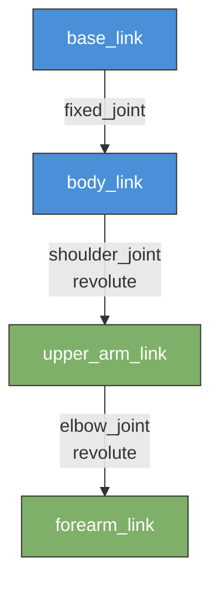

# باب 7: روبوٹ کی تفصیل — یو آر ڈی ایف اور ایس ڈی ایف (Robot Description -- URDF and SDF)

<div dir="rtl">

[Chapter 6](./ch06-gazebo-simulation.md) میں آپ نے گیزیبو (Gazebo) کو لانچ کیا اور ایک پہلے سے تیار شدہ روبوٹ (Robot) ماڈل کو اسپان کیا۔ لیکن وہ ماڈل کہاں سے آیا؟ کسی کو روبوٹ کے ہر لنک (Link)، جوائنٹ (Joint)، سینسر (Sensor)، اور ویژول (Visual) ایلیمنٹ کو ایک منظم فائل میں بیان کرنا پڑا۔ وہ فائل روبوٹ کی تفصیل ہے، اور اسے لکھنا سیکھنا ایسا ہی ہے جیسے گھر بنانے سے پہلے بلیو پرنٹ بنانا سیکھنا۔

</div>

<div dir="rtl">

یہ باب آپ کو روبوٹ (Robot) کی تفصیل کے دو بنیادی فارمیٹس – یو آر ڈی ایف (URDF) اور ایس ڈی ایف (SDF) – سکھاتا ہے، اور زی کرو (xacro) کا تعارف کراتا ہے، ایک ایسا ٹول جو پیچیدہ تفصیلات کو قابل انتظام بناتا ہے۔

</div>

## سیکھنے کے مقاصد (Learning Objectives)

<div dir="rtl">

اس باب کے اختتام تک، آپ اس قابل ہو جائیں گے کہ:

- روبوٹ (Robot) کی تفصیل کی فائلوں کا مقصد اور ان کی ضرورت کی وضاحت کر سکیں۔
- ایک کم سے کم یو آر ڈی ایف (URDF) فائل لکھ سکیں جو لنکس (Links)، جوائنٹس (Joints)، ویژول جیومیٹری (Visual Geometry)، اور کولیژن جیومیٹری (Collision Geometry) کی وضاحت کرتی ہے۔
- خصوصیات اور استعمال کے کیسز کے لحاظ سے یو آر ڈی ایف (URDF) اور ایس ڈی ایف (SDF) کے درمیان فرق کر سکیں۔
- روبوٹ (Robot) کی تفصیلات کو پیرامیٹرائز اور ماڈیولرائز کرنے کے لیے زی کرو (xacro) کا استعمال کر سکیں۔
- آر ویز ٹو (RViz2) میں یو آر ڈی ایف (URDF) کو ویژولائز (Visualize) کر سکیں اور ٹی ایف (ٹرانسفارم) (TF (transform)) ٹری (Tree) کی تصدیق کر سکیں۔

</div>

## 7.1 تعارف: روبوٹس کو ڈسکرپشن فائل کی ضرورت کیوں ہے؟ (Introduction: Why Robots Need a Description File)

<div dir="rtl">

ایک روبوٹ (Robot) سخت جسموں (لنکس) کا ایک مجموعہ ہے جو جوائنٹس (Joints) کے ذریعے جڑے ہوئے ہیں۔ کسی روبوٹ (Robot) کو سمیولیشن (simulate) یا ویژولائز (visualize) کرنے کے لیے، سافٹ ویئر کو یہ جاننے کی ضرورت ہوتی ہے:

</div>

<div dir="rtl">

- **حصے کیا ہیں؟** روبوٹ (Robot) میں کتنے لنکس (Links) ہیں؟ ہر ایک کی شکل کیا ہے؟
- **وہ کیسے جڑے ہوئے ہیں؟** کون سے لنکس (Links) جوائنٹس (Joints) کے ذریعے جڑے ہوئے ہیں؟ جوائنٹ کی کون سی قسم – ریوولیوٹ (Revolute) (ہِنج)، پریزمیٹک (Prismatic) (سلائیڈر)، یا فکسڈ (Fixed)؟
- **وہ کیسے نظر آتے ہیں؟** رینڈرنگ (rendering) کے لیے کون سا رنگ، ٹیکسچر، یا میش (Mesh) استعمال کیا جانا چاہیے؟
- **وہ کیسے ٹکراتے ہیں؟؟** ٹکراؤ کا پتہ لگانے کے لیے فزکس انجن (Physics Engine) کو کون سی آسان جیومیٹری (Geometry) استعمال کرنی چاہیے؟
- **طبعی خصوصیات کیا ہیں؟** ماس (Mass)، انرشیا (Inertia)، رگڑ کے گتانک (friction coefficients)۔

</div>

<div dir="rtl">

اس معلومات کے بغیر، گیزیبو (Gazebo) روبوٹ (Robot) کو سمیولیشن (simulate) نہیں کر سکتا، آر ویز ٹو (RViz2) اسے ڈسپلے (display) نہیں کر سکتا، اور موشن پلانرز ٹراجیکٹریز (trajectories) کا حساب نہیں لگا سکتے۔ روبوٹ (Robot) کی تفصیل کی فائل روبوٹ (Robot) کی طبعی ساخت کے لیے سچائی کا واحد ذریعہ ہے۔

</div>

<div dir="rtl">

اسے اس طرح سمجھیں: ایک روبوٹ (Robot) کی تفصیل روبوٹ (Robot) کے لیے وہی ہے جو ایک ویب پیج کے لیے ایچ ٹی ایم ایل (HTML) ہے۔ یہ ایک منظم، اعلانیہ دستاویز ہے جو رینڈرنگ انجن (Rendering Engine) کو بتاتی ہے کہ کیا بنانا ہے اور چیزیں ایک دوسرے سے کیسے متعلق ہیں۔

</div>

## 7.2 یو آر ڈی ایف: یونائیٹڈ روبوٹ ڈسکرپشن فارمیٹ (URDF: The Unified Robot Description Format)

<div dir="rtl">

یو آر ڈی ایف (URDF) ایک ایکس ایم ایل (XML) فارمیٹ ہے جسے آر او ایس (ROS) کمیونٹی نے بنایا ہے۔ یہ آر او ایس (ROS) ایکو سسٹم (ecosystem) میں سب سے زیادہ استعمال ہونے والا روبوٹ (Robot) تفصیل فارمیٹ ہے۔ تقریباً ہر آر او ایس (ROS) کے موافق روبوٹ (Robot) – ٹرٹل بوٹ (TurtleBot) سے لے کر صنعتی آرمز (industrial arms) تک – ایک یو آر ڈی ایف (URDF) فائل کے ساتھ آتا ہے۔

</div>

### ٹری سٹرکچر (The Tree Structure)

<div dir="rtl">

ایک یو آر ڈی ایف (URDF) ایک روبوٹ (Robot) کو لنکس (Links) کے ایک **ٹری** (Tree) کے طور پر بیان کرتا ہے جو جوائنٹس (Joints) سے جڑے ہوتے ہیں۔ صرف ایک روٹ لنک (Root Link) ہوتا ہے (عام طور پر `base_link` کہلاتا ہے)، اور ہر دوسرا لنک (Link) ایک چائلڈ ہوتا ہے جو ایک جوائنٹ (Joint) کے ذریعے جڑا ہوتا ہے۔ یو آر ڈی ایف (URDF) لوپس (loops) یا بند کائینیٹک چینز (kinematic chains) کی اجازت نہیں دیتا۔

</div>



<div dir="rtl">

اس ڈایاگرام میں، `base_link` روٹ (Root) ہے۔ ایک فکسڈ جوائنٹ (Fixed Joint) اسے `body_link` سے جوڑتا ہے۔ دو ریوولیوٹ جوائنٹس (Revolute Joints) ایک سادہ 2-ڈی او ایف (ڈگری آف فریڈم) (DOF (Degree of Freedom)) آرم (arm) بناتے ہیں۔ ہر جوائنٹ (Joint) ایک پیرنٹ لنک (parent link) اور ایک چائلڈ لنک (child link) کے درمیان تعلق کی وضاحت کرتا ہے۔

</div>

### لنکس: سخت اجسام (Links: The Rigid Bodies)

<div dir="rtl">

ایک لنک (Link) ایک واحد سخت جسم کی نمائندگی کرتا ہے۔ اس کے تین اہم اجزاء ہیں:

</div>

| جزو (Component) | مقصد (Purpose) | درکار؟ (Required?) |
|-----------|---------|-----------|
| `<visual>` | یہ بتاتا ہے کہ لنک (Link) ویژولائزیشن (Visualization) ٹولز (جیسے آر ویز ٹو (RViz2)، گیزیبو (Gazebo) جی یو آئی (GUI)) میں کیسا نظر آتا ہے۔ میشز (Meshes) یا پرمیٹیو شیپس (Primitive Shapes) کا استعمال کرتا ہے۔ | نہیں، لیکن تجویز کردہ |
| `<collision>` | ٹکراؤ کا پتہ لگانے کے لیے فزکس انجن (Physics Engine) کے ذریعے استعمال ہونے والی آسان جیومیٹری (Geometry) کی وضاحت کرتا ہے۔ اکثر ایک باؤنڈنگ باکس (Bounding Box) یا سلنڈر (Cylinder) ہوتا ہے۔ | نہیں، لیکن سمیولیشن (Simulation) کے لیے درکار |
| `<inertial>` | ماس (Mass) اور 3x3 انرشیا میٹرکس (Inertia Matrix) کی وضاحت کرتا ہے۔ فزکس انجن (Physics Engine) کے لیے ڈائنامکس (Dynamics) کو صحیح طریقے سے سمیولیشن (simulate) کرنے کے لیے درکار۔ | نہیں، لیکن نان-فکسڈ جوائنٹس (non-fixed joints) کے لیے درکار |

<div dir="rtl">

:::tip ویژول بمقابلہ کولیژن جیومیٹری (Visual vs Collision Geometry)
`visual` کے لیے ایک تفصیلی میش (Mesh) (ایس ٹی ایل (STL) یا ڈی اے ای (DAE) فائل) استعمال کریں تاکہ روبوٹ (Robot) حقیقت پسندانہ نظر آئے۔ `collision` کے لیے ایک سادہ پرمیٹیو (primitive) (باکس، سلنڈر (Cylinder)، اسفیئر (sphere)) استعمال کریں تاکہ فزکس انجن (Physics Engine) تیزی سے کام کرے۔ کولیژن جیومیٹری (Collision Geometry) کو ویژول جیومیٹری (Visual Geometry) سے مکمل طور پر مطابقت رکھنے کی ضرورت نہیں – اسے صرف ایک معقول تخمینہ ہونے کی ضرورت ہے۔
:::

</div>

### جوائنٹس: رابطے (Joints: The Connections)

<div dir="rtl">

ایک جوائنٹ (Joint) ایک پیرنٹ لنک (parent link) کو چائلڈ لنک (child link) سے جوڑتا ہے۔ یو آر ڈی ایف (URDF) ان جوائنٹ (Joint) کی اقسام کو سپورٹ کرتا ہے:

</div>

| جوائنٹ کی قسم (Joint Type) | حرکت (Motion) | مثال (Example) |
|------------|--------|---------|
| `revolute` | ایک محور کے گرد گھومتا ہے، بالائی اور نچلی حدود کے ساتھ | کہنی، کندھا |
| `continuous` | ایک محور کے گرد گھومتا ہے، کوئی حدود نہیں | پہیہ |
| `prismatic` | ایک محور کے ساتھ سلائیڈ کرتا ہے، بالائی اور نچلی حدود کے ساتھ | لینیئر ایکچو ایٹر (Linear actuator) |
| `fixed` | کوئی حرکت نہیں – دو لنکس (Links) کو سختی سے جوڑتا ہے | سینسر (Sensor) ماؤنٹ |
| `floating` | چھ ڈگری آف فریڈم (ڈی او ایف) (Degree of Freedom (DOF)) (یو آر ڈی ایف (URDF) میں شاذ و نادر ہی استعمال ہوتا ہے) | فری-فلوٹنگ بیس (Free-floating base) |
| `planar` | ایک پلین (plane) میں حرکت (شاذ و نادر ہی استعمال ہوتا ہے) | -- |

### کوڈ مثال 1: ایک کم سے کم 2-لنک روبوٹ آرم یو آر ڈی ایف (Code Example 1: A Minimal 2-Link Robot Arm URDF)

<div dir="rtl">

یہ ایک مکمل یو آر ڈی ایف (URDF) فائل ہے جو ایک بیس (base) اور ایک گھومنے والے لنک (Link) کے ساتھ ایک سادہ روبوٹ (Robot) آرم (arm) کی وضاحت کرتی ہے۔ اسے `simple_arm.urdf` کے طور پر محفوظ کریں:

</div>

```xml
<?xml version="1.0"?>
<!--
  simple_arm.urdf
  A minimal 2-link robot arm for learning URDF structure.
  - base_link: a fixed box sitting on the ground
  - arm_link:  a cylinder that rotates around the Z-axis
-->
<robot name="simple_arm">

  <!-- ================= BASE LINK ================= -->
  <!-- The root of the kinematic tree. A heavy box that sits on the ground. -->
  <link name="base_link">
    <!-- Visual: what you see in RViz2 / Gazebo -->
    <visual>
      <geometry>
        <box size="0.2 0.2 0.1"/>  <!-- 20cm x 20cm x 10cm box -->
      </geometry>
      <material name="blue">
        <color rgba="0.0 0.0 0.8 1.0"/>  <!-- RGBA: blue, fully opaque -->
      </material>
    </visual>

    <!-- Collision: simplified geometry for physics -->
    <collision>
      <geometry>
        <box size="0.2 0.2 0.1"/>
      </geometry>
    </collision>

    <!-- Inertial: mass and inertia tensor -->
    <inertial>
      <mass value="5.0"/>  <!-- 5 kg -->
      <inertia ixx="0.01" ixy="0.0" ixz="0.0"
               iyy="0.01" iyz="0.0" izz="0.01"/>
    </inertial>
  </link>

  <!-- ================= ARM LINK ================= -->
  <!-- A cylinder that rotates relative to the base. -->
  <link name="arm_link">
    <visual>
      <!-- Offset the visual so the cylinder extends upward from the joint -->
      <origin xyz="0.0 0.0 0.2" rpy="0 0 0"/>
      <geometry>
        <cylinder radius="0.04" length="0.4"/>  <!-- 4cm radius, 40cm long -->
      </geometry>
      <material name="orange">
        <color rgba="1.0 0.5 0.0 1.0"/>
      </material>
    </visual>

    <collision>
      <origin xyz="0.0 0.0 0.2" rpy="0 0 0"/>
      <geometry>
        <cylinder radius="0.04" length="0.4"/>
      </geometry>
    </collision>

    <inertial>
      <mass value="1.0"/>  <!-- 1 kg -->
      <origin xyz="0.0 0.0 0.2" rpy="0 0 0"/>
      <inertia ixx="0.005" ixy="0.0" ixz="0.0"
               iyy="0.005" iyz="0.0" izz="0.001"/>
    </inertial>
  </link>

  <!-- ================= JOINT ================= -->
  <!-- Revolute joint: arm_link rotates around the Z-axis relative to base_link -->
  <joint name="base_to_arm" type="revolute">
    <parent link="base_link"/>
    <child link="arm_link"/>
    <!-- Place the joint at the top center of the base -->
    <origin xyz="0.0 0.0 0.05" rpy="0 0 0"/>
    <!-- Rotation axis: Z-axis (pointing up) -->
    <axis xyz="0 0 1"/>
    <!-- Joint limits: rotate +/- 90 degrees, max effort 10 Nm, max velocity 1 rad/s -->
    <limit lower="-1.5708" upper="1.5708" effort="10.0" velocity="1.0"/>
  </joint>

</robot>
```

<div dir="rtl">

**اس فائل میں اہم مشاہدات:**

- `<visual>` کے اندر موجود `<origin>` ٹیگ سلنڈر (Cylinder) کو آفسیٹ کرتا ہے تاکہ یہ جوائنٹ (Joint) سے اوپر کی طرف پھیلے بجائے اس کے کہ اس پر مرکوز ہو۔
- جوائنٹ (Joint) پر موجود `<limit>` ٹیگ گردش کو تقریباً پلس اور مائنس 90 ڈگری تک محدود کرتا ہے۔
- `<axis>` ٹیگ اس سمت کی وضاحت کرتا ہے جس کے گرد جوائنٹ (Joint) گھومتا ہے۔

</div>

<div dir="rtl">

**اس یو آر ڈی ایف (URDF) کی درستگی کی تصدیق کرنے کے لیے:**

</div>

```bash
# Install the urdf_parser if not already available
sudo apt install liburdfdom-tools

# Check for syntax errors
check_urdf simple_arm.urdf
```

<div dir="rtl">

**متوقع آؤٹ پٹ:**

</div>

```
robot name is: simple_arm
---------- Successfully Coverage [simple_arm] ----------
root Link: base_link has 1 child(ren)
    child(1):  arm_link
        child(1):  arm_link
```

## 7.3 ایس ڈی ایف: سمیولیشن ڈسکرپشن فارمیٹ (SDF: The Simulation Description Format)

<div dir="rtl">

ایس ڈی ایف (SDF) (سمیولیشن ڈسکرپشن فارمیٹ) گیزیبو (Gazebo) کا آبائی فارمیٹ ہے۔ جہاں یو آر ڈی ایف (URDF) آر او ایس (ROS) کے لیے ڈیزائن کیا گیا تھا، ایس ڈی ایف (SDF) سمیولیشن (Simulation) کے لیے ڈیزائن کیا گیا تھا۔ یہ ہر وہ چیز بیان کر سکتا ہے جو یو آر ڈی ایف (URDF) کر سکتا ہے، اس کے علاوہ اضافی خصوصیات بھی۔

</div>

### یو آر ڈی ایف بمقابلہ ایس ڈی ایف: اہم اختلافات (URDF vs SDF: Key Differences)

| خصوصیت (Feature) | یو آر ڈی ایف (URDF) | ایس ڈی ایف (SDF) |
|---------|------|-----|
| **گنجائش (Scope)** | صرف ایک روبوٹ (Robot) | پوری دنیا (روبوٹس (Robots)، لائٹس (lights)، علاقے (terrain)، فزکس کی سیٹنگز (physics settings)) |
| **کائینیٹک سٹرکچر (Kinematic structure)** | صرف ٹری (Tree) (کوئی لوپس نہیں) | بند کائینیٹک چینز (kinematic chains) کو سپورٹ کرتا ہے |
| **سینسرز (Sensors)** | آبائی طور پر سپورٹ نہیں (گیزیبو (Gazebo) پلگ انز درکار ہیں) | فرسٹ-کلاس سینسر (Sensor) کی تعریفیں |
| **فزکس پراپرٹیز (Physics properties)** | بنیادی (ماس (mass)، انرشیا (inertia)) | مکمل فزکس کی ترتیب (رگڑ (friction)، ڈیمپنگ (damping)، سالور سیٹنگز (solver settings)) |
| **متعدد روبوٹس (Multiple robots)** | فی فائل ایک روبوٹ (Robot) | ایک ورلڈ فائل (world file) میں متعدد ماڈلز |
| **آر او ایس انٹیگریشن (ROS integration)** | آبائی – `robot_state_publisher`، موو اِٹ (MoveIt)، آر ویز ٹو (RViz2) کے ذریعے استعمال ہوتا ہے | آر او ایس (ROS) ٹولز (tools) کے لیے تبدیلی کی ضرورت ہے |

### کب کس کا استعمال کریں (When to Use Which)

<div dir="rtl">

- **یو آر ڈی ایف (URDF) استعمال کریں** جب آپ کا بنیادی ہدف آر او ایس (ROS) ایکو سسٹم (ecosystem) ہو: آر ویز ٹو (RViz2) ویژولائزیشن (Visualization)، `robot_state_publisher`، موو اِٹ (MoveIt) موشن پلاننگ (motion planning)، اور ٹی ایف (TF) ٹری (Tree) پبلشنگ (publishing)۔ زیادہ تر آر او ایس (ROS) ٹیوٹوریلز (tutorials) اور ٹولز (tools) یو آر ڈی ایف (URDF) کی توقع رکھتے ہیں۔
- **ایس ڈی ایف (SDF) استعمال کریں** جب آپ کو مکمل سمیولیشن (Simulation) دنیاؤں، بند کائینیٹک چینز (kinematic chains)، یا اعلیٰ فزکس پراپرٹیز کی وضاحت کرنے کی ضرورت ہو۔ گیزیبو (Gazebo) آبائی طور پر ایس ڈی ایف (SDF) کو پڑھتا ہے اور جب آپ یو آر ڈی ایف (URDF) ماڈل کو اسپان (spawn) کرتے ہیں تو یو آر ڈی ایف (URDF) کو اندرونی طور پر ایس ڈی ایف (SDF) میں تبدیل کرتا ہے۔

</div>

<div dir="rtl">

عملی طور پر، زیادہ تر روبوٹکس (robotics) ٹیمیں ایک **یو آر ڈی ایف (URDF) (یا زی کرو (xacro)) فائل** کو بنیادی روبوٹ (Robot) کی تفصیل کے طور پر برقرار رکھتی ہیں اور گیزیبو (Gazebo) کو اندرونی طور پر ایس ڈی ایف (SDF) میں تبدیلی کو سنبھالنے دیتی ہیں۔ یہ آپ کو دونوں جہانوں کا بہترین فائدہ دیتا ہے: مکمل آر او ایس (ROS) ٹول (tool) مطابقت کے ساتھ ساتھ گیزیبو (Gazebo) سمیولیشن (Simulation) بھی۔

</div>

## 7.4 زی کرو: روبوٹ کی تفصیل کے لیے میکروز (Xacro: Macros for Robot Description)

<div dir="rtl">

حقیقی روبوٹس (Robots) پیچیدہ ہوتے ہیں۔ ایک ہیومنائیڈ (humanoid) میں 30+ سے زیادہ جوائنٹس (Joints) ہو سکتے ہیں، ہر ایک میں ملتی جلتی لنک (Link) کی تعریفیں ہوتی ہیں۔ ان سب کو ہاتھ سے راؤ یو آر ڈی ایف (raw URDF) میں لکھنا تھکا دینے والا اور غلطی کا شکار ہو سکتا ہے۔ **زی کرو** (Xacro) (ایکس ایم ایل میکروز) (XML Macros) یو آر ڈی ایف (URDF) میں ویری ایبلز (variables)، ریاضیاتی اظہارات (math expressions) اور دوبارہ استعمال کے قابل میکروز (macros) شامل کرکے اس مسئلے کو حل کرتا ہے۔

</div>

<div dir="rtl">

زی کرو (xacro) فائلیں `.urdf.xacro` ایکسٹینشن (extension) استعمال کرتی ہیں اور بلڈ ٹائم (build time) یا لانچ ٹائم (launch time) پر سادہ یو آر ڈی ایف (URDF) میں پروسیس (process) ہوتی ہیں۔

</div>

### کوڈ مثال 2: زی کرو (xacro) کے ساتھ پیرامیٹرائزڈ روبوٹ (Code Example 2: Parameterized Robot with Xacro)

<div dir="rtl">

اسے `simple_arm.urdf.xacro` کے طور پر محفوظ کریں:

</div>

```xml
<?xml version="1.0"?>
<!--
  simple_arm.urdf.xacro
  The same 2-link arm, but parameterized with xacro.
  Change the properties at the top to resize the entire robot.
-->
<robot xmlns:xacro="http://www.ros.org/wiki/xacro" name="simple_arm">

  <!-- =============== PROPERTIES (like variables) =============== -->
  <xacro:property name="base_width"  value="0.2"/>
  <xacro:property name="base_height" value="0.1"/>
  <xacro:property name="base_mass"   value="5.0"/>

  <xacro:property name="arm_radius"  value="0.04"/>
  <xacro:property name="arm_length"  value="0.4"/>
  <xacro:property name="arm_mass"    value="1.0"/>

  <!-- =============== MACRO: a reusable link template =============== -->
  <xacro:macro name="cylinder_link" params="name radius length mass color_r color_g color_b">
    <link name="${name}">
      <visual>
        <origin xyz="0 0 ${length/2}" rpy="0 0 0"/>
        <geometry>
          <cylinder radius="${radius}" length="${length}"/>
        </geometry>
        <material name="${name}_color">
          <color rgba="${color_r} ${color_g} ${color_b} 1.0"/>
        </material>
      </visual>
      <collision>
        <origin xyz="0 0 ${length/2}" rpy="0 0 0"/>
        <geometry>
          <cylinder radius="${radius}" length="${length}"/>
        </geometry>
      </collision>
      <inertial>
        <mass value="${mass}"/>
        <origin xyz="0 0 ${length/2}" rpy="0 0 0"/>
        <!-- Simplified inertia for a solid cylinder -->
        <inertia ixx="${(1.0/12.0)*mass*(3*radius*radius + length*length)}"
                 ixy="0" ixz="0"
                 iyy="${(1.0/12.0)*mass*(3*radius*radius + length*length)}"
                 iyz="0"
                 izz="${0.5*mass*radius*radius}"/>
      </inertial>
    </link>
  </xacro:macro>

  <!-- =============== BUILD THE ROBOT =============== -->

  <!-- Base link: a box (defined inline since it differs from the macro) -->
  <link name="base_link">
    <visual>
      <geometry>
        <box size="${base_width} ${base_width} ${base_height}"/>
      </geometry>
      <material name="blue">
        <color rgba="0.0 0.0 0.8 1.0"/>
      </material>
    </visual>
    <collision>
      <geometry>
        <box size="${base_width} ${base_width} ${base_height}"/>
      </geometry>
    </collision>
    <inertial>
      <mass value="${base_mass}"/>
      <inertia ixx="0.01" ixy="0" ixz="0" iyy="0.01" iyz="0" izz="0.01"/>
    </inertial>
  </link>

  <!-- Arm link: use the macro -->
  <xacro:cylinder_link name="arm_link"
                       radius="${arm_radius}"
                       length="${arm_length}"
                       mass="${arm_mass}"
                       color_r="1.0" color_g="0.5" color_b="0.0"/>

  <!-- Joint connecting base to arm -->
  <joint name="base_to_arm" type="revolute">
    <parent link="base_link"/>
    <child link="arm_link"/>
    <origin xyz="0 0 ${base_height/2}" rpy="0 0 0"/>
    <axis xyz="0 0 1"/>
    <limit lower="-1.5708" upper="1.5708" effort="10.0" velocity="1.0"/>
  </joint>

</robot>
```

<div dir="rtl">

**زی کرو (xacro) آپ کو کیا فراہم کرتا ہے:**

1. **پراپرٹیز (Properties)** (`xacro:property`): ایک ویلیو (value) کو ایک بار متعین کریں، اسے ہر جگہ `${name}` کے ساتھ استعمال کریں۔ `arm_length` کو 0.4 سے 0.6 میں تبدیل کریں اور پورا روبوٹ (Robot) مستقل طور پر اپ ڈیٹ (update) ہو جائے گا۔
2. **ریاضیاتی اظہارات (Math expressions)**: `${length/2}` یا `${(1.0/12.0)*mass*(3*radius*radius + length*length)}` کو براہ راست ایٹریبیوٹ ویلیوز (attribute values) میں لکھیں۔ انرشیا ٹینسر (inertia tensor) سلنڈر (Cylinder) کے فارمولوں سے خود بخود شمار کیا جاتا ہے۔
3. **میکروز (Macros)** (`xacro:macro`): ایک ٹیمپلیٹ (template) کو ایک بار متعین کریں، اسے مختلف پیرامیٹرز (parameters) کے ساتھ کئی بار انسٹینشیٹ (instantiate) کریں۔ ایک حقیقی ہیومنائیڈ (humanoid) میں، آپ تمام آرم سیگمنٹس (arm segments) کے لیے ایک میکرو (Macro) اور تمام لیگ سیگمنٹس (leg segments) کے لیے دوسرا استعمال کر سکتے ہیں۔

</div>

<div dir="rtl">

**زی کرو (xacro) کو یو آر ڈی ایف (URDF) میں پروسیس (process) کرنے کے لیے:**

</div>

```bash
# Generate plain URDF from the xacro file
xacro simple_arm.urdf.xacro > simple_arm_generated.urdf

# Verify the generated URDF
check_urdf simple_arm_generated.urdf
```

<div dir="rtl">

**متوقع آؤٹ پٹ:**

</div>

```
robot name is: simple_arm
---------- Successfully Parsed [simple_arm] ----------
root Link: base_link has 1 child(ren)
    child(1):  arm_link
```

<div dir="rtl">

لانچ ٹائم (launch time) پر، `robot_state_publisher` زی کرو (xacro) فائلوں کو براہ راست پروسیس (process) کر سکتا ہے، لہذا آپ کو شاذ و نادر ہی یو آر ڈی ایف (URDF) کو دستی طور پر تیار کرنے کی ضرورت ہوتی ہے۔

</div>

## 7.5 یو آر ڈی ایف کو آر او ایس ٹو میں لوڈ کرنا (Loading URDF into ROS 2)

<div dir="rtl">

`robot_state_publisher` نوڈ (Node) ایک یو آر ڈی ایف (URDF) (یا زی کرو (xacro)) پڑھتا ہے اور دو کام کرتا ہے:

</div>

<div dir="rtl">

1. **ٹی ایف (TF) ٹری (Tree) شائع کرتا ہے**: یہ تمام لنکس (Links) کے درمیان ٹرانسفارمز (transforms) کو `/joint_states` ٹاپک (Topic) پر موصول ہونے والے جوائنٹ اسٹیٹس (Joint States) کی بنیاد پر براڈکاسٹ (broadcasts) کرتا ہے۔
2. **روبوٹ (Robot) کی تفصیل شائع کرتا ہے**: یہ مکمل یو آر ڈی ایف (URDF) کو `/robot_description` ٹاپک (Topic) پر دستیاب کرتا ہے تاکہ آر ویز ٹو (RViz2) جیسے ٹولز (tools) روبوٹ (Robot) کو ڈسپلے (display) کر سکیں۔

</div>

<div dir="rtl">

یہاں بتایا گیا ہے کہ آپ لانچ فائل (launch file) میں یو آر ڈی ایف (URDF) کو کیسے لوڈ (load) کرتے ہیں:

</div>

```python
"""Launch robot_state_publisher with our simple_arm URDF."""

import os
from ament_index_python.packages import get_package_share_directory
from launch import LaunchDescription
from launch_ros.actions import Node
import xacro


def generate_launch_description():
    """Process the xacro file and start robot_state_publisher."""

    # Locate the xacro file in your package
    pkg_share = get_package_share_directory('my_robot_pkg')
    xacro_path = os.path.join(pkg_share, 'urdf', 'simple_arm.urdf.xacro')

    # Process xacro into a URDF string
    robot_description = xacro.process_file(xacro_path).toxml()

    # Start robot_state_publisher
    robot_state_pub = Node(
        package='robot_state_publisher',
        executable='robot_state_publisher',
        parameters=[{'robot_description': robot_description}],
        output='screen',
    )

    # Start joint_state_publisher_gui for interactive control
    joint_state_pub_gui = Node(
        package='joint_state_publisher_gui',
        executable='joint_state_publisher_gui',
        output='screen',
    )

    # Start RViz2 for visualization
    rviz_node = Node(
        package='rviz2',
        executable='rviz2',
        output='screen',
    )

    return LaunchDescription([
        robot_state_pub,
        joint_state_pub_gui,
        rviz_node,
    ])
```

<div dir="rtl">

جب آپ اس لانچ فائل (launch file) کو چلاتے ہیں، تو ہر نان-فکسڈ جوائنٹ (non-fixed joint) کے لیے ایک جی یو آئی (GUI) سلائیڈر (slider) ظاہر ہوتا ہے۔ سلائیڈر (slider) کو حرکت دینے سے جوائنٹ اسٹیٹس (Joint States) شائع ہوتے ہیں، `robot_state_publisher` ٹی ایف (TF) ٹری (Tree) کو اپ ڈیٹ (update) کرتا ہے، اور آر ویز ٹو (RViz2) روبوٹ (Robot) کو حقیقی وقت میں حرکت کرتے ہوئے دکھاتا ہے۔

</div>

## خلاصہ (Summary)

<div dir="rtl">

اس باب میں آپ نے سیکھا:

- **روبوٹ (Robot) کی تفصیلات کیوں موجود ہیں**: سمیولیٹرز (simulators)، ویژولائزرز (visualizers)، اور موشن پلانرز (motion planners) سب کو روبوٹ (Robot) کے لنکس (Links)، جوائنٹس (Joints)، اور طبعی خصوصیات کی ایک منظم تعریف کی ضرورت ہوتی ہے۔
- **یو آر ڈی ایف (URDF) کی بنیادی باتیں**: لنکس (Links) (ویژول (visual)، کولیژن (collision)، انرشیل (inertial))، جوائنٹس (Joints) (ریوولیوٹ (revolute)، کنٹینیووس (continuous)، پریزمیٹک (prismatic)، فکسڈ (fixed))، اور `base_link` پر مبنی ٹری سٹرکچر (Tree structure)۔
- **ایس ڈی ایف (SDF) بمقابلہ یو آر ڈی ایف (URDF)**: ایس ڈی ایف (SDF) گیزیبو (Gazebo) کا آبائی فارمیٹ ہے جس میں زیادہ خصوصیات ہیں (دنیا، سینسرز (Sensors)، بند چینز (chains))۔ یو آر ڈی ایف (URDF) آر او ایس (ROS) ایکو سسٹم (ecosystem) کا معیار ہے۔ زیادہ تر ٹیمیں یو آر ڈی ایف (URDF) کو برقرار رکھتی ہیں اور گیزیبو (Gazebo) کو اندرونی طور پر اسے تبدیل کرنے دیتی ہیں۔
- **زی کرو (xacro)**: ایک میکرو (Macro) زبان جو یو آر ڈی ایف (URDF) میں ویری ایبلز (variables)، ریاضی اور دوبارہ استعمال کے قابل ٹیمپلیٹس (templates) کا اضافہ کرتی ہے، جس سے پیچیدہ روبوٹس (Robots) قابل انتظام بنتے ہیں۔
- **آر او ایس ٹو انٹیگریشن (ROS 2 integration)**: `robot_state_publisher` یو آر ڈی ایف (URDF) کو لوڈ (load) کرتا ہے، ٹرانسفارمز (transforms) شائع کرتا ہے، اور تفصیل کو باقی آر او ایس ٹو (ROS 2) سسٹم (system) کے لیے دستیاب کرتا ہے۔

</div>

## ہینڈز-آن مشق: ایک یو آر ڈی ایف بنائیں اور اسے آر ویز ٹو (RViz2) میں ویژولائز کریں (Hands-On Exercise: Create a URDF and Visualize It in RViz2)

<div dir="rtl">

اس مشق میں آپ ایک سادہ 2-لنک روبوٹ (Robot) یو آر ڈی ایف (URDF) بنائیں گے، اسے آر ویز ٹو (RViz2) میں لوڈ (load) کریں گے، اور ٹی ایف (TF) ٹری (Tree) کی تصدیق کریں گے۔

</div>

### پیشگی شرائط (Prerequisites)

```bash
# Install required packages
sudo apt install ros-humble-joint-state-publisher-gui \
                 ros-humble-robot-state-publisher \
                 ros-humble-rviz2 \
                 ros-humble-xacro \
                 liburdfdom-tools
```

### مراحل (Steps)

<div dir="rtl">

**مرحلہ 1:** ایک ورک اسپیس (Workspace) اور پیکیج (Package) بنائیں۔ (اگر آپ کے پاس پہلے سے ہے تو چھوڑ دیں)۔

</div>

```bash
mkdir -p ~/ros2_ws/src
cd ~/ros2_ws/src
ros2 pkg create --build-type ament_python my_robot_description
mkdir -p my_robot_description/urdf
mkdir -p my_robot_description/launch
```

<div dir="rtl">

**مرحلہ 2:** کوڈ مثال 1 سے `simple_arm.urdf` کو `my_robot_description/urdf/simple_arm.urdf` میں کاپی کریں۔

</div>

<div dir="rtl">

**مرحلہ 3:** `my_robot_description/launch/view_robot.launch.py` پر ایک لانچ فائل (launch file) بنائیں۔

</div>

```python
"""Launch file to view simple_arm in RViz2."""

import os
from ament_index_python.packages import get_package_share_directory
from launch import LaunchDescription
from launch_ros.actions import Node


def generate_launch_description():
    pkg_share = get_package_share_directory('my_robot_description')
    urdf_path = os.path.join(pkg_share, 'urdf', 'simple_arm.urdf')

    with open(urdf_path, 'r') as f:
        robot_description = f.read()

    return LaunchDescription([
        Node(
            package='robot_state_publisher',
            executable='robot_state_publisher',
            parameters=[{'robot_description': robot_description}],
        ),
        Node(
            package='joint_state_publisher_gui',
            executable='joint_state_publisher_gui',
        ),
        Node(
            package='rviz2',
            executable='rviz2',
        ),
    ])
```

<div dir="rtl">

**مرحلہ 4:** یو آر ڈی ایف (URDF) اور لانچ فائلوں کو انسٹال (install) کرنے کے لیے `setup.py` کو اپ ڈیٹ (update) کریں۔ `data_files` میں یہ اندراجات (entries) شامل کریں:

</div>

```python
# Inside setup.py data_files list, add:
(os.path.join('share', package_name, 'urdf'), glob('urdf/*')),
(os.path.join('share', package_name, 'launch'), glob('launch/*.py')),
```

<div dir="rtl">

**مرحلہ 5:** بلڈ (Build) اور لانچ (launch) کریں۔

</div>

```bash
cd ~/ros2_ws
colcon build --packages-select my_robot_description
source install/setup.bash
ros2 launch my_robot_description view_robot.launch.py
```

<div dir="rtl">

**مرحلہ 6:** آر ویز ٹو (RViz2) میں، **روبوٹ ماڈل** (RobotModel) ڈسپلے (display) شامل کریں:

1. ڈسپلیز پینل (Displays panel) میں "Add" پر کلک کریں۔
2. "RobotModel" منتخب کریں اور "OK" پر کلک کریں۔
3. "Fixed Frame" (ڈسپلیز پینل (Displays panel) کے اوپری حصے میں) کو `base_link` پر سیٹ کریں۔
4. آپ کو نیلا بیس باکس (base box) اور نارنجی آرم سلنڈر (arm cylinder) نظر آنا چاہیے۔

</div>

<div dir="rtl">

**مرحلہ 7:** کوآرڈینیٹ فریمز (coordinate frames) دیکھنے کے لیے **ٹی ایف** (TF) ڈسپلے (display) شامل کریں:

1. دوبارہ "Add" پر کلک کریں، "TF" منتخب کریں، "OK" پر کلک کریں۔
2. آپ کو `base_link` اور `arm_link` پر کوآرڈینیٹ فریم ایکسس (coordinate frame axes) نظر آنے چاہئیں۔

</div>

<div dir="rtl">

**مرحلہ 8:** آرم (arm) کو گھمانے اور ٹی ایف (TF) ٹری (Tree) کو حقیقی وقت میں اپ ڈیٹ (update) کرنے کی تصدیق کے لیے جوائنٹ اسٹیٹ پبلشر جی یو آئی (Joint State Publisher GUI) سلائیڈر (slider) استعمال کریں۔

</div>

### تصدیق (Verification)

<div dir="rtl">

آپ کی مشق مکمل ہو جائے گی جب:

- [ ] آر ویز ٹو (RViz2) روبوٹ (Robot) کو نیلے بیس (base) اور نارنجی آرم (arm) کے ساتھ دکھائے
- [ ] ٹی ایف (TF) ڈسپلے (display) `base_link` اور `arm_link` کے لیے فریمز (frames) دکھائے
- [ ] جوائنٹ اسٹیٹ پبلشر جی یو آئی (Joint State Publisher GUI) میں سلائیڈر (slider) کو حرکت دینے سے آر ویز ٹو (RViz2) میں آرم (arm) گھومے
- [ ] `ros2 run tf2_tools view_frames` چلانے سے ایک `frames.pdf` تیار ہو جو درست ٹری (Tree) دکھائے: `base_link` -> `arm_link`

</div>

## مزید مطالعہ (Further Reading)

<div dir="rtl">

- [یو آر ڈی ایف کی خصوصیات (آر او ایس ویکی) (URDF Specification (ROS Wiki))](http://wiki.ros.org/urdf/XML) -- تمام یو آر ڈی ایف (URDF) ایکس ایم ایل (XML) عناصر کے لیے مکمل حوالہ۔
- [ایس ڈی ایف کی خصوصیات (SDF Specification)](http://sdformat.org/spec) -- ایس ڈی ایف (SDF) فارمیٹ (format) کی آفیشل (official) تفصیل۔
- [زی کرو ڈاکومینٹیشن (آر او ایس ویکی) (Xacro Documentation (ROS Wiki))](http://wiki.ros.org/xacro) -- زی کرو (xacro) میکروز (macros) اور خصوصیات کے لیے مکمل گائیڈ (guide)۔
- [`robot_state_publisher` (آر او ایس ٹو (ROS 2))](https://github.com/ros/robot_state_publisher) -- ٹرانسفارم پبلشر (transform publisher) کے لیے سورس (source) اور ڈاکومینٹیشن (documentation)۔
- [آر ویز ٹو یوزر گائیڈ (RViz2 User Guide)](https://docs.ros.org/en/humble/Tutorials/Intermediate/RViz/RViz-User-Guide/RViz-User-Guide.html) -- آر ویز ٹو (RViz2) ڈسپلے (displays) کو کیسے کنفیگر (configure) کریں۔
- [موو اِٹ ٹو یو آر ڈی ایف ٹیوٹوریل (MoveIt 2 URDF Tutorial)](https://moveit.picknik.ai/humble/doc/tutorials/getting_started/getting_started.html) -- موو اِٹ (MoveIt) موشن پلاننگ (motion planning) فریم ورک (framework) کے ساتھ یو آر ڈی ایف (URDF) کا استعمال۔

</div>

<div dir="rtl">

---

*پچھلے باب میں، [باب 6: گیزیبو سمیولیشن (Gazebo Simulation)](./ch06-gazebo-simulation.md)، آپ نے گیزیبو سمیولیٹر (Gazebo simulator) کو لانچ (launch) کرنے اور اس کے ساتھ کام کرنے کا طریقہ سیکھا۔ اگلے باب میں، [باب 8: این ویڈیا آئزک (NVIDIA Isaac)](../module-3/ch08-nvidia-isaac.md)، آپ اے آئی (AI) سے چلنے والے روبوٹ پرسیپشن (robot perception) اور سمیولیشن (Simulation) کے لیے این ویڈیا (NVIDIA) کے پلیٹ فارم کو تلاش کریں گے۔*

---

</div>