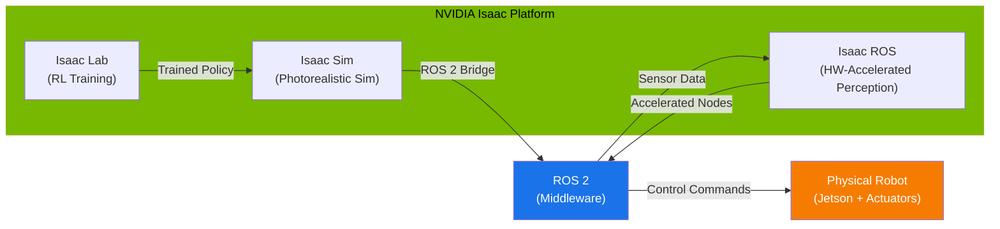

<div dir="rtl">

# باب 8: این ویڈیا آئزک (NVIDIA Isaac) — روبوٹکس (Robotics) کے لیے اے آئی (AI)

## سیکھنے کے مقاصد

اس باب کے اختتام تک، آپ اس قابل ہو جائیں گے کہ:

*   **بیان کریں** این ویڈیا آئزک (NVIDIA Isaac) پلیٹ فارم (Platform) کے تین ستون (آئزک سِم (Isaac Sim)، آئزک لیب (Isaac Lab)، آئزک آر او ایس (Isaac ROS)) اور وہ آر او ایس ٹو (ROS 2) سے کس طرح جڑے ہیں۔
*   **وضاحت کریں** کہ جی پی یو (GPU) سے تیز سمیولیشن (Simulation) بڑے پیمانے پر روبوٹ (Robot) اے آئی (AI) کی تربیت اور جانچ کے لیے کیوں اہم ہے۔
*   پائتھن (Python) اسٹینڈ اکیلے اے پی آئی (Standalone API) کا استعمال کرتے ہوئے پروگرام کے ذریعے ایک بنیادی آئزک سِم (Isaac Sim) سین (Scene) **تخلیق کریں**۔
*   آئزک سِم (Isaac Sim) کو آر او ایس ٹو (ROS 2) سے **جوڑیں** اور سمیولیٹڈ سینسر (Sensor) ڈیٹا کو آر او ایس ٹاپک (ROS topics) پر شائع کریں۔
*   آئزک سِم (Isaac Sim) یوزر انٹرفیس (user interface) کو **نیویگیٹ کریں** اور ایک پہلے سے بنا ہوا روبوٹ (Robot) اثاثہ (asset) لوڈ کریں۔

## تعارف

ماڈیول 1 اور 2 میں آپ نے سیکھا کہ آر او ایس ٹو (ROS 2) نوڈ (Node) کیسے بنائے جاتے ہیں، یو آر ڈی ایف (URDF)/ایس ڈی ایف (SDF) کے ساتھ روبوٹ (Robot) کو کیسے بیان کیا جاتا ہے، اور انہیں گیزیبو (Gazebo) میں کیسے سمیولیٹ (Simulate) کیا جاتا ہے۔ گیزیبو (Gazebo) سیکھنے کے لیے بہترین ہے، لیکن جیسے جیسے آپ کے روبوٹ (Robot) اور ماحول مزید پیچیدہ ہوتے جائیں گے، آپ حدود کا سامنا کریں گے: رینڈرنگ (rendering) حقیقت پسندی، سمیولیشن (Simulation) کی رفتار، اور بڑے پیمانے پر تربیتی ڈیٹا تیار کرنے کی صلاحیت۔

یہ وہ مسئلہ ہے جسے این ویڈیا آئزک (NVIDIA Isaac) حل کرتا ہے۔ اسے یوں سمجھیں: اگر گیزیبو (Gazebo) ایک اچھی طرح سے لیس گھر کی ورکشاپ ہے، تو این ویڈیا آئزک (NVIDIA Isaac) ایک صنعتی فیکٹری ہے۔ دونوں آپ کو چیزیں بنانے اور جانچنے کی اجازت دیتے ہیں، لیکن فیکٹری جی پی یو (GPU) ہارڈ ویئر (Hardware) سے چلنے والی ہزاروں مختلف اقسام کو متوازی طور پر، فوٹو ریئلسٹک (photorealistic) معیار کے ساتھ تیار کر سکتی ہے۔

این ویڈیا آئزک (NVIDIA Isaac) کوئی ایک ٹول (tool) نہیں ہے۔ یہ ٹولز کا ایک **ایکو سسٹم** (Ecosystem) ہے جو روبوٹ (Robot) کی تیاری کے مکمل لائف سائیکل (lifecycle) پر محیط ہے — سمیولیشن (Simulation) میں اے آئی (AI) کی تربیت سے لے کر حقیقی ہارڈ ویئر (Hardware) پر پرسیپشن (perception) کو تعینات کرنے تک۔ اس باب میں، آپ سیکھیں گے کہ ہر حصہ کیا کرتا ہے، یہ کیوں اہم ہے، اور آئزک سِم (Isaac Sim) اے پی آئی (API) کے خلاف پائتھن (Python) کوڈ لکھنا کیسے شروع کیا جائے۔

:::caution ہارڈ ویئر (Hardware) کی ضرورت

این ویڈیا آئزک سِم (NVIDIA Isaac Sim) کے لیے ایک **این ویڈیا آر ٹی ایکس جی پی یو (NVIDIA RTX GPU)** (آر ٹی ایکس 3070 یا اس سے زیادہ کی سفارش کی جاتی ہے، کم از کم 12 جی بی وی ریم (VRAM) کے ساتھ) کی ضرورت ہے۔ معیاری لیپ ٹاپ (laptops) اور نان-این ویڈیا (non-NVIDIA) مشینیں **آئزک سِم (Isaac Sim) کو مقامی طور پر نہیں چلا سکیں گی**۔

**کلاؤڈ (Cloud) کا متبادل:** آپ این ویڈیا اومنیورس کلاؤڈ (NVIDIA Omniverse Cloud) یا ایک اے ڈبلیو ایس (AWS) `g5.2xlarge` انسٹنس (A10G GPU، 24 جی بی وی ریم (VRAM)) کا استعمال کر سکتے ہیں تاکہ مقامی ہارڈ ویئر (Hardware) کے بغیر آئزک سِم (Isaac Sim) چلا سکیں۔ کلاؤڈ (Cloud) سیٹ اپ (setup) ہدایات کے لیے ضمیمہ A3 دیکھیں۔

:::

## 8.1 این ویڈیا آئزک (NVIDIA Isaac) ایکو سسٹم (Ecosystem)

کوڈ (code) میں غوطہ لگانے سے پہلے، آپ کو آئزک (Isaac) ایکو سسٹم (Ecosystem) کا ایک ذہنی نقشہ درکار ہے۔ اس کے تین بڑے اجزاء ہیں، اور وہ روبوٹ (Robot) کی تیاری کے پائپ لائن (pipeline) میں مختلف کردار ادا کرتے ہیں۔

| جز (Component) | یہ کیا کرتا ہے (What It Does) | اسے کب استعمال کریں (When You Use It) |
|---|---|---|
| **آئزک سِم (Isaac Sim)** | این ویڈیا اومنیورس (NVIDIA Omniverse) پر مبنی فوٹو ریئلسٹک (Photorealistic) فزکس (Physics) سمیولیشن (Simulation) | ماحول ڈیزائن (design) کریں، روبوٹ (Robot) کے رویے کی جانچ کریں، مصنوعی تربیتی ڈیٹا (synthetic training data) تیار کریں |
| **آئزک لیب (Isaac Lab)** | آئزک سِم (Isaac Sim) کے اوپر بنائی گئی ری انفورسمنٹ لرننگ (Reinforcement learning) فریم ورک (framework) | جی پی یو (GPU) متوازی ماحول کا استعمال کرتے ہوئے روبوٹ (Robot) پالیسیوں (policies) (چلنا، پکڑنا) کو تربیت دیں |
| **آئزک آر او ایس (Isaac ROS)** | پرسیپشن (Perception) کے لیے ہارڈ ویئر (Hardware) سے تیز آر او ایس ٹو (ROS 2) پیکجز (packages) | جیٹسن (Jetson) ہارڈ ویئر (Hardware) پر حقیقی وقت کی پرسیپشن (Perception) (سلام (SLAM)، آبجیکٹ ڈیٹیکشن (object detection)، ڈیپتھ (depth)) تعینات کریں |

اہم بصیرت یہ ہے کہ یہ تین اجزاء ایک **پائپ لائن** (pipeline) بناتے ہیں: آپ آئزک لیب (Isaac Lab) میں تربیت دیتے ہیں، آئزک سِم (Isaac Sim) میں جانچ کرتے ہیں، اور آئزک آر او ایس (Isaac ROS) کے ساتھ تعینات (deploy) کرتے ہیں۔

### مر میڈ (Mermaid): آئزک (Isaac) ایکو سسٹم (Ecosystem)



**اس ڈایاگرام (diagram) کو کیسے پڑھیں:** آئزک لیب (Isaac Lab) ایک پالیسی (policy) کو تربیت دیتی ہے (مثال کے طور پر، چلنے کا انداز)۔ آپ اس پالیسی (policy) کو آئزک سِم (Isaac Sim) کی فوٹو ریئلسٹک (photorealistic) دنیا میں تصدیق کرتے ہیں۔ جب آپ مطمئن ہو جاتے ہیں، تو آپ پالیسی (policy) کو ایک حقیقی روبوٹ (Robot) پر تعینات کرتے ہیں جس کا پرسیپشن اسٹیک (perception stack) آئزک آر او ایس (Isaac ROS) نوڈ (Node) چلاتا ہے، یہ سب آر او ایس ٹو (ROS 2) کے ذریعے مربوط ہوتا ہے۔

### جی پی یو (GPU) سے تیز سمیولیشن (Simulation) کیوں اہم ہے

روایتی سی پی یو (CPU) پر مبنی سمیولیٹرز (simulators) جیسے گیزیبو (Gazebo) ایک وقت میں ایک ماحول چلاتے ہیں۔ اگر آپ روبوٹ (Robot) کے کام کی 1,000 مختلف اقسام (مختلف روشنی، رگڑ، آبجیکٹ (object) پوزیشنز) کو جانچنا چاہتے ہیں، تو آپ 1,000 تسلسلی سمیولیشن (Simulation) چلاتے ہیں۔ اس میں کئی دن لگ سکتے ہیں۔

جی پی یو (GPU) سے تیز سمیولیٹرز (simulators) جیسے آئزک سِم (Isaac Sim) اور آئزک لیب (Isaac Lab) ایک سنگل جی پی یو (GPU) پر **ہزاروں ماحول متوازی طور پر** چلا سکتے ہیں۔ جو کام دنوں میں ہوتا تھا وہ اب منٹوں میں ہوتا ہے۔ یہ کوئی اچھی چیز نہیں ہے — یہ ری انفورسمنٹ لرننگ (reinforcement learning) اور ڈومین رینڈمائزیشن (domain randomization) جیسی جدید تکنیکوں کے لیے ایک بنیادی ضرورت ہے، دونوں سے آپ باب 9 اور 10 میں واقف ہوں گے۔

اس کے علاوہ، آئزک سِم (Isaac Sim) فوٹو ریئلسٹک (photorealistic) رینڈرنگ (rendering) کے لیے **آر ٹی ایکس رے ٹریسنگ (RTX ray tracing)** کا استعمال کرتا ہے۔ یہ اس لیے اہم ہے کیونکہ اگر آپ کے روبوٹ (Robot) کا کیمرہ (Camera) تربیت کے دوران حقیقت پسندانہ تصاویر دیکھتا ہے، تو اسے حقیقی دنیا میں تعینات ہونے پر بہتر کارکردگی کا مظاہرہ کرے گا۔ اس تصور کو **سِم ٹو رئیل ٹرانسفر (sim-to-real transfer)** کہا جاتا ہے، اور یہ باب 10 کا موضوع ہے۔

## 8.2 آئزک سِم (Isaac Sim) آرکیٹیکچر (Architecture) اور سین (Scene) سیٹ اپ (Setup)

آئزک سِم (Isaac Sim) **این ویڈیا اومنیورس (NVIDIA Omniverse)** کے اوپر بنایا گیا ہے، جو 3D تعاون اور سمیولیشن (Simulation) کے لیے ایک پلیٹ فارم (Platform) ہے۔ آئزک سِم (Isaac Sim) میں ہر چیز کو **یو ایس ڈی (یونیورسل سین ڈسکرپشن) (USD (Universal Scene Description))** کا استعمال کرتے ہوئے ظاہر کیا جاتا ہے — ایک فائل فارمیٹ (file format) جو اصل میں پکسار (Pixar) نے 3D سینز (scenes) کو بیان کرنے کے لیے بنایا تھا۔ ایک یو ایس ڈی (USD) فائل میں جیومیٹری (geometry)، مواد، فزکس (Physics) کی خصوصیات، اور یہاں تک کہ روبوٹ (Robot) جوائنٹ (joint) کی تعریفیں بھی شامل ہو سکتی ہیں۔

آئزک سِم (Isaac Sim) پائتھن (Python) اے پی آئی (API) آپ کو ہر چیز کو اسکرپٹ (script) کرنے کی اجازت دیتا ہے: آبجیکٹ (objects) بنانا، روبوٹ (Robot) لوڈ کرنا، فزکس (Physics) ترتیب دینا، سمیولیشن (Simulation) کو آگے بڑھانا، اور سینسر (Sensor) ڈیٹا پڑھنا۔ پائتھن (Python) اے پی آئی (API) استعمال کرنے کے دو طریقے ہیں:

1.  **اسٹینڈ اکیلے اسکرپٹس (Standalone scripts)** — آئزک سِم (Isaac Sim) پائتھن (Python) انٹرپریٹر (interpreter) کا استعمال کرتے ہوئے کمانڈ لائن (command line) سے چلائیں۔
2.  **ایکسٹینشن اسکرپٹس (Extension scripts)** — آئزک سِم (Isaac Sim) جی یو آئی (GUI) کے اندر اومنیورس (Omniverse) ایکسٹینشن (extensions) کے طور پر چلائیں۔

ہم اسٹینڈ اکیلے اسکرپٹس (Standalone scripts) پر توجہ مرکوز کریں گے کیونکہ انہیں خودکار بنانا اور سی آئی/سی ڈی پائپ لائنز (CI/CD pipelines) کے ساتھ ضم کرنا آسان ہے۔

### کوڈ (Code) مثال 1: ایک سادہ سین (Scene) بنانا

درج ذیل اسکرپٹ (script) ایک گراؤنڈ پلین (ground plane) بناتا ہے، ایک سرخ کیوب (cube) شامل کرتا ہے، اور 500 مراحل کے لیے سمیولیشن (Simulation) چلاتا ہے۔ یہ آئزک سِم (Isaac Sim) کا "ہیلو ورلڈ (Hello World)" ہے۔

</div>

```python
"""
Isaac Sim Standalone Script: Create a ground plane and a cube.
Run with: ~/.local/share/ov/pkg/isaac-sim-4.2.0/python.sh scene_hello.py
"""

from isaacsim import SimulationApp

# Launch Isaac Sim in headless mode (no GUI window).
# Set headless=False if you want to see the viewport.
simulation_app = SimulationApp({"headless": True})

# --- After SimulationApp is created, we can import Omniverse modules ---
import omni.isaac.core.utils.prims as prim_utils
from omni.isaac.core import World
from omni.isaac.core.objects import DynamicCuboid, GroundPlane

# Create a simulation world with default physics settings.
world = World(stage_units_in_meters=1.0)

# Add a ground plane at the origin.
world.scene.add_default_ground_plane()

# Add a dynamic cube 0.5 meters above the ground.
# It will fall due to gravity when the simulation starts.
cube = world.scene.add(
    DynamicCuboid(
        prim_path="/World/my_cube",
        name="red_cube",
        position=[0.0, 0.0, 0.5],   # x, y, z in meters
        size=0.1,                     # 10 cm cube
        color=[1.0, 0.0, 0.0],       # RGB red
    )
)

# Reset the world (initializes physics, sets initial positions).
world.reset()

# Step the simulation for 500 physics steps.
for step in range(500):
    world.step(render=False)  # render=False for headless mode
    if step % 100 == 0:
        position, orientation = cube.get_world_pose()
        print(f"Step {step:>3d}: cube position = {position}")

# Clean up.
simulation_app.close()
```

<div dir="rtl">

**متوقع آؤٹ پٹ (output):**

</div>

```text
Step   0: cube position = [0.0, 0.0, 0.5]
Step 100: cube position = [0.0, 0.0, 0.10035]
Step 200: cube position = [0.0, 0.0, 0.05000]
Step 300: cube position = [0.0, 0.0, 0.05000]
Step 400: cube position = [0.0, 0.0, 0.05000]
```

<div dir="rtl">

کیوب (cube) 0.5 میٹر (m) پر شروع ہوتا ہے، کشش ثقل کے تحت گرتا ہے، اور گراؤنڈ پلین (GroundPlane) پر 0.05 میٹر (اپنی اونچائی کا نصف، کیونکہ پوزیشن مرکز سے ماپی جاتی ہے) پر آرام کرتا ہے۔ درست اعداد آپ کے فزکس (Physics) ٹائم سٹیپ (timestep) پر منحصر ہیں، لیکن پیٹرن — گرنا پھر آرام کرنا — مستقل رہے گا۔

**اس کوڈ (code) میں اہم تصورات:**

*   `SimulationApp` کو **سب سے پہلے** بنانا چاہیے، کسی بھی اومنیورس (Omniverse) ماڈیول (module) کو امپورٹ (import) کرنے سے پہلے۔
*   `World` فزکس (Physics) سین (Scene)، ٹائم سٹیپ (timestep) اور تمام آبجیکٹ (objects) کا انتظام کرتا ہے۔
*   `DynamicCuboid` ایک سہولت کلاس (convenience class) ہے جو ریگڈ باڈی (rigid-body) فزکس (Physics) کے ساتھ ایک یو ایس ڈی (USD) پریم (prim) بناتی ہے۔
*   `world.step()` سمیولیشن (Simulation) کو ایک فزکس (Physics) ٹائم سٹیپ (timestep) (ڈیفالٹ (default): 1/60 سیکنڈ) سے آگے بڑھاتا ہے۔

## 8.3 آئزک سِم (Isaac Sim) کو آر او ایس ٹو (ROS 2) سے جوڑنا

آئزک سِم (Isaac Sim) کی سب سے بڑی طاقتوں میں سے ایک اس کا مقامی آر او ایس ٹو (ROS 2) برج (Bridge) ہے۔ یہ برج (Bridge) سمیولیٹڈ سینسر (Sensor) (کیمرے (cameras)، لائیڈار (LiDARs)، آئی ایم یو (IMUs)) کو آر او ایس ٹو (ROS 2) ٹاپک (topics) پر ڈیٹا شائع کرنے کی اجازت دیتا ہے، اور آر او ایس ٹو (ROS 2) نوڈ (nodes) سمیولیشن (Simulation) میں کمانڈ (commands) واپس بھیجتے ہیں۔ آپ کے آر او ایس ٹو (ROS 2) کوڈ (code) کے نقطہ نظر سے، سمیولیٹڈ روبوٹ (Robot) ایک حقیقی روبوٹ (Robot) جیسا ہی لگتا ہے۔

آئزک سِم (Isaac Sim) آر او ایس ٹو (ROS 2) انٹیگریشن (integration) کے لیے بلٹ ان (built-in) **اومنی گراف (OmniGraph)** نوڈ (nodes) کے ساتھ آتا ہے۔ اومنی گراف (OmniGraph) اومنیورس (Omniverse) کا بصری پروگرامنگ سسٹم (visual programming system) ہے — اسے ایک ڈیٹا فلو گراف (dataflow graph) سمجھیں جو سمیولیشن (Simulation) کے واقعات کو آر او ایس (ROS) پبلشرز (publishers) اور سبسکرائبرز (subscribers) سے جوڑتا ہے۔ آپ اومنی گراف (OmniGraph) کو جی یو آئی (GUI) میں بصری طور پر، یا پائتھن (Python) کے ذریعے پروگرام کے ذریعے ترتیب دے سکتے ہیں۔

### کوڈ (Code) مثال 2: آر او ایس ٹو (ROS 2) پر کیمرہ (Camera) کی تصویر شائع کرنا

مندرجہ ذیل اسٹینڈ اکیلا اسکرپٹ (standalone script) کیمرہ (Camera) کے ساتھ ایک سین (Scene) بناتا ہے، آر او ایس ٹو (ROS 2) برج (Bridge) کو فعال کرتا ہے، اور کیمرہ (Camera) کی تصاویر کو آر او ایس ٹو (ROS 2) ٹاپک (topic) پر شائع کرتا ہے۔

</div>

```python
"""
Isaac Sim + ROS 2: Publish a simulated camera image to a ROS 2 topic.
Run with: ~/.local/share/ov/pkg/isaac-sim-4.2.0/python.sh camera_ros2.py

Prerequisites:
  - ROS 2 Humble sourced in the environment
  - Isaac Sim ROS 2 bridge extension enabled
"""

from isaacsim import SimulationApp

simulation_app = SimulationApp({"headless": True})

# --- Omniverse imports (must come after SimulationApp) ---
import omni.isaac.core.utils.prims as prim_utils
from omni.isaac.core import World
from omni.isaac.core.objects import DynamicCuboid, GroundPlane
from omni.isaac.sensor import Camera

# Enable the ROS 2 bridge extension.
import omni.kit.app
ext_manager = omni.kit.app.get_app().get_extension_manager()
ext_manager.set_extension_enabled_immediate("omni.isaac.ros2_bridge", True)

# Create the world and populate the scene.
world = World(stage_units_in_meters=1.0)
world.scene.add_default_ground_plane()

world.scene.add(
    DynamicCuboid(
        prim_path="/World/target_cube",
        name="target_cube",
        position=[1.0, 0.0, 0.05],
        size=0.1,
        color=[0.0, 0.0, 1.0],  # Blue cube
    )
)

# Add a camera sensor looking at the cube.
camera = Camera(
    prim_path="/World/my_camera",
    position=[0.0, 0.0, 0.5],
    frequency=30,           # 30 Hz publish rate
    resolution=(640, 480),
)

world.reset()
camera.initialize()

# Set up ROS 2 publisher via OmniGraph.
import omni.graph.core as og

# Create an OmniGraph that publishes the camera image.
keys = og.Controller.Keys
(graph_handle, nodes, _, _) = og.Controller.edit(
    {"graph_path": "/World/ROS2CameraGraph", "evaluator_name": "execution"},
    {
        keys.CREATE_NODES: [
            ("OnPlaybackTick", "omni.graph.action.OnPlaybackTick"),
            ("CameraHelper", "omni.isaac.ros2_bridge.ROS2CameraHelper"),
        ],
        keys.SET_VALUES: [
            ("CameraHelper.inputs:topicName", "/isaac_sim/camera/rgb"),
            ("CameraHelper.inputs:type", "rgb"),
            ("CameraHelper.inputs:cameraPrim", "/World/my_camera"),
            ("CameraHelper.inputs:frameId", "sim_camera"),
        ],
        keys.CONNECT: [
            ("OnPlaybackTick.outputs:tick", "CameraHelper.inputs:execIn"),
        ],
    },
)

print("ROS 2 camera publisher active on topic: /isaac_sim/camera/rgb")
print("In another terminal, run: ros2 topic echo /isaac_sim/camera/rgb sensor_msgs/msg/Image")

# Run the simulation for 300 steps (10 seconds at 30 Hz).
for step in range(300):
    world.step(render=True)  # render=True needed for camera data

simulation_app.close()
```

<div dir="rtl">

**متوقع آؤٹ پٹ (output) (آئزک سِم (Isaac Sim) ٹرمینل (terminal) میں):**

</div>

```text
ROS 2 camera publisher active on topic: /isaac_sim/camera/rgb
In another terminal, run: ros2 topic echo /isaac_sim/camera/rgb sensor_msgs/msg/Image
```

<div dir="rtl">

**تصدیق (Verification) (ایک علیحدہ آر او ایس ٹو (ROS 2) ٹرمینل (terminal) میں):**

</div>

```bash
# Source ROS 2 and check the topic
source /opt/ros/humble/setup.bash
ros2 topic list
# You should see: /isaac_sim/camera/rgb

ros2 topic hz /isaac_sim/camera/rgb
# Expected: average rate ~30 Hz
```

<div dir="rtl">

**اس کوڈ (code) میں اہم تصورات:**

*   آر او ایس ٹو (ROS 2) برج (Bridge) ایکسٹینشن (`omni.isaac.ros2_bridge`) کو واضح طور پر فعال کیا جانا چاہیے۔
*   **اومنی گراف (OmniGraph)** سمیولیشن (Simulation) کے واقعات (ہر ٹک (tick)) کو آر او ایس ٹو (ROS 2) پبلشر (publisher) نوڈ (nodes) سے جوڑتا ہے۔
*   `ROS2CameraHelper` ایک سہولت نوڈ (node) ہے جو فریم (frame) کی تبدیلی اور پیغام کی فارمیٹنگ (formatting) کو سنبھالتا ہے۔
*   جب کیمرہ (Camera) ڈیٹا تیار کرنے کی ضرورت ہو تو `render=True` کی ضرورت ہوتی ہے — رینڈرر (renderer) کو پکسلز (pixels) تیار کرنا چاہیے۔
*   آر او ایس ٹو (ROS 2) کے نقطہ نظر سے، یہ کیمرہ (Camera) کی تصویر ایک حقیقی کیمرہ (Camera) فیڈ (feed) سے ناقابل شناخت ہے۔

### آئزک سِم (Isaac Sim) + آر او ایس ٹو (ROS 2) کمیونیکیشن فلو (Communication Flow)

جب آپ اوپر والا اسکرپٹ (script) چلاتے ہیں، تو سمیولیشن (Simulation) کے ہر ٹک (tick) پر درج ذیل ہوتا ہے:

1.  آئزک سِم (Isaac Sim) فزکس (Physics) کو ایک ٹائم سٹیپ (timestep) سے آگے بڑھاتا ہے۔
2.  آر ٹی ایکس (RTX) رینڈرر (renderer) ایک کیمرہ (Camera) فریم (frame) تیار کرتا ہے۔
3.  اومنی گراف (OmniGraph) `ROS2CameraHelper` نوڈ (node) فریم (frame) کو `sensor_msgs/msg/Image` پیغام میں تبدیل کرتا ہے۔
4.  پیغام کو `/isaac_sim/camera/rgb` ٹاپک (topic) پر آر او ایس ٹو (ROS 2) ڈی ڈی ایس (DDS) لیئر (layer) کے ذریعے شائع کیا جاتا ہے۔
5.  کوئی بھی آر او ایس ٹو (ROS 2) سبسکرائبر (subscriber) (آپ کا پرسیپشن (perception) نوڈ (node)، آر ویز ٹو (RViz2) وغیرہ) تصویر وصول کرتا ہے۔

یہ لائیڈار (LiDAR)، آئی ایم یو (IMU)، ڈیپتھ کیمرے (depth cameras)، اور جوائنٹ اسٹیٹس (joint states) کے لیے استعمال ہونے والا وہی پیٹرن (pattern) ہے۔ سمیولیشن (Simulation) حقیقی ہارڈ ویئر (Hardware) کا ایک ڈراپ ان متبادل (drop-in replacement) بن جاتا ہے۔

## 8.4 روبوٹ (Robot) اثاثے (Assets) لوڈ کرنا

آئزک سِم (Isaac Sim) یو ایس ڈی (USD) فارمیٹ (format) میں روبوٹ (Robot) اثاثے (assets) کی ایک لائبریری (library) کے ساتھ آتا ہے، بشمول مشہور روبوٹ (Robot) جیسے فرانکا ایمیکا پانڈا آرم (Franka Emika Panda arm)، یونیتری کواڈروپیڈز (Unitree quadrupeds)، اور این ویڈیا کارٹر موبائل روبوٹ (NVIDIA Carter mobile robot)۔ آپ اپنی یو آر ڈی ایف (URDF) فائلیں بھی امپورٹ (import) کر سکتے ہیں — وہی فائلیں جو آپ نے [باب 7](../module-2/ch07-urdf-sdf.md) میں بنائی تھیں۔

ایک بلٹ ان (built-in) روبوٹ (Robot) لوڈ کرنے کے لیے، آپ نیوکلیئس (Nucleus) اثاثہ (asset) سرور (server) یا ایک مقامی پاتھ (path) استعمال کرتے ہیں:

</div>

```python
# Load the Franka Panda arm from the Isaac Sim asset library.
from omni.isaac.core.utils.stage import add_reference_to_stage

add_reference_to_stage(
    usd_path="/Isaac/Robots/Franka/franka_alt_fingers.usd",
    prim_path="/World/Franka",
)
```

<div dir="rtl">

فرانکا آرم (Franka arm) ایک 7-ڈگری-آف-فریڈم (degree-of-freedom) مینیپولیٹر (manipulator) ہے جو تحقیق میں عام طور پر استعمال ہوتا ہے۔ آپ اسے [باب 9](./ch09-perception-manipulation.md) میں پرسیپشن (perception) اور مینیپولیشن (manipulation) کے کاموں کے لیے وسیع پیمانے پر استعمال کریں گے۔

## خلاصہ

اس باب میں، آپ نے سیکھا:

*   **این ویڈیا آئزک (NVIDIA Isaac) ایکو سسٹم (Ecosystem)** تین ستونوں پر مشتمل ہے: آئزک سِم (Isaac Sim) (فوٹو ریئلسٹک سمیولیشن (photorealistic simulation))، آئزک لیب (Isaac Lab) (ری انفورسمنٹ لرننگ (reinforcement learning))، اور آئزک آر او ایس (Isaac ROS) (تعیناتی (deployment) کے لیے ہارڈ ویئر (Hardware) سے تیز پرسیپشن (perception))۔
*   **جی پی یو (GPU) سے تیز سمیولیشن (Simulation)** ہزاروں ماحول میں متوازی تربیت اور بہتر سِم ٹو رئیل ٹرانسفر (sim-to-real transfer) کے لیے فوٹو ریئلسٹک (photorealistic) رینڈرنگ (rendering) کو ممکن بناتی ہے۔
*   **آئزک سِم (Isaac Sim) کا پائتھن (Python) اے پی آئی (API)** ایک `SimulationApp` انٹری پوائنٹ (entry point)، فزکس (Physics) کا انتظام کرنے کے لیے ایک `World` آبجیکٹ (object)، اور آبجیکٹ (objects) اور روبوٹ (Robot) کو ظاہر کرنے کے لیے یو ایس ڈی (USD) پریم (prims) کا استعمال کرتا ہے۔
*   **آر او ایس ٹو (ROS 2) برج (Bridge)** آئزک سِم (Isaac Sim) کو اومنی گراف (OmniGraph) کے ذریعے آر او ایس ٹو (ROS 2) ایکو سسٹم (Ecosystem) سے جوڑتا ہے، جس سے سمیولیٹڈ سینسر (Sensor) معیاری آر او ایس ٹو (ROS 2) ٹاپک (topics) پر ڈیٹا شائع کر سکتے ہیں۔
*   **روبوٹ (Robot) اثاثے (assets)** یو ایس ڈی (USD) فارمیٹ (format) میں ذخیرہ کیے جاتے ہیں اور بلٹ ان (built-in) نیوکلیئس (Nucleus) لائبریری (library) سے لوڈ کیے جا سکتے ہیں یا یو آر ڈی ایف (URDF) فائلوں سے امپورٹ (import) کیے جا سکتے ہیں۔

اہم بات یہ ہے کہ آئزک سِم (Isaac Sim) آر او ایس ٹو (ROS 2) کا متبادل نہیں ہے — یہ ایک **تکمیلی** ٹول (tool) ہے۔ آر او ایس ٹو (ROS 2) روبوٹ (Robot) کنٹرول (control) کے لیے آپ کا مڈل ویئر (middleware) ہی رہتا ہے۔ آئزک سِم (Isaac Sim) اعلیٰ وفادار سمیولیشن (high-fidelity simulation) کا ماحول فراہم کرتا ہے جو آپ کے آر او ایس ٹو (ROS 2) کوڈ (code) کو بہتر بناتا ہے تاکہ آپ اسے بڑے پیمانے پر حقیقت پسندانہ حالات میں جانچ سکیں۔

## عملی مشق

**مقصد:** آئزک سِم (Isaac Sim) میں فرانکا (Franka) روبوٹ (Robot) لوڈ کریں، سمیولیشن (Simulation) شروع کریں، اور ویوپورٹ (viewport) میں روبوٹ (Robot) کا مشاہدہ کریں۔

**پیشگی ضروریات:**
*   این ویڈیا آئزک سِم (NVIDIA Isaac Sim) 4.x انسٹال (installed) ہو (یا این ویڈیا اومنیورس کلاؤڈ (NVIDIA Omniverse Cloud) کے ذریعے رسائی)
*   آپ کے ماحول میں آر او ایس ٹو (ROS 2) ہبل (Humble) سورس (sourced) کیا گیا ہو۔
*   کم از کم 8 جی بی وی ریم (VRAM) والا ایک این ویڈیا آر ٹی ایکس جی پی یو (NVIDIA RTX GPU)۔

**اقدامات:**

1.  اومنیورس لانچر (Omniverse Launcher) سے یا کمانڈ لائن (command line) کے ذریعے **آئزک سِم (Isaac Sim) لانچ کریں**:
    ```bash
    cd ~/.local/share/ov/pkg/isaac-sim-4.2.0
    ./isaac-sim.sh
    ```

2.  **فرانکا (Franka) مثال کا سین (Scene) کھولیں:**
    *   آئزک سِم (Isaac Sim) جی یو آئی (GUI) میں، **File > Open** پر جائیں۔
    *   نیویگیٹ (Navigate) کریں: `Isaac/Samples/Isaac_SDK/Robots/Franka/franka_basic.usd`
    *   متبادل طور پر، فرانکا (Franka) اثاثے (assets) تلاش کرنے کے لیے مواد براؤزر (Content browser) استعمال کریں۔

3.  **پلے بٹن (Play button) دبائیں** (ٹول بار (toolbar) میں مثلث کا بٹن (triangle button)، یا اسپیس بار (spacebar))۔

4.  **روبوٹ (Robot) کا مشاہدہ کریں:** فرانکا آرم (Franka arm) اپنی ڈیفالٹ (default) ہوم پوزیشن (home position) میں ظاہر ہونا چاہیے۔ کشش ثقل فعال ہے — اگر جوائنٹ (joints) کنٹرول (controlled) نہیں ہیں، تو آرم (arm) جھک سکتا ہے۔

5.  **ایک آر او ایس ٹو (ROS 2) ٹرمینل (terminal) کھولیں** اور شائع شدہ ٹاپک (topics) کی جانچ کریں:
    ```bash
    source /opt/ros/humble/setup.bash
    ros2 topic list
    ```

6.  **جوائنٹ اسٹیٹس (joint states) کی تصدیق کریں کہ وہ شائع ہو رہے ہیں:**
    ```bash
    ros2 topic echo /joint_states
    ```

**متوقع آؤٹ پٹ (output):** آپ کو ایک `sensor_msgs/msg/JointState` پیغام نظر آنا چاہیے جس میں 7 جوائنٹ (joint) پوزیشنز (ہر فرانکا (Franka) جوائنٹ (joint) کے لیے ایک) سمیولیشن (Simulation) کی شرح پر اپ ڈیٹ (update) ہو رہی ہیں۔

**تصدیق چیک لسٹ (checklist):**
- [ ] آئزک سِم (Isaac Sim) جی پی یو (GPU) کی غلطیوں (errors) کے بغیر لانچ (launches) ہوتا ہے۔
- [ ] فرانکا (Franka) روبوٹ (Robot) ویوپورٹ (viewport) میں نظر آ رہا ہے۔
- [ ] پلے بٹن (Play button) دبانے سے فزکس سمیولیشن (Physics simulation) شروع ہو جاتی ہے۔
- [ ] `ros2 topic list` سمیولیشن (Simulation) سے ٹاپک (topics) دکھاتا ہے۔
- [ ] سمیولیشن (Simulation) چلنے کے ساتھ جوائنٹ اسٹیٹ (joint state) کی قدریں وقت کے ساتھ تبدیل ہوتی ہیں۔

## مزید مطالعہ

- [این ویڈیا آئزک سِم (NVIDIA Isaac Sim) دستاویزات (Documentation)](https://docs.omniverse.nvidia.com/isaacsim/latest/index.html) — آفیشل (Official) یوزر گائیڈ (user guide) جو انسٹالیشن (installation)، ٹیوٹوریلز (tutorials)، اور اے پی آئی (API) حوالہ کا احاطہ کرتا ہے۔
- [این ویڈیا آئزک لیب (NVIDIA Isaac Lab) دستاویزات (Documentation)](https://isaac-sim.github.io/IsaacLab/) — آئزک سِم (Isaac Sim) کے اوپر ری انفورسمنٹ لرننگ (reinforcement learning) کے لیے فریم ورک (Framework)۔
- [آئزک آر او ایس (Isaac ROS) دستاویزات (Documentation)](https://nvidia-isaac-ros.github.io/) — این ویڈیا جیٹسن (NVIDIA Jetson) کے لیے ہارڈ ویئر (Hardware) سے تیز آر او ایس ٹو (ROS 2) پیکجز (packages)۔
- [اوپن یو ایس ڈی (OpenUSD) تفصیلات (Specification)](https://openusd.org/release/index.html) — یونیورسل سین ڈسکرپشن (Universal Scene Description) فارمیٹ (format) جو آئزک سِم (Isaac Sim) استعمال کرتا ہے۔
- [آر او ایس ٹو (ROS 2) ہبل (Humble) دستاویزات (Documentation)](https://docs.ros.org/en/humble/) — آر او ایس ٹو (ROS 2) ڈسٹری بیوشن (distribution) جو اس درسی کتاب میں استعمال ہوئی ہے۔
- پچھلا: [باب 7: یو آر ڈی ایف (URDF) اور ایس ڈی ایف (SDF)](../module-2/ch07-urdf-sdf.md) | اگلا: [باب 9: پرسیپشن (Perception) اور مینیپولیشن (Manipulation)](./ch09-perception-manipulation.md)

</div>