# باب 9: پرسپشن اور مینیپولیشن (Perception and Manipulation)

## سیکھنے کے مقاصد (Learning Objectives)

<div dir="rtl">

اس باب کے اختتام تک، آپ اس قابل ہو جائیں گے کہ:

- خام کیمرہ ڈیٹا سے لے کر قابلِ عمل آبجیکٹ ڈیٹیکشنز تک روبوٹ (Robot) کی مکمل پرسپشن (Perception) پائپ لائن کا سراغ لگائیں۔
- ایک آر او ایس ٹو (ROS 2) نوڈ (Node) کو لاگو کریں جو ایک کیمرہ ٹاپک (Topic) کو سبسکرائب کرتا ہے اور اوپن سی وی (OpenCV) کے ساتھ بنیادی آبجیکٹ ڈیٹیکشن (Object Detection) انجام دیتا ہے۔
- ہارڈویئر-ایکسیلریٹڈ پرسپشن میں آئزک آر او ایس (Isaac ROS) پیکجز (اَپریل ٹیگ ڈیٹیکشن، ڈی این این اِنفرینس) کے کردار کو بیان کریں۔
- روبوٹک مینیپولیشن (Manipulation) کے لیے ایک سادہ آرم موشن کی منصوبہ بندی اور اسے انجام دینے کے لیے موو اِٹ ٹو (MoveIt 2) کا استعمال کریں۔
- پرسپشن اور مینیپولیشن کو یکجا کرنے والا ایک پک اینڈ پلیس (Pick-and-place) ورک فلو ڈیزائن کریں۔

</div>

## تعارف (Introduction)

<div dir="rtl">

پرسپشن کے بغیر ایک روبوٹ (Robot) نابینا ہوتا ہے۔ مینیپولیشن (Manipulation) کے بغیر ایک روبوٹ مفلوج ہوتا ہے۔ اس باب میں، آپ سیکھیں گے کہ اپنے روبوٹ کو آنکھیں اور ہاتھ دونوں کیسے دیں۔

غور کریں کہ جب آپ میز سے کافی کا مگ اٹھاتے ہیں تو کیا ہوتا ہے۔ آپ کی آنکھیں مگ کا پتہ لگاتی ہیں، اس کی پوزیشن اور اورینٹیشن کا اندازہ لگاتی ہیں، اور آپ کے ہاتھ کو اس کی طرف رہنمائی کرتی ہیں۔ آپ کا دماغ ایک آرم ٹرائجیکٹری (Arm Trajectory) کی منصوبہ بندی کرتا ہے جو رکاوٹوں سے بچتی ہے، اور آپ کی انگلیاں صرف مناسب قوت کے ساتھ ہینڈل کے گرد بند ہوتی ہیں۔ یہ سارا عمل — پرسپشن، پلاننگ، ایگزیکیوشن — ایک سیکنڈ کے اندر ہوتا ہے۔

ایک روبوٹ کے لیے، ان میں سے ہر قدم ایک الگ سافٹ ویئر کمپونینٹ ہوتا ہے، اور انہیں قابلِ بھروسہ طریقے سے ایک ساتھ کام کرانا روبوٹکس کے مرکزی چیلنجز میں سے ایک ہے۔ اس باب میں، آپ ہر ٹکڑا بنائیں گے اور انہیں ایک ورکنگ پائپ لائن میں جوڑیں گے۔

ہم تین ایکو سسٹم سے ٹولز استعمال کریں گے:
- بنیادی کمپیوٹر ویژن (Computer Vision) کے لیے **اوپن سی وی (OpenCV)** (قابل رسائی اور تعلیمی)
- جی پی یو (GPU)-ایکسیلریٹڈ پرسپشن کے لیے **آئزک آر او ایس (Isaac ROS)** (پروڈکشن-گریڈ)
- موشن پلاننگ (Motion Planning) اور آرم کنٹرول کے لیے **موو اِٹ ٹو (MoveIt 2)** (صنعتی معیار)

آخر تک، آپ کے پاس آئزک سم (Isaac Sim) میں فرانک پانڈا (Franka Panda) آرم کے ساتھ ایک مکمل پرسپشن-ٹو-مینیپولیشن پائپ لائن چل رہی ہوگی۔

</div>

## 9.1 روبوٹ پرسپشن پائپ لائن (The Robot Perception Pipeline)

<div dir="rtl">

روبوٹ (Robot) پرسپشن (Perception) تین سوالوں کے جواب دیتی ہے: منظر میں **کیا** ہے؟ یہ **کہاں** ہے؟ مجھے اس کے ساتھ **کیسے** تعامل کرنا چاہیے؟

پائپ لائن خام سینسر (Sensor) ڈیٹا سے اعلیٰ سطح کے منظر کی سمجھ تک جاتی ہے:

```mermaid
flowchart LR
    Camera["Camera\n(RGB + Depth)"] --> Preprocess["Preprocessing\n(Resize, Denoise)"]
    Preprocess --> Detection["Object Detection\n(DNN / Color Filter)"]
    Detection --> Pose["Pose Estimation\n(3D Position + Orientation)"]
    Pose --> Planning["Motion Planning\n(MoveIt 2)"]
    Planning --> Execution["Arm Execution\n(Joint Commands)"]
    Execution --> Gripper["Gripper Control\n(Open / Close)"]

    style Camera fill:#1a73e8,color:#fff
    style Detection fill:#e8710a,color:#fff
    style Planning fill:#76b900,color:#000
    style Execution fill:#f57c00,color:#fff
```

</div>



<div dir="rtl">

آئیے ہر مرحلے سے گزرتے ہیں:

1.  **کیمرہ ان پٹ۔** ایک کیمرہ (آر جی بی، ڈیپتھ، یا آر جی بی-ڈی) ایک مقررہ شرح (عام طور پر 30 ہرٹز) پر تصاویر کیپچر کرتا ہے۔ آئزک سم (Isaac Sim) میں، یہ سمیولیٹڈ کیمرہ ہے جو آپ نے باب 8 میں سیٹ کیا تھا۔ ایک حقیقی روبوٹ پر، یہ عام طور پر ایک انٹیل ریئل سینس (Intel RealSense) یا اسی طرح کا ڈیپتھ کیمرہ ہوتا ہے۔

2.  **پری پروسیسنگ۔** خام تصاویر کو اکثر ری سائزنگ، کلر اسپیس کنورژن، یا نوائز ریڈکشن کی ضرورت ہوتی ہے اس سے پہلے کہ ڈیٹیکشن الگورتھم (Algorithm) انہیں پروسیس کر سکے۔

3.  **آبجیکٹ ڈیٹیکشن۔** یہ وہ جگہ ہے جہاں روبوٹ (Robot) دلچسپی کی اشیاء کی شناخت کرتا ہے۔ طریقے سادہ (کلر تھریش ہولڈنگ) سے لے کر نفیس (یولو (YOLO) یا ایس ایس ڈی (SSD) جیسے ڈیپ نیورل نیٹ ورکس (Deep Neural Networks)) تک ہوتے ہیں۔ آئزک آر او ایس (Isaac ROS) جی پی یو (GPU)-ایکسیلریٹڈ ڈی این این (DNN) اِنفرینس نوڈز (Nodes) فراہم کرتا ہے۔

4.  **پوز ایسٹیمیشن۔** یہ جاننا کہ تصویر میں ایک "مگ" موجود ہے کافی نہیں ہے — روبوٹ کو مگ کی تھری ڈی پوزیشن اور اورینٹیشن (سکس ڈی او ایف پوز (6-DoF pose)) روبوٹ کے بیس فریم کے نسبت درکار ہوتی ہے۔ اس کے لیے ٹو ڈی ڈیٹیکشن کو ڈیپتھ ڈیٹا اور کیمرہ کیلیبریشن کے ساتھ یکجا کرنا ضروری ہے۔

5.  **موشن پلاننگ۔** آبجیکٹ کے تھری ڈی پوز (Pose) کو دیکھتے ہوئے، روبوٹ کا پلانر (موو اِٹ ٹو (MoveIt 2)) آرم کی موجودہ کنفیگریشن سے گراسپ پوز تک ایک کولیشن-فری ٹرائجیکٹری (Collision-free trajectory) کا حساب لگاتا ہے۔

6.  **ایگزیکیوشن۔** منصوبہ بند ٹرائجیکٹری کو آرم کنٹرولر کو جوائنٹ کمانڈز (Joint commands) کے طور پر بھیجا جاتا ہے۔ گریپر کھلتا ہے، آرم حرکت کرتا ہے، اور گریپر آبجیکٹ کے گرد بند ہوتا ہے۔

### پرسپشن کے لیے آئزک آر او ایس (Isaac ROS for Perception)

<div dir="rtl">

پروڈکشن روبوٹس کے لیے، آپ اپنا یولو (YOLO) اِنفرینس نوڈ (Node) شروع سے نہیں لکھیں گے۔ این ویڈیا (NVIDIA) **آئزک آر او ایس (Isaac ROS)** فراہم کرتا ہے — آر او ایس ٹو (ROS 2) پیکجز کا ایک مجموعہ جو این ویڈیا جی پی یوز (GPUs) (ڈیسک ٹاپ آر ٹی ایکس (RTX) اور جیٹسن ایج ڈیوائسز دونوں) پر پرسپشن الگورتھم (Algorithm) چلاتا ہے۔ اہم پیکجز میں شامل ہیں:

| پیکیج (Package) | فنکشن (Function) |
|---------|----------|
| `isaac_ros_apriltag` | اَپریل ٹیگ (AprilTag) فڈوشیل مارکرز کا پتہ لگاتا ہے (کیلیبریشن اور سادہ آبجیکٹ ٹریکنگ کے لیے بہترین) |
| `isaac_ros_dnn_inference` | آبجیکٹ ڈیٹیکشن اور سیگمنٹیشن (Segmentation) کے لیے ٹینسر آر ٹی (TensorRT)-آپٹیمائزڈ نیورل نیٹ ورکس چلاتا ہے |
| `isaac_ros_visual_slam` | لوکلائزیشن (Localization) اور میپنگ (Mapping) کے لیے جی پی یو (GPU)-ایکسیلریٹڈ ویژول سلام (Visual SLAM) |
| `isaac_ros_depth_segmentation` | ڈیپتھ امیجز سے آبجیکٹس کو سیگمنٹ کرتا ہے |
| `isaac_ros_centerpose` | ایک سنگل آر جی بی امیج سے آبجیکٹس کے سکس ڈی او ایف پوز (6-DoF pose) کا اندازہ لگاتا ہے |

یہ پیکجز ڈراپ-اِن آر او ایس ٹو (ROS 2) نوڈز (Nodes) کے طور پر ڈیزائن کیے گئے ہیں۔ آپ ایک کیمرہ ٹاپک (Topic) کو سبسکرائب کرتے ہیں، اور وہ آؤٹ پٹ ٹاپکس پر ڈیٹیکشنز، پوز (Poses)، یا میپس پبلش کرتے ہیں۔ جی پی یو (GPU) ایکسیلریشن کا مطلب ہے کہ وہ جیٹسن اورن (Jetson Orin) پر حقیقی وقت میں چل سکتے ہیں — جو صرف سی پی یو (CPU) اِنفرینس کے ساتھ ناممکن ہوتا۔

</div>

## 9.2 اوپن سی وی (OpenCV) کے ساتھ کیمرہ-بیسڈ آبجیکٹ ڈیٹیکشن (Camera-Based Object Detection with OpenCV)

<div dir="rtl">

جی پی یو (GPU)-ایکسیلریٹڈ پائپ لائنز استعمال کرنے سے پہلے، بنیادی باتوں کو سمجھنا اہم ہے۔ اس سیکشن میں، آپ ایک آر او ایس ٹو (ROS 2) نوڈ (Node) بنائیں گے جو ایک کیمرہ ٹاپک (Topic) کو سبسکرائب کرتا ہے، رنگ کے لحاظ سے آبجیکٹس کا پتہ لگاتا ہے، اور ڈیٹیکشن کے نتائج پبلش کرتا ہے۔

رنگ پر مبنی ڈیٹیکشن آبجیکٹ ڈیٹیکشن کی سب سے آسان شکل ہے: آپ امیج کو ایچ ایس وی (HSV) کلر اسپیس میں تبدیل کرتے ہیں، ایک رنگ کی رینج کی تعریف کرتے ہیں (مثال کے طور پر، "سرخ")، اور مماثل کونٹورز کا پتہ لگاتے ہیں۔ یہ پروڈکشن کے لیے اتنا مضبوط نہیں ہے، لیکن یہ اس بنیادی پیٹرن کو سکھاتا ہے جس کی تمام ڈیٹیکشن نوڈز پیروی کرتے ہیں۔

</div>

### کوڈ مثال 1: آر او ایس ٹو کلر ڈیٹیکشن نوڈ (ROS 2 Color Detection Node)

```python
"""
ROS 2 node that subscribes to a camera image topic, detects objects
by color (red), and publishes bounding box information.

Usage:
  ros2 run perception_pkg color_detector

Subscribes to: /camera/image_raw (sensor_msgs/msg/Image)
Publishes to:  /detections (std_msgs/msg/String)
"""

import rclpy
from rclpy.node import Node
from sensor_msgs.msg import Image
from std_msgs.msg import String
from cv_bridge import CvBridge
import cv2
import numpy as np


class ColorDetectorNode(Node):
    """Detects red objects in camera images using HSV thresholding."""

    def __init__(self):
        super().__init__("color_detector")

        # Subscribe to the camera image topic.
        self.image_sub = self.create_subscription(
            Image,
            "/camera/image_raw",
            self.image_callback,
            10,
        )

        # Publish detection results as a simple string.
        self.detection_pub = self.create_publisher(String, "/detections", 10)

        # CvBridge converts between ROS Image messages and OpenCV arrays.
        self.bridge = CvBridge()

        # Define the HSV range for "red" color detection.
        # Red wraps around the hue spectrum, so we need two ranges.
        self.lower_red_1 = np.array([0, 120, 70])
        self.upper_red_1 = np.array([10, 255, 255])
        self.lower_red_2 = np.array([170, 120, 70])
        self.upper_red_2 = np.array([180, 255, 255])

        self.get_logger().info("Color detector node started. Waiting for images...")

    def image_callback(self, msg: Image):
        """Process each incoming camera frame."""
        # Convert ROS Image message to OpenCV BGR image.
        cv_image = self.bridge.imgmsg_to_cv2(msg, desired_encoding="bgr8")

        # Convert BGR to HSV color space.
        hsv = cv2.cvtColor(cv_image, cv2.COLOR_BGR2HSV)

        # Create masks for red color (two ranges because red wraps in HSV).
        mask1 = cv2.inRange(hsv, self.lower_red_1, self.upper_red_1)
        mask2 = cv2.inRange(hsv, self.lower_red_2, self.upper_red_2)
        mask = mask1 | mask2

        # Find contours in the mask.
        contours, _ = cv2.findContours(mask, cv2.RETR_EXTERNAL, cv2.CHAIN_APPROX_SIMPLE)

        detections = []
        for contour in contours:
            area = cv2.contourArea(contour)
            if area < 500:
                continue  # Ignore small noise

            # Get bounding box.
            x, y, w, h = cv2.boundingRect(contour)
            center_x = x + w // 2
            center_y = y + h // 2
            detections.append(f"red_object at ({center_x}, {center_y}), area={area:.0f}")

        if detections:
            result = "; ".join(detections)
            self.detection_pub.publish(String(data=result))
            self.get_logger().info(f"Detected: {result}")


def main(args=None):
    rclpy.init(args=args)
    node = ColorDetectorNode()
    rclpy.spin(node)
    node.destroy_node()
    rclpy.shutdown()


if __name__ == "__main__":
    main()
```

**متوقع آؤٹ پٹ (جب کیمرے میں ایک سرخ مکعب نظر آتا ہے):**

```text
[INFO] [color_detector]: Color detector node started. Waiting for images...
[INFO] [color_detector]: Detected: red_object at (320, 240), area=4523
[INFO] [color_detector]: Detected: red_object at (318, 242), area=4501
[INFO] [color_detector]: Detected: red_object at (321, 239), area=4538
```

<div dir="rtl">

**اہم تصورات:**

- **سی وی برج (CvBridge)** آر او ایس `Image` پیغامات اور نمپائے (NumPy) اریز کے درمیان تبدیل کرتا ہے جنہیں اوپن سی وی (OpenCV) پروسیس کر سکتا ہے۔ یہ آر او ایس ایکو سسٹم اور کمپیوٹر ویژن (Computer Vision) کے درمیان معیاری برج ہے۔
- **ایچ ایس وی (HSV) تھریش ہولڈنگ** کلر ڈیٹیکشن (Color Detection) کے لیے آر جی بی (RGB) سے زیادہ مضبوط ہے کیونکہ یہ ہیو (رنگ) کو سیچوریشن (Saturation) اور ویلیو (چمک) سے الگ کرتا ہے۔ یہ اسے روشنی کی تبدیلیوں کے لیے کم حساس بناتا ہے۔
- نوڈ (Node) معیاری آر او ایس ٹو (ROS 2) پیٹرن کی پیروی کرتا ہے: ان پٹ کو سبسکرائب کریں، پروسیس کریں، آؤٹ پٹ پبلش کریں۔ آپ کلر ڈیٹیکشن کو نیورل نیٹ ورک سے تبدیل کر سکتے ہیں اور نوڈ کا ڈھانچہ وہی رہے گا۔

</div>

## 9.3 موو اِٹ ٹو (MoveIt 2) کے ساتھ موشن پلاننگ (Motion Planning)

<div dir="rtl">

پرسپشن (Perception) آپ کو بتاتی ہے کہ آبجیکٹس (Objects) کہاں ہیں۔ **موو اِٹ ٹو (MoveIt 2)** روبوٹ آرم (Robot Arm) کو بتاتی ہے کہ ان تک کیسے پہنچنا ہے۔

موو اِٹ ٹو (MoveIt 2) آر او ایس ٹو (ROS 2) کے لیے موشن پلاننگ (Motion Planning) فریم ورک ہے۔ یہ سنبھالتا ہے:

- **اِنورس کائینیٹکس (IK):** تھری ڈی اسپیس میں ایک ہدف کی پوزیشن/اورینٹیشن کو مشترکہ زاویوں میں تبدیل کرنا جو اس تک پہنچنے کے لیے درکار ہیں۔
- **پاتھ پلاننگ (Path Planning):** موجودہ جوائنٹ کنفیگریشن سے ہدف تک کولیشن-فری ٹرائجیکٹری (Collision-free trajectory) تلاش کرنا۔
- **کولیشن اَوائیڈنس (Collision Avoidance):** روبوٹ (Robot) اور ماحول کا ماڈل استعمال کرنا تاکہ یہ یقینی بنایا جا سکے کہ آرم کسی چیز سے نہیں ٹکراتا۔
- **ٹرائجیکٹری ایگزیکیوشن (Trajectory Execution):** منصوبہ بند ٹرائجیکٹری کو روبوٹ کے جوائنٹ کنٹرولرز کو بھیجنا۔

</div>

### موو اِٹ ٹو تصورات (MoveIt 2 Concepts)

<div dir="rtl">

کوڈ لکھنے سے پہلے، آپ کو موو اِٹ ٹو (MoveIt 2) کے تین تصورات کو سمجھنا ضروری ہے:

-   **موو گروپ (Move Group):** جوائنٹس (Joints) کا ایک نامزد سیٹ جو ایک ساتھ حرکت کرتا ہے۔ فرانکا پانڈا (Franka Panda) کے لیے، مرکزی موو گروپ (Move Group) کو `panda_arm` (7 جوائنٹس) کہا جاتا ہے اور گریپر گروپ `panda_hand` (2 فنگر جوائنٹس) ہے۔
-   **پلاننگ سین (Planning Scene):** روبوٹ (Robot) اور اس کے ماحول کی ایک نمائندگی جو کولیشن چیکنگ کے لیے استعمال ہوتی ہے۔ اس میں روبوٹ کی اپنی جیومیٹری کے ساتھ ساتھ کوئی بھی رکاوٹ شامل ہوتی ہے جو آپ شامل کرتے ہیں۔
-   **پلان اینڈ ایگزیکیوٹ (Plan and Execute):** موو اِٹ ٹو (MoveIt 2) پلاننگ (ٹرائجیکٹری کا حساب لگانا) کو ایگزیکیوشن (کنٹرولرز کو بھیجنا) سے الگ کرتا ہے۔ آپ منصوبہ بندی کر سکتے ہیں، نتیجہ کا معائنہ کر سکتے ہیں، اور پھر فیصلہ کر سکتے ہیں کہ اسے انجام دینا ہے یا نہیں۔

</div>

### کوڈ مثال 2: موو اِٹ ٹو (MoveIt 2) کے ساتھ آرم موشن کی منصوبہ بندی (Planning an Arm Motion with MoveIt 2)

<div dir="rtl">

مندرجہ ذیل اسکرپٹ ایک سادہ آرم موشن کی منصوبہ بندی اور اسے انجام دینے کے لیے `moveit_py` پائتھون بائنڈنگز کا استعمال کرتا ہے۔

</div>

```python
"""
MoveIt 2 Python script: Plan and execute arm motion for the Franka Panda.

Prerequisites:
  - MoveIt 2 installed and configured for the Franka Panda
  - Franka MoveIt config package launched:
    ros2 launch franka_moveit_config moveit.launch.py

Usage:
  ros2 run manipulation_pkg plan_arm_motion
"""

import rclpy
from rclpy.node import Node
from geometry_msgs.msg import Pose, Point, Quaternion

# MoveIt 2 Python bindings.
from moveit.core.robot_state import RobotState
from moveit.planning import MoveItPy, PlanRequestParameters


class ArmPlannerNode(Node):
    """Plans and executes a simple arm motion using MoveIt 2."""

    def __init__(self):
        super().__init__("arm_planner")
        self.get_logger().info("Initializing MoveIt 2...")

        # Initialize MoveIt 2 Python interface.
        self.moveit = MoveItPy(node_name="arm_planner_moveit")
        self.panda_arm = self.moveit.get_planning_component("panda_arm")
        self.get_logger().info("MoveIt 2 ready.")

    def plan_and_execute(self):
        """Plan a motion to a target pose and execute it."""
        # Define target pose: 40 cm in front, 30 cm to the right, 40 cm up.
        target_pose = Pose()
        target_pose.position = Point(x=0.4, y=-0.3, z=0.4)
        # Orientation: gripper pointing downward (quaternion).
        target_pose.orientation = Quaternion(x=1.0, y=0.0, z=0.0, w=0.0)

        # Set the target for the planning component.
        self.panda_arm.set_start_state_to_current_state()
        self.panda_arm.set_goal_state(
            pose_stamped_msg=self._make_pose_stamped(target_pose),
            pose_link="panda_link8",  # End-effector link
        )

        # Plan the motion.
        self.get_logger().info("Planning motion to target pose...")
        plan_result = self.panda_arm.plan()

        if plan_result:
            self.get_logger().info(
                f"Plan found! Trajectory has "
                f"{len(plan_result.trajectory.joint_trajectory.points)} waypoints."
            )
            # Execute the planned trajectory.
            self.get_logger().info("Executing trajectory...")
            robot_trajectory = plan_result.trajectory
            self.moveit.execute(robot_trajectory, controllers=[])
            self.get_logger().info("Execution complete.")
        else:
            self.get_logger().error("Planning failed! Target may be unreachable.")

    def _make_pose_stamped(self, pose: Pose):
        """Wrap a Pose in a PoseStamped message."""
        from geometry_msgs.msg import PoseStamped
        ps = PoseStamped()
        ps.header.frame_id = "panda_link0"  # Base frame of the Franka
        ps.pose = pose
        return ps


def main(args=None):
    rclpy.init(args=args)
    node = ArmPlannerNode()

    # Plan and execute the motion.
    node.plan_and_execute()

    node.destroy_node()
    rclpy.shutdown()


if __name__ == "__main__":
    main()
```

**متوقع آؤٹ پٹ:**

```text
[INFO] [arm_planner]: Initializing MoveIt 2...
[INFO] [arm_planner]: MoveIt 2 ready.
[INFO] [arm_planner]: Planning motion to target pose...
[INFO] [arm_planner]: Plan found! Trajectory has 47 waypoints.
[INFO] [arm_planner]: Executing trajectory...
[INFO] [arm_planner]: Execution complete.
```

<div dir="rtl">

**اہم تصورات:**

-   **`MoveItPy`** موو اِٹ ٹو (MoveIt 2) کے لیے پائتھون (Python) انٹری پوائنٹ ہے۔ یہ موو گروپ (Move Group) ایکشن سرور اور پلاننگ سین (Planning Scene) سے جڑتا ہے۔
-   **`set_start_state_to_current_state()`** پلانر (Planner) کو بتاتا ہے کہ آرم جہاں بھی ہے وہاں سے شروع کرے۔ یہ ضروری ہے — آپ کبھی بھی ایک پرانی حالت سے منصوبہ بندی نہیں کرنا چاہیں گے۔
-   **`set_goal_state()`** ایک ہدف پوز (Pose) (پوزیشن + اورینٹیشن) اور وہ لنک (Link) قبول کرتا ہے جسے اس پوز تک پہنچنا چاہیے۔ فرانکا (Franka) کے لیے، `panda_link8` اینڈ ایفیکٹر (End-effector) فلینج ہے۔
-   **پلان (Plan) پھر ایگزیکیوٹ (execute)** محفوظ پیٹرن ہے۔ ایک حقیقی لیب میں، آپ ایگزیکیوٹ کرنے سے پہلے آر ویز ٹو (RViz 2) میں منصوبہ کا معائنہ کریں گے۔
-   وے پوائنٹس (waypoints) کی تعداد (مثال میں 47) آغاز اور ہدف کی کنفیگریشنز اور استعمال شدہ پلانر (Planner) کے لحاظ سے مختلف ہوتی ہے۔

</div>

## 9.4 اسے ایک ساتھ جوڑنا: پک اینڈ پلیس پیٹرن (Putting It Together: The Pick-and-Place Pattern)

<div dir="rtl">

پرسپشن (Perception) اور مینیپولیشن (Manipulation) کو الگ الگ کام کرتے ہوئے، آخری مرحلہ انہیں یکجا کرنا ہے۔ ایک عام پک اینڈ پلیس (Pick-and-place) ٹاسک اس ترتیب کی پیروی کرتا ہے:

1.  **پرسِیو (Perceive):** کیمرہ ہدف آبجیکٹ (Object) کا پتہ لگاتا ہے اور اس کے تھری ڈی پوز (Pose) کا اندازہ لگاتا ہے۔
2.  **پلان اپروچ (Plan approach):** موو اِٹ ٹو (MoveIt 2) آبجیکٹ کے اوپر ایک "پری گراسپ (Pre-grasp)" پوز تک ایک ٹرائجیکٹری (Trajectory) کی منصوبہ بندی کرتا ہے۔
3.  **اپروچ (Approach):** آرم پری گراسپ پوز تک حرکت کرتا ہے۔
4.  **ڈیسینڈ (Descend):** آرم سیدھا گراسپ (Grasp) پوز تک نیچے حرکت کرتا ہے۔
5.  **گراسپ (Grasp):** گریپر بند ہوتا ہے۔
6.  **لِفٹ (Lift):** آرم سیدھا اوپر حرکت کرتا ہے، آبجیکٹ کو اٹھاتا ہے۔
7.  **موو ٹو پلیس (Move to place):** موو اِٹ ٹو (MoveIt 2) پلیسمنٹ (Placement) لوکیشن کی منصوبہ بندی کرتا ہے۔
8.  **پلیس (Place):** گریپر کھلتا ہے، آبجیکٹ کو چھوڑتا ہے۔
9.  **ریٹریٹ (Retreat):** آرم ایک محفوظ ہوم پوزیشن (Home position) پر واپس آ جاتا ہے۔

ہر قدم ایک الگ آر او ایس ٹو (ROS 2) ایکشن یا سروس کال (Service Call) ہے۔ آرکیسٹریشن — یہ فیصلہ کرنا کہ آگے کیا کرنا ہے — ایک سٹیٹ مشین (State machine) یا ایک بہیوئیر ٹری (Behavior tree) (بعد کے ابواب میں شامل ہے) کے ذریعے سنبھالا جاتا ہے۔

</div>

## خلاصہ (Summary)

<div dir="rtl">

اس باب میں، آپ نے سیکھا:

-   **روبوٹ پرسپشن پائپ لائن (Robot Perception Pipeline)** خام کیمرہ ڈیٹا سے ڈیٹیکشن (Detection) اور پوز ایسٹیمیشن (Pose Estimation) کے ذریعے قابل عمل تھری ڈی معلومات پیدا کرنے تک جاتی ہے۔
-   **اوپن سی وی (OpenCV)** بنیادی ویژن ٹولز (کلر تھریش ہولڈنگ، کونٹور ڈیٹیکشن) فراہم کرتا ہے جو تمام ڈیٹیکشن نوڈز (Nodes) کے ذریعے استعمال ہونے والے بنیادی پیٹرن سکھاتے ہیں۔
-   **آئزک آر او ایس (Isaac ROS)** پیکجز جی پی یو (GPU)-ایکسیلریٹڈ، پروڈکشن-گریڈ پرسپشن (اَپریل ٹیگ ڈیٹیکشن، ڈی این این اِنفرینس، ویژول سلام) کو ڈراپ-اِن آر او ایس ٹو (ROS 2) نوڈز کے طور پر فراہم کرتے ہیں۔
-   **موو اِٹ ٹو (MoveIt 2)** آر او ایس ٹو (ROS 2) کے لیے معیاری موشن پلاننگ (Motion Planning) فریم ورک ہے، جو اِنورس کائینیٹکس (Inverse kinematics)، کولیشن-فری پاتھ پلاننگ (Collision-free path planning)، اور ٹرائجیکٹری ایگزیکیوشن (Trajectory execution) کو سنبھالتا ہے۔
-   **پک اینڈ پلیس (Pick-and-place)** پرسپشن اور مینیپولیشن (Manipulation) کو ایک منظم ترتیب میں یکجا کرتا ہے: ڈیٹیکٹ کریں، پلان کریں، اپروچ کریں، گراسپ کریں، ٹرانسپورٹ (Transport) کریں، پلیس (Place) کریں، ریٹریٹ (Retreat) کریں۔

اہم بصیرت یہ ہے کہ پرسپشن اور مینیپولیشن **الگ مسائل نہیں ہیں** — وہ فیڈ بیک لوپ کے دو نصف حصے ہیں۔ کیمرہ آبجیکٹ کو دیکھتا ہے، آرم اس تک پہنچتا ہے، اور کیمرہ کامیابی کی تصدیق کرتا ہے۔ قابل بھروسہ روبوٹ (Robot) بنانا اس لوپ کو تیز، درست، اور غلطی کے خلاف مضبوط بنانا ہے۔

</div>

## ہینڈز-آن ایکسرسائز (Hands-On Exercise)

<div dir="rtl">

**مقصد:** فرانکا پانڈا (Franka Panda) آرم کے ساتھ آئزک سم (Isaac Sim) کا استعمال کریں، سمیولیٹڈ کیمرہ (Simulated Camera) کا استعمال کرتے ہوئے ایک رنگین مکعب کا پتہ لگائیں، اور موو اِٹ ٹو (MoveIt 2) کا استعمال کرتے ہوئے گراسپ (Grasp) موشن کی منصوبہ بندی کریں۔

**پیشگی ضروریات:**
- آئزک سم (Isaac Sim) 4.x فرانکا (Franka) روبوٹ کے ساتھ چل رہا ہے (باب 8 کی مشق سے)
- آر او ایس ٹو (ROS 2) ہمبل (Humble) موو اِٹ ٹو (MoveIt 2) کے ساتھ انسٹال ہے
- اوپن سی وی (OpenCV) اور سی وی برج (cv_bridge) انسٹال ہیں (`sudo apt install ros-humble-cv-bridge`)

**اقدامات:**

1.  **آئزک سم (Isaac Sim) لانچ کریں** فرانکا (Franka) سین کے ساتھ اور آر او ایس ٹو (ROS 2) برج کو فعال کریں۔ یقینی بنائیں کہ کیمرہ ٹاپک (Topic) پبلش کر رہا ہے ( `ros2 topic list` سے تصدیق کریں)۔

2.  **ایک سرخ مکعب شامل کریں** آئزک سم سین میں۔ اسے فرانکا کے ورک اسپیس کے اندر رکھیں (روبوٹ کے سامنے تقریباً 0.5 میٹر):
    ```python
    # In your Isaac Sim script, add:
    world.scene.add(
        DynamicCuboid(
            prim_path="/World/red_target",
            position=[0.5, 0.0, 0.05],
            size=0.05,
            color=[1.0, 0.0, 0.0],
        )
    )
    ```

3.  **موو اِٹ ٹو (MoveIt 2) لانچ کریں** فرانکا کے لیے:
    ```bash
    ros2 launch franka_moveit_config moveit.launch.py
    ```

4.  **کلر ڈیٹیکٹر نوڈ (Node) چلائیں** کوڈ مثال 1 سے۔ `/detections` ٹاپک (Topic) کی جانچ کر کے تصدیق کریں کہ یہ سرخ مکعب کا پتہ لگاتا ہے:
    ```bash
    ros2 topic echo /detections
    ```

5.  **آرم پلانر نوڈ چلائیں** کوڈ مثال 2 سے آرم کو مکعب کی پوزیشن کی طرف منتقل کرنے کے لیے۔

6.  **آر ویز ٹو (RViz 2) میں تصور کریں:**
    ```bash
    ros2 launch franka_moveit_config rviz.launch.py
    ```
    آپ کو فرانکا آرم ماڈل، منصوبہ بند ٹرائجیکٹری (Trajectory)، اور کیمرہ امیج نظر آنا چاہیے۔

**متوقع آؤٹ پٹ:**
- کلر ڈیٹیکٹر (Color Detector) تقریباً 30 ہرٹز پر ڈیٹیکشنز پبلش کرتا ہے۔
- موو اِٹ ٹو (MoveIt 2) کامیابی سے ایک ٹرائجیکٹری (Trajectory) کی منصوبہ بندی کرتا ہے (لاگ میں "Plan found!" کی جانچ کریں)۔
- آر ویز ٹو (RViz 2) میں، آپ کو آرم ماڈل اور منصوبہ بند راستہ نظر آتا ہے۔

**تصدیقی چیک لسٹ:**
- [ ] کیمرہ ٹاپک (Topic) فعال ہے: `ros2 topic hz /camera/image_raw` تقریباً 30 ہرٹز دکھاتا ہے
- [ ] کلر ڈیٹیکٹر (Color Detector) معقول پکسل کوآرڈینیٹس کے ساتھ ڈیٹیکشنز پبلش کرتا ہے
- [ ] موو اِٹ ٹو (MoveIt 2) غلطیوں کے بغیر ایک ٹرائجیکٹری (Trajectory) کی منصوبہ بندی کرتا ہے
- [ ] آر ویز ٹو (RViz 2) آرم ماڈل اور منصوبہ بند راستہ دکھاتا ہے

</div>

## مزید پڑھنا (Further Reading)

<div dir="rtl">

- [موو اِٹ ٹو (MoveIt 2) دستاویزات](https://moveit.picknik.ai/main/index.html) — آر او ایس ٹو (ROS 2) میں موشن پلاننگ (Motion Planning) کے لیے ٹیوٹوریلز، تصورات، اور اے پی آئی (API) حوالہ۔
- [اوپن سی وی (OpenCV) پائتھون ٹیوٹوریلز](https://docs.opencv.org/4.x/d6/d00/tutorial_py_root.html) — اوپن سی وی (OpenCV) کے ساتھ کمپیوٹر ویژن (Computer Vision) کے لیے جامع گائیڈ۔
- [آئزک آر او ایس (Isaac ROS) دستاویزات](https://nvidia-isaac-ros.github.io/) — جی پی یو (GPU)-ایکسیلریٹڈ آر او ایس ٹو (ROS 2) پرسپشن (Perception) پیکجز۔
- [آئزک آر او ایس اَپریل ٹیگ (Isaac ROS AprilTag)](https://nvidia-isaac-ros.github.io/repositories_and_packages/isaac_ros_apriltag/index.html) — کیلیبریشن اور ٹریکنگ کے لیے فڈوشیل مارکر ڈیٹیکشن۔
- [فرانکا ایمیکا آر او ایس ٹو پیکجز](https://github.com/frankaemika/franka_ros2) — فرانکا پانڈا (Franka Panda) کے لیے آفیشل آر او ایس ٹو (ROS 2) ڈرائیورز اور موو اِٹ کنفیگریشن۔
- پچھلا: [باب 8: این ویڈیا آئزک (NVIDIA Isaac)](./ch08-nvidia-isaac.md) | اگلا: [باب 10: سِم-ٹو-ریئل ٹرانسفر (Sim-to-Real Transfer)](./ch10-sim-to-real.md)

</div>
---