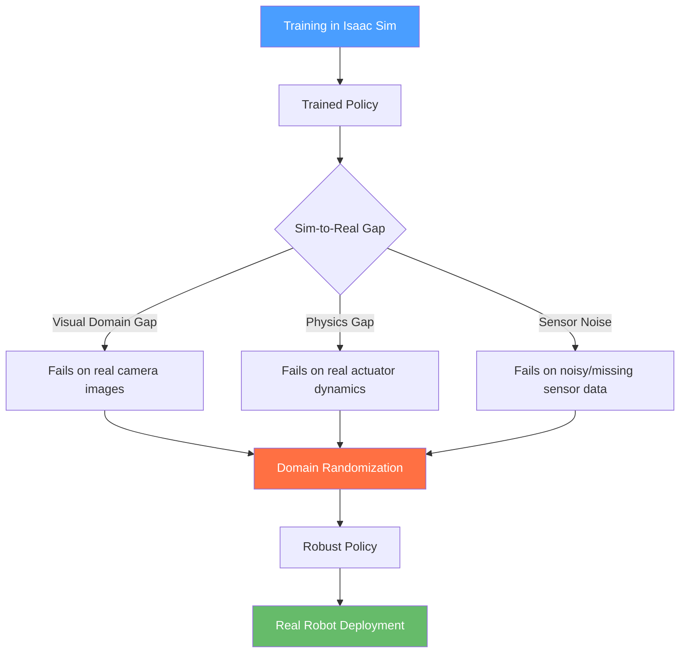

## باب 10: سم-ٹو-ریل ٹرانسفر (Sim-to-Real Transfer)

<div dir="rtl">

## سیکھنے کے مقاصد (Learning Objectives)

اس باب کے اختتام تک، آپ اس قابل ہو جائیں گے کہ:

*   **وضاحت کریں** کہ سم-ٹو-ریل (sim-to-real) گیپ کے تین ذرائع کیا ہیں: بصری ڈومین گیپ (Visual Domain Gap)، فزکس گیپ (Physics Gap)، اور سینسر نوائز (Sensor Noise)۔
*   **بیان کریں** ڈومین رینڈمائزیشن (Domain Randomization) کیا ہے اور یہ زیادہ مضبوط پالیسیاں (policies) کیوں تیار کرتی ہے۔
*   **ایکسپورٹ کریں** ایک تربیت یافتہ پائی ٹارچ (PyTorch) پالیسی کو او این این ایکس (ONNX) فارمیٹ میں تاکہ ہارڈویئر سے آزاد تعیناتی (deployment) کی جا سکے۔
*   **بنائیں** ایک آر او ایس ٹو (ROS 2) نوڈ (Node) جو ایک او این این ایکس (ONNX) ماڈل کو لوڈ کرتا ہے اور سینسر (sensor) کے مشاہدات (observations) پر انفرنس (inference) چلاتا ہے۔
*   **جائزہ لیں** حقیقی دنیا کی پالیسی (policy) کارکردگی کا کامیابی کی شرح (success rate)، لیٹنسی (latency)، اور ڈومین ٹرانسفر میٹرکس (domain transfer metrics) کا استعمال کرتے ہوئے۔

</div>

---

<div dir="rtl">

## تعارف (Introduction)

2022 کے اواخر میں، ای ٹی ایچ زیورخ (ETH Zurich) کی ایک ٹیم نے کچھ غیر معمولی کام کیا: انہوں نے ایک چوپایہ روبوٹ (robot) کو مکمل طور پر سمیولیشن (simulation) میں تربیت دی – تربیت کے دوران کبھی بھی فزیکل ہارڈویئر (physical hardware) کو ہاتھ نہیں لگایا – اور پھر پالیسی (policy) کو براہ راست ایک حقیقی روبوٹ (robot) پر تعینات کیا۔ روبوٹ (robot) گھاس، بجری، سیڑھیوں، اور حتیٰ کہ برف پر بھی چلا، یہ سب کچھ حقیقی دنیا کی کسی بھی فائن ٹیوننگ (fine-tuning) کے بغیر ہوا۔

یہ چال بہتر فزکس سمیولیشن (physics simulation) نہیں تھی۔ یہ چال پالیسی (policy) کو تغیر (variation) کی توقع کرنا سکھانا تھی۔ ہزاروں رینڈمائزڈ سمیولیشن (simulation) ماحول – مختلف زمینی رگڑ کی قدریں، مختلف موٹر (motor) تاخیر، مختلف روشنی کے حالات – میں تربیت دے کر پالیسی (policy) اتنی مضبوط ہو گئی کہ سمیولیشن (simulation) اور حقیقت کے درمیان ناگزیر گیپ (gap) کو سنبھال سکے۔

یہی **سم-ٹو-ریل ٹرانسفر** (Sim-to-Real Transfer) کی بنیادی بصیرت ہے: آپ حقیقت کو بالکل درست سمیولیشن (simulation) نہیں کر سکتے، لیکن آپ ایسی پالیسیاں (policies) تربیت دے سکتے ہیں جو سمیولیشن (simulation) اور حقیقی دنیا کے درمیان موجود فرق کے خلاف مضبوط ہوں۔ یہ باب ان تکنیکوں کا احاطہ کرتا ہے جو اس کام کو ممکن بناتی ہیں: سم-ٹو-ریل (sim-to-real) گیپ کو سمجھنا، این ویڈیا آئزک سم (NVIDIA Isaac Sim) میں ڈومین رینڈمائزیشن (Domain Randomization) کا اطلاق کرنا، تربیت یافتہ پالیسیوں (policies) کو او این این ایکس (ONNX) فارمیٹ میں ایکسپورٹ کرنا، اور انہیں فزیکل ہارڈویئر (physical hardware) پر ایک آر او ایس ٹو (ROS 2) نوڈ (Node) میں تعینات کرنا۔

</div>

---

<div dir="rtl">

## سم-ٹو-ریل گیپ (Sim-to-Real Gap)

**سم-ٹو-ریل گیپ** (Sim-to-Real Gap) سے مراد کارکردگی میں وہ گراوٹ ہے جو اس وقت ہوتی ہے جب سمیولیشن (simulation) میں تربیت یافتہ پالیسی (policy) کو ایک حقیقی روبوٹ (robot) پر تعینات کیا جاتا ہے۔ اس کے تین بنیادی ذرائع ہیں:

### 1. بصری ڈومین گیپ (Visual Domain Gap)

سمیولیشن (simulation) رینڈرر (renderers)، حتیٰ کہ آئزک سم (Isaac Sim) کے آر ٹی ایکس رینڈرر (RTX renderer) جیسے فوٹو ریئلسٹک (photorealistic) بھی، ایسی تصاویر تیار کرتے ہیں جو حقیقی کیمروں سے باریک لیکن اہم طریقوں سے مختلف ہوتی ہیں۔ ٹیکسچرز (Textures) بہت صاف ہوتے ہیں۔ عکس بہت کامل ہوتے ہیں۔ گہرائی کا شور (depth noise) غلط تقسیم کی پیروی کرتا ہے۔ سمیولیٹڈ (simulated) تصاویر پر تربیت یافتہ ایک بصری پالیسی (visual policy) حقیقی تصاویر پر تباہ کن طور پر ناکام ہو سکتی ہے حتیٰ کہ جب منظر انسان کے لیے بہت مشابہ دکھائی دے۔

### 2. فزکس گیپ (Physics Gap)

کوئی بھی سمیولیٹر (simulator) حقیقی دنیا کو مکمل طور پر ماڈل (model) نہیں کرتا۔ جوائنٹ فرکشن (Joint friction)، ایکچوایٹر (actuator) ردعمل کا وقت، زمینی رابطہ کی حرکیات، اور آبجیکٹ (object) کی ڈیفارمایبلٹی (deformability) سب کی تخمینہ کاری کی جاتی ہے۔ کامل جوائنٹ کنٹرول (joint control) کے ساتھ تربیت یافتہ چلنے کی پالیسی (walking policy) اس وقت مشکل میں پڑ سکتی ہے جب حقیقی موٹرز (motors) میں 5ms کی لیٹنسی (latency) ہو۔ سادہ شدہ رابطہ ماڈلز (contact models) کے ساتھ تربیت یافتہ گرایسپنگ پالیسی (grasping policy) غیر متوقع سطح کی خصوصیات والے آبجیکٹس (objects) پر ناکام ہو سکتی ہے۔

### 3. سینسر نوائز (Sensor Noise)

حقیقی سینسرز (sensors) شور (noise) شامل کرتے ہیں، ریڈنگ (readings) چھوڑ دیتے ہیں، اور مداخلت کا سامنا کرتے ہیں۔ ایک لیڈر (LiDAR) شفاف گلاس (glass) کے لیے `inf` واپس کر سکتا ہے۔ ایک آئی ایم یو (IMU) وقت کے ساتھ ڈرفٹ (drift) کرتا ہے۔ سمیولیشن (simulation) سینسرز (sensors) میں عام طور پر صاف، کامل ڈیٹا ہوتا ہے جب تک کہ شور (noise) کو واضح طور پر شامل نہ کیا جائے۔

</div>



---

<div dir="rtl">

## ڈومین رینڈمائزیشن (Domain Randomization)

**ڈومین رینڈمائزیشن** (Domain Randomization) سم-ٹو-ریل (sim-to-real) گیپ کو سمیولیشن (simulation) کے ایک ہی مقررہ ماحول کے بجائے سمیولیشن (simulation) ماحول کی ایک تقسیم (distribution) میں تربیت دے کر حل کرتی ہے۔ اگر ایک پالیسی (policy) 0.3 اور 1.2 کے درمیان رگڑ کے گتانک (friction coefficients) والی سطحوں پر چلنا سیکھتی ہے، تو وہ غالباً حقیقی سطح کی رگڑ کی قدر پر بھی عام ہو جائے گی، چاہے وہ کچھ بھی ہو۔

### کیا رینڈمائز کریں (What to Randomize)

| زمرہ (Category) | پیرامیٹر (Parameter) | مثال کی حد (Example Range) |
|----------|-----------|---------------|
| **فزکس (Physics)** | زمینی رگڑ (Ground friction) | 0.3 – 1.2 |
| **فزکس (Physics)** | آبجیکٹ ماس (Object mass) | نامزد کا ±20% |
| **فزکس (Physics)** | موٹر ٹارک (Motor torque) | ±10% |
| **فزکس (Physics)** | ایکچوایٹر (Actuator) تاخیر | 0 – 10 ms |
| **بصری (Visual)** | روشنی کی شدت (Lighting intensity) | 0.5 – 2.0× |
| **بصری (Visual)** | آبجیکٹ ٹیکسچرز (Object textures) | لائبریری سے بے ترتیب |
| **بصری (Visual)** | کیمرہ نوائز (Camera noise) | σ = 0 – 0.02 |
| **سینسرز (Sensors)** | آئی ایم یو نوائز (IMU noise) | گاوسیئن نوائز (Gaussian noise) شامل کریں |
| **سینسرز (Sensors)** | لیڈر ڈراپ ریٹ (LiDAR drop rate) | 0 – 5% غائب |

### آئزک سم میں ڈومین رینڈمائزیشن (Domain Randomization in Isaac Sim)

</div>

```python
# File: ~/isaac_sim_projects/domain_rand/randomizer.py
# Domain randomization setup using Isaac Sim Python API.
# Run from within Isaac Sim's Script Editor.

from omni.isaac.core.utils.prims import get_prim_at_path
from omni.isaac.core.physics_context import PhysicsContext
import omni.isaac.core.utils.numpy.rotations as rot_utils
import numpy as np

class DomainRandomizer:
    """Applies random perturbations to simulation parameters each episode."""

    def __init__(self, physics_context: PhysicsContext):
        self.physics = physics_context
        self.rng = np.random.default_rng(seed=42)

    def randomize_episode(self):
        """Call this at the start of each training episode."""
        # Randomize gravity direction slightly (±2°) to simulate uneven terrain
        gravity_angle = self.rng.uniform(-0.035, 0.035)  # radians
        self.physics.set_gravity(
            value=[np.sin(gravity_angle) * 9.81, 0.0, -np.cos(gravity_angle) * 9.81]
        )

        # Randomize ground friction
        ground_prim = get_prim_at_path('/World/ground_plane')
        friction = self.rng.uniform(0.4, 1.2)
        if ground_prim.HasAttribute('physxMaterial:staticFriction'):
            ground_prim.GetAttribute('physxMaterial:staticFriction').Set(friction)

        # Randomize robot joint friction (simulates wear)
        joint_friction = self.rng.uniform(0.0, 0.05)

        print(f'Episode randomization: gravity_angle={gravity_angle:.3f} rad, '
              f'friction={friction:.2f}, joint_friction={joint_friction:.4f}')

        return {
            'gravity_angle': gravity_angle,
            'ground_friction': friction,
            'joint_friction': joint_friction
        }
```

---

<div dir="rtl">

## پالیسیوں کو او این این ایکس میں ایکسپورٹ کرنا (Exporting Policies to ONNX)

ایک بار جب ایک پالیسی (policy) کو سمیولیشن (simulation) میں تربیت دے دی جائے (عام طور پر پائی ٹارچ (PyTorch) کے ساتھ)، اگلا قدم اسے **او این این ایکس (Open Neural Network Exchange)** فارمیٹ میں ایکسپورٹ کرنا ہے۔ او این این ایکس (ONNX) ایک ہارڈویئر (hardware) سے آزاد ماڈل (model) فارمیٹ (format) ہے جسے این ویڈیا ٹینسر آر ٹی (NVIDIA TensorRT)، انٹیل اوپن وینو (Intel OpenVINO)، اور `onnxruntime` پائیتھون (Python) لائبریری (library) سپورٹ کرتے ہیں – جو اسے روبوٹ (robot) ہارڈویئر (hardware) پر تعیناتی کے لیے مثالی بناتا ہے۔

</div>

```python
# File: ~/training/export_policy.py
# Export a trained PyTorch policy to ONNX format.

import torch
import torch.nn as nn

class WalkingPolicy(nn.Module):
    """Simple MLP policy: 48 observations -> 12 joint targets."""

    def __init__(self):
        super().__init__()
        self.network = nn.Sequential(
            nn.Linear(48, 256),    # Input: joint positions, velocities, IMU
            nn.ELU(),
            nn.Linear(256, 256),
            nn.ELU(),
            nn.Linear(256, 12),    # Output: 12 target joint positions
            nn.Tanh()              # Normalize to [-1, 1]
        )

    def forward(self, obs: torch.Tensor) -> torch.Tensor:
        return self.network(obs)


def export_to_onnx(checkpoint_path: str, output_path: str):
    """Load a trained checkpoint and export to ONNX."""
    # Load the trained weights
    policy = WalkingPolicy()
    checkpoint = torch.load(checkpoint_path, map_location='cpu')
    policy.load_state_dict(checkpoint['policy_state_dict'])
    policy.eval()  # Set to inference mode (disables dropout, etc.)

    # Create a dummy input with the correct shape
    # batch_size=1, obs_dim=48
    dummy_input = torch.zeros(1, 48)

    # Export to ONNX
    torch.onnx.export(
        policy,
        dummy_input,
        output_path,
        input_names=['observations'],    # Name the input tensor
        output_names=['actions'],        # Name the output tensor
        dynamic_axes={
            'observations': {0: 'batch_size'},  # Allow variable batch size
            'actions': {0: 'batch_size'}
        },
        opset_version=17,               # ONNX opset version (17 = recent stable)
    )
    print(f'Policy exported to {output_path}')
    print(f'Input: observations [batch, 48] -> Output: actions [batch, 12]')


if __name__ == '__main__':
    export_to_onnx(
        checkpoint_path='./runs/walking_v3/checkpoint_5000.pt',
        output_path='./exported/walking_policy.onnx'
    )
```

**توقع شدہ آؤٹ پٹ (Expected output)**:
```
Policy exported to ./exported/walking_policy.onnx
Input: observations [batch, 48] -> Output: actions [batch, 12]
```

---

<div dir="rtl">

## کوڈ مثال: آر او ایس ٹو نوڈ کے طور پر او این این ایکس پالیسی کی تعیناتی (Code Example: Deploying an ONNX Policy as a ROS 2 Node)

ایک بار جب آپ کے پاس او این این ایکس (ONNX) فائل ہو، تو آپ اسے ایک آر او ایس ٹو (ROS 2) نوڈ (Node) کے اندر چلا سکتے ہیں جو سینسر (sensor) ٹاپکس (topics) کو سبسکرائب (subscribes) کرتا ہے، انفرنس (inference) چلاتا ہے، اور ایکشن (action) کمانڈز (commands) شائع کرتا ہے۔

</div>

```python
# File: ~/ros2_ws/src/sim_to_real/sim_to_real/policy_node.py
# Loads a trained ONNX policy and runs real-time inference.

import rclpy
from rclpy.node import Node
from sensor_msgs.msg import JointState, Imu
from std_msgs.msg import Float64MultiArray
import numpy as np
import onnxruntime as ort  # pip install onnxruntime

class PolicyNode(Node):
    """
    Runs an ONNX locomotion policy at 50 Hz.
    Subscribes to: /joint_states, /imu/data
    Publishes to:  /joint_position_targets
    """

    OBS_DIM = 48   # Must match the exported policy's input dimension
    ACT_DIM = 12   # Must match the exported policy's output dimension
    CONTROL_RATE = 50  # Hz — how often to run inference

    def __init__(self):
        super().__init__('policy_node')

        # Parameter: path to the ONNX model file
        self.declare_parameter('model_path', '/tmp/walking_policy.onnx')
        model_path = self.get_parameter('model_path').get_parameter_value().string_value

        # Load the ONNX model into an inference session
        self.get_logger().info(f'Loading ONNX model from: {model_path}')
        self.session = ort.InferenceSession(
            model_path,
            providers=['CPUExecutionProvider']  # Use 'CUDAExecutionProvider' on GPU
        )
        self.get_logger().info('ONNX model loaded successfully.')

        # Internal state buffers — filled by sensor callbacks
        self.joint_positions = np.zeros(12)
        self.joint_velocities = np.zeros(12)
        self.imu_orientation = np.zeros(4)   # quaternion [x, y, z, w]
        self.imu_angular_vel = np.zeros(3)
        self.imu_linear_acc = np.zeros(3)

        # Subscribers
        self.joint_sub = self.create_subscription(
            JointState, '/joint_states', self.joint_callback, 10
        )
        self.imu_sub = self.create_subscription(
            Imu, '/imu/data', self.imu_callback, 10
        )

        # Publisher for joint position targets
        self.action_pub = self.create_publisher(
            Float64MultiArray, '/joint_position_targets', 10
        )

        # Control timer: runs policy inference at CONTROL_RATE Hz
        self.timer = self.create_timer(
            1.0 / self.CONTROL_RATE, self.run_inference
        )

    def joint_callback(self, msg: JointState):
        """Update joint state buffer from /joint_states."""
        n = min(len(msg.position), 12)
        self.joint_positions[:n] = msg.position[:n]
        self.joint_velocities[:n] = msg.velocity[:n]

    def imu_callback(self, msg: Imu):
        """Update IMU buffer from /imu/data."""
        q = msg.orientation
        self.imu_orientation = np.array([q.x, q.y, q.z, q.w])
        av = msg.angular_velocity
        self.imu_angular_vel = np.array([av.x, av.y, av.z])
        la = msg.linear_acceleration
        self.imu_linear_acc = np.array([la.x, la.y, la.z])

    def build_observation(self) -> np.ndarray:
        """Concatenate sensor buffers into a single 48-dim observation vector."""
        obs = np.concatenate([
            self.joint_positions,   # 12 values
            self.joint_velocities,  # 12 values
            self.imu_orientation,   # 4 values
            self.imu_angular_vel,   # 3 values
            self.imu_linear_acc,    # 3 values
            np.zeros(14),           # Padding to reach 48 dims (e.g., command velocity)
        ])
        return obs.astype(np.float32)

    def run_inference(self):
        """Run the ONNX policy and publish joint targets."""
        obs = self.build_observation()

        # ONNX expects shape [batch_size, obs_dim] = [1, 48]
        obs_input = obs[np.newaxis, :]  # Add batch dimension

        # Run inference — returns list of output arrays
        outputs = self.session.run(
            output_names=['actions'],
            input_feed={'observations': obs_input}
        )

        # actions shape: [1, 12] — remove batch dimension
        actions = outputs[0][0]

        # Publish joint targets
        msg = Float64MultiArray()
        msg.data = actions.tolist()
        self.action_pub.publish(msg)


def main(args=None):
    rclpy.init(args=args)
    node = PolicyNode()
    rclpy.spin(node)
    node.destroy_node()
    rclpy.shutdown()
```

**onnxruntime انسٹال کریں**:
```bash
pip install onnxruntime   # CPU
# or for GPU (Jetson):
pip install onnxruntime-gpu
```

---

<div dir="rtl">

## سم-ٹو-ریل کارکردگی کا جائزہ (Evaluating Sim-to-Real Performance)

تعیناتی کے بعد، ان میٹرکس (metrics) کو پیمائش کریں تاکہ یہ معلوم ہو سکے کہ ٹرانسفر (transfer) کتنا اچھا کام کر رہا ہے:

| میٹرک (Metric) | تعریف (Definition) | پیمائش کیسے کریں (How to Measure) |
|--------|-----------|----------------|
| **کامیابی کی شرح (Success rate)** | آزمائشوں کا % جہاں کام مکمل ہوتا ہے | 20+ آزمائشیں چلائیں، کامیابیوں کو شمار کریں |
| **پالیسی لیٹنسی (Policy latency)** | فی قدم انفرنس (inference) کا وقت | `session.run()` کے ارد گرد `time.perf_counter()` |
| **ڈومین ٹرانسفر سکور (Domain transfer score)** | (حقیقی کارکردگی) / (سمیولیشن کارکردگی) | سمیولیشن بیس لائن (sim baseline) سے موازنہ کریں |
| **ناکامی موڈ کی تقسیم (Failure mode distribution)** | مشاہدہ شدہ ناکامیوں کی اقسام | ہر ناکامی کو لاگ (log) کریں اور درجہ بندی کریں |

0.8 سے اوپر کا ڈومین ٹرانسفر سکور (حقیقی کارکردگی ≥ سمیولیشن کارکردگی کا 80%) ایک کامیاب ٹرانسفر (transfer) سمجھا جاتا ہے۔ 0.5 سے نیچے اہم ڈومین مماثلت (domain mismatch) کی نشاندہی کرتا ہے اور مزید ڈومین رینڈمائزیشن (Domain Randomization) کی ضرورت ہے۔

</div>

---

<div dir="rtl">

## خلاصہ (Summary)

اس باب میں، آپ نے سیکھا:

*   **سم-ٹو-ریل گیپ** (Sim-to-Real Gap) کے تین ذرائع ہیں: بصری ڈومین گیپ (Visual Domain Gap)، فزکس گیپ (Physics Gap)، اور سینسر نوائز (Sensor Noise)۔
*   **ڈومین رینڈمائزیشن** (Domain Randomization) متنوع سمیولیشن (simulation) پیرامیٹرز (parameters) پر پالیسیوں (policies) کو تربیت دیتی ہے، جس سے مضبوط طرز عمل پیدا ہوتے ہیں جو حقیقی ہارڈویئر (hardware) پر عام ہوتے ہیں۔
*   **او این این ایکس (ONNX) ایکسپورٹ** پائی ٹارچ (PyTorch) ماڈلز (models) کو ایک پورٹیبل (portable) فارمیٹ (format) میں تبدیل کرتا ہے جسے `onnxruntime` کے ساتھ کسی بھی ہارڈویئر (hardware) پر تعینات کیا جا سکتا ہے۔
*   ایک **آر او ایس ٹو (ROS 2) پالیسی نوڈ** (policy node) سینسر (sensor) ٹاپکس (topics) کو سبسکرائب (subscribes) کرتا ہے، ایک آبزرویشن ویکٹر (observation vector) بناتا ہے، او این این ایکس (ONNX) انفرنس (inference) چلاتا ہے، اور ایکشن (action) کمانڈز (commands) شائع کرتا ہے – اس طرح سم-ٹو-ریل (sim-to-real) تعیناتی پائپ لائن (deployment pipeline) مکمل ہوتی ہے۔
*   کامیابی کی پیمائش **ڈومین ٹرانسفر سکور** (domain transfer score) سے کی جاتی ہے: سمیولیشن (simulation) کی کارکردگی کے لحاظ سے حقیقی دنیا کی کارکردگی۔

</div>

---

<div dir="rtl">

## عملی مشق: ایک پالیسی ایکسپورٹ اور تعینات کریں (Hands-On Exercise: Export and Deploy a Policy)

**وقت کا تخمینہ**: 45–60 منٹ

**پیشگی شرائط**:
*   پائیتھون (Python) 3.10+، پائی ٹارچ (PyTorch)، onnxruntime انسٹال شدہ
*   آر او ایس ٹو (ROS 2) ہمبل (Humble) انسٹال شدہ ([ضمیمہ A2](../appendices/a2-software-installation.md))
*   باب 8 (آئزک سم (Isaac Sim)) مکمل شدہ

### اقدامات (Steps)

1.  **onnxruntime انسٹال کریں**:
    ```bash
    pip install onnxruntime torch torchvision
    ```

2.  **ایک ڈمی تربیت یافتہ پالیسی بنائیں** (حقیقی تربیت کے بغیر جانچ کے لیے):
    ```python
    import torch
    from export_policy import WalkingPolicy
    policy = WalkingPolicy()
    torch.save({'policy_state_dict': policy.state_dict()}, 'dummy_checkpoint.pt')
    ```

3.  **او این این ایکس (ONNX) میں ایکسپورٹ کریں**:
    ```bash
    python export_policy.py
    #Expected: Policy exported to ./exported/walking_policy.onnx
    ```

4.  **او این این ایکس (ONNX) ماڈل کی تصدیق کریں**:
    ```python
    import onnxruntime as ort
    import numpy as np
    sess = ort.InferenceSession('./exported/walking_policy.onnx')
    dummy_obs = np.zeros((1, 48), dtype=np.float32)
    actions = sess.run(['actions'], {'observations': dummy_obs})
    print(f'Output shape: {actions[0].shape}')  # Expected: (1, 12)
    ```

5.  **آر او ایس ٹو (ROS 2) پیکیج بنائیں اور بلڈ کریں**:
    ```bash
    cd ~/ros2_ws/src
    ros2 pkg create sim_to_real --build-type ament_python --dependencies rclpy sensor_msgs std_msgs
    # Add policy_node.py as shown above
    colcon build --packages-select sim_to_real
    source install/setup.bash
    ```

6.  **ایک موک (mock) ماڈل (model) پاتھ کے ساتھ چلائیں**:
    ```bash
    ros2 run sim_to_real policy_node \
        --ros-args -p model_path:=/path/to/walking_policy.onnx
    ```

### تصدیق (Verification)

```bash
# Confirm the action topic is being published
ros2 topic hz /joint_position_targets
```
توقع شدہ: `average rate: 50.000`

</div>

---

<div dir="rtl">

## مزید مطالعہ (Further Reading)

*   **پچھلا**: [باب 9: پرسیپشن اور مینیپولیشن (Perception & Manipulation)](ch09-perception-manipulation.md) — آبجیکٹ ڈیٹیکشن (object detection) پائپ لائن (pipeline)
*   **اگلا**: [باب 11: ہیومنائڈ کائنیمیٹکس (Humanoid Kinematics)](../module-4/ch11-humanoid-kinematics.md) — کائنیمیٹک چینز (kinematic chains) اور آئی کے (IK)
*   **متعلقہ**: [ضمیمہ ڈی: جیٹسن تعیناتی (Jetson Deployment)](../appendices/a4-jetson-deployment.md) — ایج ہارڈویئر (edge hardware) پر او این این ایکس (ONNX) انفرنس (inference) چلانا

**سرکاری دستاویزات**:
*   [او این این ایکس رن ٹائم (ONNX Runtime) دستاویزات](https://onnxruntime.ai/docs/)
*   [آئزک سم (Isaac Sim) ڈومین رینڈمائزیشن (Domain Randomization)](https://docs.omniverse.nvidia.com/isaacsim/latest/replicator_tutorials/)
*   [ای ٹی ایچ زیورخ (ETH Zurich) لیگڈ لوکوموشن (Legged Locomotion) پیپر](https://leggedrobotics.github.io/legged_gym/)

</div>