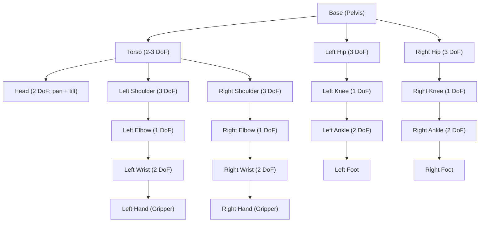

# باب 11: ہیومنوئڈ روبوٹ کائنیمیٹکس (Chapter 11: Humanoid Robot Kinematics)

<div dir="rtl">

[باب 10](../module-3/ch10-sim-to-real.md) میں، آپ نے تربیت یافتہ پالیسیاں سمولیشن (Simulation) سے حقیقی ہارڈویئر میں منتقل کرنا سیکھا۔ اب ہم ہیومنوئڈ کی حرکت کو ممکن بنانے والے ریاضیاتی ستون پر توجہ مرکوز کرتے ہیں: **کائنیمیٹکس (Kinematics)**۔ اس سے پہلے کہ ایک روبوٹ (Robot) چل سکے، پکڑ سکے یا ہاتھ ہلا سکے، اس کے کنٹرول سافٹ ویئر (Control Software) کو ایک بظاہر سادہ سوال کا جواب دینا ضروری ہے -- "اگر میں ہر جوائنٹ (Joint) کو ایک خاص زاویہ پر سیٹ کروں تو ہاتھ کہاں پہنچے گا؟" اور اس کا الٹ، "مطلوبہ ہاتھ کی پوزیشن کو دیکھتے ہوئے، مجھے کن جوائنٹ کے زاویوں کی ضرورت ہے؟"

</div>

<div dir="rtl">

یہ باب آپ کو ان سوالات کا جواب دینے کے لیے نظریاتی اور عملی اوزار دونوں فراہم کرتا ہے۔

</div>

## سیکھنے کے مقاصد (Learning Objectives)

<div dir="rtl">

اس باب کے آخر تک، آپ اس قابل ہو جائیں گے:

</div>

1.  **ہیومنوئڈ روبوٹ** کے کائنیمیٹک ڈھانچے کو بیان کریں، بشمول ڈگریز آف فریڈم (Degrees of Freedom) (DoF) اور کائنیمیٹک چینز (Kinematic Chains)۔
2.  ہوموجینس ٹرانسفارمیشن میٹرکسز (Homogeneous Transformation Matrices) کا استعمال کرتے ہوئے ایک کثیر جوائنٹ بازو کے لیے فارورڈ کائنیمیٹکس (Forward Kinematics) (FK) کا حساب لگائیں۔
3.  ڈیناوٹ ہارتنبرگ (Denavit-Hartenberg) (DH) پیرامیٹرز کو کسی بھی سیریل چین آف جوائنٹس کو منظم طریقے سے بیان کرنے کے لیے استعمال کریں۔
4.  `ikpy` (آئی کے پائے) پائتھون لائبریری کا استعمال کرتے ہوئے انورس کائنیمیٹکس (Inverse Kinematics) (IK) کے مسائل حل کریں۔
5.  اینالیٹیکل (Analytical) اور نیومیریکل (Numerical) آئی کے سالورز کے درمیان فرق کریں اور شناخت کریں کہ ہر ایک کب مناسب ہے۔

## تعارف (Introduction)

<div dir="rtl">

تصور کریں کہ آپ ایک کٹھ پتلی کو کنٹرول کر رہے ہیں۔ ہر وہ ڈوری جسے آپ کھینچتے ہیں وہ ایک جوائنٹ -- ایک کندھے، ایک کہنی، ایک کلائی کو گھماتی ہے۔ صحیح مجموعہ کھینچیں، اور کٹھ پتلی ہاتھ ہلاتی ہے۔ غلط مجموعہ کھینچیں، اور بازو بے مقصد اچھلتا ہے۔ **کائنیمیٹکس** جوائنٹ زاویوں اور اینڈ ایفیکٹر (End-effector) (ہاتھ، پاؤں، سر) کی پوزیشنوں کے درمیان اس تعلق کا ریاضی ہے، بغیر کسی قوتوں یا ٹارکس کی فکر کیے۔

</div>

<div dir="rtl">

ہیومنوئڈ روبوٹس کے لیے، کائنیمیٹکس موشن اسٹیک کی پہلی تہہ ہے۔ یہ ڈائنیمکس (Dynamics) (قوتوں)، ٹرائجیکٹری پلاننگ (Trajectory Planning) (ہموار راستوں)، اور کنٹرول (Control) (حقیقی وقت کی اصلاحات) کے نیچے آتا ہے۔ اگر کائنیمیٹکس غلط ہیں، تو ان کے اوپر کوئی بھی چیز تلافی نہیں کر سکتی۔

</div>

### ہیومنوئڈز کے لیے کائنیمیٹکس کیوں اہم ہے (Why Kinematics Matters for Humanoids)

<div dir="rtl">

ایک عام ہیومنوئڈ روبوٹ میں 30 سے 50 ڈگریز آف فریڈم ہوتے ہیں۔ ہر بازو میں اکیلے 7 DoF ہو سکتے ہیں۔ ہر ٹانگ میں 6 ہوتے ہیں۔ ٹورسو (Torso) 2 سے 3 کا اضافہ کرتا ہے۔ ان تمام جوائنٹس کو بیک وقت منظم کرنا ایک بہت بڑا حسابی چیلنج ہے، لیکن یہ سب ایک ہی بنیادی ریاضی سے شروع ہوتا ہے: **ٹرانسفارمیشن میٹرکسز (Transformation Matrices)**۔

</div>

## 11.1 ایک ہیومنوئڈ روبوٹ کیا بناتا ہے: ڈگریز آف فریڈم اور کائنیمیٹک چینز (What Makes a Humanoid Robot: Degrees of Freedom and Kinematic Chains)

<div dir="rtl">

ایک **ڈگری آف فریڈم (DoF)** حرکت کا ایک واحد آزاد محور ہے۔ ایک ریوولیوٹ جوائنٹ (Revolute Joint) (جیسے آپ کی کہنی) میں ایک DoF ہوتا ہے -- یہ ایک واحد محور کے گرد گھومتا ہے۔ ایک بال اینڈ ساکٹ جوائنٹ (Ball-and-Socket Joint) (جیسے آپ کا کندھا) میں تین DoF ہوتے ہیں -- یہ تین محوروں کے گرد گھوم سکتا ہے۔

</div>

<div dir="rtl">

ایک **کائنیمیٹک چین** جوائنٹس سے منسلک سخت لنکس کا ایک سلسلہ ہے۔ آپ کا بازو، کندھے سے انگلی تک، ایک کائنیمیٹک چین ہے۔ ایک ہیومنوئڈ روبوٹ کائنیمیٹک چینز کا ایک **شاخ دار درخت** ہے، یہ سب ٹورسو (یا پیلوِس (Pelvis)) پر جڑے ہوتے ہیں۔

</div>



<div dir="rtl">

بیس سے کسی پتی (ہاتھ، پاؤں، سر) تک کا ہر راستہ ایک الگ کائنیمیٹک چین ہے۔ جب آپ FK یا IK کا حساب لگاتے ہیں، تو آپ ایک وقت میں ایک چین کے ساتھ کام کرتے ہیں۔

</div>

### اوپن بمقابلہ کلوزڈ کائنیمیٹک چینز (Open vs. Closed Kinematic Chains)

-   **اوپن چین (Open Chain)**: اینڈ ایفیکٹر آزاد ہوتا ہے (مثلاً، ہاتھ ہلاتا بازو)۔ ہر جوائنٹ کو آزادانہ طور پر سیٹ کیا جا سکتا ہے۔
-   **کلوزڈ چین (Closed Chain)**: اینڈ ایفیکٹر محدود ہوتا ہے (مثلاً، چلتے وقت دونوں پاؤں زمین پر ہوں)۔ یہ پابندی کی مساوات کا اضافہ کرتا ہے اور ریاضی کو مشکل بنا دیتا ہے۔

<div dir="rtl">

زیادہ تر ہیومنوئڈ بازو کے کام اوپن چین مسائل ہوتے ہیں۔ بائی پیڈل لوکوموشن (Bipedal Locomotion) (جس کا احاطہ [باب 12](./ch12-bipedal-locomotion.md) میں کیا گیا ہے) میں کلوزڈ چینز شامل ہوتی ہیں۔

</div>

## 11.2 فارورڈ کائنیمیٹکس اور ٹرانسفارمیشن میٹرکسز (Forward Kinematics and Transformation Matrices)

<div dir="rtl">

**فارورڈ کائنیمیٹکس (FK)** جواب دیتا ہے: "تمام جوائنٹ زاویوں کو دیکھتے ہوئے، اینڈ ایفیکٹر کہاں ہے؟"

</div>

<div dir="rtl">

اس کے لیے ٹول **ہوموجینس ٹرانسفارمیشن میٹرکس (Homogeneous Transformation Matrix)** ہے -- ایک 4x4 میٹرکس جو ایک ہی آپریشن میں گردش اور ترجمہ دونوں کو انکوڈ کرتا ہے۔

</div>

```
         ┌                    ┐
T_i  =   │  R (3×3)  │ d (3×1) │
         │  0 (1×3)  │   1    │
         └                    ┘
```

<div dir="rtl">

جہاں `R` ایک 3×3 گردش میٹرکس ہے اور `d` ایک 3×1 ترجمہ ویکٹر ہے۔

</div>

<div dir="rtl">

اینڈ ایفیکٹر پوز کو تلاش کرنے کے لیے، آپ چین کے ساتھ تمام انفرادی ٹرانسفارمیشنز کو ضرب دیتے ہیں:

</div>

```
T(0→n) = T_1 · T_2 · T_3 · ... · T_n
```

### ڈیناوٹ ہارتنبرگ (DH) پیرامیٹرز (Denavit-Hartenberg (DH) Parameters)

<div dir="rtl">

ہر ٹرانسفارمیشن کو شروع سے بیان کرنے کے بجائے، روبوٹکس دان **DH پیرامیٹرز (Denavit-Hartenberg Parameters)** نامی ایک معیاری کنونشن استعمال کرتے ہیں۔ ہر جوائنٹ کو بالکل چار اعداد سے بیان کیا جاتا ہے:

</div>

<div dir="rtl">

| پیرامیٹر (Parameter) | علامت (Symbol) | معنی (Meaning) |
| :------------------ | :------------- | :-------------- |
| لنک کی لمبائی      | `a`            | جوائنٹ کے محوروں کے درمیان x-axis کے ساتھ فاصلہ |
| لنک کا موڑ           | `alpha`        | x-axis کے گرد ماپا جانے والا جوائنٹ کے محوروں کے درمیان زاویہ |
| لنک کا آفسیٹ        | `d`            | z-axis کے ساتھ فاصلہ (پریزمیٹک جوائنٹس کے لیے متغیر) |
| جوائنٹ کا زاویہ      | `theta`        | z-axis کے گرد گردش (ریوولیوٹ جوائنٹس کے لیے متغیر) |

</div>

<div dir="rtl">

ایک ریوولیوٹ جوائنٹ کے لیے، `theta` وہ متغیر ہے جو جوائنٹ کی حرکت کے وقت تبدیل ہوتا ہے۔ باقی سب لنک کی ایک مقررہ ہندسی خاصیت ہے۔

</div>

### کوڈ کی مثال 1: 3-DoF پلینر آرم کے لیے فارورڈ کائنیمیٹکس (Code Example 1: Forward Kinematics for a 3-DoF Planar Arm)

<div dir="rtl">

آئیے نم پائے (NumPy) کا استعمال کرتے ہوئے ایک سادہ 3-DoF پلینر آرم (Planar Arm) کے لیے FK کا حساب لگائیں۔ ہر جوائنٹ ایک ہی سطح میں گھومتا ہے (تمام گردش محور متوازی ہوتے ہیں)۔

</div>

```python
"""
Forward Kinematics for a 3-DoF Planar Robot Arm.
Each joint is revolute, rotating about the Z-axis.
Link lengths: L1=1.0m, L2=0.8m, L3=0.5m
"""
import numpy as np

def dh_transform(theta, d, a, alpha):
    """
    Build a 4x4 homogeneous transformation matrix
    from Denavit-Hartenberg parameters.

    Parameters:
        theta: joint angle (radians) -- rotation about Z
        d:     link offset -- translation along Z
        a:     link length -- translation along X
        alpha: link twist -- rotation about X
    Returns:
        4x4 numpy array
    """
    ct, st = np.cos(theta), np.sin(theta)
    ca, sa = np.cos(alpha), np.sin(alpha)
    return np.array([
        [ct, -st * ca,  st * sa, a * ct],
        [st,  ct * ca, -ct * sa, a * st],
        [0,   sa,       ca,      d     ],
        [0,   0,        0,       1     ]
    ])

def forward_kinematics_3dof(joint_angles, link_lengths):
    """
    Compute the end-effector position for a 3-DoF planar arm.

    Parameters:
        joint_angles:  list of 3 angles in radians [theta1, theta2, theta3]
        link_lengths:  list of 3 link lengths [L1, L2, L3]
    Returns:
        (x, y, z) position of the end-effector
    """
    # For a planar arm: d=0, alpha=0 for all joints
    T = np.eye(4)  # Start with identity (base frame)
    for theta, L in zip(joint_angles, link_lengths):
        T_i = dh_transform(theta=theta, d=0, a=L, alpha=0)
        T = T @ T_i  # Chain the transformations

    # Extract end-effector position from the final transformation
    x, y, z = T[0, 3], T[1, 3], T[2, 3]
    return x, y, z

# --- Example usage ---
link_lengths = [1.0, 0.8, 0.5]  # meters

# All joints at 0 degrees: arm is fully extended along X-axis
angles_straight = [0.0, 0.0, 0.0]
pos = forward_kinematics_3dof(angles_straight, link_lengths)
print(f"Straight arm -> x={pos[0]:.3f}, y={pos[1]:.3f}, z={pos[2]:.3f}")

# Shoulder at 45 deg, elbow at -30 deg, wrist at 15 deg
angles_bent = [np.radians(45), np.radians(-30), np.radians(15)]
pos = forward_kinematics_3dof(angles_bent, link_lengths)
print(f"Bent arm     -> x={pos[0]:.3f}, y={pos[1]:.3f}, z={pos[2]:.3f}")

# Arm folded back: all joints at 90 degrees
angles_folded = [np.radians(90), np.radians(90), np.radians(90)]
pos = forward_kinematics_3dof(angles_folded, link_lengths)
print(f"Folded arm   -> x={pos[0]:.3f}, y={pos[1]:.3f}, z={pos[2]:.3f}")
```

**متوقع آؤٹ پٹ (Expected Output):**

```
Straight arm -> x=2.300, y=0.000, z=0.000
Bent arm     -> x=1.388, y=1.155, z=0.000
Folded arm   -> x=-0.800, y=1.500, z=0.000
```

<div dir="rtl">

غور کریں کہ سیدھے بازو میں `x = 1.0 + 0.8 + 0.5 = 2.3` ہے، جو اس بات کی تصدیق کرتا ہے کہ تمام لنکس X-axis کے ساتھ سیدھ میں ہیں۔ پلینر آرم میں ہمیشہ `z = 0` ہوتا ہے کیونکہ تمام گردشیں Z-axis کے گرد ہوتی ہیں۔

</div>

## 11.3 آئی کے پائے کے ساتھ انورس کائنیمیٹکس (Inverse Kinematics with ikpy)

<div dir="rtl">

**انورس کائنیمیٹکس (IK)** مخالف سوال کا جواب دیتا ہے: "مطلوبہ اینڈ ایفیکٹر پوزیشن (اور اختیاری طور پر اورینٹیشن) کو دیکھتے ہوئے، کون سے جوائنٹ زاویے اسے حاصل کرتے ہیں؟"

</div>

<div dir="rtl">

IK بنیادی طور پر FK سے تین وجوہات کی بنا پر زیادہ مشکل ہے:

</div>

1.  **متعدد حل**: ایک ہدف نقطہ بہت سی مختلف جوائنٹ کنفیگریشنز کے ذریعے قابل رسائی ہو سکتا ہے (سوچیں کہ آپ اپنی انگلی سے ایک مقررہ نقطہ کو چھوتے ہوئے اپنی کہنی کو کتنے مختلف طریقوں سے پوزیشن کر سکتے ہیں)۔
2.  **کوئی حل نہیں**: ہدف قابل رسائی ورک سپیس (Workspace) سے باہر ہو سکتا ہے۔
3.  **سنگولیریٹیز (Singularities)**: بعض کنفیگریشنز پر، روبوٹ ایک ڈگری آف فریڈم کھو دیتا ہے (جیسے ایک مکمل پھیلا ہوا بازو جو اپنی نوک کو ریڈیئل سمت میں حرکت نہیں دے سکتا)۔

### اینالیٹیکل بمقابلہ نیومیریکل آئی کے (Analytical vs. Numerical IK)

-   **اینالیٹیکل آئی کے**: کلوزڈ فارم مساوات اخذ کریں۔ تیز اور عین، لیکن صرف مخصوص روبوٹ جیومیٹریز (عام طور پر 6 DoF یا اس سے کم خاص جوائنٹ انتظامات کے ساتھ) کے لیے ممکن ہے۔
-   **نیومیریکل آئی کے**: کسی حل پر کنورج کرنے کے لیے بار بار اصلاح کا استعمال کریں۔ یہ کسی بھی روبوٹ جیومیٹری کے لیے کام کرتا ہے لیکن سست ہوتا ہے اور مقامی منیمم (local minima) پر کنورج کر سکتا ہے۔

<div dir="rtl">

7+ DoF بازوؤں والے ہیومنوئڈ روبوٹس کے لیے، نیومیریکل آئی کے معیاری طریقہ کار ہے۔ لائبریریاں جیسے **ikpy**، **PyKDL (پائے کے ڈی ایل)**، اور **MoveIt (موو اٹ)** تیار سالورز فراہم کرتی ہیں۔

</div>

### کوڈ کی مثال 2: آئی کے پائے کے ساتھ انورس کائنیمیٹکس (Code Example 2: Inverse Kinematics with ikpy)

<div dir="rtl">

`ikpy` لائبریری آپ کو یو آر ڈی ایف (URDF) فائلوں سے یا دستی طور پر ایک کائنیمیٹک چین کی تعریف کرنے دیتی ہے، پھر ایک فنکشن کال کے ساتھ IK حل کرتی ہے۔

</div>

```python
"""
Inverse Kinematics using ikpy for a 6-DoF robot arm.
We define the chain manually, set a target position,
and let ikpy find the joint angles.

Install: pip install ikpy numpy matplotlib
"""
import numpy as np
from ikpy.chain import Chain
from ikpy.link import OriginLink, URDFLink

# Define a 6-DoF arm kinematic chain manually.
# Each URDFLink specifies the joint axis and the translation to the next joint.
arm_chain = Chain(name="6dof_arm", links=[
    OriginLink(),  # Fixed base (not a real joint)
    URDFLink(
        name="shoulder_pan",
        origin_translation=[0, 0, 0.1],    # 10cm above base
        origin_orientation=[0, 0, 0],
        rotation=[0, 0, 1],                 # Rotates about Z
    ),
    URDFLink(
        name="shoulder_lift",
        origin_translation=[0, 0, 0.3],    # 30cm link
        origin_orientation=[0, 0, 0],
        rotation=[0, 1, 0],                 # Rotates about Y
    ),
    URDFLink(
        name="elbow",
        origin_translation=[0, 0, 0.25],   # 25cm link
        origin_orientation=[0, 0, 0],
        rotation=[0, 1, 0],                 # Rotates about Y
    ),
    URDFLink(
        name="wrist_pitch",
        origin_translation=[0, 0, 0.2],    # 20cm link
        origin_orientation=[0, 0, 0],
        rotation=[0, 1, 0],                 # Rotates about Y
    ),
    URDFLink(
        name="wrist_roll",
        origin_translation=[0, 0, 0.1],    # 10cm link
        origin_orientation=[0, 0, 0],
        rotation=[1, 0, 0],                 # Rotates about X
    ),
    URDFLink(
        name="wrist_yaw",
        origin_translation=[0, 0, 0.08],   # 8cm to end-effector
        origin_orientation=[0, 0, 0],
        rotation=[0, 0, 1],                 # Rotates about Z
    ),
])

# --- Solve IK for a target position ---
target_position = [0.3, 0.2, 0.5]  # (x, y, z) in meters
print(f"Target position: x={target_position[0]}, y={target_position[1]}, z={target_position[2]}")

# Build a 4x4 target frame (position only, default orientation)
target_frame = np.eye(4)
target_frame[:3, 3] = target_position

# Solve IK -- returns array of joint angles (including fixed base = 0)
joint_angles = arm_chain.inverse_kinematics(target_frame)

print("\nSolved joint angles (radians):")
for i, link in enumerate(arm_chain.links):
    print(f"  {link.name:20s}: {joint_angles[i]:+.4f} rad ({np.degrees(joint_angles[i]):+.1f} deg)")

# --- Verify by running FK on the solved angles ---
result_frame = arm_chain.forward_kinematics(joint_angles)
result_pos = result_frame[:3, 3]
error = np.linalg.norm(np.array(target_position) - result_pos)

print(f"\nFK verification:  x={result_pos[0]:.4f}, y={result_pos[1]:.4f}, z={result_pos[2]:.4f}")
print(f"Position error:   {error:.6f} meters")
```

**متوقع آؤٹ پٹ (Expected Output)** (اقدار ikpy ورژن اور سالور سیڈ کے لحاظ سے قدرے مختلف ہو سکتی ہیں):

```
Target position: x=0.3, y=0.2, z=0.5

Solved joint angles (radians):
  :                +0.0000 rad (+0.0 deg)
  shoulder_pan        : +0.5881 rad (+33.7 deg)
  shoulder_lift       : -0.3245 rad (-18.6 deg)
  elbow               : +0.9512 rad (+54.5 deg)
  wrist_pitch         : -0.2187 rad (-12.5 deg)
  wrist_roll          : +0.0034 rad (+0.2 deg)
  wrist_yaw           : +0.0012 rad (+0.1 deg)

FK verification:  x=0.3001, y=0.1999, z=0.5001
Position error:   0.000182 meters
```

<div dir="rtl">

پوزیشن کی غلطی 1 ملی میٹر سے بہت کم ہونی چاہیے، یہ ظاہر کرتی ہے کہ نیومیریکل سالور کامیابی سے کنورج ہوا۔

</div>

### یو آر ڈی ایف سے چینز لوڈ کرنا (Loading Chains from URDF)

<div dir="rtl">

عملی طور پر، آپ دستی طور پر لنکس کی تعریف نہیں کریں گے۔ اس کے بجائے، ایک URDF فائل سے لوڈ کریں:

</div>

```python
# Load a kinematic chain from URDF (e.g., for a humanoid's left arm)
from ikpy.chain import Chain

left_arm = Chain.from_urdf_file(
    "humanoid.urdf",
    base_elements=["torso_link"],
    last_link_vector=[0, 0, 0.05],  # Offset to fingertip
    active_links_mask=[False, True, True, True, True, True, True, False]
)
```

<div dir="rtl">

`active_links_mask` ikpy کو بتاتا ہے کہ کن جوائنٹس کے لیے حل کرنا ہے اور کن کو مقررہ رکھنا ہے (جیسے بیس لنک اور ایک مقررہ گرپر جوائنٹ)۔

</div>

## 11.4 انہیں اکٹھا کرنا: کائنیمیٹکس پائپ لائن (Putting It Together: The Kinematics Pipeline)

<div dir="rtl">

ایک حقیقی ہیومنوئڈ سسٹم میں، کائنیمیٹکس تنہائی میں کام نہیں کرتا۔ یہ اس طرح فٹ ہوتا ہے:

</div>

1.  **ٹاسک پلانر (Task Planner)** فیصلہ کرتا ہے کہ روبوٹ کو پوزیشن (0.4, 0.1, 0.3) پر ایک کپ اٹھانا چاہیے۔
2.  **IK سالور** اس پوزیشن پر ہاتھ رکھنے کے لیے درکار جوائنٹ زاویوں کا حساب لگاتا ہے۔
3.  **ٹرائجیکٹری پلانر** موجودہ جوائنٹ زاویوں سے ہدف زاویوں تک ایک ہموار راستہ تیار کرتا ہے۔
4.  **کنٹرولر** 100-1000 ہرٹز پر جوائنٹ زاویہ کمانڈز بھیجتا ہے، گڑبڑ کی اصلاح کرتا ہے۔

<div dir="rtl">

فالتو (Redundant) بازوؤں (7+ DoF) والے ہیومنوئڈ روبوٹس کے لیے، IK سالور کے پاس اضافی آزادی ہوتی ہے۔ یہ ریڈنڈنسی (Redundancy) استعمال کی جاتی ہے:

</div>

-   آبسٹریکلز (Obstacles) سے بچنا (کہنی کو جسم سے دور رکھنا)۔
-   جوائنٹ ٹارکس (Joint Torques) کو کم کرنا (ایسی کنفیگریشنز کو ترجیح دینا جو توانائی کے لحاظ سے موثر ہوں)۔
-   جوائنٹ کی حدود سے دور رہنا (جوائنٹس کو ان کی درمیانی رینج کے قریب رکھنا)۔

## خلاصہ (Summary)

-   ایک ہیومنوئڈ روبوٹ کائنیمیٹک چینز کا ایک شاخ دار درخت ہے، ہر چین سخت لنکس اور جوائنٹس کا ایک سلسلہ ہے۔
-   **فارورڈ کائنیمیٹکس** جوائنٹ زاویوں سے اینڈ ایفیکٹر پوز کا حساب لگانے کے لیے DH پیرامیٹرز اور ٹرانسفارمیشن میٹرکس ضرب کا استعمال کرتا ہے۔
-   **انورس کائنیمیٹکس** مشکل الٹے مسئلے کو حل کرتا ہے؛ ikpy جیسے نیومیریکل سالورز من مانی جیومیٹریز کو سنبھالتے ہیں۔
-   DH پیرامیٹرز (theta, d, a, alpha) کسی بھی سیریل کائنیمیٹک چین کو بیان کرنے کا ایک معیاری طریقہ فراہم کرتے ہیں۔
-   حقیقی ہیومنوئڈ IK میں ریڈنڈنسی ریزولوشن، جوائنٹ کی حدود، اور آبسٹریکل سے بچنا شامل ہے -- وہ موضوعات جنہیں ٹرائجیکٹری پلانرز اور ہول باڈی کنٹرولرز حل کرتے ہیں۔

## عملی مشق (Hands-On Exercise)

**مقصد (Goal):**
<div dir="rtl">

ikpy کا استعمال کرتے ہوئے ایک 6-DoF روبوٹ بازو کے لیے IK کو حل کریں اور اپنے حل کی تصدیق کریں۔

</div>

**پیشگی شرائط (Prerequisites):**
-   پائتھون 3.8+
-   انحصار انسٹال کریں: `pip install ikpy numpy matplotlib (میٹ پلاٹ لب)`

**اقدامات (Steps):**

1.  اوپر کوڈ کی مثال 2 سے 6-DoF آرم چین کی تعریف کاپی کریں۔
2.  تین ہدف پوزیشنز کی تعریف کریں:
    -   ہدف A: `[0.4, 0.0, 0.6]` (بالکل سامنے، اونچا)
    -   ہدف B: `[0.2, 0.3, 0.3]` (ایک طرف، نیچا)
    -   ہدف C: `[0.0, 0.0, 1.03]` (بالکل اوپر -- ورک سپیس کی حد کے قریب)
3.  ہر ہدف کے لیے، IK حل کریں اور جوائنٹ زاویوں کو ریکارڈ کریں۔
4.  پوزیشن کی غلطی 1 ملی میٹر سے کم ہے اس کی تصدیق کے لیے ہر حل پر FK چلائیں۔
5.  **بونس**: `ikpy` کے بلٹ ان پلاٹنگ کا استعمال کرتے ہوئے ہر ہدف کے لیے بازو کی کنفیگریشن کو پلاٹ کرنے کے لیے `matplotlib` کا استعمال کریں:

```python
import matplotlib.pyplot as plt
fig, ax = plt.subplots(1, 1, subplot_kw={"projection": "3d"})
arm_chain.plot(joint_angles, ax, target=target_position)
plt.show()
```

**متوقع آؤٹ پٹ (Expected Output):**
<div dir="rtl">

ہر ہدف کے لیے، آپ کو 0.001 میٹر سے کم جوائنٹ زاویہ حل اور پوزیشن کی غلطیاں نظر آنی چاہیئیں۔ ہدف C (ورک سپیس کی حد کے قریب) میں بڑی غلطی ہو سکتی ہے یا بازو کو تقریباً مکمل طور پر پھیلانے کی ضرورت پڑ سکتی ہے۔

</div>

**تصدیق (Verification):**
<div dir="rtl">

اگر تمام اہداف کے لیے `np.linalg.norm(target - fk_result[:3, 3]) < 0.001` ہے، تو آپ کے IK حل درست ہیں۔

</div>

## مزید مطالعہ (Further Reading)

-   [ikpy دستاویزات](https://github.com/Phmusic/ikpy) -- پائتھون انورس کائنیمیٹکس لائبریری
-   [ROS 2 MoveIt دستاویزات](https://moveit.picknik.ai/main/index.html) -- صنعت کا معیاری موشن پلاننگ فریم ورک
-   کریگ، جے جے، *Introduction to Robotics: Mechanics and Control* (چوتھا ایڈیشن) -- روبوٹ کائنیمیٹکس پر معیاری درسی کتاب
-   [ڈیناوٹ ہارتنبرگ کنونشن کی وضاحت (ویکیپیڈیا)](https://en.wikipedia.org/wiki/Denavit%E2%80%93Hartenberg_parameters)
-   [این ویڈیا (NVIDIA) آئزک (Isaac) سم (Sim) - روبوٹ کی تفصیل](https://docs.omniverse.nvidia.com/isaacsim/latest/features/environment_setup/assets/usd_assets_robots.html) -- آئزک سم میں URDF/USD روبوٹ ماڈلز کا استعمال

<div dir="rtl">

---

*اگلا: [باب 12: بائی پیڈل لوکوموشن](./ch12-bipedal-locomotion.md) -- جہاں ہم ہیومنوئڈ روبوٹس کو چلانے کے چیلنج پر کائنیمیٹکس کا اطلاق کرتے ہیں۔*

---

</div>