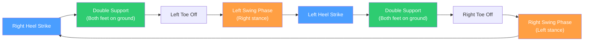

# باب 12: دوپایہ نقل و حرکت

<div dir="rtl">

[Chapter 11](./ch11-humanoid-kinematics.md) میں، آپ نے سیکھا کہ `kinematics` (کائنیمیٹکس) `joint angles` (جوائنٹ اینگلز) کو `end-effector positions` (اینڈ-ایفیکٹر پوزیشنز) میں کیسے تبدیل کرتی ہے۔ اب ہم `humanoid robotics` (ہیومنائڈ روبوٹکس) میں سب سے مشکل کھلے مسئلے سے نمٹتے ہیں: **ایک دوپایہ `robot` (روبوٹ) کو گرے بغیر چلانا**۔ چلنا جب انسان کرتے ہیں تو بآسانی معلوم ہوتا ہے، لیکن یہ درحقیقت `controlled falling` (کنٹرولڈ فالنگ) کا ایک مسلسل عمل ہے۔ یہ باب وضاحت کرتا ہے کہ `bipedal locomotion` (دوپایہ نقل و حرکت) اتنی مشکل کیوں ہے، توازن کے پیچھے کے اہم نظریات کو متعارف کراتا ہے، اور آپ کو `gait signals` (گیٹ سگنلز) اور `stability metrics` (اسٹیبلٹی میٹرکس) کو `simulate` کرنے کے لیے کام کرنے والا `Python` (پائتھون) کوڈ فراہم کرتا ہے۔

</div>

## سیکھنے کے مقاصد

<div dir="rtl">

اس باب کے اختتام تک، آپ اس قابل ہو جائیں گے:

1.  `inverted pendulum model` (انورٹڈ پینڈولم ماڈل) کا حوالہ دیتے ہوئے، یہ **وضاحت** کر سکیں گے کہ `bipedal walking` (دوپایہ واکنگ) `wheeled locomotion` (وہیلڈ نقل و حرکت) یا `quadruped locomotion` (کواڈروپیڈ نقل و حرکت) سے زیادہ مشکل کیوں ہے۔
2.  `Zero Moment Point (ZMP)` (زیرو مومنٹ پوائنٹ (زیڈ ایم پی)) اور `dynamic stability` (ڈائنامک اسٹیبلٹی) میں اس کے کردار کی **تعریف** کر سکیں گے۔
3.  `bipedal gait cycle` (دوپایہ گیٹ سائیکل) کے مراحل (`stance` (اسٹینس)، `swing` (سوئنگ)، `double support` (ڈبل سپورٹ)) کو **بیان** کر سکیں گے۔
4.  `rhythmic walking signals` (ردھمک واکنگ سگنلز) پیدا کرنے کے لیے `Python` میں ایک `Central Pattern Generator (CPG)` (سینٹرل پیٹرن جنریٹر (سی پی جی)) کو **نافذ** کر سکیں گے۔
5.  `locomotion control` (نقل و حرکت کنٹرول) کے لیے `model-based` (ماڈل پر مبنی) اور `learning-based` (لرننگ پر مبنی) طریقوں کا **موازنہ** کر سکیں گے۔

</div>

## تعارف

<div dir="rtl">

ایک کار اور ایک شخص کے درمیان فرق پر غور کریں۔ ایک کار کے چار پہیے مستقل طور پر زمین پر ہوتے ہیں -- یہ ہر وقت `statically stable` (اسٹیٹیکلی مستحکم) ہوتی ہے۔ دو پیروں پر کھڑے ایک `humanoid robot` کا `base of support` (بیس آف سپورٹ) بہت چھوٹا ہوتا ہے (اس کے پیروں کے درمیان کا علاقہ)، اور جس لمحے وہ قدم اٹھانے کے لیے ایک پیر اٹھاتا ہے، وہ ایک واحد `contact patch` پر توازن برقرار رکھتا ہے جو کاغذ کی ایک شیٹ سے بھی چھوٹا ہوتا ہے۔

چلنا صرف پیروں کو باری باری حرکت دینا نہیں ہے۔ یہ ایک **`dynamic process` (ڈائنامک پروسیس)** ہے جس کے لیے ضرورت ہوتی ہے:

-   `swing foot` (سوئنگ فٹ) اٹھانے سے پہلے `center of mass (CoM)` (سینٹر آف ماس (سی او ایم)) کو `support foot` (سپورٹ فٹ) پر منتقل کرنا۔
-   جسم کے گرنے سے پہلے اسے پکڑنے کے لیے `swing leg` کا وقت مقرر کرنا۔
-   ہر `heel strike` (ہیل اسٹرائیک) پر `ground impacts` (گراؤنڈ امپیکٹس) کو جذب کرنا۔
-   ناہموار `terrain`، ڈھلوانوں اور بیرونی دھکوں کے مطابق ڈھلنا۔

یہی وجہ ہے کہ `Boston Dynamics` (بوسٹن ڈائنامکس) نے `bipedal walking` پر کئی دہائیاں صرف کیں، اور یہی وجہ ہے کہ زیادہ تر حقیقی دنیا کے `robot` اب بھی پہیے یا چار ٹانگیں استعمال کرتے ہیں۔

</div>

### الٹے پینڈولم کی تشبیہ (The Inverted Pendulum Analogy)

<div dir="rtl">

چلنے والے `biped` کا سب سے آسان ماڈل `inverted pendulum` (انورٹڈ پینڈولم) ہے: ایک نقطہ `mass` جو `massless rigid leg` کے اوپر متوازن ہے۔ اپنی ہتھیلی پر جھاڑو کی چھڑی کو متوازن کرنے کی طرح، یہ نظام فطری طور پر غیر مستحکم ہے۔ کوئی بھی چھوٹی سی گڑبڑ `mass` کو `equilibrium point` سے دور تیز کرتی ہے۔ `control` کا چیلنج یہ ہے کہ پینڈولم کو گرنے سے بچانے کے لیے پیر کی جگہ کو مسلسل ایڈجسٹ کیا جائے۔

</div>

## 12.1 گیٹ سائیکل (The Gait Cycle)

<div dir="rtl">

ایک `gait cycle` (گیٹ سائیکل) پیر کی حرکات کا ایک مکمل تسلسل ہے، ایک `heel strike` سے لے کر اسی پیر کے اگلے `heel strike` تک۔ یہ مخصوص مراحل میں تقسیم ہوتا ہے۔

</div>



**ایک ٹانگ کے لیے مراحل کی تقسیم:**

| Phase | % of Cycle | Description |
|-------|-----------|-------------|
| Stance phase | ~60% | `Foot` زمین پر ہے، جسمانی وزن کو سہارا دے رہا ہے |
| Swing phase | ~40% | `Foot` ہوا میں ہے، آگے بڑھ رہا ہے |
| Double support | ~20% (total) | دونوں `feet` زمین پر ہیں (فی سائیکل دو بار ہوتا ہے) |

<div dir="rtl">

انسانی چلنے میں، ہمیشہ کم از کم ایک `foot` زمین پر ہوتا ہے۔ `running` (رننگ) میں، ایک `flight phase` (فلائٹ فیز) ہوتا ہے جہاں کوئی بھی `foot` زمین سے `contact` نہیں کرتا -- یہ ایک بہت مشکل `control` مسئلہ ہے۔

</div>

### چلنے کی رفتار اور استحکام (Walking Speed and Stability)

<div dir="rtl">

آہستہ چلنے کا مطلب `double-support` مراحل کا زیادہ لمبا ہونا ہے، جو زیادہ مستحکم ہوتا ہے۔ تیز چلنے سے `double support` کم ہوتا ہے اور بالآخر `running` میں تبدیل ہو جاتا ہے۔ زیادہ تر `humanoid robot` انسانوں (اوسطاً 1.4 m/s) کے مقابلے میں آہستہ (0.3-1.0 m/s) چلتے ہیں کیونکہ زیادہ رفتار پر `stability margins` (اسٹیبلٹی مارجنز) کم ہو جاتے ہیں۔

</div>

## 12.2 زیرو مومنٹ پوائنٹ (زیڈ ایم پی) تھیوری (Zero Moment Point (ZMP) Theory)

<div dir="rtl">

`Zero Moment Point` `model-based bipedal locomotion` میں سب سے اہم تصور ہے۔ جسے `Miomir Vukobratovic` (میومیر وکوبراتووک) نے 1969 میں متعارف کرایا تھا، `ZMP` نے انجینئرز کو `dynamic balance` (ڈائنامک بیلنس) کے لیے ایک ٹھوس `criterion` دیا۔

</div>

<div dir="rtl">

**تعریف**: `ZMP` زمین پر وہ نقطہ ہے جہاں `robot` پر عمل کرنے والی تمام `inertial` (انرشیل) اور `gravitational forces` (گریویٹیشنل فورسز) کا کُل `moment` صفر ہوتا ہے۔ آسان الفاظ میں، یہ وہ نقطہ ہے جہاں `ground reaction force` (گراؤنڈ ری ایکشن فورس) مؤثر طریقے سے عمل کرتی ہے۔

</div>

<div dir="rtl">

**`stability criterion` (اسٹیبلٹی کرائیٹیرین)**: اگر `ZMP` `support polygon` (سپورٹ پولِیگون) (`ground contact points` (گراؤنڈ کانٹیکٹ پوائنٹس) کے `convex hull` (کونویکس ہول)) کے اندر رہتا ہے، تو `robot` نہیں گرے گا۔ اگر `ZMP` `support polygon` سے باہر نکل جاتا ہے، تو `robot` کنارے کے گرد گھومنا شروع کر دیتا ہے اور گر جاتا ہے۔

</div>

<div dir="rtl">

`single support` (ایک پیر زمین پر) کے دوران، `support polygon` صرف اس `foot` کا `footprint` ہوتا ہے۔ یہی وجہ ہے کہ `humanoid feet` عام طور پر بڑے اور چپٹے ہوتے ہیں -- ایک بڑا `footprint` `ZMP` کو حرکت کرنے کے لیے زیادہ جگہ دیتا ہے۔

</div>

### زیڈ ایم پی بمقابلہ سینٹر آف ماس بمقابلہ سینٹر آف پریشر (ZMP vs. Center of Mass vs. Center of Pressure)

<div dir="rtl">

یہ تین تصورات متعلقہ لیکن الگ الگ ہیں:

-   **`Center of Mass (CoM)` (سینٹر آف ماس (سی او ایم))**: `robot` کے تمام `mass` کی اوسط پوزیشن، تقسیم کے لحاظ سے وزن شدہ۔ یہ ایک 3D نقطہ ہے۔
-   **`Center of Pressure (CoP)` (سینٹر آف پریشر (سی او پی))**: وہ نقطہ جہاں `net ground reaction force` عمل کرتی ہے۔ `feet` میں `force sensors` (فورس سینسرز) سے قابل پیمائش۔
-   **`ZMP`**: `CoP` کے ساتھ ملتا ہے جب `robot` ایک چپٹی سطح کے ساتھ `contact` میں ہوتا ہے اور گھوم نہیں رہا ہوتا۔ عملی طور پر، `ZMP` اور `CoP` کو اکثر چپٹی زمین پر چلنے کے لیے ایک دوسرے کے متبادل کے طور پر استعمال کیا جاتا ہے۔

</div>

### کوڈ مثال 1: ایک سادہ بائیپیڈ کے لیے زیڈ ایم پی کا حساب (ZMP Calculation for a Simple Biped)

<div dir="rtl">

یہ مثال ایک آسان ماڈل -- متبادل `support points` پر حرکت کرنے والے ایک نقطہ `mass` کے لیے `ZMP trajectory` (ٹرائجیکٹری) کا حساب لگاتی ہے۔

</div>

```python
"""
ZMP calculation for a simplified biped model.
The biped is modeled as a point mass at height h,
moving with known CoM trajectory over alternating feet.

ZMP_x = x_com - (z_com * x_com_ddot) / (z_com_ddot + g)

For flat ground walking (z_com constant, z_com_ddot = 0):
    ZMP_x = x_com - (h * x_com_ddot) / g
"""
import numpy as np
import matplotlib
matplotlib.use('Agg')  # Non-interactive backend
import matplotlib.pyplot as plt

# --- Parameters ---
g = 9.81          # gravity (m/s^2)
h = 0.8           # CoM height (m), roughly hip height for a humanoid
dt = 0.01         # time step (s)
duration = 4.0    # simulation duration (s)
step_length = 0.3 # meters per step
step_period = 0.8 # seconds per step

t = np.arange(0, duration, dt)

# --- Generate a CoM trajectory ---
# The CoM follows a smooth sinusoidal path (simplified)
# In reality, CoM trajectory is planned so ZMP stays in support polygon
x_com = 0.5 * step_length * t  # Constant forward velocity
# Add a slight lateral sway (simplified to sagittal plane here)

# Compute CoM acceleration using finite differences
x_com_dot = np.gradient(x_com, dt)
x_com_ddot = np.gradient(x_com_dot, dt)

# --- Compute ZMP ---
# For flat ground: ZMP_x = x_com - (h / g) * x_com_ddot
zmp_x = x_com - (h / g) * x_com_ddot

# --- Define foot placement positions ---
# Feet are placed at regular intervals
foot_positions = np.arange(0, x_com[-1] + step_length, step_length)

# --- Support polygon boundaries ---
foot_half_length = 0.12  # half the foot length (24cm foot)

# --- Plot results ---
fig, axes = plt.subplots(2, 1, figsize=(12, 8), sharex=True)

# Plot 1: CoM and ZMP trajectories
axes[0].plot(t, x_com, 'b-', linewidth=2, label='CoM position')
axes[0].plot(t, zmp_x, 'r--', linewidth=2, label='ZMP position')
for fp in foot_positions:
    axes[0].axhspan(fp - foot_half_length, fp + foot_half_length,
                     alpha=0.15, color='green')
axes[0].set_ylabel('X position (m)')
axes[0].set_title('CoM and ZMP Trajectories During Walking')
axes[0].legend()
axes[0].grid(True, alpha=0.3)

# Plot 2: CoM acceleration
axes[1].plot(t, x_com_ddot, 'g-', linewidth=2, label='CoM acceleration')
axes[1].axhline(y=0, color='k', linestyle='-', linewidth=0.5)
axes[1].set_xlabel('Time (s)')
axes[1].set_ylabel('Acceleration (m/s^2)')
axes[1].set_title('Center of Mass Acceleration')
axes[1].legend()
axes[1].grid(True, alpha=0.3)

plt.tight_layout()
plt.savefig('zmp_trajectory.png', dpi=100)
print("Plot saved to zmp_trajectory.png")

# --- Print summary ---
print(f"\nSimulation duration: {duration} s")
print(f"CoM height: {h} m")
print(f"CoM travel distance: {x_com[-1]:.2f} m")
print(f"ZMP range: [{zmp_x.min():.3f}, {zmp_x.max():.3f}] m")
print(f"Max |ZMP - CoM| offset: {np.max(np.abs(zmp_x - x_com)):.4f} m")
```

**Expected Output:**

```
Plot saved to zmp_trajectory.png

Simulation duration: 4.0 s
CoM height: 0.8 m
CoM travel distance: 0.60 m
ZMP range: [0.000, 0.600] m
Max |ZMP - CoM| offset: 0.0000 m
```

<div dir="rtl">

اس آسان `constant-velocity` مثال میں، `CoM acceleration` تقریباً صفر ہے (سوائے `boundaries` کے)، اس لیے `ZMP` `CoM` کو قریب سے `track` کرتا ہے۔ ایک حقیقی `walking gait` میں، `CoM` ہر `step` کے اندر تیز اور دھیما ہوتا ہے، جس کی وجہ سے `ZMP` `support polygon` کے اندر `oscillate` کرتا ہے۔ اہم بصیرت یہ ہے: اگر آپ `CoM trajectory` کی اس طرح منصوبہ بندی کرتے ہیں کہ `ZMP` کبھی `foot` کو نہ چھوڑے، تو `robot` متوازن رہتا ہے۔

</div>

## 12.3 سینٹرل پیٹرن جنریٹرز (سی پی جیز) (Central Pattern Generators (CPGs))

<div dir="rtl">

حیاتیاتی نقل و حرکت `joint trajectories` کو شروع سے حساب لگانے والے مرکزی `planner` کے ذریعے پیدا نہیں ہوتی۔ اس کے بجائے، جانور `Central Pattern Generators (CPGs)` (سینٹرل پیٹرن جنریٹرز (سی پی جیز)) استعمال کرتے ہیں -- `spinal cord` (اسپائنل کورڈ) میں `neural circuits` (نیورل سرکٹس) جو دماغ سے مسلسل `input` کی ضرورت کے بغیر `rhythmic motor patterns` (ردھمک موٹر پیٹرنز) پیدا کرتے ہیں۔ ایک کٹی ہوئی `spinal cord` والی بلی اب بھی `treadmill` پر چلنے کی حرکتیں پیدا کر سکتی ہے۔

</div>

<div dir="rtl">

`robotics` میں، `CPGs` کو `coupled oscillators` (کپلڈ آسیلیٹرز) کے طور پر `model` کیا جاتا ہے۔ ہر `oscillator` ایک `joint` (یا ایک ٹانگ) کو چلاتا ہے، اور `oscillators` کے درمیان `coupling` صحیح `phase relationships` (فیز ریلیشن شپس) کو نافذ کرتی ہے (مثال کے طور پر، بائیں ٹانگ اور دائیں ٹانگ 180 ڈگری `out of phase` ہوتی ہیں)۔

</div>

### سب سے سادہ سی پی جی: کپلڈ سائن آسیلیٹرز (Coupled Sine Oscillators)

<div dir="rtl">

سب سے بنیادی `CPG` `sinusoidal oscillators` استعمال کرتا ہے جس میں `phase offsets` ہوتے ہیں:

</div>

```
theta_i(t) = A_i * sin(2*pi*f*t + phi_i) + offset_i
```

<div dir="rtl">

جہاں:
-   `A_i` `amplitude` (ایمپلیٹیوڈ) ہے (جوائنٹ کتنا دور جھولتا ہے)
-   `f` `frequency` (فریکوئنسی) ہے (فی سیکنڈ قدم)
-   `phi_i` `phase offset` (فیز آفسیٹ) ہے (دوسرے `joints` کے نسبت وقت)

</div>

### کوڈ مثال 2: سی پی جی واکنگ گیٹ جنریٹر (CPG Walking Gait Generator)

```python
"""
Central Pattern Generator (CPG) for bipedal walking.
Generates hip and knee joint angle signals for left and right legs.

The key insight: left and right legs are 180 degrees out of phase,
and knee flexion is timed to occur during the swing phase.
"""
import numpy as np
import matplotlib
matplotlib.use('Agg')
import matplotlib.pyplot as plt

class CPGWalkingGenerator:
    """
    A simple coupled-oscillator CPG for bipedal walking.
    Generates joint angle trajectories for hip and knee joints.
    """

    def __init__(self, frequency=1.0, hip_amplitude=0.4, knee_amplitude=0.6):
        """
        Parameters:
            frequency:      walking frequency in Hz (steps per second)
            hip_amplitude:  max hip swing angle in radians (~23 degrees)
            knee_amplitude: max knee flexion angle in radians (~34 degrees)
        """
        self.freq = frequency
        self.hip_amp = hip_amplitude
        self.knee_amp = knee_amplitude

        # Phase offsets (radians):
        # Right hip:  0           (reference)
        # Left hip:   pi          (180 deg out of phase)
        # Right knee: pi/2        (flexes during swing phase)
        # Left knee:  pi/2 + pi   (180 deg offset from right knee)
        self.phases = {
            'right_hip':  0.0,
            'left_hip':   np.pi,
            'right_knee': np.pi / 2,
            'left_knee':  np.pi / 2 + np.pi,
        }

    def generate(self, duration, dt=0.01):
        """
        Generate joint angle trajectories.

        Returns:
            t: time array
            signals: dict mapping joint name to angle array (radians)
        """
        t = np.arange(0, duration, dt)
        signals = {}

        for joint_name, phase in self.phases.items():
            if 'hip' in joint_name:
                amplitude = self.hip_amp
            else:
                amplitude = self.knee_amp

            # Sine oscillator with phase offset
            angle = amplitude * np.sin(2 * np.pi * self.freq * t + phase)

            # Knee joints only flex (negative direction), never hyperextend
            if 'knee' in joint_name:
                angle = np.clip(angle, -self.knee_amp, 0)

            signals[joint_name] = angle

        return t, signals


# --- Generate walking signals ---
cpg = CPGWalkingGenerator(frequency=1.0, hip_amplitude=0.4, knee_amplitude=0.6)
t, signals = cpg.generate(duration=3.0)

# --- Plot ---
fig, axes = plt.subplots(2, 1, figsize=(12, 8), sharex=True)

# Hip joints
axes[0].plot(t, np.degrees(signals['right_hip']), 'b-', linewidth=2, label='Right Hip')
axes[0].plot(t, np.degrees(signals['left_hip']), 'r--', linewidth=2, label='Left Hip')
axes[0].set_ylabel('Angle (degrees)')
axes[0].set_title('CPG Hip Joint Signals')
axes[0].legend()
axes[0].grid(True, alpha=0.3)
axes[0].axhline(y=0, color='k', linewidth=0.5)

# Knee joints
axes[1].plot(t, np.degrees(signals['right_knee']), 'b-', linewidth=2, label='Right Knee')
axes[1].plot(t, np.degrees(signals['left_knee']), 'r--', linewidth=2, label='Left Knee')
axes[1].set_ylabel('Angle (degrees)')
axes[1].set_xlabel('Time (s)')
axes[1].set_title('CPG Knee Joint Signals')
axes[1].legend()
axes[1].grid(True, alpha=0.3)
axes[1].axhline(y=0, color='k', linewidth=0.5)

plt.tight_layout()
plt.savefig('cpg_walking_gait.png', dpi=100)
print("Plot saved to cpg_walking_gait.png")

# --- Print sample values ---
print("\nSample joint angles at t=0.0s:")
for joint, angles in signals.items():
    print(f"  {joint:15s}: {np.degrees(angles[0]):+.1f} deg")

print(f"\nSample joint angles at t=0.25s (quarter cycle):")
idx = int(0.25 / 0.01)
for joint, angles in signals.items():
    print(f"  {joint:15s}: {np.degrees(angles[idx]):+.1f} deg")

print(f"\nWalking frequency: {cpg.freq} Hz ({cpg.freq * 60:.0f} steps/min)")
```

**Expected Output:**

```
Plot saved to cpg_walking_gait.png

Sample joint angles at t=0.0s:
  right_hip      : +0.0 deg
  left_hip       : -0.0 deg
  right_knee     : -0.0 deg
  left_knee      : -0.0 deg

Sample joint angles at t=0.25s (quarter cycle):
  right_hip      : +22.9 deg
  left_hip       : -22.9 deg
  right_knee     : -0.0 deg
  left_knee      : -34.4 deg

Walking frequency: 1.0 Hz (60 steps/min)
```

<div dir="rtl">

t=0.25s (`quarter cycle`) پر، دائیں `hip` آگے (+22.9 ڈگری) ہے جبکہ بائیں `hip` پیچھے (-22.9 ڈگری) ہے۔ بائیں `knee` `flexed` (-34.4 ڈگری) ہے کیونکہ بائیں ٹانگ اپنی `swing phase` میں ہے۔ انسانی چلنے کا طریقہ کار بالکل ایسا ہی ہے۔

</div>

## 12.4 ماڈل پر مبنی بمقابلہ لرننگ پر مبنی نقل و حرکت (Model-Based vs. Learning-Based Locomotion)

<div dir="rtl">

`bipedal locomotion controllers` دو وسیع `camps` میں تقسیم ہوتے ہیں۔

</div>

### ماڈل پر مبنی کنٹرول (زیڈ ایم پی، پریویو کنٹرول، ہول-باڈی کنٹرول) (Model-Based Control)

<div dir="rtl">

-   `trajectories` کی منصوبہ بندی کے لیے واضح طور پر `physics equations` (فزکس ایکویشنز) کا استعمال کرتا ہے۔
-   `ZMP-based preview control` (زیڈ ایم پی پر مبنی پریویو کنٹرول) (جیسا کہ `Honda ASIMO` (ہونڈا آسیمو) اور `HRP series` (ایچ آر پی سیریز) پر استعمال ہوتا ہے) `CoM trajectory` کی 1-2 قدم آگے سے منصوبہ بندی کرتا ہے تاکہ یہ یقینی بنایا جا سکے کہ `ZMP` `support polygon` کے اندر رہتا ہے۔
-   **فائدے**: ریاضیاتی طور پر یقینی `stability` (`model assumptions` کے تحت)، قابل تشریح، قابل `tune`۔
-   **نقصانات**: درست `robot model` (روبوٹ ماڈل) کی ضرورت ہوتی ہے، `uneven terrain` (ان ایون ٹیرین) پر نازک، ڈھلنے میں سست۔

</div>

### لرننگ پر مبنی کنٹرول (ری انفورسمنٹ لرننگ) (Learning-Based Control)

<div dir="rtl">

-   `reinforcement learning (RL)` (ری انفورسمنٹ لرننگ (آر ایل)) کا استعمال کرتے ہوئے `simulation` میں ایک `neural network` (نیورل نیٹ ورک) `policy` (پالیسی) کو `train` کرتا ہے۔
-   `policy observations` (آبزرویشنز) (`joint positions` (جوائنٹ پوزیشنز)، `IMU` (آئی ایم یو)، `foot contact sensors` (فٹ کانٹیکٹ سینسرز)) کو براہ راست `joint commands` (جوائنٹ کمانڈز) سے `map` کرتی ہے۔
-   `Sim-to-real transfer` (سم-ٹو-ریل ٹرانسفر) ([Chapter 10](../module-3/ch10-sim-to-real.md) میں شامل ہے) `simulation gap` (سمیولیشن گیپ) کو پُر کرتا ہے۔
-   **فائدے**: ناہموار `terrain` کو سنبھال سکتا ہے، `model errors` (ماڈل ایررز) کے لیے مضبوط، ناول حالات کے مطابق ڈھلتا ہے۔
-   **نقصانات**: `training` مہنگا ہے، `policies` `opaque` (اوپیک) ہیں، `safety guarantees` (سیفٹی گارنٹی) قائم کرنا مشکل ہے۔

</div>

### جدید رجحان: ہائبرڈ اپروچز (Hybrid Approaches)

<div dir="rtl">

`state-of-the-art humanoid robot` (جیسے `Agility Robotics` (ایجیلیٹی روبوٹکس) اور `Figure AI` (فگر اے آئی) سے) تیزی سے `hybrid architectures` (ہائبرڈ آرکیٹیکچرز) کا استعمال کر رہے ہیں: ایک `RL policy low-level joint commands` (لو-لیول جوائنٹ کمانڈز) فراہم کرتی ہے، جبکہ ایک `model-based layer` (ماڈل پر مبنی لیئر) `high-level footstep planning` (ہائی-لیول فٹ اسٹیپ پلاننگ) اور `safety constraints` (سیفٹی کنسٹرینٹس) کو سنبھالتی ہے۔ یہ `learning` کی موافقت پذیری کو `model-based control` کی پیش گوئی کے ساتھ جوڑتا ہے۔

</div>

## خلاصہ

<div dir="rtl">

-   `Bipedal walking controlled falling` ہے -- `robot` `dynamically unstable` ہے اور توازن برقرار رکھنے کے لیے مسلسل ایڈجسٹ کرنا ضروری ہے۔
-   `gait cycle` (`stance` اور `swing phases` کے درمیان باری باری ہوتا ہے)، جس میں `double-support periods` اضافی `stability` فراہم کرتے ہیں۔
-   `Zero Moment Point (ZMP)` ایک ٹھوس `criterion` فراہم کرتا ہے: `ZMP` کو `support polygon` کے اندر رکھیں، اور `robot` نہیں گرے گا۔
-   `Central Pattern Generators (CPGs)` `coupled oscillators` کا استعمال کرتے ہوئے `rhythmic walking signals` پیدا کرتے ہیں، جو حیاتیاتی `neural circuits` سے متاثر ہیں۔
-   `Model-based controllers` (`ZMP preview control`) یقینی `stability` پیش کرتے ہیں لیکن درست `models` کی ضرورت ہوتی ہے۔ `Learning-based controllers (RL)` زیادہ مضبوط ہیں لیکن ان کی تصدیق کرنا مشکل ہے۔
-   جدید نظام `hybrid architectures` میں دونوں طریقوں کو یکجا کرتے ہیں۔

</div>

## عملی مشق (Hands-On Exercise)

<div dir="rtl">

**مقصد**: ایک آسان `ZMP controller` کو نافذ کریں اور `simulated walking sequence` کے دوران `ZMP trajectory` کا تصور کریں۔

**`Prerequisites` (ضروریات)**:
-   `Python` 3.8+
-   `pip install numpy matplotlib`

**اقدامات**:

1.  **ایک `walking scenario` کی تعریف کریں**: `robot` 6 متبادل `steps` لیتا ہے۔ ہر `foot` کو `x = step_number * 0.3 m` پر رکھا جاتا ہے۔ بائیں `foot` `y = +0.1 m` پر، دائیں `foot` `y = -0.1 m` پر۔

2.  **ایک `CoM trajectory` کی منصوبہ بندی کریں**: ہر `support foot` پر `CoM` کو منتقل کرنے کے لیے ایک سادہ `sinusoidal lateral sway` کا استعمال کریں:
    ```python
    # Lateral CoM position oscillates between +0.1 and -0.1
    y_com = 0.1 * np.sin(2 * np.pi * step_freq * t)
    ```

3.  `ZMP` کو X اور Y دونوں سمتوں میں اس کا استعمال کرتے ہوئے **حساب کریں**:
    ```
    ZMP_x = x_com - (h / g) * x_com_ddot
    ZMP_y = y_com - (h / g) * y_com_ddot
    ```

4.  `foot positions` (آیتوں) پر `ZMP trajectory` (سبز لائن) کو اوورلے کرتے ہوئے **پلاٹ** کریں۔ بائیں اور دائیں `feet` کے لیے مختلف رنگ استعمال کریں۔

5.  **`stability` کی جانچ کریں**: تصدیق کریں کہ `ZMP` ہر وقت `support polygon` کے اندر رہتا ہے۔ کسی بھی وقت کے `steps` کے لیے جہاں ایسا نہیں ہوتا، ایک `warning` پرنٹ کریں۔

**متوقع آؤٹ پٹ**: ایک 2D `plot` (`top-down view` (ٹاپ-ڈاؤن ویو)) جس میں متبادل `foot rectangles` (بائیں نیلے رنگ میں، دائیں سرخ رنگ میں) `ZMP trajectory` (سبز لائن) کے ساتھ ان کے درمیان بُنا ہوا دکھایا گیا ہے۔ `ZMP` کو `single support` کے دوران `foot boundaries` کے اندر اور `double support` کے دوران مشترکہ علاقے کے اندر رہنا چاہیے۔

**تصدیق**: ان `time steps` کی تعداد شمار کریں جہاں `ZMP` `support polygon` سے باہر نکلتا ہے۔ ایک `well-tuned trajectory` (ویل-ٹیونڈ ٹراجیکٹری) کے لیے، یہ تعداد صفر ہونی چاہیے۔

</div>

## مزید مطالعہ (Further Reading)

<div dir="rtl">

-   `Vukobratovic, M. and Borovac, B., "Zero-Moment Point -- Thirty Five Years of Its Life," International Journal of Humanoid Robotics, 2004` -- اصلی `ZMP paper`
-   [Humanoid Robotics: A Reference (Springer Handbook)](https://link.springer.com/referencework/10.1007/978-94-007-6046-2) -- `humanoid locomotion` پر جامع `reference`
-   `Ijspeert, A.J., "Central pattern generators for locomotion control in animals and robots," Neural Networks, 2008` -- `CPGs` پر `seminal paper`
-   [Agility Robotics - Digit](https://agilityrobotics.com/) -- `hybrid learning/model-based control` کا استعمال کرتے ہوئے تجارتی `bipedal robot`
-   [NVIDIA Isaac Lab - Locomotion](https://isaac-sim.github.io/IsaacLab/main/index.html) -- `simulation` میں `RL-based locomotion training`

</div>

---

*سابقہ: [باب 11: ہیومنائڈ روبوٹ کائنیمیٹکس](./ch11-humanoid-kinematics.md) | اگلا: [باب 13: بات چیت کرنے والے اور وی ایل اے روبوٹکس](./ch13-conversational-robotics.md)*

---