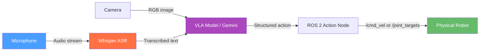

# باب 13: مکالماتی روبوٹکس اور وی ایل اے (Conversational Robotics & VLA)

## سیکھنے کے مقاصد (Learning Objectives)

<div dir="rtl">

اس باب کے اختتام تک، آپ اس قابل ہو جائیں گے کہ:

- **وضاحت کریں** کہ وژن-لینگویج-ایکشن (VLA) ماڈلز (models) کیا ہیں اور وہ روایتی روبوٹ کنٹرولرز (robot controllers) سے کیسے مختلف ہیں۔
- **تیار کریں** ایک وِسپر (Whisper) پر مبنی آر او ایس ٹو (ROS 2) نوڈ (node) جو صوتی کمانڈز (voice commands) کو ریئل ٹائم (real time) میں ٹرانسکرائب (transcribe) کرتا ہے۔
- **مربوط کریں** جیمنی اے پی آئی (Gemini API) کو تاکہ قدرتی زبان کی کمانڈز (natural language commands) کو ساخت شدہ روبوٹ ایکشنز (structured robot actions) میں پارس (parse) کیا جا سکے۔
- **ڈیزائن کریں** ایک حفاظتی پرت (safety layer) کو کمانڈ کنفرمیشن (command confirmation) اور فال بیک برتاؤ (fallback behaviors) کے ساتھ۔
- **نافذ کریں** ایک اینڈ ٹو اینڈ وائس ٹو موشن پائپ لائن (end-to-end voice-to-motion pipeline): مائیکروفون (microphone) → ٹیکسٹ (text) → جے ایس او این ایکشن (JSON action) → ٹوئسٹ کمانڈ (Twist command)۔

</div>

---

## تعارف (Introduction)

<div dir="rtl">

2023 میں، گوگل ڈیپ مائنڈ (Google DeepMind) کی ایک ٹیم نے آر ٹی ٹو: روبوٹک ٹرانسفارمر ٹو (RT-2: Robotic Transformer 2) شائع کیا۔ انہوں نے ایک وژن-لینگویج ماڈل (Vision-Language Model) لیا جسے انٹرنیٹ کے پیمانے پر موجود ٹیکسٹ اور تصاویر پر تربیت دی گئی تھی، اور اسے روبوٹ ایکشنز (robot actions) بھی آؤٹ پٹ (output) کرنے کے لیے فائن ٹیون (fine-tuned) کیا۔ نتیجہ ایک ایسا روبوٹ تھا جو نئی ہدایات پر عمل کر سکتا تھا جن کے لیے اسے کبھی واضح طور پر تربیت نہیں دی گئی تھی: "سوشی اٹھاؤ" جب تربیتی سیٹ (training set) میں کوئی سوشی موجود نہیں تھی، کیونکہ ماڈل (model) پہلے ہی انٹرنیٹ سے سمجھ چکا تھا کہ سوشی کیا ہے۔

</div>

<div dir="rtl">

اس نے روبوٹکس (robotics) میں ایک نئے پیراڈائم (paradigm) کا آغاز کیا: ہر صورت حال کے لیے روبوٹس کو واضح اصولوں کے ساتھ پروگرام (program) کرنے کے بجائے، آپ لینگویج ماڈلز (language models) کو فزیکل دنیا (physical world) میں بنیاد فراہم کرتے ہیں، اور وہ روبوٹ کنٹرول (robot control) پر دنیا کے بارے میں اپنی تمام معلومات کا استعمال کرتے ہیں۔

</div>

<div dir="rtl">

اس باب میں، آپ اس خیال کا ایک آسان لیکن مکمل ورژن (version) بنائیں گے: ایک روبوٹ جو آپ کی آواز سنتا ہے، آپ کے کہے ہوئے الفاظ کو ٹرانسکرائب کرنے کے لیے وِسپر (Whisper) کا استعمال کرتا ہے، اس ٹیکسٹ (text) کو جیمنی اے پی آئی (Gemini API) پر بھیجتا ہے تاکہ یہ طے کیا جا سکے کہ کون سا ایکشن (action) لینا ہے، اور پھر آر او ایس ٹو ٹاپکس (ROS 2 topics) پر پبلش (publish) کر کے اس ایکشن کو انجام دیتا ہے۔ یہ مکالماتی روبوٹکس (conversational robotics) ہے — ایک ایسا روبوٹ جس سے آپ بات کر سکتے ہیں۔

</div>

---

## وژن-لینگویج-ایکشن ماڈلز (Vision-Language-Action Models)

<div dir="rtl">

ایک **وژن-لینگویج-ایکشن (VLA) ماڈل** ایک نیورل نیٹ ورک (neural network) ہے جو بصری مشاہدات (کیمرہ فریمز) اور لسانی ہدایات کو ان پٹ (input) کے طور پر لیتا ہے، اور روبوٹ ایکشنز (جوائنٹ پوزیشنز یا ویلوسیٹی کمانڈز) کو آؤٹ پٹ (output) کے طور پر فراہم کرتا ہے۔

</div>

<div dir="rtl">

اہم نکتہ یہ ہے کہ زبان اور وژن (vision) گہرا ڈھانچہ رکھتے ہیں۔ "گراسپ (grasp)،" "پُش (push)،" اور "اسٹیک (stack)" جیسے الفاظ بصری پیٹرنز (patterns) اور فزیکل افورڈینسز (physical affordances) سے مطابقت رکھتے ہیں جو انٹرنیٹ ڈیٹا (data) پر تربیت یافتہ ایک ماڈل نے ضمنی طور پر سیکھے ہیں۔ روبوٹ مظاہروں پر فائن ٹیوننگ (fine-tuning) کے ذریعے، ان ایسوسی ایشنز (associations) کو حقیقی روبوٹ موشنز (robot motions) سے جوڑا جا سکتا ہے۔

</div>

### قابل ذکر و ایل اے ماڈلز (Notable VLA Models)

<div dir="rtl">

| ماڈل (Model) | تنظیم (Organization) | ان پٹ (Input) | آؤٹ پٹ (Output) |
|---------------|----------------------|---------------|------------------|
| RT-2          | گوگل ڈیپ مائنڈ (Google DeepMind) | تصویر + ٹیکسٹ | اینڈ-ایفیکٹر کمانڈز (End-effector commands) |
| OpenVLA       | اسٹینفورڈ (Stanford) | تصویر + ٹیکسٹ | جوائنٹ ڈیلٹاز (Joint deltas) |
| π0 (Pi Zero)  | فزیکل انٹیلیجنس (Physical Intelligence) | متعدد تصاویر + ٹیکسٹ | جوائنٹ پوزیشنز (Joint positions) |
| RoboFlamingo  | بائٹ ڈانس (ByteDance) | متعدد تصاویر + ٹیکسٹ | ای ای ٹریجیکٹری (EE trajectory) |

</div>

### و ایل اے پائپ لائن (The VLA Pipeline)



<div dir="rtl">

**متبادل متن:** وژن-لینگویج-ایکشن (VLA) پائپ لائن: مائیکروفون (Microphone) سے آڈیو سٹریم (Audio stream) وِسپر (Whisper) اے ایس آر (ASR) میں جاتی ہے، اور کیمرے (Camera) سے آر جی بی (RGB) تصویر و ایل اے ماڈل (VLA Model) / جیمنی (Gemini) میں۔ وِسپر (Whisper) سے ٹرانسکرائبڈ ٹیکسٹ (transcribed text) بھی و ایل اے (VLA) میں جاتی ہے۔ و ایل اے (VLA) سے ساخت شدہ ایکشن (structured action) آر او ایس ٹو ایکشن نوڈ (ROS 2 Action Node) میں، جو پھر `/cmd_vel` یا `/joint_targets` کے ذریعے فزیکل روبوٹ (Physical Robot) کو کمانڈز بھیجتا ہے۔

</div>

<div dir="rtl">

اس باب میں، ہم جیمنی (Gemini) کو زبان کی استدلال کے جزو (language reasoning component) کے طور پر استعمال کرتے ہیں (ٹیکسٹ کمانڈز کو ہینڈل کرتے ہوئے) بجائے ایک مکمل و ایل اے ماڈل کے، جو ایک قابل رسائی انٹری پوائنٹ (entry point) فراہم کرتا ہے۔ فن تعمیر (architecture) یکساں ہے — جب آپ کے پاس کمپیوٹ (compute) ہو تو آپ ایک مکمل و ایل اے ماڈل کو تبدیل کر سکتے ہیں۔

</div>

---

## وِسپر (Whisper) کے ساتھ اسپیچ ریکگنیشن (Speech Recognition)

<div dir="rtl">

**اوپن اے آئی وِسپر (OpenAI Whisper)** ایک اوپن سورس (open-source) خودکار اسپیچ ریکگنیشن (ASR) ماڈل ہے جو مقامی طور پر چلتا ہے، بغیر کسی اے پی آئی (API) کالز کے۔ یہ 99 زبانوں کو سپورٹ کرتا ہے اور سی پی یو (CPU) (آہستہ) یا جی پی یو (GPU) (ریئل ٹائم میں) پر چلتا ہے۔

</div>

<div dir="rtl">

ہم `فاسٹر وِسپر (faster-whisper)` استعمال کرتے ہیں — جو ایک کمیونٹی (community) کے ذریعے برقرار رکھا گیا دوبارہ نفاذ (reimplementation) ہے جو اصل سے 4-8 گنا تیز چلتا ہے جس میں وہی ماڈل ویٹس (model weights) استعمال ہوتے ہیں۔

</div>

### فاسٹر وِسپر (faster-whisper) انسٹال کرنا

```bash
pip install faster-whisper sounddevice numpy
```

### وِسپر آر او ایس ٹو نوڈ (Whisper ROS 2 Node)

```python
# File: ~/ros2_ws/src/conversational_robotics/conversational_robotics/whisper_node.py
# Records audio from microphone and publishes transcribed text to /voice_command.

import rclpy
from rclpy.node import Node
from std_msgs.msg import String
import sounddevice as sd     # pip install sounddevice
import numpy as np
import threading
from faster_whisper import WhisperModel  # pip install faster-whisper

class WhisperNode(Node):
    """
    Continuously listens for voice input and publishes transcriptions.
    Uses faster-whisper for CPU-efficient speech recognition.
    """

    SAMPLE_RATE = 16000   # Whisper requires 16 kHz audio
    CHUNK_SECONDS = 3     # Record 3-second chunks and transcribe each
    MODEL_SIZE = 'tiny'   # Use 'base' or 'small' for better accuracy

    def __init__(self):
        super().__init__('whisper_node')

        # Load the Whisper model (downloads ~39MB for 'tiny' on first run)
        self.get_logger().info(f'Loading Whisper model ({self.MODEL_SIZE})...')
        self.model = WhisperModel(
            self.MODEL_SIZE,
            device='cpu',           # Change to 'cuda' if GPU available
            compute_type='int8'     # int8 quantization for CPU speed
        )
        self.get_logger().info('Whisper model loaded.')

        # Publisher: sends transcribed text to /voice_command topic
        self.publisher = self.create_publisher(String, '/voice_command', 10)

        # Start recording in a background thread (non-blocking)
        self.running = True
        self.thread = threading.Thread(target=self.record_loop, daemon=True)
        self.thread.start()
        self.get_logger().info(
            f'Listening for voice commands ({self.CHUNK_SECONDS}s chunks)...'
        )

    def record_loop(self):
        """Background thread: continuously record audio and transcribe."""
        while self.running:
            # Record audio chunk
            samples = sd.rec(
                int(self.CHUNK_SECONDS * self.SAMPLE_RATE),
                samplerate=self.SAMPLE_RATE,
                channels=1,
                dtype='float32'
            )
            sd.wait()  # Block until recording is complete

            # Flatten from [N, 1] to [N]
            audio = samples.flatten()

            # Transcribe with Whisper (returns generator of Segment objects)
            segments, info = self.model.transcribe(
                audio,
                language='en',          # Force English for faster inference
                beam_size=1,            # Greedy decoding (fastest)
                vad_filter=True,        # Skip silent segments
                vad_parameters={'min_silence_duration_ms': 500}
            )

            # Collect all text segments
            text = ' '.join(segment.text.strip() for segment in segments)

            # Only publish if non-empty and not just noise
            if text and len(text) > 3:
                self.get_logger().info(f'Transcribed: "{text}"')
                msg = String()
                msg.data = text
                self.publisher.publish(msg)

    def destroy_node(self):
        self.running = False
        super().destroy_node()


def main(args=None):
    rclpy.init(args=args)
    node = WhisperNode()
    rclpy.spin(node)
    node.destroy_node()
    rclpy.shutdown()
```

---

## کوڈ کی مثال: جیمنی ایکشن پلانر (Code Example: Gemini Action Planner)

<div dir="rtl">

جیمنی پلانر (planner) ٹرانسکرائب شدہ ٹیکسٹ (transcribed text) وصول کرتا ہے اور ایک ساخت شدہ جے ایس او این (JSON) ایکشن (action) واپس کرتا ہے جسے روبوٹ (robot) انجام دے سکتا ہے۔

</div>

```python
# File: ~/ros2_ws/src/conversational_robotics/conversational_robotics/gemini_planner.py
# Converts voice command text to structured robot actions using Gemini API.

import rclpy
from rclpy.node import Node
from std_msgs.msg import String
from geometry_msgs.msg import Twist
import google.generativeai as genai  # pip install google-generativeai
import json
import os

# System prompt: defines what Gemini should do and what output format it should use
SYSTEM_PROMPT = """You are a robot action planner.
Given a voice command, respond ONLY with a JSON object in this exact format:
{
  "action": "navigate|rotate|stop|pick|place|greet|unknown",
  "direction": "forward|backward|left|right|null",
  "speed": 0.1 to 1.0,
  "duration_seconds": 1 to 10,
  "target": "object or location name or null",
  "confidence": 0.0 to 1.0,
  "explanation": "brief reasoning"
}

Examples:
- "move forward slowly" -> {"action":"navigate","direction":"forward","speed":0.2,...}
- "turn left" -> {"action":"rotate","direction":"left","speed":0.5,...}
- "stop" -> {"action":"stop","direction":null,"speed":0.0,...}
- "pick up the cup" -> {"action":"pick","target":"cup","speed":0.3,...}
Do not include any text outside the JSON object."""

class GeminiPlannerNode(Node):
    """
    Subscribes to /voice_command, calls Gemini API to parse the command,
    and publishes velocity commands to /cmd_vel.
    """

    def __init__(self):
        super().__init__('gemini_planner')

        # Parameter: Gemini API key (set via environment variable)
        api_key = os.environ.get('GEMINI_API_KEY', '')
        if not api_key:
            self.get_logger().error(
                'GEMINI_API_KEY environment variable not set! '
                'Export it: export GEMINI_API_KEY=your_key_here'
            )

        # Configure Gemini
        genai.configure(api_key=api_key)
        self.model = genai.GenerativeModel(
            model_name='gemini-2.0-flash',
            system_instruction=SYSTEM_PROMPT
        )

        # Subscribe to transcribed voice commands
        self.voice_sub = self.create_subscription(
            String, '/voice_command', self.command_callback, 10
        )

        # Publishers
        self.cmd_pub = self.create_publisher(Twist, '/cmd_vel', 10)
        self.response_pub = self.create_publisher(String, '/robot_response', 10)

        self.get_logger().info('Gemini planner ready. Waiting for voice commands...')

    def command_callback(self, msg: String):
        """Called when a new transcribed voice command arrives."""
        text = msg.data
        self.get_logger().info(f'Processing command: "{text}"')

        try:
            # Send to Gemini for parsing
            response = self.model.generate_content(text)
            response_text = response.text.strip()

            # Parse the JSON response
            action = json.loads(response_text)
            self.get_logger().info(f'Gemini response: {action}')

            # Safety check: ignore low-confidence commands
            if action.get('confidence', 0) < 0.5:
                self.get_logger().warn(
                    f'Low confidence ({action["confidence"]:.2f}), ignoring command.'
                )
                return

            # Execute the action
            self.execute_action(action)

        except json.JSONDecodeError as e:
            self.get_logger().error(f'Gemini returned invalid JSON: {e}')
        except Exception as e:
            self.get_logger().error(f'Gemini API error: {e}')

    def execute_action(self, action: dict):
        """Convert a parsed action dict to ROS 2 commands."""
        cmd = Twist()  # Default: all zeros (stopped)

        action_type = action.get('action', 'unknown')
        direction = action.get('direction', 'null')
        speed = float(action.get('speed', 0.3))

        if action_type == 'navigate':
            if direction == 'forward':
                cmd.linear.x = speed
            elif direction == 'backward':
                cmd.linear.x = -speed
            elif direction == 'left':
                cmd.linear.x = speed * 0.5
                cmd.angular.z = speed
            elif direction == 'right':
                cmd.linear.x = speed * 0.5
                cmd.angular.z = -speed

        elif action_type == 'rotate':
            if direction == 'left':
                cmd.angular.z = speed
            elif direction == 'right':
                cmd.angular.z = -speed

        elif action_type == 'stop':
            pass  # cmd is already all zeros

        elif action_type == 'greet':
            # A simple greeting: rotate in place briefly
            cmd.angular.z = 1.0
            self.cmd_pub.publish(cmd)
            import time; time.sleep(1.0)
            cmd.angular.z = 0.0

        self.cmd_pub.publish(cmd)

        # Publish explanation as robot speech response
        explanation = action.get('explanation', '')
        if explanation:
            response_msg = String()
            response_msg.data = explanation
            self.response_pub.publish(response_msg)
            self.get_logger().info(f'Robot: {explanation}')


def main(args=None):
    rclpy.init(args=args)
    node = GeminiPlannerNode()
    rclpy.spin(node)
    node.destroy_node()
    rclpy.shutdown()
```

**سیٹ اپ (Setup)**:
```bash
pip install google-generativeai
export GEMINI_API_KEY=your_api_key_here
```

---

## حفاظت: کمانڈ کنفرمیشن اور فال بیکس (Safety: Command Confirmation and Fallbacks)

<div dir="rtl">

مکالماتی روبوٹس (conversational robots) کو مبہم یا خطرناک کمانڈز (commands) کو خوبی سے ہینڈل (handle) کرنا چاہیے۔ تین حفاظتی پیٹرنز (safety patterns):

</div>

### 1. اعتماد کی حد (Confidence Threshold)

<div dir="rtl">

ایسی کمانڈز کو نظر انداز کریں جہاں پلانر (planner) کا اعتماد ایک حد (threshold) سے کم ہو (اوپر دکھایا گیا ہے: `confidence < 0.5`)۔ یہ غلط سنی ہوئی یا مبہم تقریر پر عمل کرنے سے روکتا ہے۔

</div>

### 2. ناقابل واپسی ایکشنز کے لیے کمانڈ کنفرمیشن (Command Confirmation for Irreversible Actions)

<div dir="rtl">

ایسے ایکشنز کے لیے جو واپس نہیں لیے جا سکتے — تیز رفتار سے حرکت کرنا، والو کھولنا، پکڑی ہوئی چیز کو چھوڑنا — زبانی تصدیق کی ضرورت ہوتی ہے:

</div>

```python
# Pattern: require "confirm" before executing high-consequence actions
if action_type in ['pick', 'place'] and action.get('speed', 0) > 0.8:
    self.get_logger().warn('High-speed manipulation: say "confirm" to proceed.')
    self.pending_action = action
    return  # Don't execute yet
```

### 3. "سٹاپ" یا "کینسل" پر ایمرجنسی سٹاپ (Emergency Stop on "Stop" or "Cancel")

<div dir="rtl">

ہمیشہ ایک ہارڈ سٹاپ (hard stop) نافذ کریں جو تمام زیر التواء کمانڈز (commands) کو اوور رائڈ (override) کرے۔

</div>

```python
# In command_callback, check for stop words before calling Gemini
stop_words = {'stop', 'halt', 'cancel', 'emergency', 'abort'}
if any(word in text.lower() for word in stop_words):
    self.cmd_pub.publish(Twist())  # Publish zero velocity immediately
    self.get_logger().warn('EMERGENCY STOP triggered by voice command.')
    return
```

---

## خلاصہ (Summary)

<div dir="rtl">

اس باب میں، آپ نے سیکھا:

- و ایل اے ماڈلز (VLA models) روبوٹ ایکشنز (robot actions) میں زبان کی سمجھ کو بنیاد فراہم کرتے ہیں، جس سے ٹاسک کی مخصوص پروگرامنگ (programming) کے بغیر نئی ہدایات پر عمل کرنا ممکن ہوتا ہے۔
- وِسپر (Whisper) سی پی یو (CPU) کے قابل، اوپن سورس (open-source) اسپیچ ریکگنیشن (speech recognition) فراہم کرتا ہے جو مقامی طور پر بغیر اے پی آئی (API) کالز کے چلتا ہے — ریئل ٹائم (real-time) روبوٹ کے استعمال کے لیے اہم ہے۔
- جیمنی اے پی آئی (Gemini API) احتیاط سے ڈیزائن کردہ سسٹم پرامپٹ (system prompt) کا استعمال کرتے ہوئے قدرتی زبان کی کمانڈز (natural language commands) کو ساخت شدہ جے ایس او این (JSON) ایکشنز (actions) میں پارس (parse) کر سکتی ہے۔
- مکمل پائپ لائن (pipeline) ہے: مائیکروفون (microphone) → وِسپر (Whisper) → ٹیکسٹ (text) → جیمنی (Gemini) → جے ایس او این (JSON) → آر او ایس ٹو (ROS 2) → روبوٹ موشن (robot motion)۔
- حفاظت کے لیے اعتماد کی حدود (confidence thresholds)، زیادہ نتائج والے ایکشنز (high-consequence actions) کے لیے کمانڈ کنفرمیشن (command confirmation)، اور ایمرجنسی سٹاپ (emergency stop) کی ضرورت ہوتی ہے جو اے آئی پائپ لائن (AI pipeline) کو بائی پاس (bypass) کرے۔

</div>

---

## ہینڈز آن ایکسرسائز: صوتی کمانڈ والا روبوٹ (Hands-On Exercise: Voice-Commanded Robot)

**وقت کا تخمینہ**: 45–60 منٹ

**پیشگی ضروریات (Prerequisites)**:
<div dir="rtl">

- جیمنی اے پی آئی کی (Gemini API key) ([Google AI Studio](https://aistudio.google.com/app/apikey))
- آر او ایس ٹو ہمبل (ROS 2 Humble) انسٹال شدہ ([Appendix A2](../appendices/a2-software-installation.md))
- مائیکروفون (microphone) منسلک
- باب 4 (نوڈز اور ٹاپکس) مکمل

</div>

### اقدامات (Steps)

1.  **انحصار انسٹال کریں (Install dependencies)**:
    ```bash
    pip install faster-whisper sounddevice google-generativeai
    ```

2.  **آر او ایس ٹو پیکج (ROS 2 package) بنائیں**:
    ```bash
    cd ~/ros2_ws/src
    ros2 pkg create conversational_robotics \
        --build-type ament_python \
        --dependencies rclpy std_msgs geometry_msgs
    ```

3.  **دونوں نوڈز (nodes) بنائیں** — اس باب سے `whisper_node.py` اور `gemini_planner.py` کو محفوظ کریں۔

4.  `setup.py` کو دونوں نوڈز کے لیے انٹری پوائنٹس (entry points) کے ساتھ اپ ڈیٹ کریں۔

5.  **بلڈ کریں (Build)**:
    ```bash
    cd ~/ros2_ws
    colcon build --packages-select conversational_robotics
    source install/setup.bash
    ```

6.  **اپنی اے پی آئی کی (API key) سیٹ کریں اور چلائیں**:
    ```bash
    export GEMINI_API_KEY=your_key_here

    # Terminal 1: آواز کی شناخت (voice recognition)
    ros2 run conversational_robotics whisper_node

    # Terminal 2: ایکشن پلاننگ (action planning)
    ros2 run conversational_robotics gemini_planner
    ```

7.  **آواز کے ساتھ ٹیسٹ کریں**: "move forward slowly" کہیں اور تصدیق کریں:
    ```bash
    ros2 topic echo /cmd_vel
    ```
    **متوقع**: 5 سیکنڈ کے اندر `linear: x: 0.2` ظاہر ہو رہا ہے۔

### تصدیق (Verification)

```bash
# ایک ٹیسٹ کمانڈ دستی طور پر پبلش کریں (مائیکروفون کے بغیر):
ros2 topic pub --once /voice_command std_msgs/msg/String "data: 'move forward slowly'"
# پھر چیک کریں:
ros2 topic echo /cmd_vel --once
```

---

## مزید مطالعہ (Further Reading)

<div dir="rtl">

- **پچھلا**: [باب 12: بائپیڈل لوکوموشن (Bipedal Locomotion)](ch12-bipedal-locomotion.md) — واکنگ کنٹرولرز (walking controllers)
- **اگلا**: [کیپ سٹون: خود مختار ہیومنائیڈ (Autonomous Humanoid)](../capstone/ch14-autonomous-humanoid.md) — تمام ماڈیولز کو مربوط کرنا
- **متعلقہ**: [باب 1: فزیکل اے آئی کا تعارف (Physical AI Introduction)](../module-1/ch01-intro-physical-ai.md) — زبان + روبوٹکس کیوں اہم ہے

</div>

**سرکاری دستاویزات (Official documentation)**:
<div dir="rtl">

- [جیمنی اے پی آئی (API) دستاویزات](https://ai.google.dev/gemini-api/docs)
- [گٹ ہب (GitHub) پر فاسٹر وِسپر (faster-whisper)](https://github.com/SYSTRAN/faster-whisper)
- [آر ٹی ٹو (RT-2) پیپر (گوگل ڈیپ مائنڈ)](https://robotics-transformer2.github.io/)
- [اوپن وی ایل اے (OpenVLA) (اسٹینفورڈ)](https://openvla.github.io/)

</div>